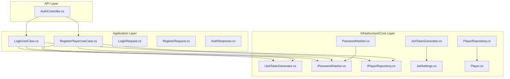
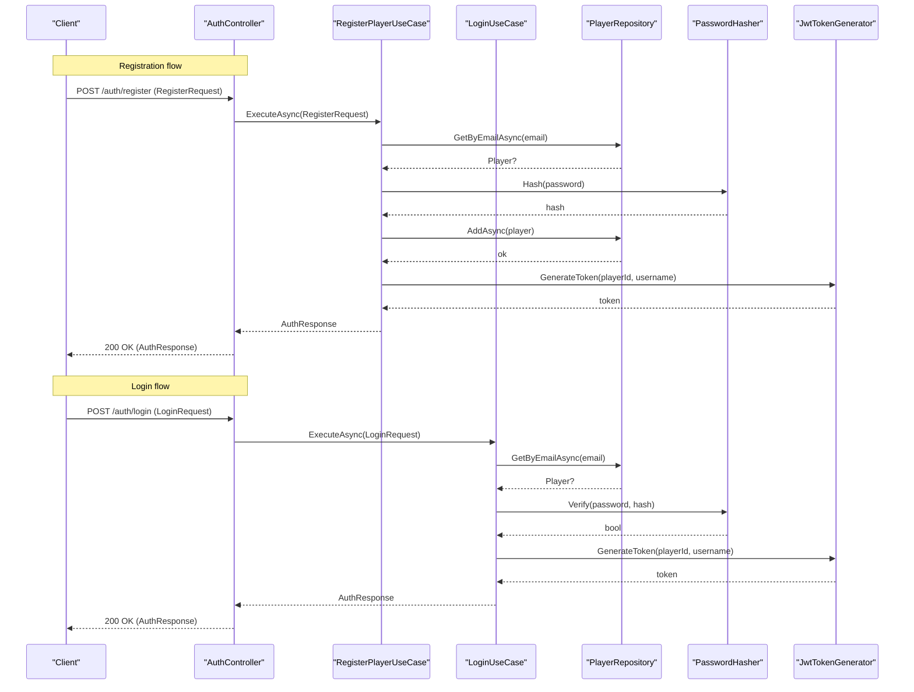
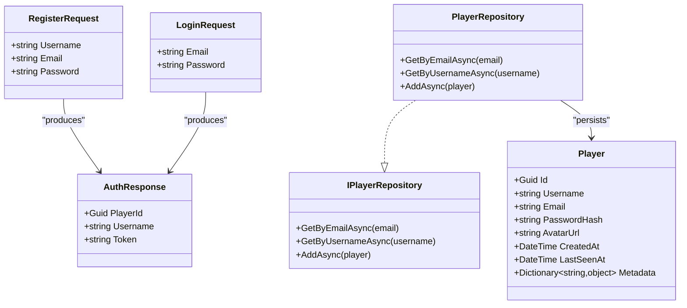
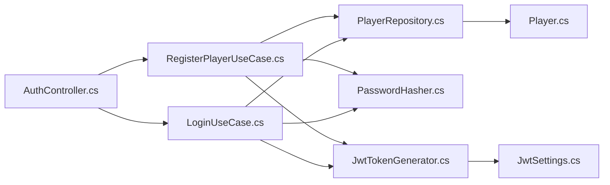

# API Reference

<cite>
**Referenced Files in This Document**
- [AuthController.cs](file://GameBackend.API/Controllers/AuthController.cs)
- [LoginRequest.cs](file://GameBackend.Application/Contracts/Auth/LoginRequest.cs)
- [RegisterRequest.cs](file://GameBackend.Application/Contracts/Auth/RegisterRequest.cs)
- [AuthResponse.cs](file://GameBackend.Application/Contracts/Auth/AuthResponse.cs)
- [LoginUseCase.cs](file://GameBackend.Application/Contracts/UseCases/Auth/LoginUseCase.cs)
- [RegisterPlayerUseCase.cs](file://GameBackend.Application/Contracts/UseCases/Auth/RegisterPlayerUseCase.cs)
- [IJwtTokenGenerator.cs](file://GameBackend.Core/Interfaces/IJwtTokenGenerator.cs)
- [IPasswordHasher.cs](file://GameBackend.Core/Interfaces/IPasswordHasher.cs)
- [IPlayerRepository.cs](file://GameBackend.Core/Interfaces/IPlayerRepository.cs)
- [JwtTokenGenerator.cs](file://GameBackend.Infrastructure/Security/JwtTokenGenerator.cs)
- [PasswordHasher.cs](file://GameBackend.Infrastructure/Security/PasswordHasher.cs)
- [PlayerRepository.cs](file://GameBackend.Infrastructure/Repositories/PlayerRepository.cs)
- [JwtSettings.cs](file://GameBackend.Infrastructure/Security/JwtSettings.cs)
- [Player.cs](file://GameBackend.Core/Entities/Player.cs)
- [Program.cs](file://GameBackend.API/Program.cs)
- [appsettings.json](file://GameBackend.API/appsettings.json)
</cite>

## Table of Contents
1. [Introduction](#introduction)
2. [Project Structure](#project-structure)
3. [Core Components](#core-components)
4. [Architecture Overview](#architecture-overview)
5. [Detailed Component Analysis](#detailed-component-analysis)
6. [Dependency Analysis](#dependency-analysis)
7. [Performance Considerations](#performance-considerations)
8. [Troubleshooting Guide](#troubleshooting-guide)
9. [Conclusion](#conclusion)
10. [Appendices](#appendices)

## Introduction
This document provides a complete API reference for the GameBackend authentication endpoints. It covers the REST endpoints for registration and login, including request/response schemas, HTTP status codes, error handling, and integration guidance. It also explains the authentication middleware and JWT token generation used by the system.

## Project Structure
The authentication functionality spans three layers:
- API layer: Exposes HTTP endpoints via controllers.
- Application layer: Implements use cases and contracts for requests/responses.
- Infrastructure/Core layer: Provides persistence, hashing, and token generation.

**Diagram sources**
- [AuthController.cs:1-49](file://GameBackend.API/Controllers/AuthController.cs#L1-L49)
- [LoginUseCase.cs:1-45](file://GameBackend.Application/Contracts/UseCases/Auth/LoginUseCase.cs#L1-L45)
- [RegisterPlayerUseCase.cs:1-58](file://GameBackend.Application/Contracts/UseCases/Auth/RegisterPlayerUseCase.cs#L1-L58)
- [LoginRequest.cs:1-7](file://GameBackend.Application/Contracts/Auth/LoginRequest.cs#L1-L7)
- [RegisterRequest.cs:1-8](file://GameBackend.Application/Contracts/Auth/RegisterRequest.cs#L1-L8)
- [AuthResponse.cs:1-8](file://GameBackend.Application/Contracts/Auth/AuthResponse.cs#L1-L8)
- [PlayerRepository.cs:1-34](file://GameBackend.Infrastructure/Repositories/PlayerRepository.cs#L1-L34)
- [PasswordHasher.cs:1-16](file://GameBackend.Infrastructure/Security/PasswordHasher.cs#L1-L16)
- [JwtTokenGenerator.cs:1-44](file://GameBackend.Infrastructure/Security/JwtTokenGenerator.cs#L1-L44)
- [IJwtTokenGenerator.cs:1-6](file://GameBackend.Core/Interfaces/IJwtTokenGenerator.cs#L1-L6)
- [IPasswordHasher.cs:1-7](file://GameBackend.Core/Interfaces/IPasswordHasher.cs#L1-L7)
- [IPlayerRepository.cs:1-10](file://GameBackend.Core/Interfaces/IPlayerRepository.cs#L1-L10)
- [JwtSettings.cs:1-8](file://GameBackend.Infrastructure/Security/JwtSettings.cs#L1-L8)
- [Player.cs:1-13](file://GameBackend.Core/Entities/Player.cs#L1-L13)

**Section sources**
- [AuthController.cs:1-49](file://GameBackend.API/Controllers/AuthController.cs#L1-L49)
- [LoginUseCase.cs:1-45](file://GameBackend.Application/Contracts/UseCases/Auth/LoginUseCase.cs#L1-L45)
- [RegisterPlayerUseCase.cs:1-58](file://GameBackend.Application/Contracts/UseCases/Auth/RegisterPlayerUseCase.cs#L1-L58)

## Core Components
- Authentication endpoints:
  - POST /auth/register
  - POST /auth/login
- Request/response contracts:
  - RegisterRequest: Username, Email, Password
  - LoginRequest: Email, Password
  - AuthResponse: PlayerId, Username, Token
- Use cases:
  - RegisterPlayerUseCase: Validates uniqueness, hashes password, persists player, generates JWT
  - LoginUseCase: Finds player by email, verifies password, generates JWT
- Infrastructure:
  - PlayerRepository: EF Core repository for players
  - PasswordHasher: BCrypt-based hashing and verification
  - JwtTokenGenerator: HMAC-signed JWT with configurable issuer, audience, key

**Section sources**
- [AuthController.cs:22-48](file://GameBackend.API/Controllers/AuthController.cs#L22-L48)
- [RegisterRequest.cs:1-8](file://GameBackend.Application/Contracts/Auth/RegisterRequest.cs#L1-L8)
- [LoginRequest.cs:1-7](file://GameBackend.Application/Contracts/Auth/LoginRequest.cs#L1-L7)
- [AuthResponse.cs:1-8](file://GameBackend.Application/Contracts/Auth/AuthResponse.cs#L1-L8)
- [RegisterPlayerUseCase.cs:23-57](file://GameBackend.Application/Contracts/UseCases/Auth/RegisterPlayerUseCase.cs#L23-L57)
- [LoginUseCase.cs:22-44](file://GameBackend.Application/Contracts/UseCases/Auth/LoginUseCase.cs#L22-L44)
- [PlayerRepository.cs:17-33](file://GameBackend.Infrastructure/Repositories/PlayerRepository.cs#L17-L33)
- [PasswordHasher.cs:7-15](file://GameBackend.Infrastructure/Security/PasswordHasher.cs#L7-L15)
- [JwtTokenGenerator.cs:20-43](file://GameBackend.Infrastructure/Security/JwtTokenGenerator.cs#L20-L43)

## Architecture Overview
The authentication flow integrates controller actions, use cases, repositories, and security services.

**Diagram sources**
- [AuthController.cs:22-48](file://GameBackend.API/Controllers/AuthController.cs#L22-L48)
- [RegisterPlayerUseCase.cs:23-57](file://GameBackend.Application/Contracts/UseCases/Auth/RegisterPlayerUseCase.cs#L23-L57)
- [LoginUseCase.cs:22-44](file://GameBackend.Application/Contracts/UseCases/Auth/LoginUseCase.cs#L22-L44)
- [PlayerRepository.cs:17-33](file://GameBackend.Infrastructure/Repositories/PlayerRepository.cs#L17-L33)
- [PasswordHasher.cs:7-15](file://GameBackend.Infrastructure/Security/PasswordHasher.cs#L7-L15)
- [JwtTokenGenerator.cs:20-43](file://GameBackend.Infrastructure/Security/JwtTokenGenerator.cs#L20-L43)

## Detailed Component Analysis

### Endpoint: POST /auth/register
- Description: Registers a new player with a unique email and username.
- Authentication: Not required.
- Request body: RegisterRequest
  - Username: string, required
  - Email: string, required
  - Password: string, required
- Response body: AuthResponse
  - PlayerId: guid, required
  - Username: string, required
  - Token: string, required (JWT)
- Success: 200 OK
- Failure: 400 Bad Request with error message

Example request:
- Method: POST
- URL: /auth/register
- Headers: Content-Type: application/json
- Body: { "Username": "...", "Email": "...", "Password": "..." }

Example successful response:
- Status: 200 OK
- Body: { "PlayerId": "...", "Username": "...", "Token": "..." }

Common errors:
- User already exists: 400 Bad Request

Notes:
- The server validates email uniqueness before creating a new player.
- Password is hashed using BCrypt before persisting.

**Section sources**
- [AuthController.cs:22-34](file://GameBackend.API/Controllers/AuthController.cs#L22-L34)
- [RegisterRequest.cs:1-8](file://GameBackend.Application/Contracts/Auth/RegisterRequest.cs#L1-L8)
- [AuthResponse.cs:1-8](file://GameBackend.Application/Contracts/Auth/AuthResponse.cs#L1-L8)
- [RegisterPlayerUseCase.cs:23-57](file://GameBackend.Application/Contracts/UseCases/Auth/RegisterPlayerUseCase.cs#L23-L57)
- [PlayerRepository.cs:17-33](file://GameBackend.Infrastructure/Repositories/PlayerRepository.cs#L17-L33)
- [PasswordHasher.cs:7-15](file://GameBackend.Infrastructure/Security/PasswordHasher.cs#L7-L15)

### Endpoint: POST /auth/login
- Description: Authenticates an existing player and returns a JWT token.
- Authentication: Not required.
- Request body: LoginRequest
  - Email: string, required
  - Password: string, required
- Response body: AuthResponse
  - PlayerId: guid, required
  - Username: string, required
  - Token: string, required (JWT)
- Success: 200 OK
- Failure: 401 Unauthorized with error message

Example request:
- Method: POST
- URL: /auth/login
- Headers: Content-Type: application/json
- Body: { "Email": "...", "Password": "..." }

Example successful response:
- Status: 200 OK
- Body: { "PlayerId": "...", "Username": "...", "Token": "..." }

Common errors:
- Invalid credentials: 401 Unauthorized

Notes:
- Authentication requires a valid email/password combination.
- On success, a signed JWT is returned for subsequent protected operations.

**Section sources**
- [AuthController.cs:36-48](file://GameBackend.API/Controllers/AuthController.cs#L36-L48)
- [LoginRequest.cs:1-7](file://GameBackend.Application/Contracts/Auth/LoginRequest.cs#L1-L7)
- [AuthResponse.cs:1-8](file://GameBackend.Application/Contracts/Auth/AuthResponse.cs#L1-L8)
- [LoginUseCase.cs:22-44](file://GameBackend.Application/Contracts/UseCases/Auth/LoginUseCase.cs#L22-L44)
- [PlayerRepository.cs:17-33](file://GameBackend.Infrastructure/Repositories/PlayerRepository.cs#L17-L33)
- [PasswordHasher.cs:7-15](file://GameBackend.Infrastructure/Security/PasswordHasher.cs#L7-L15)

### Authentication Middleware and Protected Operations
- JWT token generation: HMAC-SHA256 signed tokens with a configurable key, issuer, and audience.
- Token payload: Includes subject (player ID) and unique name (username).
- Token lifetime: 7 days.
- Protected operations: Clients must include the JWT in the Authorization header as a bearer token for protected routes.

Implementation details:
- Token generation uses a symmetric key and signing credentials.
- Settings are provided via JwtSettings (key, issuer, audience).

**Section sources**
- [JwtTokenGenerator.cs:20-43](file://GameBackend.Infrastructure/Security/JwtTokenGenerator.cs#L20-L43)
- [JwtSettings.cs:1-8](file://GameBackend.Infrastructure/Security/JwtSettings.cs#L1-L8)
- [IJwtTokenGenerator.cs:1-6](file://GameBackend.Core/Interfaces/IJwtTokenGenerator.cs#L1-L6)

### Data Models

**Diagram sources**
- [RegisterRequest.cs:1-8](file://GameBackend.Application/Contracts/Auth/RegisterRequest.cs#L1-L8)
- [LoginRequest.cs:1-7](file://GameBackend.Application/Contracts/Auth/LoginRequest.cs#L1-L7)
- [AuthResponse.cs:1-8](file://GameBackend.Application/Contracts/Auth/AuthResponse.cs#L1-L8)
- [Player.cs:1-13](file://GameBackend.Core/Entities/Player.cs#L1-L13)
- [IPlayerRepository.cs:1-10](file://GameBackend.Core/Interfaces/IPlayerRepository.cs#L1-L10)
- [PlayerRepository.cs:1-34](file://GameBackend.Infrastructure/Repositories/PlayerRepository.cs#L1-L34)

## Dependency Analysis
- Controller depends on use cases.
- Use cases depend on repositories, password hasher, and JWT generator.
- Repositories depend on the domain entity and persistence context.
- Security services implement interfaces for testability and configuration.

**Diagram sources**
- [AuthController.cs:14-20](file://GameBackend.API/Controllers/AuthController.cs#L14-L20)
- [RegisterPlayerUseCase.cs:13-21](file://GameBackend.Application/Contracts/UseCases/Auth/RegisterPlayerUseCase.cs#L13-L21)
- [LoginUseCase.cs:12-20](file://GameBackend.Application/Contracts/UseCases/Auth/LoginUseCase.cs#L12-L20)
- [PlayerRepository.cs:10-15](file://GameBackend.Infrastructure/Repositories/PlayerRepository.cs#L10-L15)
- [JwtTokenGenerator.cs:13-18](file://GameBackend.Infrastructure/Security/JwtTokenGenerator.cs#L13-L18)
- [JwtSettings.cs:1-8](file://GameBackend.Infrastructure/Security/JwtSettings.cs#L1-L8)
- [Player.cs:1-13](file://GameBackend.Core/Entities/Player.cs#L1-L13)

**Section sources**
- [AuthController.cs:14-20](file://GameBackend.API/Controllers/AuthController.cs#L14-L20)
- [RegisterPlayerUseCase.cs:13-21](file://GameBackend.Application/Contracts/UseCases/Auth/RegisterPlayerUseCase.cs#L13-L21)
- [LoginUseCase.cs:12-20](file://GameBackend.Application/Contracts/UseCases/Auth/LoginUseCase.cs#L12-L20)
- [PlayerRepository.cs:10-15](file://GameBackend.Infrastructure/Repositories/PlayerRepository.cs#L10-L15)
- [JwtTokenGenerator.cs:13-18](file://GameBackend.Infrastructure/Security/JwtTokenGenerator.cs#L13-L18)

## Performance Considerations
- Password hashing uses BCrypt; while secure, it is computationally intensive. Keep password lengths reasonable and avoid excessive re-hashing.
- JWT generation is lightweight but ensure the signing key is strong and rotated periodically.
- Database queries for email lookup are O(n) in EF Core; ensure indexing on Email for production workloads.
- Consider connection pooling and async I/O for high concurrency.

## Troubleshooting Guide
Common issues and resolutions:
- Registration fails with “User already exists”:
  - Cause: Duplicate email detected.
  - Resolution: Use a unique email or update the existing account.
- Login fails with “Invalid credentials”:
  - Cause: Nonexistent email or incorrect password.
  - Resolution: Verify credentials; ensure the user was registered.
- Login returns 401 Unauthorized:
  - Cause: Authentication failure.
  - Resolution: Retry with correct credentials.
- Registration returns 400 Bad Request:
  - Cause: Validation or duplicate detection failure.
  - Resolution: Inspect request fields and retry.

Operational tips:
- Ensure the Authorization header is present for protected routes after obtaining a token.
- Confirm JWT settings (issuer, audience, key) match client expectations.

**Section sources**
- [AuthController.cs:30-33](file://GameBackend.API/Controllers/AuthController.cs#L30-L33)
- [AuthController.cs:44-47](file://GameBackend.API/Controllers/AuthController.cs#L44-L47)
- [RegisterPlayerUseCase.cs:26-28](file://GameBackend.Application/Contracts/UseCases/Auth/RegisterPlayerUseCase.cs#L26-L28)
- [LoginUseCase.cs:25-32](file://GameBackend.Application/Contracts/UseCases/Auth/LoginUseCase.cs#L25-L32)

## Conclusion
The GameBackend authentication API provides straightforward registration and login endpoints with robust security through BCrypt hashing and JWT-based authentication. Clients should include the returned JWT in the Authorization header for protected operations. The layered architecture ensures clear separation of concerns and facilitates testing and maintenance.

## Appendices

### Endpoint Summary
- POST /auth/register
  - Request: RegisterRequest
  - Response: AuthResponse
  - Status: 200 OK
  - Errors: 400 Bad Request
- POST /auth/login
  - Request: LoginRequest
  - Response: AuthResponse
  - Status: 200 OK
  - Errors: 401 Unauthorized

### Request/Response Schemas
- RegisterRequest
  - Username: string, required
  - Email: string, required
  - Password: string, required
- LoginRequest
  - Email: string, required
  - Password: string, required
- AuthResponse
  - PlayerId: string (guid)
  - Username: string
  - Token: string (JWT)

### Client Implementation Guidelines
- Registration:
  - Send POST /auth/register with JSON body containing Username, Email, Password.
  - On success, store the returned Token for future authenticated requests.
- Login:
  - Send POST /auth/login with JSON body containing Email, Password.
  - On success, store the returned Token.
- Protected Requests:
  - Include Authorization: Bearer <Token> header for routes requiring authentication.

### Rate Limiting Considerations
- No explicit rate limiting is implemented in the provided code.
- Recommended practices:
  - Apply IP-based or per-account rate limits on /auth/register and /auth/login.
  - Enforce limits using middleware or platform-specific mechanisms.
  - Log and alert on unusual spikes to prevent abuse.

### Configuration References
- JWT settings (key, issuer, audience) are loaded via JwtSettings and injected into JwtTokenGenerator.

**Section sources**
- [JwtSettings.cs:1-8](file://GameBackend.Infrastructure/Security/JwtSettings.cs#L1-L8)
- [appsettings.json](file://GameBackend.API/appsettings.json)
- [Program.cs](file://GameBackend.API/Program.cs)