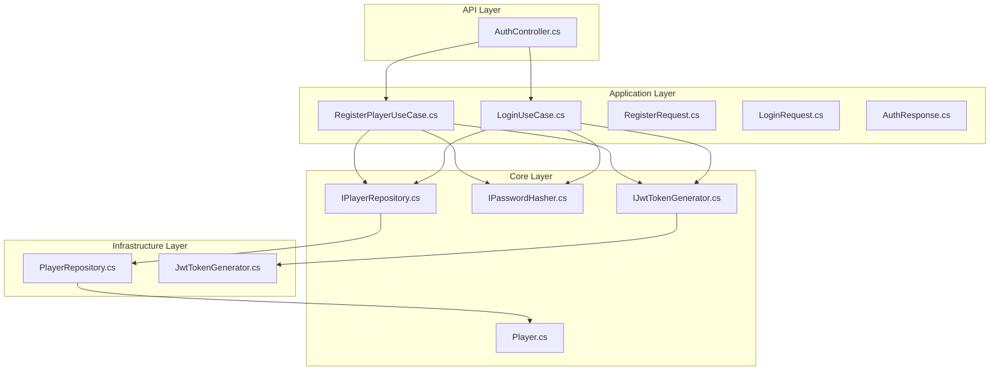
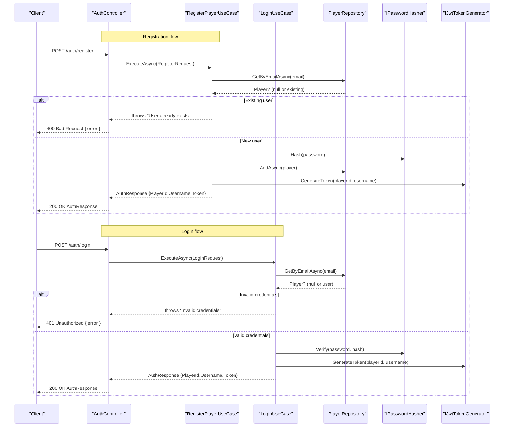
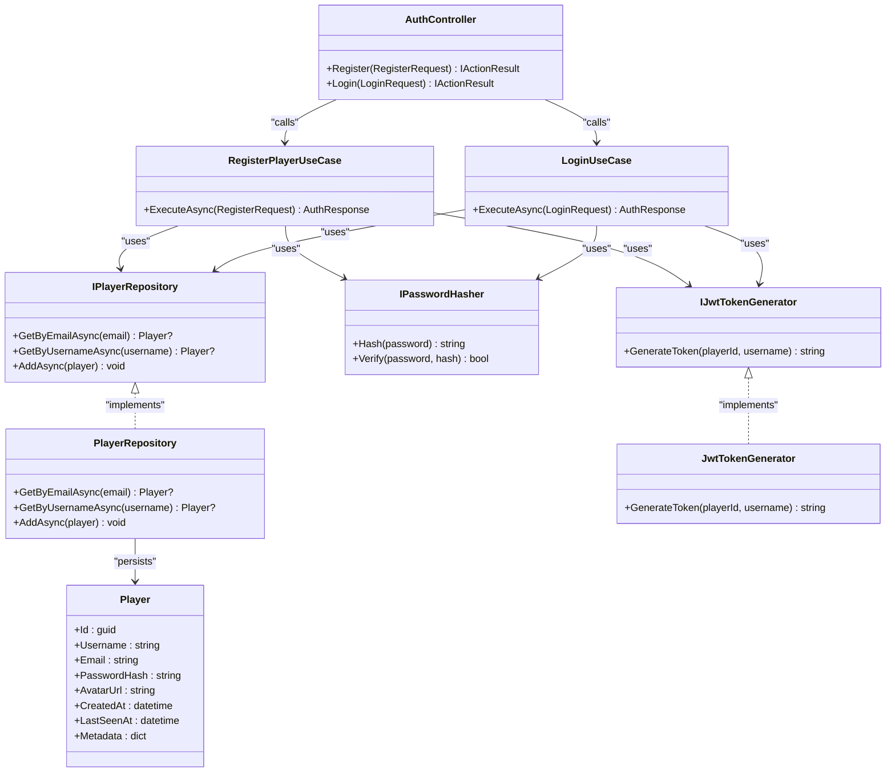

# Authentication Endpoints

<cite>
**Referenced Files in This Document**
- [AuthController.cs](file://GameBackend.API/Controllers/AuthController.cs)
- [RegisterRequest.cs](file://GameBackend.Application/Contracts/Auth/RegisterRequest.cs)
- [LoginRequest.cs](file://GameBackend.Application/Contracts/Auth/LoginRequest.cs)
- [AuthResponse.cs](file://GameBackend.Application/Contracts/Auth/AuthResponse.cs)
- [RegisterPlayerUseCase.cs](file://GameBackend.Application/Contracts/UseCases/Auth/RegisterPlayerUseCase.cs)
- [LoginUseCase.cs](file://GameBackend.Application/Contracts/UseCases/Auth/LoginUseCase.cs)
- [Player.cs](file://GameBackend.Core/Entities/Player.cs)
- [IPlayerRepository.cs](file://GameBackend.Core/Interfaces/IPlayerRepository.cs)
- [IPasswordHasher.cs](file://GameBackend.Core/Interfaces/IPasswordHasher.cs)
- [IJwtTokenGenerator.cs](file://GameBackend.Core/Interfaces/IJwtTokenGenerator.cs)
- [PlayerRepository.cs](file://GameBackend.Infrastructure/Repositories/PlayerRepository.cs)
- [JwtTokenGenerator.cs](file://GameBackend.Infrastructure/Security/JwtTokenGenerator.cs)
</cite>

## Table of Contents
1. [Introduction](#introduction)
2. [Project Structure](#project-structure)
3. [Core Components](#core-components)
4. [Architecture Overview](#architecture-overview)
5. [Detailed Component Analysis](#detailed-component-analysis)
6. [Dependency Analysis](#dependency-analysis)
7. [Performance Considerations](#performance-considerations)
8. [Troubleshooting Guide](#troubleshooting-guide)
9. [Conclusion](#conclusion)

## Introduction
This document provides comprehensive API documentation for the authentication endpoints exposed by the backend service. It covers:
- POST /auth/register for user registration
- POST /auth/login for user authentication

For each endpoint, you will find:
- Request schema and parameter specifications
- Successful response format with JWT token and user details
- HTTP status codes and error handling behavior
- Practical usage examples using curl and JSON payloads

## Project Structure
The authentication functionality spans multiple layers:
- API layer: HTTP controller exposing endpoints
- Application layer: use cases orchestrating business logic
- Core layer: domain entities and interfaces
- Infrastructure layer: persistence and security implementations

**Diagram sources**
- [AuthController.cs:1-49](file://GameBackend.API/Controllers/AuthController.cs#L1-L49)
- [RegisterPlayerUseCase.cs:1-58](file://GameBackend.Application/Contracts/UseCases/Auth/RegisterPlayerUseCase.cs#L1-L58)
- [LoginUseCase.cs:1-45](file://GameBackend.Application/Contracts/UseCases/Auth/LoginUseCase.cs#L1-L45)
- [RegisterRequest.cs:1-8](file://GameBackend.Application/Contracts/Auth/RegisterRequest.cs#L1-L8)
- [LoginRequest.cs:1-7](file://GameBackend.Application/Contracts/Auth/LoginRequest.cs#L1-L7)
- [AuthResponse.cs:1-8](file://GameBackend.Application/Contracts/Auth/AuthResponse.cs#L1-L8)
- [Player.cs:1-13](file://GameBackend.Core/Entities/Player.cs#L1-L13)
- [IPlayerRepository.cs:1-10](file://GameBackend.Core/Interfaces/IPlayerRepository.cs#L1-L10)
- [IPasswordHasher.cs:1-7](file://GameBackend.Core/Interfaces/IPasswordHasher.cs#L1-L7)
- [IJwtTokenGenerator.cs:1-6](file://GameBackend.Core/Interfaces/IJwtTokenGenerator.cs#L1-L6)
- [PlayerRepository.cs:1-34](file://GameBackend.Infrastructure/Repositories/PlayerRepository.cs#L1-L34)
- [JwtTokenGenerator.cs:1-44](file://GameBackend.Infrastructure/Security/JwtTokenGenerator.cs#L1-L44)

**Section sources**
- [AuthController.cs:1-49](file://GameBackend.API/Controllers/AuthController.cs#L1-L49)
- [RegisterPlayerUseCase.cs:1-58](file://GameBackend.Application/Contracts/UseCases/Auth/RegisterPlayerUseCase.cs#L1-L58)
- [LoginUseCase.cs:1-45](file://GameBackend.Application/Contracts/UseCases/Auth/LoginUseCase.cs#L1-L45)

## Core Components
This section documents the data contracts and response model used by the authentication endpoints.

- RegisterRequest
  - Fields:
    - Username: string
    - Email: string
    - Password: string
  - Notes: Used for user registration requests.

- LoginRequest
  - Fields:
    - Email: string
    - Password: string
  - Notes: Used for user login requests.

- AuthResponse
  - Fields:
    - PlayerId: guid
    - Username: string
    - Token: string (JWT)
  - Notes: Returned upon successful registration or login.

**Section sources**
- [RegisterRequest.cs:1-8](file://GameBackend.Application/Contracts/Auth/RegisterRequest.cs#L1-L8)
- [LoginRequest.cs:1-7](file://GameBackend.Application/Contracts/Auth/LoginRequest.cs#L1-L7)
- [AuthResponse.cs:1-8](file://GameBackend.Application/Contracts/Auth/AuthResponse.cs#L1-L8)

## Architecture Overview
The authentication endpoints follow a layered architecture:
- HTTP requests reach the controller
- Controller delegates to use cases
- Use cases interact with repositories and security interfaces
- Infrastructure implements persistence and JWT generation

**Diagram sources**
- [AuthController.cs:22-48](file://GameBackend.API/Controllers/AuthController.cs#L22-L48)
- [RegisterPlayerUseCase.cs:23-57](file://GameBackend.Application/Contracts/UseCases/Auth/RegisterPlayerUseCase.cs#L23-L57)
- [LoginUseCase.cs:22-44](file://GameBackend.Application/Contracts/UseCases/Auth/LoginUseCase.cs#L22-L44)
- [IPlayerRepository.cs:7-9](file://GameBackend.Core/Interfaces/IPlayerRepository.cs#L7-L9)
- [IPasswordHasher.cs:5-6](file://GameBackend.Core/Interfaces/IPasswordHasher.cs#L5-L6)
- [IJwtTokenGenerator.cs:5](file://GameBackend.Core/Interfaces/IJwtTokenGenerator.cs#L5)

## Detailed Component Analysis

### POST /auth/register
- Endpoint: POST /auth/register
- Description: Registers a new player using username, email, and password. Returns a JWT token and user details on success.
- Request body schema: RegisterRequest
  - Username: string
  - Email: string
  - Password: string
- Successful response body schema: AuthResponse
  - PlayerId: guid
  - Username: string
  - Token: string (JWT)
- HTTP status codes:
  - 200 OK: Registration successful
  - 400 Bad Request: User already exists or invalid input
- Error response format:
  - Content-Type: application/json
  - Body: { "error": "<message>" }
- Practical usage example:
  - curl
    - curl -X POST https://<host>/auth/register -H "Content-Type: application/json" -d '{"username":"alice","email":"alice@example.com","password":"securePass123"}'
  - Expected successful response
    - Status: 200
    - Body: {"playerId":"<guid>","username":"alice","token":"<jwt>"}
  - Error response (already exists)
    - Status: 400
    - Body: {"error":"User already exists"}

**Section sources**
- [AuthController.cs:22-34](file://GameBackend.API/Controllers/AuthController.cs#L22-L34)
- [RegisterPlayerUseCase.cs:23-57](file://GameBackend.Application/Contracts/UseCases/Auth/RegisterPlayerUseCase.cs#L23-L57)
- [RegisterRequest.cs:1-8](file://GameBackend.Application/Contracts/Auth/RegisterRequest.cs#L1-L8)
- [AuthResponse.cs:1-8](file://GameBackend.Application/Contracts/Auth/AuthResponse.cs#L1-L8)

### POST /auth/login
- Endpoint: POST /auth/login
- Description: Authenticates a player using email and password. Returns a JWT token and user details on success.
- Request body schema: LoginRequest
  - Email: string
  - Password: string
- Successful response body schema: AuthResponse
  - PlayerId: guid
  - Username: string
  - Token: string (JWT)
- HTTP status codes:
  - 200 OK: Authentication successful
  - 401 Unauthorized: Invalid credentials
- Error response format:
  - Content-Type: application/json
  - Body: { "error": "<message>" }
- Practical usage example:
  - curl
    - curl -X POST https://<host>/auth/login -H "Content-Type: application/json" -d '{"email":"alice@example.com","password":"securePass123"}'
  - Expected successful response
    - Status: 200
    - Body: {"playerId":"<guid>","username":"alice","token":"<jwt>"}
  - Error response (invalid credentials)
    - Status: 401
    - Body: {"error":"Invalid credentials"}

**Section sources**
- [AuthController.cs:36-48](file://GameBackend.API/Controllers/AuthController.cs#L36-L48)
- [LoginUseCase.cs:22-44](file://GameBackend.Application/Contracts/UseCases/Auth/LoginUseCase.cs#L22-L44)
- [LoginRequest.cs:1-7](file://GameBackend.Application/Contracts/Auth/LoginRequest.cs#L1-L7)
- [AuthResponse.cs:1-8](file://GameBackend.Application/Contracts/Auth/AuthResponse.cs#L1-L8)

## Dependency Analysis
The authentication endpoints depend on clean architecture boundaries:
- Controller depends on use cases
- Use cases depend on core interfaces
- Core interfaces are implemented by infrastructure

**Diagram sources**
- [AuthController.cs:9-20](file://GameBackend.API/Controllers/AuthController.cs#L9-L20)
- [RegisterPlayerUseCase.cs:7-21](file://GameBackend.Application/Contracts/UseCases/Auth/RegisterPlayerUseCase.cs#L7-L21)
- [LoginUseCase.cs:6-20](file://GameBackend.Application/Contracts/UseCases/Auth/LoginUseCase.cs#L6-L20)
- [IPlayerRepository.cs:5-9](file://GameBackend.Core/Interfaces/IPlayerRepository.cs#L5-L9)
- [IPasswordHasher.cs:3-6](file://GameBackend.Core/Interfaces/IPasswordHasher.cs#L3-L6)
- [IJwtTokenGenerator.cs:3-5](file://GameBackend.Core/Interfaces/IJwtTokenGenerator.cs#L3-L5)
- [PlayerRepository.cs:8-33](file://GameBackend.Infrastructure/Repositories/PlayerRepository.cs#L8-L33)
- [JwtTokenGenerator.cs:11-43](file://GameBackend.Infrastructure/Security/JwtTokenGenerator.cs#L11-L43)
- [Player.cs:3-12](file://GameBackend.Core/Entities/Player.cs#L3-L12)

**Section sources**
- [AuthController.cs:1-49](file://GameBackend.API/Controllers/AuthController.cs#L1-L49)
- [RegisterPlayerUseCase.cs:1-58](file://GameBackend.Application/Contracts/UseCases/Auth/RegisterPlayerUseCase.cs#L1-L58)
- [LoginUseCase.cs:1-45](file://GameBackend.Application/Contracts/UseCases/Auth/LoginUseCase.cs#L1-L45)

## Performance Considerations
- Password hashing cost: The password hasher interface is designed to support configurable hashing costs; ensure appropriate settings are configured in production to balance security and performance.
- Token lifetime: JWT tokens are generated with a fixed expiration policy; ensure client-side refresh strategies align with server-configured token lifetimes.
- Database queries: Repository methods use asynchronous operations; keep database connections tuned and consider indexing on Email and Username for optimal lookup performance.
- Controller error handling: Exceptions thrown by use cases are caught and mapped to HTTP status codes; avoid throwing large exception messages to clients to prevent payload bloat.

[No sources needed since this section provides general guidance]

## Troubleshooting Guide
Common issues and resolutions:
- Registration fails with "User already exists"
  - Cause: Email is already registered
  - Resolution: Use a different email or log in instead
  - HTTP status: 400 Bad Request
- Login fails with "Invalid credentials"
  - Cause: Non-existent email or incorrect password
  - Resolution: Verify email/password; ensure account exists
  - HTTP status: 401 Unauthorized
- Network or server errors
  - Cause: Temporary connectivity or server issues
  - Resolution: Retry after a short delay; check service health
- Unexpected error payloads
  - Cause: Unhandled exceptions in use cases
  - Resolution: Review server logs; ensure proper validation before calling endpoints

**Section sources**
- [AuthController.cs:30-33](file://GameBackend.API/Controllers/AuthController.cs#L30-L33)
- [AuthController.cs:44-47](file://GameBackend.API/Controllers/AuthController.cs#L44-L47)
- [RegisterPlayerUseCase.cs:27](file://GameBackend.Application/Contracts/UseCases/Auth/RegisterPlayerUseCase.cs#L27)
- [LoginUseCase.cs:26-32](file://GameBackend.Application/Contracts/UseCases/Auth/LoginUseCase.cs#L26-L32)

## Conclusion
The authentication endpoints provide a clear, layered approach to user registration and login:
- Requests are validated via strongly-typed models
- Use cases encapsulate business logic
- Core interfaces enable testable and maintainable code
- Infrastructure implementations handle persistence and security

Follow the documented request/response schemas and status codes to integrate with the endpoints reliably.

[No sources needed since this section summarizes without analyzing specific files]