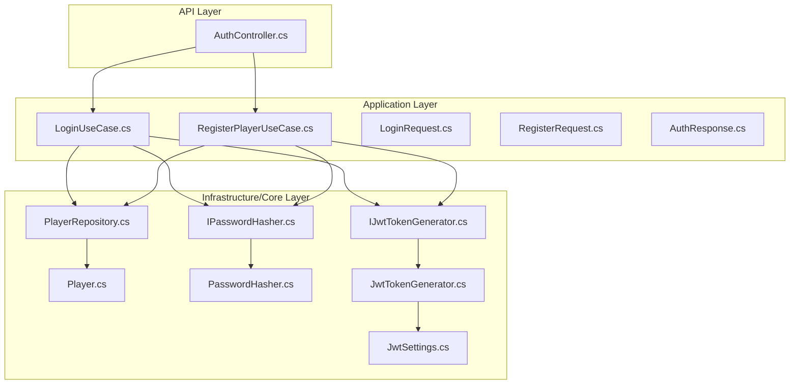
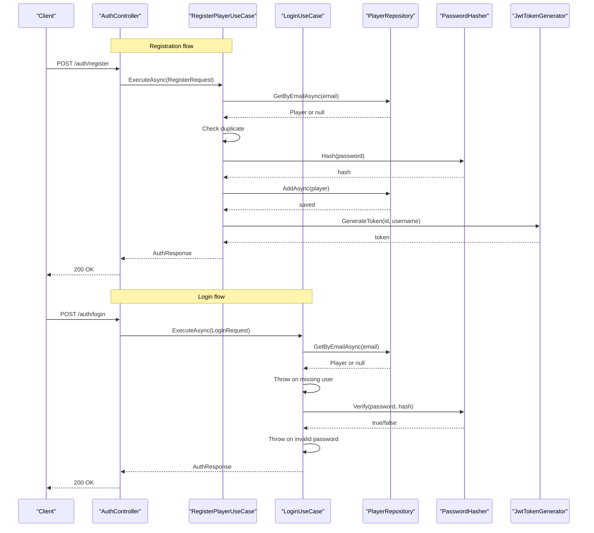
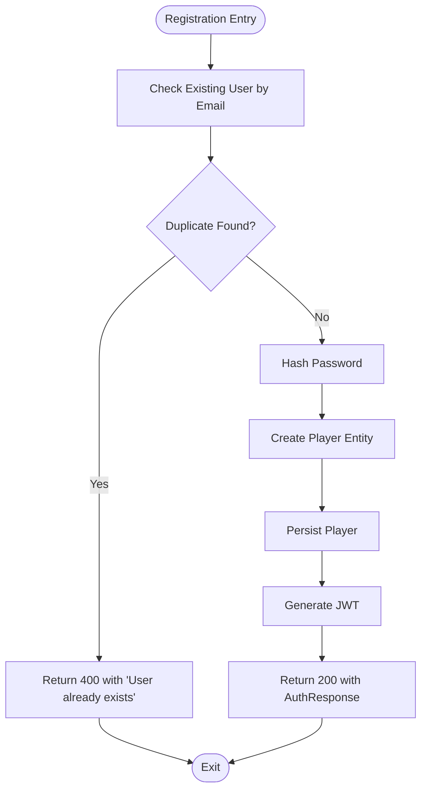
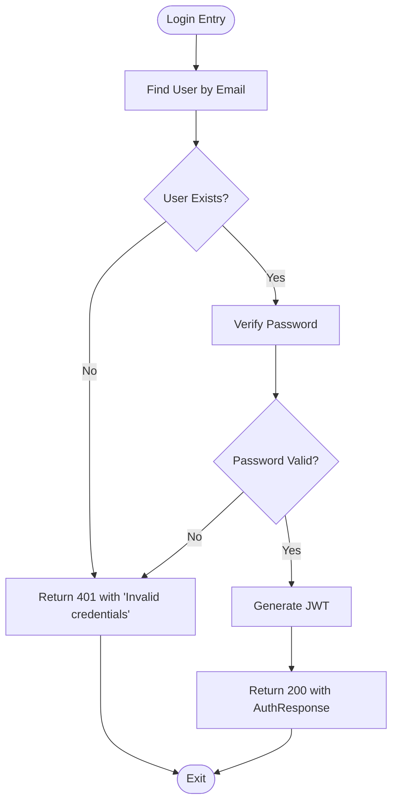
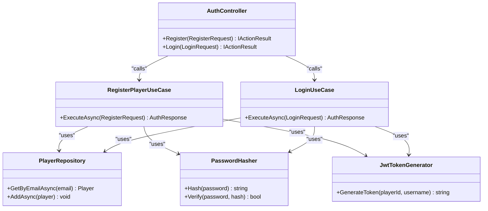

# Error Handling & Status Codes

<cite>
**Referenced Files in This Document**
- [AuthController.cs](file://GameBackend.API/Controllers/AuthController.cs)
- [LoginUseCase.cs](file://GameBackend.Application/Contracts/UseCases/Auth/LoginUseCase.cs)
- [RegisterPlayerUseCase.cs](file://GameBackend.Application/Contracts/UseCases/Auth/RegisterPlayerUseCase.cs)
- [LoginRequest.cs](file://GameBackend.Application/Contracts/Auth/LoginRequest.cs)
- [RegisterRequest.cs](file://GameBackend.Application/Contracts/Auth/RegisterRequest.cs)
- [AuthResponse.cs](file://GameBackend.Application/Contracts/Auth/AuthResponse.cs)
- [PlayerRepository.cs](file://GameBackend.Infrastructure/Repositories/PlayerRepository.cs)
- [Player.cs](file://GameBackend.Core/Entities/Player.cs)
- [IPasswordHasher.cs](file://GameBackend.Core/Interfaces/IPasswordHasher.cs)
- [IJwtTokenGenerator.cs](file://GameBackend.Core/Interfaces/IJwtTokenGenerator.cs)
- [PasswordHasher.cs](file://GameBackend.Infrastructure/Security/PasswordHasher.cs)
- [JwtTokenGenerator.cs](file://GameBackend.Infrastructure/Security/JwtTokenGenerator.cs)
- [JwtSettings.cs](file://GameBackend.Infrastructure/Security/JwtSettings.cs)
</cite>

## Table of Contents
1. [Introduction](#introduction)
2. [Project Structure](#project-structure)
3. [Core Components](#core-components)
4. [Architecture Overview](#architecture-overview)
5. [Detailed Component Analysis](#detailed-component-analysis)
6. [Dependency Analysis](#dependency-analysis)
7. [Performance Considerations](#performance-considerations)
8. [Troubleshooting Guide](#troubleshooting-guide)
9. [Conclusion](#conclusion)

## Introduction
This document explains how the authentication API handles errors and maps them to HTTP status codes. It covers:
- Invalid input validation failures
- Duplicate email registration
- Incorrect login credentials
- Server-side exceptions

It also documents the HTTP status codes used (400 for bad requests, 401 for unauthorized, 500 for internal server errors), the error response format, common validation patterns, and troubleshooting guidance.

## Project Structure
The authentication flow spans three layers:
- API layer: controllers receive requests and return HTTP responses
- Application layer: use cases orchestrate business logic and throw domain-specific exceptions
- Infrastructure/Core layer: repositories and services implement persistence and cryptography

**Diagram sources**
- [AuthController.cs:1-49](file://GameBackend.API/Controllers/AuthController.cs#L1-L49)
- [LoginUseCase.cs:1-45](file://GameBackend.Application/Contracts/UseCases/Auth/LoginUseCase.cs#L1-L45)
- [RegisterPlayerUseCase.cs:1-58](file://GameBackend.Application/Contracts/UseCases/Auth/RegisterPlayerUseCase.cs#L1-L58)
- [LoginRequest.cs:1-7](file://GameBackend.Application/Contracts/Auth/LoginRequest.cs#L1-L7)
- [RegisterRequest.cs:1-8](file://GameBackend.Application/Contracts/Auth/RegisterRequest.cs#L1-L8)
- [AuthResponse.cs:1-8](file://GameBackend.Application/Contracts/Auth/AuthResponse.cs#L1-L8)
- [PlayerRepository.cs:1-34](file://GameBackend.Infrastructure/Repositories/PlayerRepository.cs#L1-L34)
- [Player.cs:1-13](file://GameBackend.Core/Entities/Player.cs#L1-L13)
- [IPasswordHasher.cs:1-7](file://GameBackend.Core/Interfaces/IPasswordHasher.cs#L1-L7)
- [IJwtTokenGenerator.cs:1-6](file://GameBackend.Core/Interfaces/IJwtTokenGenerator.cs#L1-L6)
- [PasswordHasher.cs:1-16](file://GameBackend.Infrastructure/Security/PasswordHasher.cs#L1-L16)
- [JwtTokenGenerator.cs:1-44](file://GameBackend.Infrastructure/Security/JwtTokenGenerator.cs#L1-L44)
- [JwtSettings.cs:1-8](file://GameBackend.Infrastructure/Security/JwtSettings.cs#L1-L8)

**Section sources**
- [AuthController.cs:1-49](file://GameBackend.API/Controllers/AuthController.cs#L1-L49)
- [LoginUseCase.cs:1-45](file://GameBackend.Application/Contracts/UseCases/Auth/LoginUseCase.cs#L1-L45)
- [RegisterPlayerUseCase.cs:1-58](file://GameBackend.Application/Contracts/UseCases/Auth/RegisterPlayerUseCase.cs#L1-L58)

## Core Components
- AuthController: Receives authentication requests and returns standardized HTTP responses. It catches exceptions and maps them to appropriate HTTP status codes.
- LoginUseCase: Validates credentials and throws exceptions for invalid inputs or missing users.
- RegisterPlayerUseCase: Checks for duplicate emails and throws exceptions when a user already exists.
- LoginRequest/RegisterRequest/AuthResponse: Request/response DTOs used by the API.
- PlayerRepository: Persists and retrieves players; used by use cases.
- PasswordHasher/JwtTokenGenerator: Cryptographic helpers used by use cases.

**Section sources**
- [AuthController.cs:22-48](file://GameBackend.API/Controllers/AuthController.cs#L22-L48)
- [LoginUseCase.cs:22-44](file://GameBackend.Application/Contracts/UseCases/Auth/LoginUseCase.cs#L22-L44)
- [RegisterPlayerUseCase.cs:23-57](file://GameBackend.Application/Contracts/UseCases/Auth/RegisterPlayerUseCase.cs#L23-L57)
- [LoginRequest.cs:1-7](file://GameBackend.Application/Contracts/Auth/LoginRequest.cs#L1-L7)
- [RegisterRequest.cs:1-8](file://GameBackend.Application/Contracts/Auth/RegisterRequest.cs#L1-L8)
- [AuthResponse.cs:1-8](file://GameBackend.Application/Contracts/Auth/AuthResponse.cs#L1-L8)
- [PlayerRepository.cs:17-33](file://GameBackend.Infrastructure/Repositories/PlayerRepository.cs#L17-L33)
- [IPasswordHasher.cs:1-7](file://GameBackend.Core/Interfaces/IPasswordHasher.cs#L1-L7)
- [IJwtTokenGenerator.cs:1-6](file://GameBackend.Core/Interfaces/IJwtTokenGenerator.cs#L1-L6)

## Architecture Overview
The controller delegates to use cases. Use cases call repositories and cryptographic services. Exceptions thrown by use cases are caught by the controller and mapped to HTTP responses.

**Diagram sources**
- [AuthController.cs:22-48](file://GameBackend.API/Controllers/AuthController.cs#L22-L48)
- [RegisterPlayerUseCase.cs:23-57](file://GameBackend.Application/Contracts/UseCases/Auth/RegisterPlayerUseCase.cs#L23-L57)
- [LoginUseCase.cs:22-44](file://GameBackend.Application/Contracts/UseCases/Auth/LoginUseCase.cs#L22-L44)
- [PlayerRepository.cs:17-33](file://GameBackend.Infrastructure/Repositories/PlayerRepository.cs#L17-L33)
- [PasswordHasher.cs:7-15](file://GameBackend.Infrastructure/Security/PasswordHasher.cs#L7-L15)
- [JwtTokenGenerator.cs:20-43](file://GameBackend.Infrastructure/Security/JwtTokenGenerator.cs#L20-L43)

## Detailed Component Analysis

### HTTP Status Codes and Error Responses
- 400 Bad Request: Returned when an unhandled exception occurs during registration. The response body contains a JSON object with an error field.
- 401 Unauthorized: Returned when an unhandled exception occurs during login (e.g., invalid credentials).
- 500 Internal Server Error: Not explicitly returned by the current controller logic. If thrown, ASP.NET Core would map it to 500 by default.

Error response format:
- Body: JSON object with a single error property containing a human-readable message.

Examples of typical error responses:
- Registration failure: {"error": "Something went wrong"}
- Login failure: {"error": "Invalid credentials"}

Note: The current implementation wraps all exceptions in a generic message. Validation failures (e.g., empty fields) are not handled at the controller level and will surface as 400 with a generic message.

**Section sources**
- [AuthController.cs:30-33](file://GameBackend.API/Controllers/AuthController.cs#L30-L33)
- [AuthController.cs:44-47](file://GameBackend.API/Controllers/AuthController.cs#L44-L47)

### Error Scenarios and Causes

#### Invalid Input Validation Failures
- Cause: Empty or malformed fields in the request payload.
- Behavior: The controller catches exceptions thrown by use cases. Since validation is not performed in the controller, exceptions propagate as generic messages.
- HTTP Status: 400 Bad Request.
- Troubleshooting: Ensure all required fields are present and correctly formatted before sending the request.

Common validation patterns:
- Non-empty username/email/password
- Valid email format
- Minimum password length

**Section sources**
- [AuthController.cs:30-33](file://GameBackend.API/Controllers/AuthController.cs#L30-L33)
- [RegisterRequest.cs:1-8](file://GameBackend.Application/Contracts/Auth/RegisterRequest.cs#L1-L8)
- [LoginRequest.cs:1-7](file://GameBackend.Application/Contracts/Auth/LoginRequest.cs#L1-L7)

#### Duplicate Email Registration
- Cause: Attempting to register with an email that already exists.
- Behavior: Use case checks for an existing user by email and throws an exception if found.
- HTTP Status: 400 Bad Request.
- Error Message: Generic message wrapping the underlying cause.

**Section sources**
- [RegisterPlayerUseCase.cs:25-28](file://GameBackend.Application/Contracts/UseCases/Auth/RegisterPlayerUseCase.cs#L25-L28)
- [PlayerRepository.cs:17-21](file://GameBackend.Infrastructure/Repositories/PlayerRepository.cs#L17-L21)

#### Incorrect Login Credentials
- Cause: Nonexistent email or mismatched password.
- Behavior: Use case throws an exception after failing to find the user or verifying the password.
- HTTP Status: 401 Unauthorized.
- Error Message: Generic message indicating invalid credentials.

**Section sources**
- [LoginUseCase.cs:24-32](file://GameBackend.Application/Contracts/UseCases/Auth/LoginUseCase.cs#L24-L32)
- [PlayerRepository.cs:17-21](file://GameBackend.Infrastructure/Repositories/PlayerRepository.cs#L17-L21)
- [PasswordHasher.cs:12-15](file://GameBackend.Infrastructure/Security/PasswordHasher.cs#L12-L15)

#### Server-Side Exceptions
- Cause: Unexpected runtime errors in repositories or cryptographic services.
- Behavior: Exceptions bubble up to the controller, which returns 400 Bad Request with a generic message.
- HTTP Status: 400 Bad Request.

**Section sources**
- [AuthController.cs:30-33](file://GameBackend.API/Controllers/AuthController.cs#L30-L33)
- [AuthController.cs:44-47](file://GameBackend.API/Controllers/AuthController.cs#L44-L47)

### Processing Logic Flow for Registration

**Diagram sources**
- [RegisterPlayerUseCase.cs:23-57](file://GameBackend.Application/Contracts/UseCases/Auth/RegisterPlayerUseCase.cs#L23-L57)
- [PlayerRepository.cs:17-33](file://GameBackend.Infrastructure/Repositories/PlayerRepository.cs#L17-L33)
- [PasswordHasher.cs:7-10](file://GameBackend.Infrastructure/Security/PasswordHasher.cs#L7-L10)
- [JwtTokenGenerator.cs:20-43](file://GameBackend.Infrastructure/Security/JwtTokenGenerator.cs#L20-L43)

### Processing Logic Flow for Login

**Diagram sources**
- [LoginUseCase.cs:22-44](file://GameBackend.Application/Contracts/UseCases/Auth/LoginUseCase.cs#L22-L44)
- [PlayerRepository.cs:17-21](file://GameBackend.Infrastructure/Repositories/PlayerRepository.cs#L17-L21)
- [PasswordHasher.cs:12-15](file://GameBackend.Infrastructure/Security/PasswordHasher.cs#L12-L15)
- [JwtTokenGenerator.cs:20-43](file://GameBackend.Infrastructure/Security/JwtTokenGenerator.cs#L20-L43)

## Dependency Analysis

**Diagram sources**
- [AuthController.cs:14-20](file://GameBackend.API/Controllers/AuthController.cs#L14-L20)
- [RegisterPlayerUseCase.cs:13-21](file://GameBackend.Application/Contracts/UseCases/Auth/RegisterPlayerUseCase.cs#L13-L21)
- [LoginUseCase.cs:12-20](file://GameBackend.Application/Contracts/UseCases/Auth/LoginUseCase.cs#L12-L20)
- [PlayerRepository.cs:8-33](file://GameBackend.Infrastructure/Repositories/PlayerRepository.cs#L8-L33)
- [PasswordHasher.cs:5-16](file://GameBackend.Infrastructure/Security/PasswordHasher.cs#L5-L16)
- [JwtTokenGenerator.cs:11-44](file://GameBackend.Infrastructure/Security/JwtTokenGenerator.cs#L11-L44)

**Section sources**
- [AuthController.cs:14-20](file://GameBackend.API/Controllers/AuthController.cs#L14-L20)
- [RegisterPlayerUseCase.cs:13-21](file://GameBackend.Application/Contracts/UseCases/Auth/RegisterPlayerUseCase.cs#L13-L21)
- [LoginUseCase.cs:12-20](file://GameBackend.Application/Contracts/UseCases/Auth/LoginUseCase.cs#L12-L20)

## Performance Considerations
- Exception overhead: Throwing exceptions for control-flow events (invalid credentials, duplicates) introduces overhead. Consider returning structured error responses instead of exceptions for these cases to reduce overhead and improve clarity.
- Hashing cost: Password hashing is computationally expensive; ensure it is only invoked when necessary.
- Token generation: JWT creation is lightweight but still adds latency; cache tokens if appropriate and reuse where feasible.

## Troubleshooting Guide
- 400 Bad Request on Registration:
  - Verify the email is not already registered.
  - Ensure all required fields are present and valid.
  - Confirm backend logs for the underlying exception message.
- 401 Unauthorized on Login:
  - Confirm the email exists and the password matches.
  - Check that the account is not locked or disabled elsewhere in the system.
- Generic error messages:
  - The current controller wraps exceptions in a generic message. To improve diagnostics, consider adding structured error payloads with codes and details.
- 500 Internal Server Error:
  - Not explicitly returned by the controller. If encountered, inspect server logs for stack traces and ensure proper exception handling middleware is configured.

**Section sources**
- [AuthController.cs:30-33](file://GameBackend.API/Controllers/AuthController.cs#L30-L33)
- [AuthController.cs:44-47](file://GameBackend.API/Controllers/AuthController.cs#L44-L47)
- [RegisterPlayerUseCase.cs:25-28](file://GameBackend.Application/Contracts/UseCases/Auth/RegisterPlayerUseCase.cs#L25-L28)
- [LoginUseCase.cs:24-32](file://GameBackend.Application/Contracts/UseCases/Auth/LoginUseCase.cs#L24-L32)

## Conclusion
The authentication API currently maps use-case exceptions to 400 Bad Request for registration and 401 Unauthorized for login. To enhance observability and usability:
- Add explicit validation at the controller boundary and return structured error responses with codes.
- Distinguish between client errors (400) and authentication failures (401) more precisely.
- Consider returning 500 only for unexpected server failures and include correlation IDs for tracing.