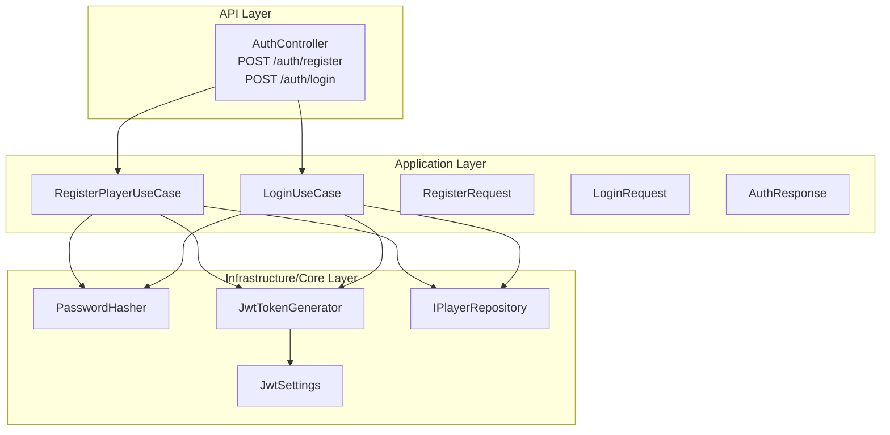
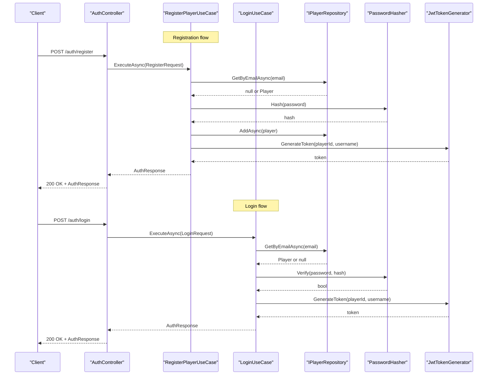
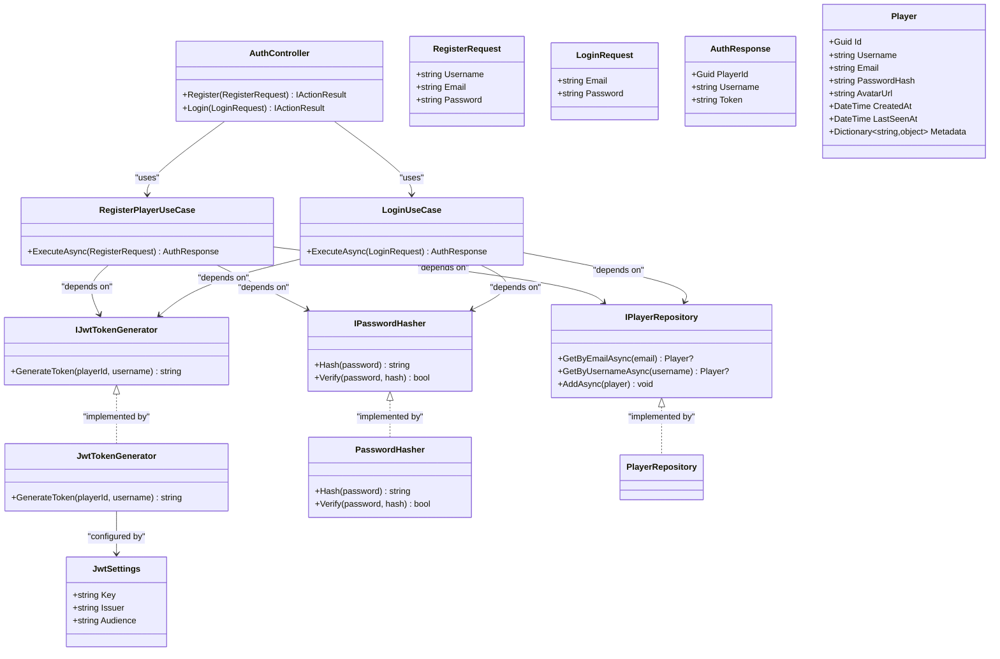

# Request & Response Schemas

<cite>
**Referenced Files in This Document**
- [AuthController.cs](file://GameBackend.API/Controllers/AuthController.cs)
- [RegisterRequest.cs](file://GameBackend.Application/Contracts/Auth/RegisterRequest.cs)
- [LoginRequest.cs](file://GameBackend.Application/Contracts/Auth/LoginRequest.cs)
- [AuthResponse.cs](file://GameBackend.Application/Contracts/Auth/AuthResponse.cs)
- [RegisterPlayerUseCase.cs](file://GameBackend.Application/Contracts/UseCases/Auth/RegisterPlayerUseCase.cs)
- [LoginUseCase.cs](file://GameBackend.Application/Contracts/UseCases/Auth/LoginUseCase.cs)
- [JwtTokenGenerator.cs](file://GameBackend.Infrastructure/Security/JwtTokenGenerator.cs)
- [PasswordHasher.cs](file://GameBackend.Infrastructure/Security/PasswordHasher.cs)
- [IJwtTokenGenerator.cs](file://GameBackend.Core/Interfaces/IJwtTokenGenerator.cs)
- [IPasswordHasher.cs](file://GameBackend.Core/Interfaces/IPasswordHasher.cs)
- [IPlayerRepository.cs](file://GameBackend.Core/Interfaces/IPlayerRepository.cs)
- [JwtSettings.cs](file://GameBackend.Infrastructure/Security/JwtSettings.cs)
- [Player.cs](file://GameBackend.Core/Entities/Player.cs)
</cite>

## Table of Contents
1. [Introduction](#introduction)
2. [Project Structure](#project-structure)
3. [Core Components](#core-components)
4. [Architecture Overview](#architecture-overview)
5. [Detailed Component Analysis](#detailed-component-analysis)
6. [Dependency Analysis](#dependency-analysis)
7. [Performance Considerations](#performance-considerations)
8. [Troubleshooting Guide](#troubleshooting-guide)
9. [Conclusion](#conclusion)

## Introduction
This document defines the API request and response data schemas for authentication operations. It covers:
- RegisterRequest schema with validation requirements
- LoginRequest schema with validation requirements
- AuthResponse schema including JWT token structure and payload details
- Field descriptions, data types, validation rules, example JSON payloads, and common validation errors with corresponding HTTP status codes

## Project Structure
The authentication flow spans three layers:
- API layer: HTTP endpoints and controller actions
- Application layer: use cases orchestrating business logic
- Infrastructure/Core layer: security helpers and repositories

**Diagram sources**
- [AuthController.cs:22-48](file://GameBackend.API/Controllers/AuthController.cs#L22-L48)
- [RegisterPlayerUseCase.cs:23-57](file://GameBackend.Application/Contracts/UseCases/Auth/RegisterPlayerUseCase.cs#L23-L57)
- [LoginUseCase.cs:22-44](file://GameBackend.Application/Contracts/UseCases/Auth/LoginUseCase.cs#L22-L44)
- [JwtTokenGenerator.cs:20-43](file://GameBackend.Infrastructure/Security/JwtTokenGenerator.cs#L20-L43)
- [PasswordHasher.cs:7-15](file://GameBackend.Infrastructure/Security/PasswordHasher.cs#L7-L15)
- [IPlayerRepository.cs:7-9](file://GameBackend.Core/Interfaces/IPlayerRepository.cs#L7-L9)
- [JwtSettings.cs:5-7](file://GameBackend.Infrastructure/Security/JwtSettings.cs#L5-L7)

**Section sources**
- [AuthController.cs:1-49](file://GameBackend.API/Controllers/AuthController.cs#L1-L49)
- [RegisterPlayerUseCase.cs:1-58](file://GameBackend.Application/Contracts/UseCases/Auth/RegisterPlayerUseCase.cs#L1-L58)
- [LoginUseCase.cs:1-45](file://GameBackend.Application/Contracts/UseCases/Auth/LoginUseCase.cs#L1-L45)

## Core Components
This section documents the data contracts exchanged by the authentication endpoints.

### RegisterRequest
- Purpose: Encapsulates registration input data.
- Fields:
  - Username: string, required
  - Email: string, required
  - Password: string, required
- Validation rules:
  - Presence: All fields must be present and non-empty.
  - Email format: Not validated in the contract; rely on transport-level validation or middleware.
  - Password strength: Not enforced in the contract; hashing occurs in the use case.
  - Confirmation field: Not present in the contract; no client-side confirmation is enforced here.
- Example JSON payload:
  {
    "username": "johndoe",
    "email": "john.doe@example.com",
    "password": "SecurePass!2024"
  }
- HTTP endpoint: POST /auth/register
- Typical responses:
  - 200 OK with AuthResponse on success
  - 400 Bad Request with error message on failure (e.g., duplicate email)

**Section sources**
- [RegisterRequest.cs:3-8](file://GameBackend.Application/Contracts/Auth/RegisterRequest.cs#L3-L8)
- [AuthController.cs:22-34](file://GameBackend.API/Controllers/AuthController.cs#L22-L34)
- [RegisterPlayerUseCase.cs:23-57](file://GameBackend.Application/Contracts/UseCases/Auth/RegisterPlayerUseCase.cs#L23-L57)

### LoginRequest
- Purpose: Encapsulates login input data.
- Fields:
  - Email: string, required
  - Password: string, required
- Validation rules:
  - Presence: Both fields must be present and non-empty.
  - Email format: Not validated in the contract; rely on transport-level validation or middleware.
- Example JSON payload:
  {
    "email": "john.doe@example.com",
    "password": "CurrentPass!2024"
  }
- HTTP endpoint: POST /auth/login
- Typical responses:
  - 200 OK with AuthResponse on success
  - 401 Unauthorized with error message on invalid credentials

**Section sources**
- [LoginRequest.cs:3-7](file://GameBackend.Application/Contracts/Auth/LoginRequest.cs#L3-L7)
- [AuthController.cs:36-48](file://GameBackend.API/Controllers/AuthController.cs#L36-L48)
- [LoginUseCase.cs:22-44](file://GameBackend.Application/Contracts/UseCases/Auth/LoginUseCase.cs#L22-L44)

### AuthResponse
- Purpose: Encapsulates the authentication result returned to clients.
- Fields:
  - PlayerId: Guid, unique identifier of the authenticated player
  - Username: string, display name of the player
  - Token: string, JWT bearer token
- JWT token structure and claims:
  - Subject (sub): PlayerId as a string
  - Unique name (unique_name): Username
  - Issuer (iss): From JwtSettings
  - Audience (aud): From JwtSettings
  - Expiration (exp): 7 days from issuance
- Example JSON payload:
  {
    "playerId": "f1a2b3c4-d5e6-7890-a1b2-c3d4e5f67890",
    "username": "johndoe",
    "token": "eyJhb...QssXw"
  }
- HTTP status mapping:
  - 200 OK for successful registration and login
  - 400 Bad Request for registration failures
  - 401 Unauthorized for login credential failures

**Section sources**
- [AuthResponse.cs:3-8](file://GameBackend.Application/Contracts/Auth/AuthResponse.cs#L3-L8)
- [JwtTokenGenerator.cs:20-43](file://GameBackend.Infrastructure/Security/JwtTokenGenerator.cs#L20-L43)
- [JwtSettings.cs:5-7](file://GameBackend.Infrastructure/Security/JwtSettings.cs#L5-L7)
- [AuthController.cs:22-48](file://GameBackend.API/Controllers/AuthController.cs#L22-L48)

## Architecture Overview
The authentication flow integrates the API controller, application use cases, and infrastructure services.

**Diagram sources**
- [AuthController.cs:22-48](file://GameBackend.API/Controllers/AuthController.cs#L22-L48)
- [RegisterPlayerUseCase.cs:23-57](file://GameBackend.Application/Contracts/UseCases/Auth/RegisterPlayerUseCase.cs#L23-L57)
- [LoginUseCase.cs:22-44](file://GameBackend.Application/Contracts/UseCases/Auth/LoginUseCase.cs#L22-L44)
- [IPlayerRepository.cs:7-9](file://GameBackend.Core/Interfaces/IPlayerRepository.cs#L7-L9)
- [PasswordHasher.cs:7-15](file://GameBackend.Infrastructure/Security/PasswordHasher.cs#L7-L15)
- [JwtTokenGenerator.cs:20-43](file://GameBackend.Infrastructure/Security/JwtTokenGenerator.cs#L20-L43)

## Detailed Component Analysis

### RegisterRequest Schema
- Data type summary:
  - Username: string
  - Email: string
  - Password: string
- Validation rules:
  - Required presence: All fields must be non-empty
  - Email format: Not enforced in the contract; consider transport-level validation
  - Password strength: Not enforced in the contract; hashing is performed by the use case
  - Confirmation field: Not included in the contract
- Processing logic:
  - Checks for existing user by email
  - Hashes the password
  - Creates a new Player entity
  - Persists the player
  - Generates a JWT token
  - Returns AuthResponse
- Example JSON payload:
  {
    "username": "alice",
    "email": "alice@example.com",
    "password": "P@ssw0rd2024"
  }
- Common validation errors and HTTP status codes:
  - Duplicate email: 400 Bad Request
- Related implementation references:
  - [RegisterRequest.cs:3-8](file://GameBackend.Application/Contracts/Auth/RegisterRequest.cs#L3-L8)
  - [RegisterPlayerUseCase.cs:23-57](file://GameBackend.Application/Contracts/UseCases/Auth/RegisterPlayerUseCase.cs#L23-L57)
  - [AuthController.cs:22-34](file://GameBackend.API/Controllers/AuthController.cs#L22-L34)

**Section sources**
- [RegisterRequest.cs:3-8](file://GameBackend.Application/Contracts/Auth/RegisterRequest.cs#L3-L8)
- [RegisterPlayerUseCase.cs:23-57](file://GameBackend.Application/Contracts/UseCases/Auth/RegisterPlayerUseCase.cs#L23-L57)
- [AuthController.cs:22-34](file://GameBackend.API/Controllers/AuthController.cs#L22-L34)

### LoginRequest Schema
- Data type summary:
  - Email: string
  - Password: string
- Validation rules:
  - Required presence: Both fields must be non-empty
  - Email format: Not enforced in the contract; consider transport-level validation
- Processing logic:
  - Retrieves player by email
  - Verifies password against stored hash
  - Generates a JWT token
  - Returns AuthResponse
- Example JSON payload:
  {
    "email": "alice@example.com",
    "password": "P@ssw0rd2024"
  }
- Common validation errors and HTTP status codes:
  - Invalid credentials (user not found or wrong password): 401 Unauthorized
- Related implementation references:
  - [LoginRequest.cs:3-7](file://GameBackend.Application/Contracts/Auth/LoginRequest.cs#L3-L7)
  - [LoginUseCase.cs:22-44](file://GameBackend.Application/Contracts/UseCases/Auth/LoginUseCase.cs#L22-L44)
  - [AuthController.cs:36-48](file://GameBackend.API/Controllers/AuthController.cs#L36-L48)

**Section sources**
- [LoginRequest.cs:3-7](file://GameBackend.Application/Contracts/Auth/LoginRequest.cs#L3-L7)
- [LoginUseCase.cs:22-44](file://GameBackend.Application/Contracts/UseCases/Auth/LoginUseCase.cs#L22-L44)
- [AuthController.cs:36-48](file://GameBackend.API/Controllers/AuthController.cs#L36-L48)

### AuthResponse Schema
- Data type summary:
  - PlayerId: Guid
  - Username: string
  - Token: string (JWT)
- JWT token structure and claims:
  - Subject (sub): PlayerId
  - Unique name (unique_name): Username
  - Issuer (iss): From JwtSettings
  - Audience (aud): From JwtSettings
  - Expiration (exp): 7 days after issuance
- Processing logic:
  - Generated by JwtTokenGenerator using configured key, issuer, and audience
- Example JSON payload:
  {
    "playerId": "123e4567-e89b-12d3-a456-426614174000",
    "username": "alice",
    "token": "eyJhb...Signature"
  }
- HTTP status mapping:
  - 200 OK for successful registration and login
  - 400 Bad Request for registration failures
  - 401 Unauthorized for login credential failures
- Related implementation references:
  - [AuthResponse.cs:3-8](file://GameBackend.Application/Contracts/Auth/AuthResponse.cs#L3-L8)
  - [JwtTokenGenerator.cs:20-43](file://GameBackend.Infrastructure/Security/JwtTokenGenerator.cs#L20-L43)
  - [JwtSettings.cs:5-7](file://GameBackend.Infrastructure/Security/JwtSettings.cs#L5-L7)
  - [AuthController.cs:22-48](file://GameBackend.API/Controllers/AuthController.cs#L22-L48)

**Section sources**
- [AuthResponse.cs:3-8](file://GameBackend.Application/Contracts/Auth/AuthResponse.cs#L3-L8)
- [JwtTokenGenerator.cs:20-43](file://GameBackend.Infrastructure/Security/JwtTokenGenerator.cs#L20-L43)
- [JwtSettings.cs:5-7](file://GameBackend.Infrastructure/Security/JwtSettings.cs#L5-L7)
- [AuthController.cs:22-48](file://GameBackend.API/Controllers/AuthController.cs#L22-L48)

## Dependency Analysis
The following diagram shows how the authentication components depend on each other and on external interfaces.

**Diagram sources**
- [AuthController.cs:14-20](file://GameBackend.API/Controllers/AuthController.cs#L14-L20)
- [RegisterPlayerUseCase.cs:9-21](file://GameBackend.Application/Contracts/UseCases/Auth/RegisterPlayerUseCase.cs#L9-L21)
- [LoginUseCase.cs:8-20](file://GameBackend.Application/Contracts/UseCases/Auth/LoginUseCase.cs#L8-L20)
- [IPlayerRepository.cs:7-9](file://GameBackend.Core/Interfaces/IPlayerRepository.cs#L7-L9)
- [IPasswordHasher.cs:5-6](file://GameBackend.Core/Interfaces/IPasswordHasher.cs#L5-L6)
- [IJwtTokenGenerator.cs:5](file://GameBackend.Core/Interfaces/IJwtTokenGenerator.cs#L5)
- [JwtTokenGenerator.cs:20-43](file://GameBackend.Infrastructure/Security/JwtTokenGenerator.cs#L20-L43)
- [PasswordHasher.cs:7-15](file://GameBackend.Infrastructure/Security/PasswordHasher.cs#L7-L15)
- [JwtSettings.cs:5-7](file://GameBackend.Infrastructure/Security/JwtSettings.cs#L5-L7)
- [Player.cs:5-12](file://GameBackend.Core/Entities/Player.cs#L5-L12)

**Section sources**
- [AuthController.cs:1-49](file://GameBackend.API/Controllers/AuthController.cs#L1-L49)
- [RegisterPlayerUseCase.cs:1-58](file://GameBackend.Application/Contracts/UseCases/Auth/RegisterPlayerUseCase.cs#L1-L58)
- [LoginUseCase.cs:1-45](file://GameBackend.Application/Contracts/UseCases/Auth/LoginUseCase.cs#L1-L45)
- [IPlayerRepository.cs:1-10](file://GameBackend.Core/Interfaces/IPlayerRepository.cs#L1-L10)
- [IPasswordHasher.cs:1-7](file://GameBackend.Core/Interfaces/IPasswordHasher.cs#L1-L7)
- [IJwtTokenGenerator.cs:1-6](file://GameBackend.Core/Interfaces/IJwtTokenGenerator.cs#L1-L6)
- [JwtTokenGenerator.cs:1-44](file://GameBackend.Infrastructure/Security/JwtTokenGenerator.cs#L1-L44)
- [PasswordHasher.cs:1-16](file://GameBackend.Infrastructure/Security/PasswordHasher.cs#L1-L16)
- [JwtSettings.cs:1-8](file://GameBackend.Infrastructure/Security/JwtSettings.cs#L1-L8)
- [Player.cs:1-13](file://GameBackend.Core/Entities/Player.cs#L1-L13)

## Performance Considerations
- Password hashing cost: The current implementation uses a hashing library; ensure configuration aligns with security and performance targets.
- Token lifetime: JWT tokens expire in 7 days; consider shortening for higher security or extending based on usage patterns.
- Network overhead: Keep request payloads minimal; the current schemas are compact and efficient.
- Database queries: Email lookups are O(log n) with indexing; ensure database indices are in place for Email.

## Troubleshooting Guide
- Registration fails with duplicate email:
  - Symptom: 400 Bad Request containing an error message indicating the user already exists.
  - Resolution: Use a different email address.
  - References:
    - [RegisterPlayerUseCase.cs:26-28](file://GameBackend.Application/Contracts/UseCases/Auth/RegisterPlayerUseCase.cs#L26-L28)
    - [AuthController.cs:30-33](file://GameBackend.API/Controllers/AuthController.cs#L30-L33)
- Login fails with invalid credentials:
  - Symptom: 401 Unauthorized containing an error message indicating invalid credentials.
  - Resolution: Verify email and password; ensure the account exists and the password matches.
  - References:
    - [LoginUseCase.cs:25-32](file://GameBackend.Application/Contracts/UseCases/Auth/LoginUseCase.cs#L25-L32)
    - [AuthController.cs:44-47](file://GameBackend.API/Controllers/AuthController.cs#L44-L47)
- Token generation issues:
  - Symptom: Errors during token creation or missing token in response.
  - Resolution: Confirm JwtSettings configuration (key, issuer, audience) and that the generator is properly injected.
  - References:
    - [JwtTokenGenerator.cs:20-43](file://GameBackend.Infrastructure/Security/JwtTokenGenerator.cs#L20-L43)
    - [JwtSettings.cs:5-7](file://GameBackend.Infrastructure/Security/JwtSettings.cs#L5-L7)

**Section sources**
- [RegisterPlayerUseCase.cs:25-28](file://GameBackend.Application/Contracts/UseCases/Auth/RegisterPlayerUseCase.cs#L25-L28)
- [AuthController.cs:30-33](file://GameBackend.API/Controllers/AuthController.cs#L30-L33)
- [LoginUseCase.cs:25-32](file://GameBackend.Application/Contracts/UseCases/Auth/LoginUseCase.cs#L25-L32)
- [AuthController.cs:44-47](file://GameBackend.API/Controllers/AuthController.cs#L44-L47)
- [JwtTokenGenerator.cs:20-43](file://GameBackend.Infrastructure/Security/JwtTokenGenerator.cs#L20-L43)
- [JwtSettings.cs:5-7](file://GameBackend.Infrastructure/Security/JwtSettings.cs#L5-L7)

## Conclusion
The authentication schemas are intentionally minimal and focused on essential fields:
- RegisterRequest: username, email, password
- LoginRequest: email, password
- AuthResponse: playerId, username, token

Validation rules are enforced primarily at runtime via use cases and controllers, with hashing and token generation handled by infrastructure services. The JWT token embeds identity claims and expires in seven days. For production deployments, consider adding explicit email format validation and password strength policies at the API boundary or via middleware.