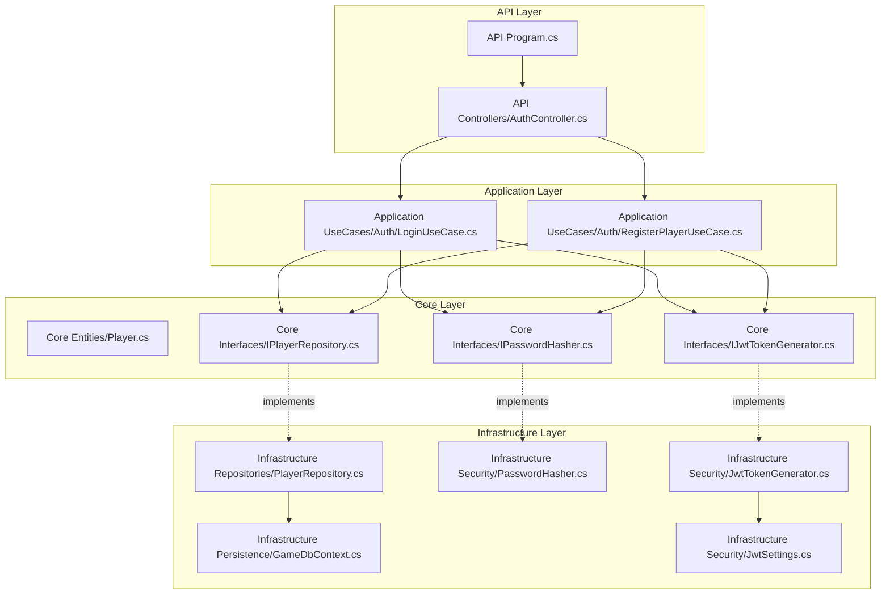
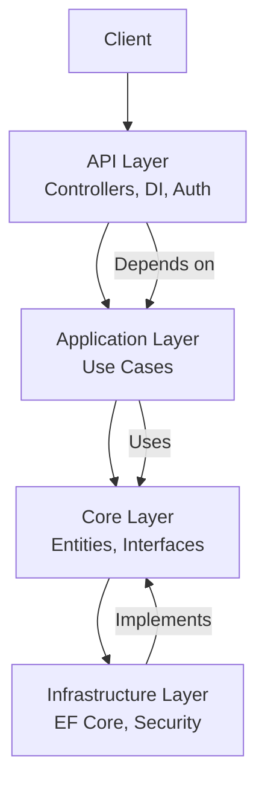
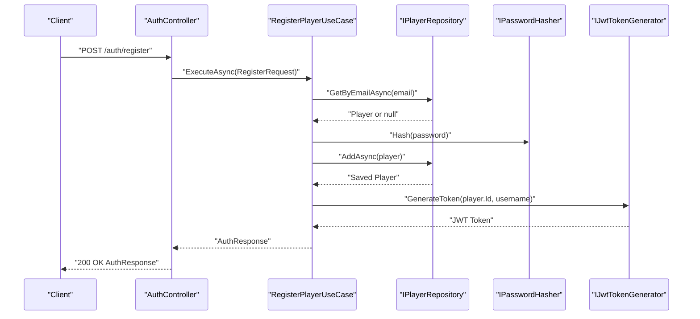
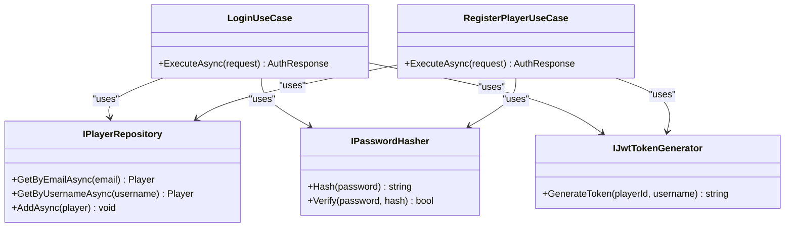
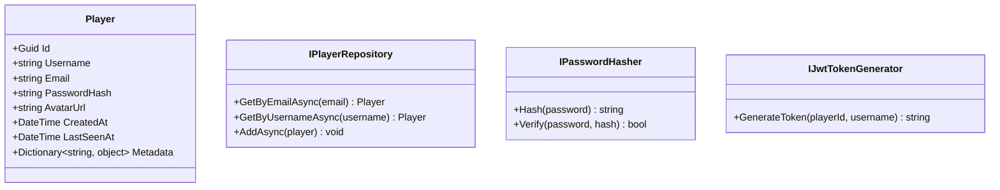
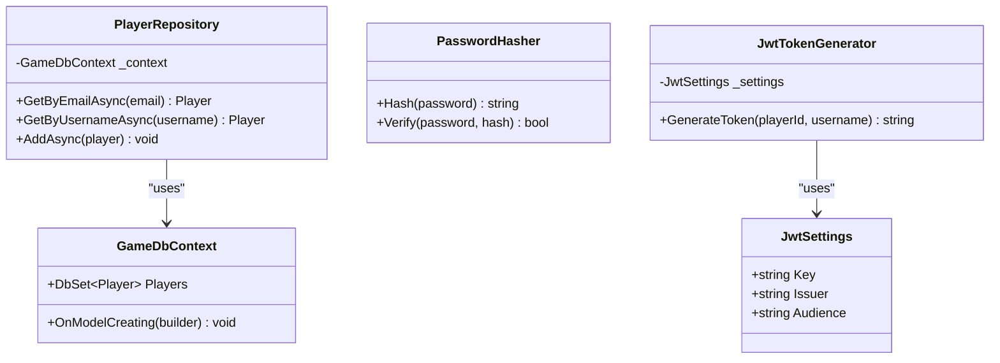
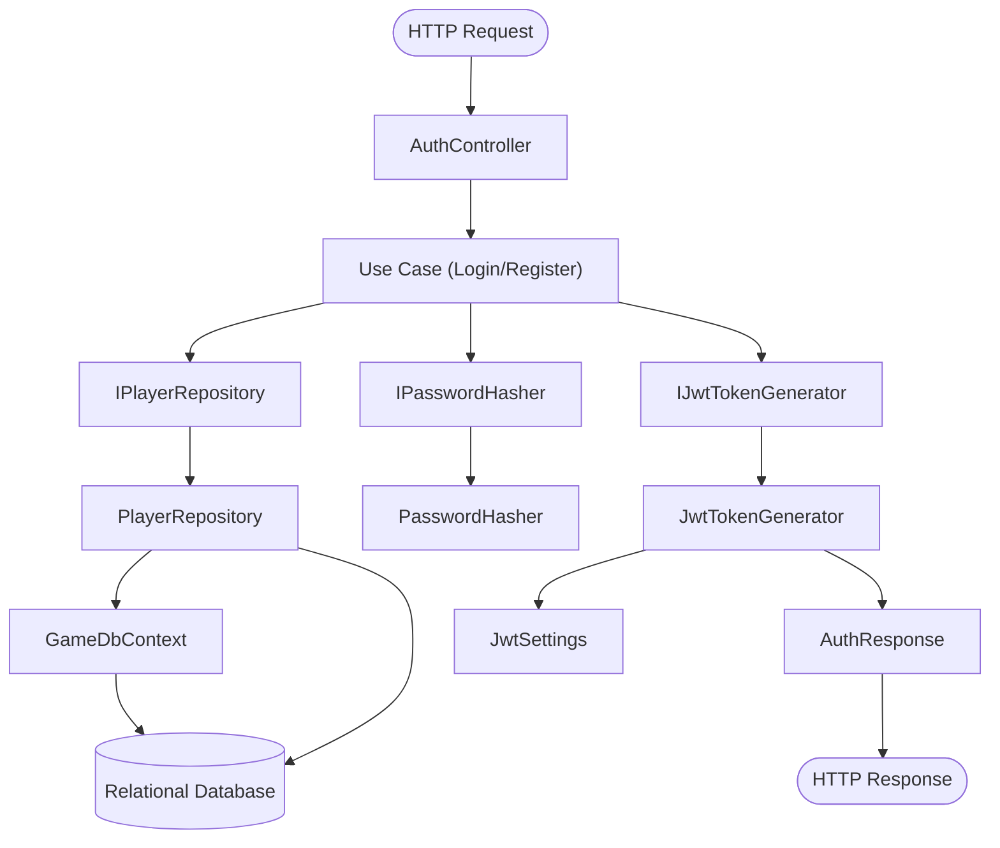
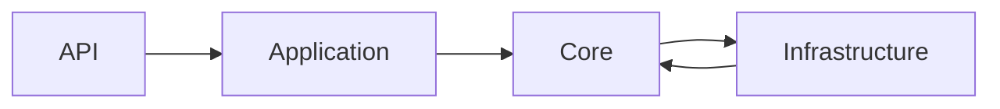

# Architecture & Design

<cite>
**Referenced Files in This Document**
- [Program.cs](file://GameBackend.API/Program.cs)
- [AuthController.cs](file://GameBackend.API/Controllers/AuthController.cs)
- [LoginUseCase.cs](file://GameBackend.Application/Contracts/UseCases/Auth/LoginUseCase.cs)
- [RegisterPlayerUseCase.cs](file://GameBackend.Application/Contracts/UseCases/Auth/RegisterPlayerUseCase.cs)
- [IPlayerRepository.cs](file://GameBackend.Core/Interfaces/IPlayerRepository.cs)
- [IPasswordHasher.cs](file://GameBackend.Core/Interfaces/IPasswordHasher.cs)
- [IJwtTokenGenerator.cs](file://GameBackend.Core/Interfaces/IJwtTokenGenerator.cs)
- [PlayerRepository.cs](file://GameBackend.Infrastructure/Repositories/PlayerRepository.cs)
- [GameDbContext.cs](file://GameBackend.Infrastructure/Persistence/GameDbContext.cs)
- [JwtTokenGenerator.cs](file://GameBackend.Infrastructure/Security/JwtTokenGenerator.cs)
- [PasswordHasher.cs](file://GameBackend.Infrastructure/Security/PasswordHasher.cs)
- [JwtSettings.cs](file://GameBackend.Infrastructure/Security/JwtSettings.cs)
- [Player.cs](file://GameBackend.Core/Entities/Player.cs)
</cite>

## Table of Contents
1. [Introduction](#introduction)
2. [Project Structure](#project-structure)
3. [Core Components](#core-components)
4. [Architecture Overview](#architecture-overview)
5. [Detailed Component Analysis](#detailed-component-analysis)
6. [Dependency Analysis](#dependency-analysis)
7. [Performance Considerations](#performance-considerations)
8. [Troubleshooting Guide](#troubleshooting-guide)
9. [Conclusion](#conclusion)

## Introduction
This document describes the clean architecture implementation of the GameBackend system. The solution is organized into four layers:
- API: HTTP entry points and controller orchestration
- Application: Use cases and application-specific logic
- Core: Domain entities and interfaces defining contracts
- Infrastructure: Persistence, cryptography, and JWT implementations

The architecture enforces unidirectional dependency flow from outer to inner layers, with the Application layer orchestrating business operations while Core defines domain contracts. The system leverages the Repository pattern, Dependency Injection, and Interface Segregation to achieve scalability, testability, and maintainability.

## Project Structure
The repository follows a layered project layout with clear separation of concerns:
- GameBackend.API: ASP.NET Core host for controllers and DI registration
- GameBackend.Application: Application contracts and use cases
- GameBackend.Core: Domain entities and core interfaces
- GameBackend.Infrastructure: EF Core persistence, repositories, and security utilities
- GameBackend.Tests: Test projects for unit and integration tests

**Diagram sources**
- [Program.cs:1-72](file://GameBackend.API/Program.cs#L1-L72)
- [AuthController.cs:1-49](file://GameBackend.API/Controllers/AuthController.cs#L1-L49)
- [LoginUseCase.cs:1-45](file://GameBackend.Application/Contracts/UseCases/Auth/LoginUseCase.cs#L1-L45)
- [RegisterPlayerUseCase.cs:1-58](file://GameBackend.Application/Contracts/UseCases/Auth/RegisterPlayerUseCase.cs#L1-L58)
- [IPlayerRepository.cs:1-10](file://GameBackend.Core/Interfaces/IPlayerRepository.cs#L1-L10)
- [IPasswordHasher.cs:1-7](file://GameBackend.Core/Interfaces/IPasswordHasher.cs#L1-L7)
- [IJwtTokenGenerator.cs:1-6](file://GameBackend.Core/Interfaces/IJwtTokenGenerator.cs#L1-L6)
- [PlayerRepository.cs:1-34](file://GameBackend.Infrastructure/Repositories/PlayerRepository.cs#L1-L34)
- [GameDbContext.cs:1-28](file://GameBackend.Infrastructure/Persistence/GameDbContext.cs#L1-L28)
- [PasswordHasher.cs:1-16](file://GameBackend.Infrastructure/Security/PasswordHasher.cs#L1-L16)
- [JwtTokenGenerator.cs:1-44](file://GameBackend.Infrastructure/Security/JwtTokenGenerator.cs#L1-L44)
- [JwtSettings.cs:1-8](file://GameBackend.Infrastructure/Security/JwtSettings.cs#L1-L8)
- [Player.cs:1-13](file://GameBackend.Core/Entities/Player.cs#L1-L13)

**Section sources**
- [Program.cs:1-72](file://GameBackend.API/Program.cs#L1-L72)
- [AuthController.cs:1-49](file://GameBackend.API/Controllers/AuthController.cs#L1-L49)
- [LoginUseCase.cs:1-45](file://GameBackend.Application/Contracts/UseCases/Auth/LoginUseCase.cs#L1-L45)
- [RegisterPlayerUseCase.cs:1-58](file://GameBackend.Application/Contracts/UseCases/Auth/RegisterPlayerUseCase.cs#L1-L58)
- [IPlayerRepository.cs:1-10](file://GameBackend.Core/Interfaces/IPlayerRepository.cs#L1-L10)
- [IPasswordHasher.cs:1-7](file://GameBackend.Core/Interfaces/IPasswordHasher.cs#L1-L7)
- [IJwtTokenGenerator.cs:1-6](file://GameBackend.Core/Interfaces/IJwtTokenGenerator.cs#L1-L6)
- [PlayerRepository.cs:1-34](file://GameBackend.Infrastructure/Repositories/PlayerRepository.cs#L1-L34)
- [GameDbContext.cs:1-28](file://GameBackend.Infrastructure/Persistence/GameDbContext.cs#L1-L28)
- [PasswordHasher.cs:1-16](file://GameBackend.Infrastructure/Security/PasswordHasher.cs#L1-L16)
- [JwtTokenGenerator.cs:1-44](file://GameBackend.Infrastructure/Security/JwtTokenGenerator.cs#L1-L44)
- [JwtSettings.cs:1-8](file://GameBackend.Infrastructure/Security/JwtSettings.cs#L1-L8)
- [Player.cs:1-13](file://GameBackend.Core/Entities/Player.cs#L1-L13)

## Core Components
- API Layer
  - Hosts the web application and registers services via Dependency Injection.
  - Configures authentication with JWT Bearer tokens and maps controllers.
  - Registers repositories, hashing, token generation, and use cases as scoped services.
- Application Layer
  - Defines use cases for authentication: registration and login.
  - Encapsulates application workflows and depends on Core interfaces.
- Core Layer
  - Contains domain entities (Player) and core interfaces (IPlayerRepository, IPasswordHasher, IJwtTokenGenerator).
  - Establishes contracts that Infrastructure implements.
- Infrastructure Layer
  - Implements persistence using Entity Framework Core and a relational database.
  - Provides cryptographic hashing and JWT token generation with configurable settings.

**Section sources**
- [Program.cs:1-72](file://GameBackend.API/Program.cs#L1-L72)
- [AuthController.cs:1-49](file://GameBackend.API/Controllers/AuthController.cs#L1-L49)
- [LoginUseCase.cs:1-45](file://GameBackend.Application/Contracts/UseCases/Auth/LoginUseCase.cs#L1-L45)
- [RegisterPlayerUseCase.cs:1-58](file://GameBackend.Application/Contracts/UseCases/Auth/RegisterPlayerUseCase.cs#L1-L58)
- [IPlayerRepository.cs:1-10](file://GameBackend.Core/Interfaces/IPlayerRepository.cs#L1-L10)
- [IPasswordHasher.cs:1-7](file://GameBackend.Core/Interfaces/IPasswordHasher.cs#L1-L7)
- [IJwtTokenGenerator.cs:1-6](file://GameBackend.Core/Interfaces/IJwtTokenGenerator.cs#L1-L6)
- [PlayerRepository.cs:1-34](file://GameBackend.Infrastructure/Repositories/PlayerRepository.cs#L1-L34)
- [GameDbContext.cs:1-28](file://GameBackend.Infrastructure/Persistence/GameDbContext.cs#L1-L28)
- [PasswordHasher.cs:1-16](file://GameBackend.Infrastructure/Security/PasswordHasher.cs#L1-L16)
- [JwtTokenGenerator.cs:1-44](file://GameBackend.Infrastructure/Security/JwtTokenGenerator.cs#L1-L44)
- [JwtSettings.cs:1-8](file://GameBackend.Infrastructure/Security/JwtSettings.cs#L1-L8)
- [Player.cs:1-13](file://GameBackend.Core/Entities/Player.cs#L1-L13)

## Architecture Overview
Clean architecture with four layers and unidirectional dependency flow:
- Outer layers depend on inner layers (API -> Application -> Core -> Infrastructure).
- Core encapsulates domain logic and contracts; Infrastructure implements them.
- Application orchestrates workflows using Core interfaces, enabling testability and isolation.

[No sources needed since this diagram shows conceptual workflow, not actual code structure]

## Detailed Component Analysis

### API Layer: Authentication Orchestration
- Responsibilities
  - Configure authentication and authorization middleware.
  - Expose HTTP endpoints for authentication operations.
  - Inject and wire use cases and infrastructure services via DI.
- Key interactions
  - AuthController receives RegisterPlayerUseCase and LoginUseCase via constructor injection.
  - Endpoints delegate to use cases and return standardized responses.

**Diagram sources**
- [AuthController.cs:1-49](file://GameBackend.API/Controllers/AuthController.cs#L1-L49)
- [RegisterPlayerUseCase.cs:1-58](file://GameBackend.Application/Contracts/UseCases/Auth/RegisterPlayerUseCase.cs#L1-L58)
- [IPlayerRepository.cs:1-10](file://GameBackend.Core/Interfaces/IPlayerRepository.cs#L1-L10)
- [IPasswordHasher.cs:1-7](file://GameBackend.Core/Interfaces/IPasswordHasher.cs#L1-L7)
- [IJwtTokenGenerator.cs:1-6](file://GameBackend.Core/Interfaces/IJwtTokenGenerator.cs#L1-L6)

**Section sources**
- [Program.cs:1-72](file://GameBackend.API/Program.cs#L1-L72)
- [AuthController.cs:1-49](file://GameBackend.API/Controllers/AuthController.cs#L1-L49)

### Application Layer: Use Cases
- Responsibilities
  - Encapsulate application workflows for authentication.
  - Coordinate between repositories, hashing, and token generation.
- Patterns
  - Use Case pattern: each operation is modeled as a cohesive class with ExecuteAsync method.
  - Dependency inversion: use cases depend on abstractions (Core interfaces).

**Diagram sources**
- [LoginUseCase.cs:1-45](file://GameBackend.Application/Contracts/UseCases/Auth/LoginUseCase.cs#L1-L45)
- [RegisterPlayerUseCase.cs:1-58](file://GameBackend.Application/Contracts/UseCases/Auth/RegisterPlayerUseCase.cs#L1-L58)
- [IPlayerRepository.cs:1-10](file://GameBackend.Core/Interfaces/IPlayerRepository.cs#L1-L10)
- [IPasswordHasher.cs:1-7](file://GameBackend.Core/Interfaces/IPasswordHasher.cs#L1-L7)
- [IJwtTokenGenerator.cs:1-6](file://GameBackend.Core/Interfaces/IJwtTokenGenerator.cs#L1-L6)

**Section sources**
- [LoginUseCase.cs:1-45](file://GameBackend.Application/Contracts/UseCases/Auth/LoginUseCase.cs#L1-L45)
- [RegisterPlayerUseCase.cs:1-58](file://GameBackend.Application/Contracts/UseCases/Auth/RegisterPlayerUseCase.cs#L1-L58)

### Core Layer: Contracts and Entities
- Responsibilities
  - Define domain entities and core interfaces.
  - Establish contracts for infrastructure implementations.
- Entities
  - Player: identity, credentials, metadata, timestamps.

**Diagram sources**
- [Player.cs:1-13](file://GameBackend.Core/Entities/Player.cs#L1-L13)
- [IPlayerRepository.cs:1-10](file://GameBackend.Core/Interfaces/IPlayerRepository.cs#L1-L10)
- [IPasswordHasher.cs:1-7](file://GameBackend.Core/Interfaces/IPasswordHasher.cs#L1-L7)
- [IJwtTokenGenerator.cs:1-6](file://GameBackend.Core/Interfaces/IJwtTokenGenerator.cs#L1-L6)

**Section sources**
- [Player.cs:1-13](file://GameBackend.Core/Entities/Player.cs#L1-L13)
- [IPlayerRepository.cs:1-10](file://GameBackend.Core/Interfaces/IPlayerRepository.cs#L1-L10)
- [IPasswordHasher.cs:1-7](file://GameBackend.Core/Interfaces/IPasswordHasher.cs#L1-L7)
- [IJwtTokenGenerator.cs:1-6](file://GameBackend.Core/Interfaces/IJwtTokenGenerator.cs#L1-L6)

### Infrastructure Layer: Persistence and Security
- Responsibilities
  - Implement Core interfaces with concrete technologies.
  - Provide persistence and security utilities.
- Implementation details
  - PlayerRepository uses Entity Framework Core to query and persist Player entities.
  - GameDbContext configures entity keys, unique indexes, and ignores non-mapped properties.
  - PasswordHasher uses bcrypt for secure hashing and verification.
  - JwtTokenGenerator creates signed JWT tokens using symmetric keys and configured issuer/audience.

**Diagram sources**
- [PlayerRepository.cs:1-34](file://GameBackend.Infrastructure/Repositories/PlayerRepository.cs#L1-L34)
- [GameDbContext.cs:1-28](file://GameBackend.Infrastructure/Persistence/GameDbContext.cs#L1-L28)
- [PasswordHasher.cs:1-16](file://GameBackend.Infrastructure/Security/PasswordHasher.cs#L1-L16)
- [JwtTokenGenerator.cs:1-44](file://GameBackend.Infrastructure/Security/JwtTokenGenerator.cs#L1-L44)
- [JwtSettings.cs:1-8](file://GameBackend.Infrastructure/Security/JwtSettings.cs#L1-L8)

**Section sources**
- [PlayerRepository.cs:1-34](file://GameBackend.Infrastructure/Repositories/PlayerRepository.cs#L1-L34)
- [GameDbContext.cs:1-28](file://GameBackend.Infrastructure/Persistence/GameDbContext.cs#L1-L28)
- [PasswordHasher.cs:1-16](file://GameBackend.Infrastructure/Security/PasswordHasher.cs#L1-L16)
- [JwtTokenGenerator.cs:1-44](file://GameBackend.Infrastructure/Security/JwtTokenGenerator.cs#L1-L44)
- [JwtSettings.cs:1-8](file://GameBackend.Infrastructure/Security/JwtSettings.cs#L1-L8)

### Data Flow Patterns and System Boundaries
- Request flow
  - HTTP request enters API layer via AuthController.
  - Controller delegates to Application use cases.
  - Use cases call Core interfaces to access data and services.
  - Infrastructure implements Core interfaces to fulfill requests.
- Boundaries
  - API boundary: HTTP endpoints and middleware.
  - Application boundary: use case orchestration.
  - Core boundary: domain contracts and entities.
  - Infrastructure boundary: persistence and cross-cutting concerns.

**Diagram sources**
- [AuthController.cs:1-49](file://GameBackend.API/Controllers/AuthController.cs#L1-L49)
- [LoginUseCase.cs:1-45](file://GameBackend.Application/Contracts/UseCases/Auth/LoginUseCase.cs#L1-L45)
- [RegisterPlayerUseCase.cs:1-58](file://GameBackend.Application/Contracts/UseCases/Auth/RegisterPlayerUseCase.cs#L1-L58)
- [IPlayerRepository.cs:1-10](file://GameBackend.Core/Interfaces/IPlayerRepository.cs#L1-L10)
- [IPasswordHasher.cs:1-7](file://GameBackend.Core/Interfaces/IPasswordHasher.cs#L1-L7)
- [IJwtTokenGenerator.cs:1-6](file://GameBackend.Core/Interfaces/IJwtTokenGenerator.cs#L1-L6)
- [PlayerRepository.cs:1-34](file://GameBackend.Infrastructure/Repositories/PlayerRepository.cs#L1-L34)
- [GameDbContext.cs:1-28](file://GameBackend.Infrastructure/Persistence/GameDbContext.cs#L1-L28)
- [PasswordHasher.cs:1-16](file://GameBackend.Infrastructure/Security/PasswordHasher.cs#L1-L16)
- [JwtTokenGenerator.cs:1-44](file://GameBackend.Infrastructure/Security/JwtTokenGenerator.cs#L1-L44)
- [JwtSettings.cs:1-8](file://GameBackend.Infrastructure/Security/JwtSettings.cs#L1-L8)

## Dependency Analysis
- Unidirectional dependencies
  - API depends on Application.
  - Application depends on Core.
  - Infrastructure implements Core interfaces.
- Dependency Injection
  - Scoped registrations bind abstractions to implementations.
  - Controllers receive use cases; use cases receive Core interfaces.
- Cohesion and coupling
  - High cohesion within each layer.
  - Low coupling between layers via interfaces.

**Diagram sources**
- [Program.cs:1-72](file://GameBackend.API/Program.cs#L1-L72)
- [LoginUseCase.cs:1-45](file://GameBackend.Application/Contracts/UseCases/Auth/LoginUseCase.cs#L1-L45)
- [RegisterPlayerUseCase.cs:1-58](file://GameBackend.Application/Contracts/UseCases/Auth/RegisterPlayerUseCase.cs#L1-L58)
- [IPlayerRepository.cs:1-10](file://GameBackend.Core/Interfaces/IPlayerRepository.cs#L1-L10)
- [IPasswordHasher.cs:1-7](file://GameBackend.Core/Interfaces/IPasswordHasher.cs#L1-L7)
- [IJwtTokenGenerator.cs:1-6](file://GameBackend.Core/Interfaces/IJwtTokenGenerator.cs#L1-L6)
- [PlayerRepository.cs:1-34](file://GameBackend.Infrastructure/Repositories/PlayerRepository.cs#L1-L34)
- [PasswordHasher.cs:1-16](file://GameBackend.Infrastructure/Security/PasswordHasher.cs#L1-L16)
- [JwtTokenGenerator.cs:1-44](file://GameBackend.Infrastructure/Security/JwtTokenGenerator.cs#L1-L44)

**Section sources**
- [Program.cs:1-72](file://GameBackend.API/Program.cs#L1-L72)
- [LoginUseCase.cs:1-45](file://GameBackend.Application/Contracts/UseCases/Auth/LoginUseCase.cs#L1-L45)
- [RegisterPlayerUseCase.cs:1-58](file://GameBackend.Application/Contracts/UseCases/Auth/RegisterPlayerUseCase.cs#L1-L58)
- [IPlayerRepository.cs:1-10](file://GameBackend.Core/Interfaces/IPlayerRepository.cs#L1-L10)
- [IPasswordHasher.cs:1-7](file://GameBackend.Core/Interfaces/IPasswordHasher.cs#L1-L7)
- [IJwtTokenGenerator.cs:1-6](file://GameBackend.Core/Interfaces/IJwtTokenGenerator.cs#L1-L6)
- [PlayerRepository.cs:1-34](file://GameBackend.Infrastructure/Repositories/PlayerRepository.cs#L1-L34)
- [PasswordHasher.cs:1-16](file://GameBackend.Infrastructure/Security/PasswordHasher.cs#L1-L16)
- [JwtTokenGenerator.cs:1-44](file://GameBackend.Infrastructure/Security/JwtTokenGenerator.cs#L1-L44)

## Performance Considerations
- Asynchronous operations
  - Use cases and repositories employ async/await to prevent blocking I/O.
- Database efficiency
  - Unique indexes on email and username reduce lookup costs.
  - Minimal projections and single round-trips per operation.
- Token generation
  - Lightweight HMAC signing with minimal overhead.
- Scalability
  - Scoped services and stateless use cases support horizontal scaling.
  - Clear separation enables caching and externalization of storage/security.

[No sources needed since this section provides general guidance]

## Troubleshooting Guide
- Authentication failures
  - Invalid credentials result in client errors surfaced from use cases.
  - Verify JWT issuer/audience configuration and signing key.
- Registration conflicts
  - Duplicate email triggers user-friendly exceptions from use cases.
- Persistence issues
  - Ensure connection string is configured and migrations applied.
  - Confirm unique constraints for email and username are enforced.

**Section sources**
- [AuthController.cs:1-49](file://GameBackend.API/Controllers/AuthController.cs#L1-L49)
- [LoginUseCase.cs:1-45](file://GameBackend.Application/Contracts/UseCases/Auth/LoginUseCase.cs#L1-L45)
- [RegisterPlayerUseCase.cs:1-58](file://GameBackend.Application/Contracts/UseCases/Auth/RegisterPlayerUseCase.cs#L1-L58)
- [GameDbContext.cs:1-28](file://GameBackend.Infrastructure/Persistence/GameDbContext.cs#L1-L28)
- [JwtTokenGenerator.cs:1-44](file://GameBackend.Infrastructure/Security/JwtTokenGenerator.cs#L1-L44)

## Conclusion
The GameBackend system demonstrates clean architecture with clear layering, unidirectional dependencies, and strong separation of concerns. The Repository pattern, Dependency Injection, and Interface Segregation enable scalable, testable, and maintainable development. The defined contracts in Core allow interchangeable infrastructure implementations, while the Application layer ensures business logic remains portable and robust.