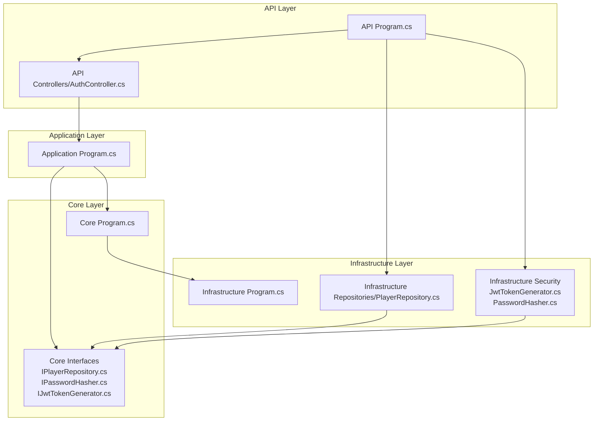
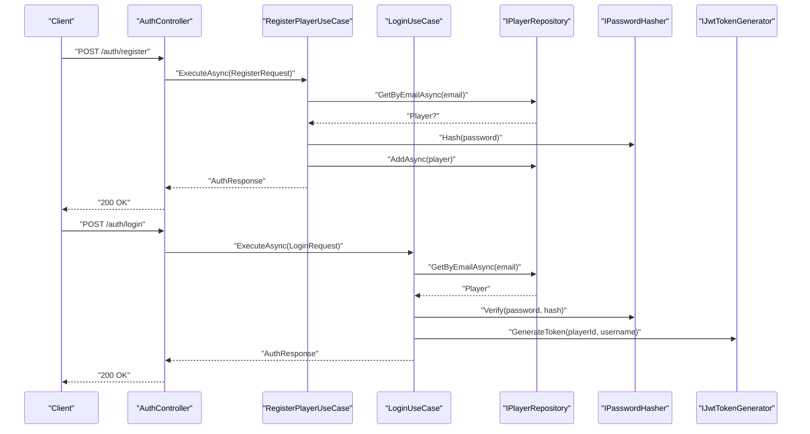
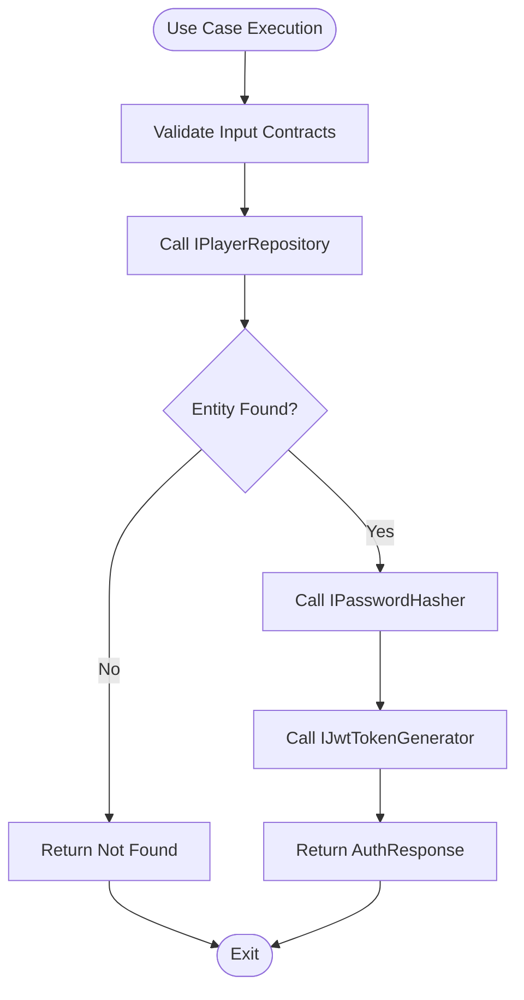
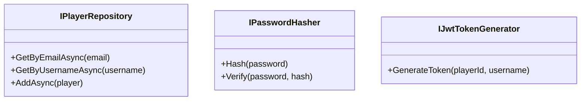
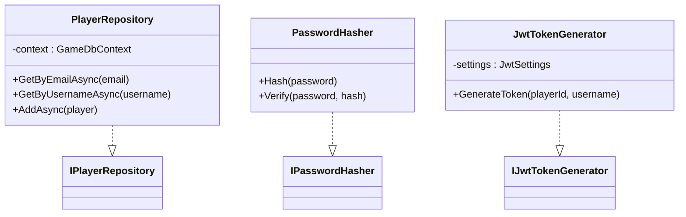
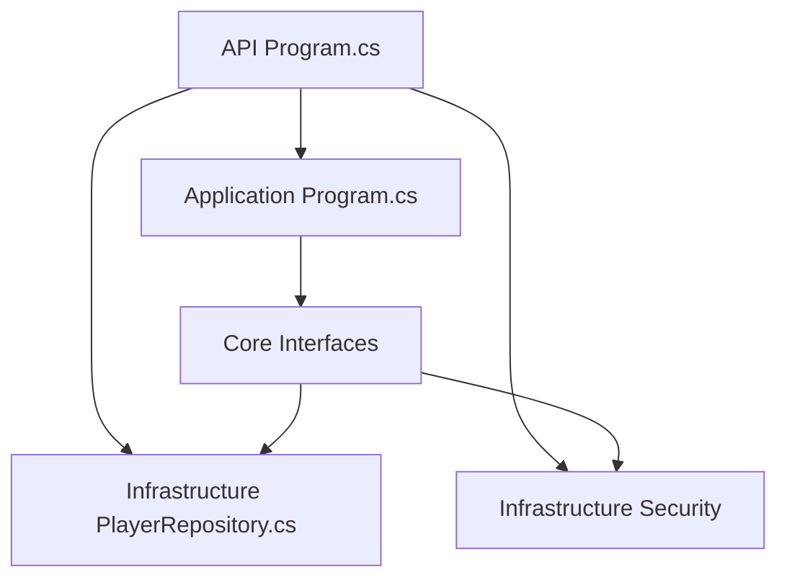

# Clean Architecture Principles

<cite>
**Referenced Files in This Document**
- [Program.cs](file://GameBackend.API/Program.cs)
- [AuthController.cs](file://GameBackend.API/Controllers/AuthController.cs)
- [Program.cs](file://GameBackend.Application/Program.cs)
- [Program.cs](file://GameBackend.Core/Program.cs)
- [Program.cs](file://GameBackend.Infrastructure/Program.cs)
- [IPlayerRepository.cs](file://GameBackend.Core/Interfaces/IPlayerRepository.cs)
- [IPasswordHasher.cs](file://GameBackend.Core/Interfaces/IPasswordHasher.cs)
- [IJwtTokenGenerator.cs](file://GameBackend.Core/Interfaces/IJwtTokenGenerator.cs)
- [RegisterRequest.cs](file://GameBackend.Application/Contracts/Auth/RegisterRequest.cs)
- [LoginRequest.cs](file://GameBackend.Application/Contracts/Auth/LoginRequest.cs)
- [PlayerRepository.cs](file://GameBackend.Infrastructure/Repositories/PlayerRepository.cs)
- [JwtTokenGenerator.cs](file://GameBackend.Infrastructure/Security/JwtTokenGenerator.cs)
- [PasswordHasher.cs](file://GameBackend.Infrastructure/Security/PasswordHasher.cs)
</cite>

## Table of Contents
1. [Introduction](#introduction)
2. [Project Structure](#project-structure)
3. [Core Components](#core-components)
4. [Architecture Overview](#architecture-overview)
5. [Detailed Component Analysis](#detailed-component-analysis)
6. [Dependency Analysis](#dependency-analysis)
7. [Performance Considerations](#performance-considerations)
8. [Troubleshooting Guide](#troubleshooting-guide)
9. [Conclusion](#conclusion)

## Introduction
This document explains how the GameBackend system implements clean architecture principles with a strict four-layer separation:
- API (Presentation): HTTP entry points and controllers
- Application (Business Logic): Use cases and application contracts
- Core (Domain): Domain entities and core interfaces
- Infrastructure (Data Access): Implementations of domain interfaces

It demonstrates dependency inversion: inner layers define abstractions (interfaces), while outer layers implement them. This design improves testability, maintainability, and separation of concerns.

## Project Structure
The solution is organized into four projects, each representing a layer:
- GameBackend.API: Presentation layer exposing HTTP endpoints
- GameBackend.Application: Business logic and application contracts
- GameBackend.Core: Domain model and core abstractions
- GameBackend.Infrastructure: Infrastructure implementations



**Diagram sources**
- [Program.cs:1-72](file://GameBackend.API/Program.cs#L1-L72)
- [AuthController.cs:1-49](file://GameBackend.API/Controllers/AuthController.cs#L1-L49)
- [Program.cs:1-44](file://GameBackend.Application/Program.cs#L1-L44)
- [Program.cs:1-44](file://GameBackend.Core/Program.cs#L1-L44)
- [Program.cs:1-44](file://GameBackend.Infrastructure/Program.cs#L1-L44)
- [IPlayerRepository.cs:1-10](file://GameBackend.Core/Interfaces/IPlayerRepository.cs#L1-L10)
- [IPasswordHasher.cs:1-7](file://GameBackend.Core/Interfaces/IPasswordHasher.cs#L1-L7)
- [IJwtTokenGenerator.cs:1-6](file://GameBackend.Core/Interfaces/IJwtTokenGenerator.cs#L1-L6)
- [PlayerRepository.cs:1-34](file://GameBackend.Infrastructure/Repositories/PlayerRepository.cs#L1-L34)
- [JwtTokenGenerator.cs:1-44](file://GameBackend.Infrastructure/Security/JwtTokenGenerator.cs#L1-L44)
- [PasswordHasher.cs:1-16](file://GameBackend.Infrastructure/Security/PasswordHasher.cs#L1-L16)

**Section sources**
- [Program.cs:1-72](file://GameBackend.API/Program.cs#L1-L72)
- [Program.cs:1-44](file://GameBackend.Application/Program.cs#L1-L44)
- [Program.cs:1-44](file://GameBackend.Core/Program.cs#L1-L44)
- [Program.cs:1-44](file://GameBackend.Infrastructure/Program.cs#L1-L44)

## Core Components
This section describes each layer and its responsibilities, focusing on how clean architecture separates concerns and enforces dependency inversion.

- API Layer
  - Purpose: Expose HTTP endpoints and handle transport concerns
  - Key elements: Program.cs configures services and middleware; AuthController.cs orchestrates requests and delegates to application use cases
  - Responsibilities: Request/response mapping, authentication middleware, routing

- Application Layer
  - Purpose: Encapsulate business use cases and application contracts
  - Key elements: Use cases for registration and login; application contracts (requests) define input structures
  - Responsibilities: Orchestration of domain logic via core interfaces; transactional boundaries; application-specific DTOs

- Core Layer
  - Purpose: Define domain entities and abstractions
  - Key elements: Player entity; core interfaces for repositories and cross-cutting services (password hashing, JWT generation)
  - Responsibilities: Pure domain logic; decoupled from frameworks and external systems

- Infrastructure Layer
  - Purpose: Implement core abstractions and integrate with external systems
  - Key elements: Entity Framework repository implementation; security implementations for hashing and JWT
  - Responsibilities: Data persistence; cryptography and token generation

**Section sources**
- [Program.cs:1-72](file://GameBackend.API/Program.cs#L1-L72)
- [AuthController.cs:1-49](file://GameBackend.API/Controllers/AuthController.cs#L1-L49)
- [Program.cs:1-44](file://GameBackend.Application/Program.cs#L1-L44)
- [Program.cs:1-44](file://GameBackend.Core/Program.cs#L1-L44)
- [Program.cs:1-44](file://GameBackend.Infrastructure/Program.cs#L1-L44)
- [IPlayerRepository.cs:1-10](file://GameBackend.Core/Interfaces/IPlayerRepository.cs#L1-L10)
- [IPasswordHasher.cs:1-7](file://GameBackend.Core/Interfaces/IPasswordHasher.cs#L1-L7)
- [IJwtTokenGenerator.cs:1-6](file://GameBackend.Core/Interfaces/IJwtTokenGenerator.cs#L1-L6)
- [PlayerRepository.cs:1-34](file://GameBackend.Infrastructure/Repositories/PlayerRepository.cs#L1-L34)
- [JwtTokenGenerator.cs:1-44](file://GameBackend.Infrastructure/Security/JwtTokenGenerator.cs#L1-L44)
- [PasswordHasher.cs:1-16](file://GameBackend.Infrastructure/Security/PasswordHasher.cs#L1-L16)

## Architecture Overview
Clean architecture enforces a unidirectional dependency flow from outer layers to inner layers. The API depends on Application, which depends on Core, which is implemented by Infrastructure. This ensures that business rules live in the innermost layers and are not affected by frameworks or transport mechanisms.

```mermaid
graph LR
API["API Layer<br/>Program.cs<br/>AuthController.cs"] --> APP["Application Layer<br/>Use Cases<br/>Contracts"]
APP --> CORE["Core Layer<br/>Entities<br/>Interfaces"]
CORE <-- INFRA_IMPL["Infrastructure Implementations"] --> INFRA["Infrastructure Layer<br/>EF Repository<br/>Security"]
```

**Diagram sources**
- [Program.cs:1-72](file://GameBackend.API/Program.cs#L1-L72)
- [AuthController.cs:1-49](file://GameBackend.API/Controllers/AuthController.cs#L1-L49)
- [Program.cs:1-44](file://GameBackend.Application/Program.cs#L1-L44)
- [Program.cs:1-44](file://GameBackend.Core/Program.cs#L1-L44)
- [Program.cs:1-44](file://GameBackend.Infrastructure/Program.cs#L1-L44)
- [IPlayerRepository.cs:1-10](file://GameBackend.Core/Interfaces/IPlayerRepository.cs#L1-L10)
- [IPasswordHasher.cs:1-7](file://GameBackend.Core/Interfaces/IPasswordHasher.cs#L1-L7)
- [IJwtTokenGenerator.cs:1-6](file://GameBackend.Core/Interfaces/IJwtTokenGenerator.cs#L1-L6)
- [PlayerRepository.cs:1-34](file://GameBackend.Infrastructure/Repositories/PlayerRepository.cs#L1-L34)
- [JwtTokenGenerator.cs:1-44](file://GameBackend.Infrastructure/Security/JwtTokenGenerator.cs#L1-L44)
- [PasswordHasher.cs:1-16](file://GameBackend.Infrastructure/Security/PasswordHasher.cs#L1-L16)

## Detailed Component Analysis

### API Layer: Authentication Flow
The API layer handles HTTP requests and delegates to application use cases. It registers infrastructure implementations and configures authentication middleware.



**Diagram sources**
- [AuthController.cs:1-49](file://GameBackend.API/Controllers/AuthController.cs#L1-L49)
- [Program.cs:1-72](file://GameBackend.API/Program.cs#L1-L72)
- [RegisterRequest.cs:1-8](file://GameBackend.Application/Contracts/Auth/RegisterRequest.cs#L1-L8)
- [LoginRequest.cs:1-7](file://GameBackend.Application/Contracts/Auth/LoginRequest.cs#L1-L7)
- [IPlayerRepository.cs:1-10](file://GameBackend.Core/Interfaces/IPlayerRepository.cs#L1-L10)
- [IPasswordHasher.cs:1-7](file://GameBackend.Core/Interfaces/IPasswordHasher.cs#L1-L7)
- [IJwtTokenGenerator.cs:1-6](file://GameBackend.Core/Interfaces/IJwtTokenGenerator.cs#L1-L6)
- [PlayerRepository.cs:1-34](file://GameBackend.Infrastructure/Repositories/PlayerRepository.cs#L1-L34)
- [PasswordHasher.cs:1-16](file://GameBackend.Infrastructure/Security/PasswordHasher.cs#L1-L16)
- [JwtTokenGenerator.cs:1-44](file://GameBackend.Infrastructure/Security/JwtTokenGenerator.cs#L1-L44)

**Section sources**
- [AuthController.cs:1-49](file://GameBackend.API/Controllers/AuthController.cs#L1-L49)
- [Program.cs:1-72](file://GameBackend.API/Program.cs#L1-L72)

### Application Layer: Use Cases and Contracts
The application layer defines contracts for input and orchestrates domain interactions via core interfaces. Use cases encapsulate business logic and coordinate with infrastructure implementations registered in the API layer.



**Diagram sources**
- [RegisterRequest.cs:1-8](file://GameBackend.Application/Contracts/Auth/RegisterRequest.cs#L1-L8)
- [LoginRequest.cs:1-7](file://GameBackend.Application/Contracts/Auth/LoginRequest.cs#L1-L7)
- [IPlayerRepository.cs:1-10](file://GameBackend.Core/Interfaces/IPlayerRepository.cs#L1-L10)
- [IPasswordHasher.cs:1-7](file://GameBackend.Core/Interfaces/IPasswordHasher.cs#L1-L7)
- [IJwtTokenGenerator.cs:1-6](file://GameBackend.Core/Interfaces/IJwtTokenGenerator.cs#L1-L6)

**Section sources**
- [RegisterRequest.cs:1-8](file://GameBackend.Application/Contracts/Auth/RegisterRequest.cs#L1-L8)
- [LoginRequest.cs:1-7](file://GameBackend.Application/Contracts/Auth/LoginRequest.cs#L1-L7)

### Core Layer: Domain Abstractions
The Core layer defines domain interfaces that represent capabilities required by the application. These abstractions are framework-agnostic and define contracts for persistence and cross-cutting services.



**Diagram sources**
- [IPlayerRepository.cs:1-10](file://GameBackend.Core/Interfaces/IPlayerRepository.cs#L1-L10)
- [IPasswordHasher.cs:1-7](file://GameBackend.Core/Interfaces/IPasswordHasher.cs#L1-L7)
- [IJwtTokenGenerator.cs:1-6](file://GameBackend.Core/Interfaces/IJwtTokenGenerator.cs#L1-L6)

**Section sources**
- [IPlayerRepository.cs:1-10](file://GameBackend.Core/Interfaces/IPlayerRepository.cs#L1-L10)
- [IPasswordHasher.cs:1-7](file://GameBackend.Core/Interfaces/IPasswordHasher.cs#L1-L7)
- [IJwtTokenGenerator.cs:1-6](file://GameBackend.Core/Interfaces/IJwtTokenGenerator.cs#L1-L6)

### Infrastructure Layer: Implementations
Infrastructure implements the core abstractions using external libraries and frameworks. This keeps framework details out of the Core and Application layers.



**Diagram sources**
- [PlayerRepository.cs:1-34](file://GameBackend.Infrastructure/Repositories/PlayerRepository.cs#L1-L34)
- [PasswordHasher.cs:1-16](file://GameBackend.Infrastructure/Security/PasswordHasher.cs#L1-L16)
- [JwtTokenGenerator.cs:1-44](file://GameBackend.Infrastructure/Security/JwtTokenGenerator.cs#L1-L44)
- [IPlayerRepository.cs:1-10](file://GameBackend.Core/Interfaces/IPlayerRepository.cs#L1-L10)
- [IPasswordHasher.cs:1-7](file://GameBackend.Core/Interfaces/IPasswordHasher.cs#L1-L7)
- [IJwtTokenGenerator.cs:1-6](file://GameBackend.Core/Interfaces/IJwtTokenGenerator.cs#L1-L6)

**Section sources**
- [PlayerRepository.cs:1-34](file://GameBackend.Infrastructure/Repositories/PlayerRepository.cs#L1-L34)
- [PasswordHasher.cs:1-16](file://GameBackend.Infrastructure/Security/PasswordHasher.cs#L1-L16)
- [JwtTokenGenerator.cs:1-44](file://GameBackend.Infrastructure/Security/JwtTokenGenerator.cs#L1-L44)

## Dependency Analysis
Clean architecture enforces dependency inversion: inner layers define interfaces; outer layers depend on and implement them. The following diagram shows the dependency flow from API to Infrastructure.



**Diagram sources**
- [Program.cs:1-72](file://GameBackend.API/Program.cs#L1-L72)
- [Program.cs:1-44](file://GameBackend.Application/Program.cs#L1-L44)
- [Program.cs:1-44](file://GameBackend.Core/Program.cs#L1-L44)
- [Program.cs:1-44](file://GameBackend.Infrastructure/Program.cs#L1-L44)
- [IPlayerRepository.cs:1-10](file://GameBackend.Core/Interfaces/IPlayerRepository.cs#L1-L10)
- [PlayerRepository.cs:1-34](file://GameBackend.Infrastructure/Repositories/PlayerRepository.cs#L1-L34)
- [JwtTokenGenerator.cs:1-44](file://GameBackend.Infrastructure/Security/JwtTokenGenerator.cs#L1-L44)
- [PasswordHasher.cs:1-16](file://GameBackend.Infrastructure/Security/PasswordHasher.cs#L1-L16)

**Section sources**
- [Program.cs:1-72](file://GameBackend.API/Program.cs#L1-L72)
- [Program.cs:1-44](file://GameBackend.Application/Program.cs#L1-L44)
- [Program.cs:1-44](file://GameBackend.Core/Program.cs#L1-L44)
- [Program.cs:1-44](file://GameBackend.Infrastructure/Program.cs#L1-L44)

## Performance Considerations
- Keep use cases focused: Each use case should encapsulate a single business transaction to minimize overhead and improve clarity.
- Minimize round-trips: Batch related operations where possible to reduce database calls.
- Optimize hashing and token generation: Use efficient algorithms and cache settings where appropriate.
- Avoid heavy logic in controllers: Delegate to use cases to keep presentation logic thin and testable.

## Troubleshooting Guide
Common issues and resolutions:
- Dependency resolution failures: Ensure the API layer registers implementations for all core interfaces used by application use cases.
- Authentication errors: Verify JWT settings and token validation parameters configured in the API Program.cs.
- Repository access errors: Confirm Entity Framework connection string and DbContext registration in the API Program.cs.
- Use case exceptions: Wrap use case calls in controllers to return appropriate HTTP status codes and error payloads.

**Section sources**
- [Program.cs:1-72](file://GameBackend.API/Program.cs#L1-L72)
- [AuthController.cs:1-49](file://GameBackend.API/Controllers/AuthController.cs#L1-L49)

## Conclusion
The GameBackend system demonstrates clean architecture by enforcing dependency inversion and strict layer separation. The API layer remains agnostic of infrastructure concerns, the Application layer orchestrates business logic via core interfaces, the Core layer defines pure domain abstractions, and the Infrastructure layer implements those abstractions. This design yields improved testability, maintainability, and separation of concerns.