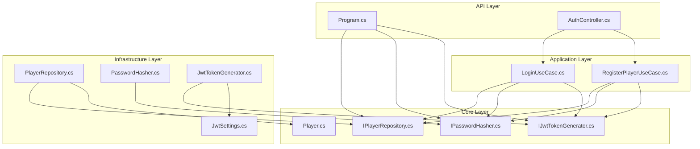
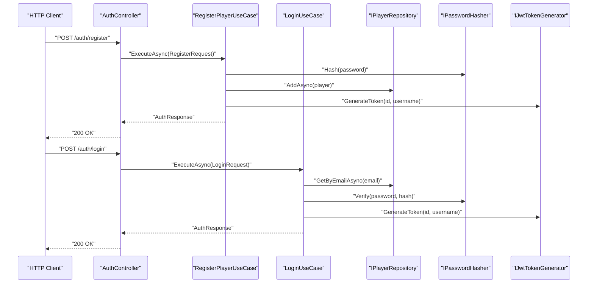
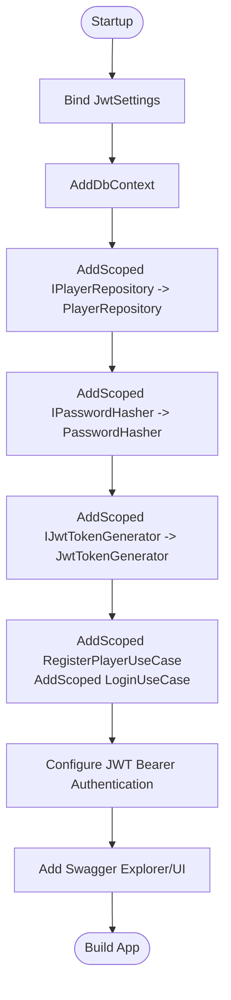
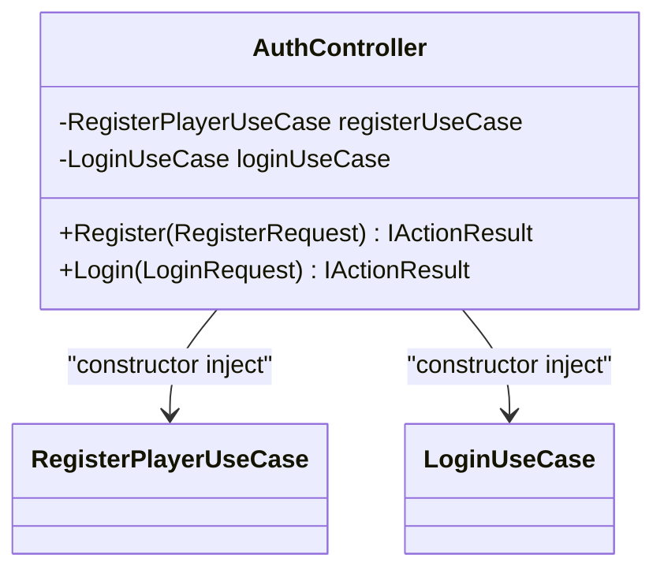
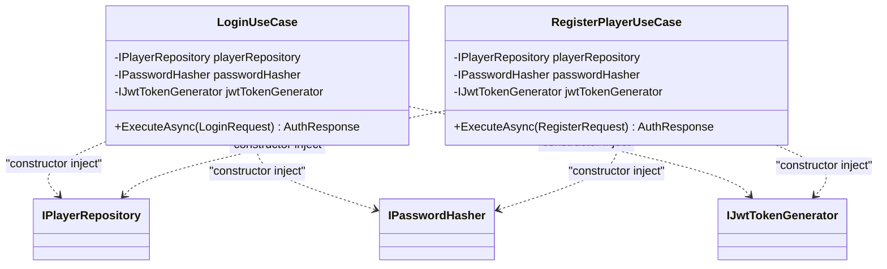
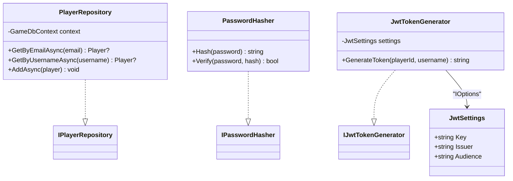
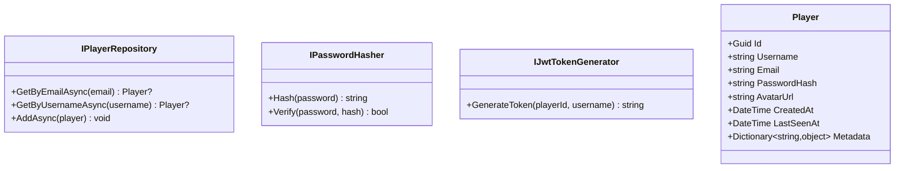
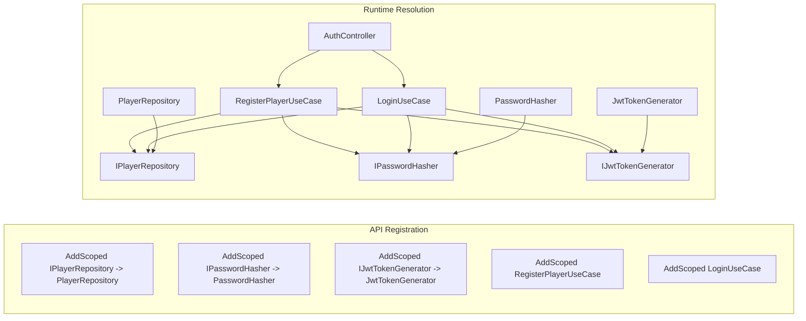

# Dependency Injection & Service Registration

<cite>
**Referenced Files in This Document**
- [Program.cs](file://GameBackend.API/Program.cs)
- [AuthController.cs](file://GameBackend.API/Controllers/AuthController.cs)
- [LoginUseCase.cs](file://GameBackend.Application/Contracts/UseCases/Auth/LoginUseCase.cs)
- [RegisterPlayerUseCase.cs](file://GameBackend.Application/Contracts/UseCases/Auth/RegisterPlayerUseCase.cs)
- [PlayerRepository.cs](file://GameBackend.Infrastructure/Repositories/PlayerRepository.cs)
- [IPlayerRepository.cs](file://GameBackend.Core/Interfaces/IPlayerRepository.cs)
- [IPasswordHasher.cs](file://GameBackend.Core/Interfaces/IPasswordHasher.cs)
- [IJwtTokenGenerator.cs](file://GameBackend.Core/Interfaces/IJwtTokenGenerator.cs)
- [JwtTokenGenerator.cs](file://GameBackend.Infrastructure/Security/JwtTokenGenerator.cs)
- [PasswordHasher.cs](file://GameBackend.Infrastructure/Security/PasswordHasher.cs)
- [JwtSettings.cs](file://GameBackend.Infrastructure/Security/JwtSettings.cs)
- [Player.cs](file://GameBackend.Core/Entities/Player.cs)
</cite>

## Table of Contents
1. [Introduction](#introduction)
2. [Project Structure](#project-structure)
3. [Core Components](#core-components)
4. [Architecture Overview](#architecture-overview)
5. [Detailed Component Analysis](#detailed-component-analysis)
6. [Dependency Analysis](#dependency-analysis)
7. [Performance Considerations](#performance-considerations)
8. [Troubleshooting Guide](#troubleshooting-guide)
9. [Conclusion](#conclusion)

## Introduction
This document explains the dependency injection (DI) patterns and service registration in the GameBackend API layer. It focuses on how services are registered with appropriate lifetimes, how interfaces are injected into controllers, and how the dependency container resolves implementations. It also documents service registration patterns for repositories, security services, and use cases, and demonstrates how DI supports testability and loose coupling across layers.

## Project Structure
The solution follows a layered architecture:
- API layer: HTTP entry point, controllers, and DI bootstrap.
- Application layer: Use cases and application contracts.
- Core layer: Domain entities and abstractions (interfaces).
- Infrastructure layer: Implementations of repositories and security services.

**Diagram sources**
- [Program.cs](file://GameBackend.API/Program.cs)
- [AuthController.cs](file://GameBackend.API/Controllers/AuthController.cs)
- [LoginUseCase.cs](file://GameBackend.Application/Contracts/UseCases/Auth/LoginUseCase.cs)
- [RegisterPlayerUseCase.cs](file://GameBackend.Application/Contracts/UseCases/Auth/RegisterPlayerUseCase.cs)
- [IPlayerRepository.cs](file://GameBackend.Core/Interfaces/IPlayerRepository.cs)
- [IPasswordHasher.cs](file://GameBackend.Core/Interfaces/IPasswordHasher.cs)
- [IJwtTokenGenerator.cs](file://GameBackend.Core/Interfaces/IJwtTokenGenerator.cs)
- [PlayerRepository.cs](file://GameBackend.Infrastructure/Repositories/PlayerRepository.cs)
- [PasswordHasher.cs](file://GameBackend.Infrastructure/Security/PasswordHasher.cs)
- [JwtTokenGenerator.cs](file://GameBackend.Infrastructure/Security/JwtTokenGenerator.cs)
- [JwtSettings.cs](file://GameBackend.Infrastructure/Security/JwtSettings.cs)
- [Player.cs](file://GameBackend.Core/Entities/Player.cs)

**Section sources**
- [Program.cs](file://GameBackend.API/Program.cs)
- [AuthController.cs](file://GameBackend.API/Controllers/AuthController.cs)

## Core Components
- API bootstrap and DI registration:
  - Registers DbContext with Entity Framework Core.
  - Registers JWT settings via strongly-typed configuration.
  - Registers scoped services for repositories and security implementations.
  - Registers application use cases as scoped services.
  - Configures authentication with JWT Bearer tokens.
  - Adds Swagger for API exploration.
- Controllers depend on use cases via constructor injection.
- Use cases depend on domain interfaces (repositories and security services) via constructor injection.
- Infrastructure implementations depend on core interfaces and configuration.

Key DI registrations and lifetimes:
- DbContext: registered with Entity Framework Core.
- Repositories and security services: registered as Scoped.
- Use cases: registered as Scoped.
- Authentication: configured with JWT Bearer and TokenValidationParameters.

**Section sources**
- [Program.cs](file://GameBackend.API/Program.cs)

## Architecture Overview
The API layer orchestrates HTTP requests to controllers, which delegate to application use cases. Use cases resolve their dependencies through constructor injection, obtaining repositories and security services. Infrastructure implementations fulfill these contracts, while configuration is supplied via strongly typed settings.

**Diagram sources**
- [AuthController.cs](file://GameBackend.API/Controllers/AuthController.cs)
- [RegisterPlayerUseCase.cs](file://GameBackend.Application/Contracts/UseCases/Auth/RegisterPlayerUseCase.cs)
- [LoginUseCase.cs](file://GameBackend.Application/Contracts/UseCases/Auth/LoginUseCase.cs)
- [IPlayerRepository.cs](file://GameBackend.Core/Interfaces/IPlayerRepository.cs)
- [IPasswordHasher.cs](file://GameBackend.Core/Interfaces/IPasswordHasher.cs)
- [IJwtTokenGenerator.cs](file://GameBackend.Core/Interfaces/IJwtTokenGenerator.cs)

## Detailed Component Analysis

### API Layer: Program.cs
- Registers configuration section for JWT settings.
- Configures Entity Framework DbContext with connection string from configuration.
- Registers scoped services:
  - Repository: IPlayerRepository -> PlayerRepository
  - Security: IPasswordHasher -> PasswordHasher
  - Security: IJwtTokenGenerator -> JwtTokenGenerator
  - Use cases: RegisterPlayerUseCase and LoginUseCase
- Adds authentication with JWT Bearer and sets TokenValidationParameters from configuration.
- Adds Swagger for API documentation.

**Diagram sources**
- [Program.cs](file://GameBackend.API/Program.cs)

**Section sources**
- [Program.cs](file://GameBackend.API/Program.cs)

### Controllers: AuthController
- Constructor-injected use cases for registration and login.
- Exposes HTTP endpoints that delegate to use cases and return standardized responses.

**Diagram sources**
- [AuthController.cs](file://GameBackend.API/Controllers/AuthController.cs)
- [RegisterPlayerUseCase.cs](file://GameBackend.Application/Contracts/UseCases/Auth/RegisterPlayerUseCase.cs)
- [LoginUseCase.cs](file://GameBackend.Application/Contracts/UseCases/Auth/LoginUseCase.cs)

**Section sources**
- [AuthController.cs](file://GameBackend.API/Controllers/AuthController.cs)

### Use Cases: Application Layer
- LoginUseCase depends on IPlayerRepository, IPasswordHasher, and IJwtTokenGenerator.
- RegisterPlayerUseCase depends on IPlayerRepository, IPasswordHasher, and IJwtTokenGenerator.
- Both use cases are registered as Scoped in the API layer.

**Diagram sources**
- [LoginUseCase.cs](file://GameBackend.Application/Contracts/UseCases/Auth/LoginUseCase.cs)
- [RegisterPlayerUseCase.cs](file://GameBackend.Application/Contracts/UseCases/Auth/RegisterPlayerUseCase.cs)
- [IPlayerRepository.cs](file://GameBackend.Core/Interfaces/IPlayerRepository.cs)
- [IPasswordHasher.cs](file://GameBackend.Core/Interfaces/IPasswordHasher.cs)
- [IJwtTokenGenerator.cs](file://GameBackend.Core/Interfaces/IJwtTokenGenerator.cs)

**Section sources**
- [LoginUseCase.cs](file://GameBackend.Application/Contracts/UseCases/Auth/LoginUseCase.cs)
- [RegisterPlayerUseCase.cs](file://GameBackend.Application/Contracts/UseCases/Auth/RegisterPlayerUseCase.cs)

### Infrastructure Implementations
- PlayerRepository implements IPlayerRepository and depends on GameDbContext.
- PasswordHasher implements IPasswordHasher using a hashing library.
- JwtTokenGenerator implements IJwtTokenGenerator and depends on JwtSettings via IOptions.

**Diagram sources**
- [PlayerRepository.cs](file://GameBackend.Infrastructure/Repositories/PlayerRepository.cs)
- [PasswordHasher.cs](file://GameBackend.Infrastructure/Security/PasswordHasher.cs)
- [JwtTokenGenerator.cs](file://GameBackend.Infrastructure/Security/JwtTokenGenerator.cs)
- [JwtSettings.cs](file://GameBackend.Infrastructure/Security/JwtSettings.cs)
- [IPlayerRepository.cs](file://GameBackend.Core/Interfaces/IPlayerRepository.cs)
- [IPasswordHasher.cs](file://GameBackend.Core/Interfaces/IPasswordHasher.cs)
- [IJwtTokenGenerator.cs](file://GameBackend.Core/Interfaces/IJwtTokenGenerator.cs)

**Section sources**
- [PlayerRepository.cs](file://GameBackend.Infrastructure/Repositories/PlayerRepository.cs)
- [PasswordHasher.cs](file://GameBackend.Infrastructure/Security/PasswordHasher.cs)
- [JwtTokenGenerator.cs](file://GameBackend.Infrastructure/Security/JwtTokenGenerator.cs)
- [JwtSettings.cs](file://GameBackend.Infrastructure/Security/JwtSettings.cs)

### Core Abstractions and Entities
- IPlayerRepository defines repository contract for player operations.
- IPasswordHasher defines password hashing and verification.
- IJwtTokenGenerator defines token generation.
- Player entity represents persisted domain data.

**Diagram sources**
- [IPlayerRepository.cs](file://GameBackend.Core/Interfaces/IPlayerRepository.cs)
- [IPasswordHasher.cs](file://GameBackend.Core/Interfaces/IPasswordHasher.cs)
- [IJwtTokenGenerator.cs](file://GameBackend.Core/Interfaces/IJwtTokenGenerator.cs)
- [Player.cs](file://GameBackend.Core/Entities/Player.cs)

**Section sources**
- [IPlayerRepository.cs](file://GameBackend.Core/Interfaces/IPlayerRepository.cs)
- [IPasswordHasher.cs](file://GameBackend.Core/Interfaces/IPasswordHasher.cs)
- [IJwtTokenGenerator.cs](file://GameBackend.Core/Interfaces/IJwtTokenGenerator.cs)
- [Player.cs](file://GameBackend.Core/Entities/Player.cs)

## Dependency Analysis
- API layer registers:
  - DbContext for persistence.
  - Scoped repository and security implementations.
  - Scoped use cases.
  - JWT authentication with TokenValidationParameters bound to configuration.
- Controllers receive use cases via constructor injection.
- Use cases receive repositories and security services via constructor injection.
- Infrastructure implementations depend on core interfaces and configuration.

**Diagram sources**
- [Program.cs](file://GameBackend.API/Program.cs)
- [AuthController.cs](file://GameBackend.API/Controllers/AuthController.cs)
- [RegisterPlayerUseCase.cs](file://GameBackend.Application/Contracts/UseCases/Auth/RegisterPlayerUseCase.cs)
- [LoginUseCase.cs](file://GameBackend.Application/Contracts/UseCases/Auth/LoginUseCase.cs)
- [PlayerRepository.cs](file://GameBackend.Infrastructure/Repositories/PlayerRepository.cs)
- [PasswordHasher.cs](file://GameBackend.Infrastructure/Security/PasswordHasher.cs)
- [JwtTokenGenerator.cs](file://GameBackend.Infrastructure/Security/JwtTokenGenerator.cs)

**Section sources**
- [Program.cs](file://GameBackend.API/Program.cs)
- [AuthController.cs](file://GameBackend.API/Controllers/AuthController.cs)
- [RegisterPlayerUseCase.cs](file://GameBackend.Application/Contracts/UseCases/Auth/RegisterPlayerUseCase.cs)
- [LoginUseCase.cs](file://GameBackend.Application/Contracts/UseCases/Auth/LoginUseCase.cs)

## Performance Considerations
- Scoped lifetime ensures per-request resolution of repositories and use cases, minimizing shared mutable state and avoiding cross-request interference.
- DbContext is registered with Entity Framework Core; ensure minimal work inside HTTP requests to reduce transaction overhead.
- JWT token generation reads settings from configuration; keep settings small and avoid heavy computation in token generation.
- Consider caching strategies for frequently accessed data if needed, while maintaining immutability and thread-safety.

## Troubleshooting Guide
Common DI-related issues and resolutions:
- Missing service registration:
  - Symptom: runtime error indicating unregistered service.
  - Resolution: Ensure the interface-to-implementation mapping is registered as Scoped in the API Program.cs.
- Incorrect lifetime:
  - Symptom: intermittent state issues or concurrency problems.
  - Resolution: Use Scoped for transient services and single-call dependencies; verify registrations match intended lifetime.
- Configuration binding errors:
  - Symptom: JWT configuration not applied or validation failures.
  - Resolution: Confirm JwtSettings section is present and values are correctly bound; verify TokenValidationParameters align with settings.
- Circular dependencies:
  - Symptom: startup failure due to circular constructor dependencies.
  - Resolution: Refactor to eliminate cycles; introduce façades or separate concerns to break tight coupling.

**Section sources**
- [Program.cs](file://GameBackend.API/Program.cs)

## Conclusion
The GameBackend API layer employs clean dependency injection patterns:
- Services are registered as Scoped for appropriate lifetime management.
- Controllers depend on use cases via constructor injection.
- Use cases depend on core interfaces, enabling loose coupling and testability.
- Infrastructure implementations fulfill contracts and consume configuration safely.
This design promotes maintainability, testability, and clear separation of concerns across layers.