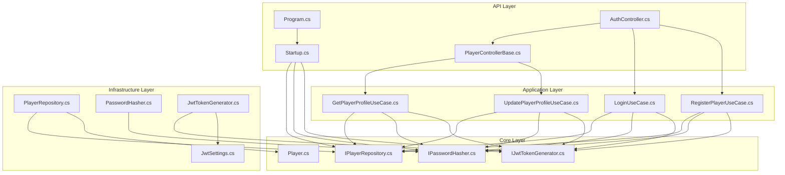
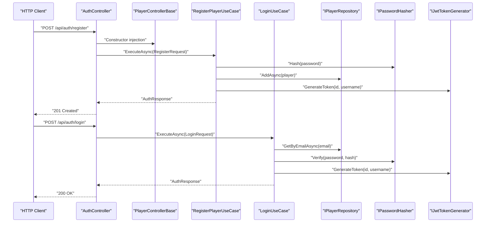
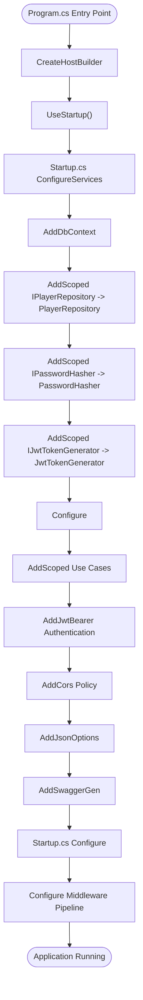
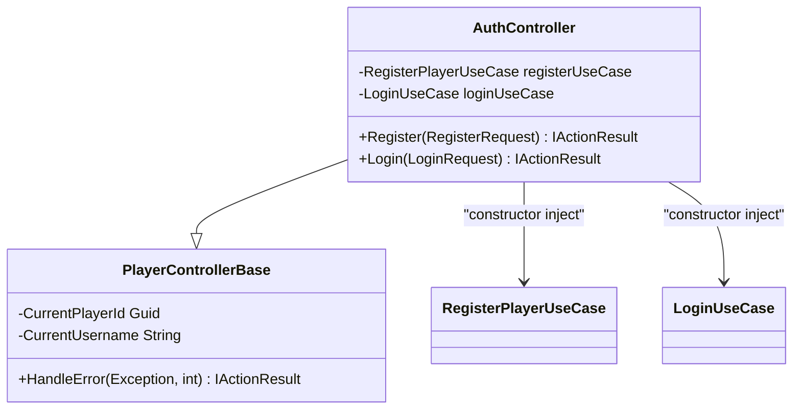
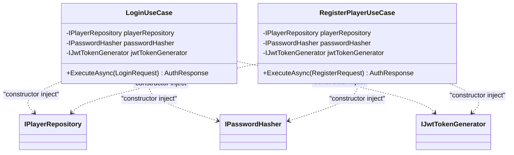
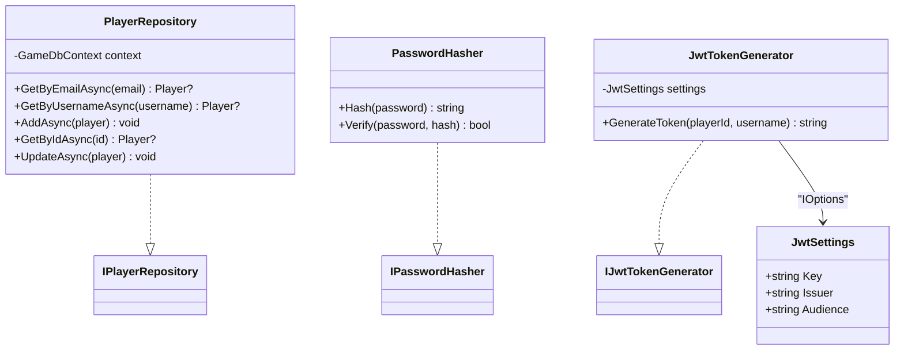
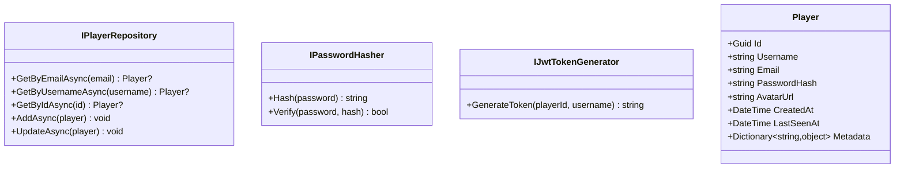
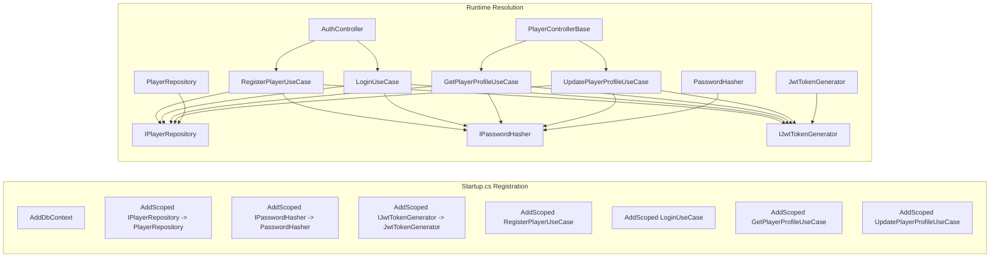

# Dependency Injection & Service Registration

<cite>
**Referenced Files in This Document**
- [Program.cs](file://GameBackend.API/Program.cs)
- [Startup.cs](file://GameBackend.API/Startup.cs)
- [AuthController.cs](file://GameBackend.API/Controllers/AuthController.cs)
- [PlayerControllerBase.cs](file://GameBackend.API/Controllers/PlayerControllerBase.cs)
- [LoginUseCase.cs](file://GameBackend.Application/Contracts/UseCases/Auth/LoginUseCase.cs)
- [RegisterPlayerUseCase.cs](file://GameBackend.Application/Contracts/UseCases/Auth/RegisterPlayerUseCase.cs)
- [PlayerRepository.cs](file://GameBackend.Infrastructure/Repositories/PlayerRepository.cs)
- [IPlayerRepository.cs](file://GameBackend.Core/Interfaces/IPlayerRepository.cs)
- [IPasswordHasher.cs](file://GameBackend.Core/Interfaces/IPasswordHasher.cs)
- [IJwtTokenGenerator.cs](file://GameBackend.Core/Interfaces/IJwtTokenGenerator.cs)
- [JwtTokenGenerator.cs](file://GameBackend.Infrastructure/Security/JwtTokenGenerator.cs)
- [PasswordHasher.cs](file://GameBackend.Infrastructure/Security/PasswordHasher.cs)
- [JwtSettings.cs](file://GameBackend.Infrastructure/Security/JwtSettings.cs)
- [Player.cs](file://GameBackend.Core/Entities/Player.cs)
</cite>

## Update Summary
**Changes Made**
- Updated service registration pattern from Program.cs to Startup.cs ConfigureServices method
- Added comprehensive CORS configuration and health check endpoint
- Enhanced JSON serialization options for better API responses
- Expanded use case registration to include profile management use cases
- Updated authentication configuration with improved JWT validation parameters

## Table of Contents
1. [Introduction](#introduction)
2. [Project Structure](#project-structure)
3. [Core Components](#core-components)
4. [Architecture Overview](#architecture-overview)
5. [Detailed Component Analysis](#detailed-component-analysis)
6. [Dependency Analysis](#dependency-analysis)
7. [Performance Considerations](#performance-considerations)
8. [Troubleshooting Guide](#troubleshooting-guide)
9. [Conclusion](#conclusion)

## Introduction
This document explains the dependency injection (DI) patterns and service registration in the GameBackend API layer. The architecture has evolved to use the modern ASP.NET Core Startup.cs pattern for service configuration, moving away from the traditional Program.cs approach. It focuses on how services are registered with appropriate lifetimes, how interfaces are injected into controllers, and how the dependency container resolves implementations. It also documents service registration patterns for repositories, security services, and use cases, and demonstrates how DI supports testability and loose coupling across layers.

## Project Structure
The solution follows a layered architecture with centralized service configuration in the Startup.cs file:
- API layer: HTTP entry point, controllers, and centralized DI bootstrap via Startup.cs.
- Application layer: Use cases and application contracts.
- Core layer: Domain entities and abstractions (interfaces).
- Infrastructure layer: Implementations of repositories and security services.

**Diagram sources**
- [Program.cs](file://GameBackend.API/Program.cs)
- [Startup.cs](file://GameBackend.API/Startup.cs)
- [AuthController.cs](file://GameBackend.API/Controllers/AuthController.cs)
- [PlayerControllerBase.cs](file://GameBackend.API/Controllers/PlayerControllerBase.cs)
- [LoginUseCase.cs](file://GameBackend.Application/Contracts/UseCases/Auth/LoginUseCase.cs)
- [RegisterPlayerUseCase.cs](file://GameBackend.Application/Contracts/UseCases/Auth/RegisterPlayerUseCase.cs)
- [IPlayerRepository.cs](file://GameBackend.Core/Interfaces/IPlayerRepository.cs)
- [IPasswordHasher.cs](file://GameBackend.Core/Interfaces/IPasswordHasher.cs)
- [IJwtTokenGenerator.cs](file://GameBackend.Core/Interfaces/IJwtTokenGenerator.cs)
- [PlayerRepository.cs](file://GameBackend.Infrastructure/Repositories/PlayerRepository.cs)
- [PasswordHasher.cs](file://GameBackend.Infrastructure/Security/PasswordHasher.cs)
- [JwtTokenGenerator.cs](file://GameBackend.Infrastructure/Security/JwtTokenGenerator.cs)
- [JwtSettings.cs](file://GameBackend.Infrastructure/Security/JwtSettings.cs)
- [Player.cs](file://GameBackend.Core/Entities/Player.cs)

**Section sources**
- [Program.cs](file://GameBackend.API/Program.cs)
- [Startup.cs](file://GameBackend.API/Startup.cs)
- [AuthController.cs](file://GameBackend.API/Controllers/AuthController.cs)

## Core Components
- Centralized service configuration in Startup.cs ConfigureServices method:
  - Registers DbContext with Entity Framework Core using PostgreSQL provider.
  - Registers JWT settings via strongly-typed configuration binding.
  - Registers scoped services for repositories and security implementations.
  - Registers application use cases as scoped services (including profile management).
  - Configures authentication with JWT Bearer tokens and comprehensive validation parameters.
  - Adds CORS policy allowing any origin for game client connections.
  - Configures enhanced JSON serialization options for API responses.
  - Adds Swagger for API exploration and health check endpoint.
- Controllers depend on use cases via constructor injection, with specialized base controller for common functionality.
- Use cases depend on domain interfaces (repositories and security services) via constructor injection.
- Infrastructure implementations depend on core interfaces and configuration.

Key DI registrations and lifetimes:
- DbContext: registered with Entity Framework Core using Npgsql provider.
- Repositories and security services: registered as Scoped.
- Use cases: registered as Scoped (registration expanded to include profile management).
- Authentication: configured with JWT Bearer and comprehensive TokenValidationParameters.
- CORS: configured with permissive policy for development environment.

**Updated** Service configuration now centralized in Startup.cs with enhanced CORS and JSON serialization options.

**Section sources**
- [Startup.cs](file://GameBackend.API/Startup.cs)

## Architecture Overview
The API layer orchestrates HTTP requests to controllers through the Startup.cs configuration, which handles all service registrations. Controllers inherit from a base controller that provides common functionality for player authentication and error handling. The controllers delegate to application use cases, which resolve their dependencies through constructor injection, obtaining repositories and security services. Infrastructure implementations fulfill these contracts, while configuration is supplied via strongly typed settings.

**Diagram sources**
- [AuthController.cs](file://GameBackend.API/Controllers/AuthController.cs)
- [PlayerControllerBase.cs](file://GameBackend.API/Controllers/PlayerControllerBase.cs)
- [RegisterPlayerUseCase.cs](file://GameBackend.Application/Contracts/UseCases/Auth/RegisterPlayerUseCase.cs)
- [LoginUseCase.cs](file://GameBackend.Application/Contracts/UseCases/Auth/LoginUseCase.cs)
- [IPlayerRepository.cs](file://GameBackend.Core/Interfaces/IPlayerRepository.cs)
- [IPasswordHasher.cs](file://GameBackend.Core/Interfaces/IPasswordHasher.cs)
- [IJwtTokenGenerator.cs](file://GameBackend.Core/Interfaces/IJwtTokenGenerator.cs)

## Detailed Component Analysis

### API Layer: Program.cs and Startup.cs
- Program.cs serves as the application entry point, delegating to Startup.cs for service configuration.
- Startup.cs ConfigureServices method centralizes all service registrations:
  - Database configuration with Entity Framework Core using Npgsql provider.
  - Repository registration: IPlayerRepository -> PlayerRepository.
  - Security service registrations: IPasswordHasher -> PasswordHasher, IJwtTokenGenerator -> JwtTokenGenerator.
  - Strongly-typed JWT settings binding via Configuration.GetSection("Jwt").
  - Comprehensive use case registrations including profile management.
  - JWT authentication with detailed validation parameters.
  - CORS policy allowing any origin for game client connections.
  - Enhanced JSON serialization options for API responses.
  - Swagger integration for API documentation.
- Startup.cs Configure method handles middleware pipeline setup including routing, CORS, authentication, and authorization.

**Diagram sources**
- [Program.cs](file://GameBackend.API/Program.cs)
- [Startup.cs](file://GameBackend.API/Startup.cs)

**Section sources**
- [Program.cs](file://GameBackend.API/Program.cs)
- [Startup.cs](file://GameBackend.API/Startup.cs)

### Controllers: AuthController and PlayerControllerBase
- AuthController inherits from PlayerControllerBase and uses constructor injection for use cases.
- PlayerControllerBase provides common functionality including current player ID extraction from JWT claims and standardized error handling.
- Exposes HTTP endpoints for authentication operations with proper exception handling and status codes.

**Diagram sources**
- [PlayerControllerBase.cs](file://GameBackend.API/Controllers/PlayerControllerBase.cs)
- [AuthController.cs](file://GameBackend.API/Controllers/AuthController.cs)
- [RegisterPlayerUseCase.cs](file://GameBackend.Application/Contracts/UseCases/Auth/RegisterPlayerUseCase.cs)
- [LoginUseCase.cs](file://GameBackend.Application/Contracts/UseCases/Auth/LoginUseCase.cs)

**Section sources**
- [AuthController.cs](file://GameBackend.API/Controllers/AuthController.cs)
- [PlayerControllerBase.cs](file://GameBackend.API/Controllers/PlayerControllerBase.cs)

### Use Cases: Application Layer
- LoginUseCase depends on IPlayerRepository, IPasswordHasher, and IJwtTokenGenerator for authentication workflows.
- RegisterPlayerUseCase depends on IPlayerRepository, IPasswordHasher, and IJwtTokenGenerator for user registration.
- Both use cases are registered as Scoped in the Startup.cs ConfigureServices method.
- Additional use cases for profile management are also registered for comprehensive player operations.

**Diagram sources**
- [LoginUseCase.cs](file://GameBackend.Application/Contracts/UseCases/Auth/LoginUseCase.cs)
- [RegisterPlayerUseCase.cs](file://GameBackend.Application/Contracts/UseCases/Auth/RegisterPlayerUseCase.cs)
- [IPlayerRepository.cs](file://GameBackend.Core/Interfaces/IPlayerRepository.cs)
- [IPasswordHasher.cs](file://GameBackend.Core/Interfaces/IPasswordHasher.cs)
- [IJwtTokenGenerator.cs](file://GameBackend.Core/Interfaces/IJwtTokenGenerator.cs)

**Section sources**
- [LoginUseCase.cs](file://GameBackend.Application/Contracts/UseCases/Auth/LoginUseCase.cs)
- [RegisterPlayerUseCase.cs](file://GameBackend.Application/Contracts/UseCases/Auth/RegisterPlayerUseCase.cs)

### Infrastructure Implementations
- PlayerRepository implements IPlayerRepository and depends on GameDbContext for database operations.
- PasswordHasher implements IPasswordHasher using BCrypt.NET library for secure password hashing.
- JwtTokenGenerator implements IJwtTokenGenerator and depends on JwtSettings via IOptions for token generation.
- All implementations are registered as Scoped services in the Startup.cs configuration.

**Diagram sources**
- [PlayerRepository.cs](file://GameBackend.Infrastructure/Repositories/PlayerRepository.cs)
- [PasswordHasher.cs](file://GameBackend.Infrastructure/Security/PasswordHasher.cs)
- [JwtTokenGenerator.cs](file://GameBackend.Infrastructure/Security/JwtTokenGenerator.cs)
- [JwtSettings.cs](file://GameBackend.Infrastructure/Security/JwtSettings.cs)
- [IPlayerRepository.cs](file://GameBackend.Core/Interfaces/IPlayerRepository.cs)
- [IPasswordHasher.cs](file://GameBackend.Core/Interfaces/IPasswordHasher.cs)
- [IJwtTokenGenerator.cs](file://GameBackend.Core/Interfaces/IJwtTokenGenerator.cs)

**Section sources**
- [PlayerRepository.cs](file://GameBackend.Infrastructure/Repositories/PlayerRepository.cs)
- [PasswordHasher.cs](file://GameBackend.Infrastructure/Security/PasswordHasher.cs)
- [JwtTokenGenerator.cs](file://GameBackend.Infrastructure/Security/JwtTokenGenerator.cs)
- [JwtSettings.cs](file://GameBackend.Infrastructure/Security/JwtSettings.cs)

### Core Abstractions and Entities
- IPlayerRepository defines repository contract for player operations including CRUD operations.
- IPasswordHasher defines password hashing and verification interface.
- IJwtTokenGenerator defines token generation interface for authentication.
- Player entity represents persisted domain data with comprehensive properties.

**Diagram sources**
- [IPlayerRepository.cs](file://GameBackend.Core/Interfaces/IPlayerRepository.cs)
- [IPasswordHasher.cs](file://GameBackend.Core/Interfaces/IPasswordHasher.cs)
- [IJwtTokenGenerator.cs](file://GameBackend.Core/Interfaces/IJwtTokenGenerator.cs)
- [Player.cs](file://GameBackend.Core/Entities/Player.cs)

**Section sources**
- [IPlayerRepository.cs](file://GameBackend.Core/Interfaces/IPlayerRepository.cs)
- [IPasswordHasher.cs](file://GameBackend.Core/Interfaces/IPasswordHasher.cs)
- [IJwtTokenGenerator.cs](file://GameBackend.Core/Interfaces/IJwtTokenGenerator.cs)
- [Player.cs](file://GameBackend.Core/Entities/Player.cs)

## Dependency Analysis
- Startup.cs ConfigureServices registers all services with appropriate lifetimes:
  - DbContext for Entity Framework Core with Npgsql provider.
  - Scoped repository and security implementations.
  - Scoped use cases including authentication and profile management.
  - JWT authentication with comprehensive TokenValidationParameters bound to configuration.
  - CORS policy for game client connectivity.
  - Enhanced JSON serialization options for API responses.
- Controllers receive use cases via constructor injection, inheriting common functionality from PlayerControllerBase.
- Use cases receive repositories and security services via constructor injection.
- Infrastructure implementations depend on core interfaces and configuration.

**Diagram sources**
- [Startup.cs](file://GameBackend.API/Startup.cs)
- [AuthController.cs](file://GameBackend.API/Controllers/AuthController.cs)
- [PlayerControllerBase.cs](file://GameBackend.API/Controllers/PlayerControllerBase.cs)
- [RegisterPlayerUseCase.cs](file://GameBackend.Application/Contracts/UseCases/Auth/RegisterPlayerUseCase.cs)
- [LoginUseCase.cs](file://GameBackend.Application/Contracts/UseCases/Auth/LoginUseCase.cs)
- [PlayerRepository.cs](file://GameBackend.Infrastructure/Repositories/PlayerRepository.cs)
- [PasswordHasher.cs](file://GameBackend.Infrastructure/Security/PasswordHasher.cs)
- [JwtTokenGenerator.cs](file://GameBackend.Infrastructure/Security/JwtTokenGenerator.cs)

**Section sources**
- [Startup.cs](file://GameBackend.API/Startup.cs)
- [AuthController.cs](file://GameBackend.API/Controllers/AuthController.cs)
- [PlayerControllerBase.cs](file://GameBackend.API/Controllers/PlayerControllerBase.cs)
- [RegisterPlayerUseCase.cs](file://GameBackend.Application/Contracts/UseCases/Auth/RegisterPlayerUseCase.cs)
- [LoginUseCase.cs](file://GameBackend.Application/Contracts/UseCases/Auth/LoginUseCase.cs)

## Performance Considerations
- Scoped lifetime ensures per-request resolution of repositories and use cases, minimizing shared mutable state and avoiding cross-request interference.
- DbContext is registered with Entity Framework Core using Npgsql provider; ensure minimal work inside HTTP requests to reduce transaction overhead.
- JWT token generation reads settings from strongly-typed configuration; keep settings small and avoid heavy computation in token generation.
- Enhanced JSON serialization options improve API response performance by reducing payload size.
- CORS policy allows any origin for development but should be restricted in production environments.
- Consider caching strategies for frequently accessed data if needed, while maintaining immutability and thread-safety.

## Troubleshooting Guide
Common DI-related issues and resolutions:
- Missing service registration:
  - Symptom: runtime error indicating unregistered service.
  - Resolution: Ensure the interface-to-implementation mapping is registered as Scoped in the Startup.cs ConfigureServices method.
- Incorrect lifetime configuration:
  - Symptom: intermittent state issues or concurrency problems.
  - Resolution: Use Scoped for transient services and single-call dependencies; verify registrations match intended lifetime in Startup.cs.
- Configuration binding errors:
  - Symptom: JWT configuration not applied or validation failures.
  - Resolution: Confirm JwtSettings section is present in configuration and values are correctly bound; verify TokenValidationParameters align with settings.
- CORS policy issues:
  - Symptom: Cross-origin request failures.
  - Resolution: Review CORS policy configuration in Startup.cs; adjust origins, methods, and headers as needed.
- Authentication failures:
  - Symptom: JWT authentication errors despite valid tokens.
  - Resolution: Verify JWT settings in configuration match TokenValidationParameters; check key, issuer, and audience values.
- Circular dependencies:
  - Symptom: startup failure due to circular constructor dependencies.
  - Resolution: Refactor to eliminate cycles; introduce façades or separate concerns to break tight coupling.

**Section sources**
- [Startup.cs](file://GameBackend.API/Startup.cs)
- [Program.cs](file://GameBackend.API/Program.cs)

## Conclusion
The GameBackend API layer employs modern dependency injection patterns with centralized service configuration in Startup.cs:
- Services are registered as Scoped for appropriate lifetime management with comprehensive coverage of repositories, security services, and use cases.
- Controllers depend on use cases via constructor injection, with specialized base controller providing common functionality.
- Use cases depend on core interfaces, enabling loose coupling and testability across all layers.
- Infrastructure implementations fulfill contracts and consume configuration through strongly-typed settings.
- Enhanced CORS, JSON serialization, and authentication configurations support robust API development.
- This design promotes maintainability, testability, and clear separation of concerns across layers while following modern ASP.NET Core best practices.