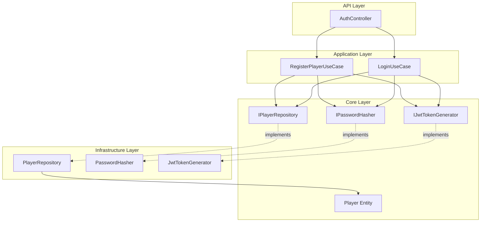
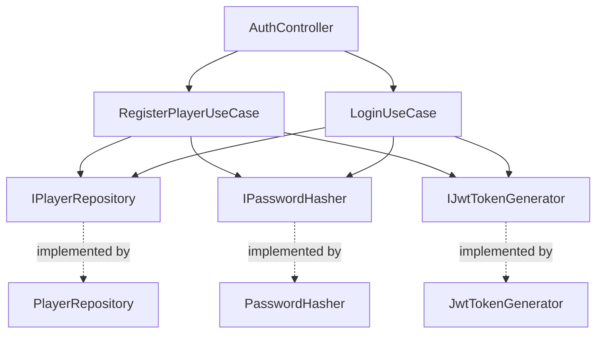
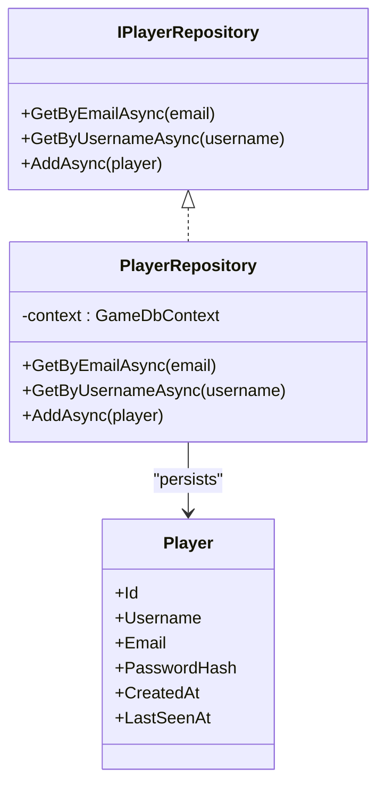
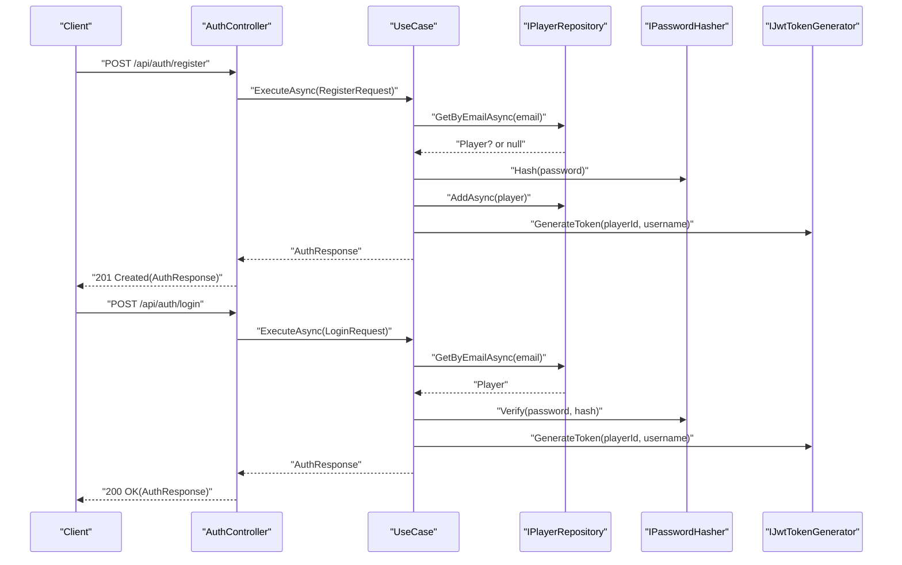
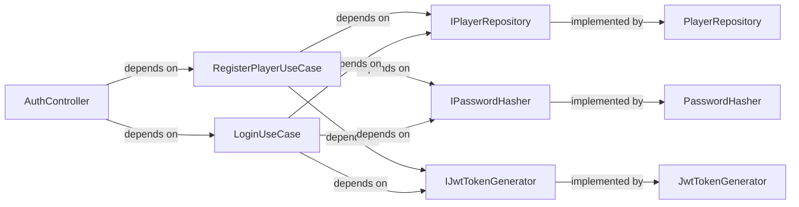
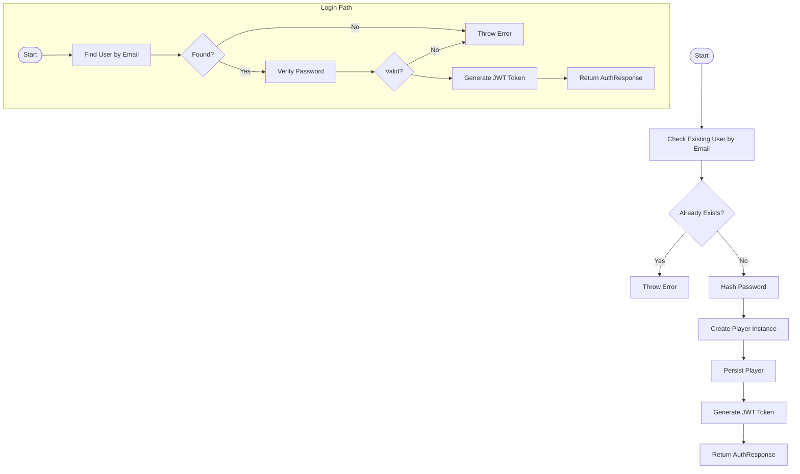
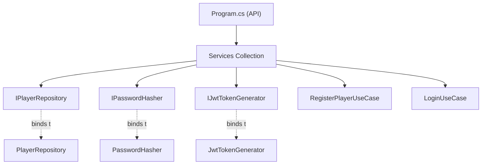

# Design Patterns Implementation

<cite>
**Referenced Files in This Document**
- [IPlayerRepository.cs](file://GameBackend.Core/Interfaces/IPlayerRepository.cs)
- [PlayerRepository.cs](file://GameBackend.Infrastructure/Repositories/PlayerRepository.cs)
- [RegisterPlayerUseCase.cs](file://GameBackend.Application/Contracts/UseCases/Auth/RegisterPlayerUseCase.cs)
- [LoginUseCase.cs](file://GameBackend.Application/Contracts/UseCases/Auth/LoginUseCase.cs)
- [AuthController.cs](file://GameBackend.API/Controllers/AuthController.cs)
- [Player.cs](file://GameBackend.Core/Entities/Player.cs)
- [IPasswordHasher.cs](file://GameBackend.Core/Interfaces/IPasswordHasher.cs)
- [IJwtTokenGenerator.cs](file://GameBackend.Core/Interfaces/IJwtTokenGenerator.cs)
- [PasswordHasher.cs](file://GameBackend.Infrastructure/Security/PasswordHasher.cs)
- [JwtTokenGenerator.cs](file://GameBackend.Infrastructure/Security/JwtTokenGenerator.cs)
- [RegisterRequest.cs](file://GameBackend.Application/Contracts/Auth/RegisterRequest.cs)
- [LoginRequest.cs](file://GameBackend.Application/Contracts/Auth/LoginRequest.cs)
- [AuthResponse.cs](file://GameBackend.Application/Contracts/Auth/AuthResponse.cs)
- [JwtSettings.cs](file://GameBackend.Infrastructure/Security/JwtSettings.cs)
- [Program.cs](file://GameBackend.API/Program.cs)
</cite>

## Table of Contents
1. [Introduction](#introduction)
2. [Project Structure](#project-structure)
3. [Core Components](#core-components)
4. [Architecture Overview](#architecture-overview)
5. [Detailed Component Analysis](#detailed-component-analysis)
6. [Dependency Analysis](#dependency-analysis)
7. [Performance Considerations](#performance-considerations)
8. [Troubleshooting Guide](#troubleshooting-guide)
9. [Conclusion](#conclusion)

## Introduction
This document explains how the GameBackend architecture applies key design patterns to achieve clean separation of concerns, testability, and maintainability. It focuses on:
- Repository pattern for data access abstraction
- Use case pattern for encapsulating business operations
- Interface segregation and dependency inversion
- How these patterns collectively support extensibility and testability

## Project Structure
The solution follows a layered architecture:
- API layer exposes HTTP endpoints and delegates to use cases
- Application layer orchestrates business operations via use cases
- Core layer defines domain entities and abstractions (interfaces)
- Infrastructure layer implements abstractions and infrastructure concerns

**Diagram sources**
- [AuthController.cs:1-47](file://GameBackend.API/Controllers/AuthController.cs#L1-L47)
- [RegisterPlayerUseCase.cs:1-58](file://GameBackend.Application/Contracts/UseCases/Auth/RegisterPlayerUseCase.cs#L1-L58)
- [LoginUseCase.cs:1-45](file://GameBackend.Application/Contracts/UseCases/Auth/LoginUseCase.cs#L1-L45)
- [IPlayerRepository.cs:1-10](file://GameBackend.Core/Interfaces/IPlayerRepository.cs#L1-L10)
- [IPasswordHasher.cs:1-7](file://GameBackend.Core/Interfaces/IPasswordHasher.cs#L1-L7)
- [IJwtTokenGenerator.cs:1-6](file://GameBackend.Core/Interfaces/IJwtTokenGenerator.cs#L1-L6)
- [PlayerRepository.cs:1-34](file://GameBackend.Infrastructure/Repositories/PlayerRepository.cs#L1-L34)
- [PasswordHasher.cs:1-16](file://GameBackend.Infrastructure/Security/PasswordHasher.cs#L1-L16)
- [JwtTokenGenerator.cs:1-40](file://GameBackend.Infrastructure/Security/JwtTokenGenerator.cs#L1-L40)
- [Player.cs:1-13](file://GameBackend.Core/Entities/Player.cs#L1-L13)

**Section sources**
- [AuthController.cs:1-47](file://GameBackend.API/Controllers/AuthController.cs#L1-L47)
- [RegisterPlayerUseCase.cs:1-58](file://GameBackend.Application/Contracts/UseCases/Auth/RegisterPlayerUseCase.cs#L1-L58)
- [LoginUseCase.cs:1-45](file://GameBackend.Application/Contracts/UseCases/Auth/LoginUseCase.cs#L1-L45)
- [IPlayerRepository.cs:1-10](file://GameBackend.Core/Interfaces/IPlayerRepository.cs#L1-L10)
- [PlayerRepository.cs:1-34](file://GameBackend.Infrastructure/Repositories/PlayerRepository.cs#L1-L34)
- [IPasswordHasher.cs:1-7](file://GameBackend.Core/Interfaces/IPasswordHasher.cs#L1-L7)
- [IJwtTokenGenerator.cs:1-6](file://GameBackend.Core/Interfaces/IJwtTokenGenerator.cs#L1-L6)
- [PasswordHasher.cs:1-16](file://GameBackend.Infrastructure/Security/PasswordHasher.cs#L1-L16)
- [JwtTokenGenerator.cs:1-40](file://GameBackend.Infrastructure/Security/JwtTokenGenerator.cs#L1-L40)
- [Player.cs:1-13](file://GameBackend.Core/Entities/Player.cs#L1-L13)

## Core Components
- Repository pattern: The IPlayerRepository interface abstracts data access. The PlayerRepository implements it using Entity Framework, enabling testability by allowing mock repositories in unit tests.
- Use case pattern: RegisterPlayerUseCase and LoginUseCase encapsulate complete authentication workflows, coordinating repository, hashing, and token generation responsibilities.
- Interface segregation and dependency inversion: Abstractions (IPlayerRepository, IPasswordHasher, IJwtTokenGenerator) decouple the application from infrastructure, enabling swapping implementations and simplifying testing.

**Section sources**
- [IPlayerRepository.cs:1-10](file://GameBackend.Core/Interfaces/IPlayerRepository.cs#L1-L10)
- [PlayerRepository.cs:1-34](file://GameBackend.Infrastructure/Repositories/PlayerRepository.cs#L1-L34)
- [RegisterPlayerUseCase.cs:1-58](file://GameBackend.Application/Contracts/UseCases/Auth/RegisterPlayerUseCase.cs#L1-L58)
- [LoginUseCase.cs:1-45](file://GameBackend.Application/Contracts/UseCases/Auth/LoginUseCase.cs#L1-L45)
- [IPasswordHasher.cs:1-7](file://GameBackend.Core/Interfaces/IPasswordHasher.cs#L1-L7)
- [IJwtTokenGenerator.cs:1-6](file://GameBackend.Core/Interfaces/IJwtTokenGenerator.cs#L1-L6)

## Architecture Overview
The system adheres to dependency inversion:
- API controllers depend on abstractions (use cases)
- Use cases depend on abstractions (repositories, hashers, token generators)
- Infrastructure implements abstractions
- DI container wires abstractions to implementations

**Diagram sources**
- [AuthController.cs:1-47](file://GameBackend.API/Controllers/AuthController.cs#L1-L47)
- [RegisterPlayerUseCase.cs:1-58](file://GameBackend.Application/Contracts/UseCases/Auth/RegisterPlayerUseCase.cs#L1-L58)
- [LoginUseCase.cs:1-45](file://GameBackend.Application/Contracts/UseCases/Auth/LoginUseCase.cs#L1-L45)
- [IPlayerRepository.cs:1-10](file://GameBackend.Core/Interfaces/IPlayerRepository.cs#L1-L10)
- [IPasswordHasher.cs:1-7](file://GameBackend.Core/Interfaces/IPasswordHasher.cs#L1-L7)
- [IJwtTokenGenerator.cs:1-6](file://GameBackend.Core/Interfaces/IJwtTokenGenerator.cs#L1-L6)
- [PlayerRepository.cs:1-34](file://GameBackend.Infrastructure/Repositories/PlayerRepository.cs#L1-L34)
- [PasswordHasher.cs:1-16](file://GameBackend.Infrastructure/Security/PasswordHasher.cs#L1-L16)
- [JwtTokenGenerator.cs:1-40](file://GameBackend.Infrastructure/Security/JwtTokenGenerator.cs#L1-L40)

## Detailed Component Analysis

### Repository Pattern: IPlayerRepository and PlayerRepository
- Purpose: Abstract data access to enable testability and persistence ignorance in higher layers.
- Interface responsibilities: Query players by email/username and add new players.
- Implementation: Uses Entity Framework to query and persist Player entities.

**Diagram sources**
- [IPlayerRepository.cs:1-10](file://GameBackend.Core/Interfaces/IPlayerRepository.cs#L1-L10)
- [PlayerRepository.cs:1-34](file://GameBackend.Infrastructure/Repositories/PlayerRepository.cs#L1-L34)
- [Player.cs](file://GameBackend.Core/Entities/Player.cs)

**Section sources**
- [IPlayerRepository.cs:1-10](file://GameBackend.Core/Interfaces/IPlayerRepository.cs#L1-L10)
- [PlayerRepository.cs:1-34](file://GameBackend.Infrastructure/Repositories/PlayerRepository.cs#L1-L34)
- [Player.cs:1-13](file://GameBackend.Core/Entities/Player.cs#L1-L13)

### Use Case Pattern: RegisterPlayerUseCase and LoginUseCase
- Purpose: Encapsulate complete business workflows for authentication.
- RegisterPlayerUseCase:
  - Validates uniqueness
  - Hashes password
  - Creates and persists a Player entity
  - Generates a JWT token
  - Returns an AuthResponse
- LoginUseCase:
  - Retrieves player by email
  - Verifies password
  - Generates a JWT token
  - Returns an AuthResponse

**Diagram sources**
- [AuthController.cs:1-47](file://GameBackend.API/Controllers/AuthController.cs#L1-L47)
- [RegisterPlayerUseCase.cs:1-58](file://GameBackend.Application/Contracts/UseCases/Auth/RegisterPlayerUseCase.cs#L1-L58)
- [LoginUseCase.cs:1-45](file://GameBackend.Application/Contracts/UseCases/Auth/LoginUseCase.cs#L1-L45)
- [IPlayerRepository.cs:1-10](file://GameBackend.Core/Interfaces/IPlayerRepository.cs#L1-L10)
- [IPasswordHasher.cs:1-7](file://GameBackend.Core/Interfaces/IPasswordHasher.cs#L1-L7)
- [IJwtTokenGenerator.cs:1-6](file://GameBackend.Core/Interfaces/IJwtTokenGenerator.cs#L1-L6)

**Section sources**
- [RegisterPlayerUseCase.cs:1-58](file://GameBackend.Application/Contracts/UseCases/Auth/RegisterPlayerUseCase.cs#L1-L58)
- [LoginUseCase.cs:1-45](file://GameBackend.Application/Contracts/UseCases/Auth/LoginUseCase.cs#L1-L45)
- [AuthController.cs:1-47](file://GameBackend.API/Controllers/AuthController.cs#L1-L47)

### Interface Segregation Principle and Dependency Inversion
- Interface segregation: Each interface has a single responsibility (repository queries, password hashing, token generation).
- Dependency inversion: Higher layers (API, Application) depend on abstractions; Infrastructure implements them.
- DI registration: The API’s Program.cs binds abstractions to implementations, enabling runtime wiring and test substitution.

**Diagram sources**
- [AuthController.cs:1-47](file://GameBackend.API/Controllers/AuthController.cs#L1-L47)
- [RegisterPlayerUseCase.cs:1-58](file://GameBackend.Application/Contracts/UseCases/Auth/RegisterPlayerUseCase.cs#L1-L58)
- [LoginUseCase.cs:1-45](file://GameBackend.Application/Contracts/UseCases/Auth/LoginUseCase.cs#L1-L45)
- [IPlayerRepository.cs:1-10](file://GameBackend.Core/Interfaces/IPlayerRepository.cs#L1-L10)
- [IPasswordHasher.cs:1-7](file://GameBackend.Core/Interfaces/IPasswordHasher.cs#L1-L7)
- [IJwtTokenGenerator.cs:1-6](file://GameBackend.Core/Interfaces/IJwtTokenGenerator.cs#L1-L6)
- [PlayerRepository.cs:1-34](file://GameBackend.Infrastructure/Repositories/PlayerRepository.cs#L1-L34)
- [PasswordHasher.cs:1-16](file://GameBackend.Infrastructure/Security/PasswordHasher.cs#L1-L16)
- [JwtTokenGenerator.cs:1-40](file://GameBackend.Infrastructure/Security/JwtTokenGenerator.cs#L1-L40)

**Section sources**
- [Program.cs:1-61](file://GameBackend.API/Program.cs#L1-L61)
- [IPlayerRepository.cs:1-10](file://GameBackend.Core/Interfaces/IPlayerRepository.cs#L1-L10)
- [IPasswordHasher.cs:1-7](file://GameBackend.Core/Interfaces/IPasswordHasher.cs#L1-L7)
- [IJwtTokenGenerator.cs:1-6](file://GameBackend.Core/Interfaces/IJwtTokenGenerator.cs#L1-L6)

### Authentication Workflows: Registration and Login
- Registration flow:
  - Check for existing user by email
  - Hash password
  - Persist new Player
  - Generate JWT token
  - Return AuthResponse
- Login flow:
  - Retrieve Player by email
  - Verify password
  - Generate JWT token
  - Return AuthResponse

**Diagram sources**
- [RegisterPlayerUseCase.cs:1-58](file://GameBackend.Application/Contracts/UseCases/Auth/RegisterPlayerUseCase.cs#L1-L58)
- [LoginUseCase.cs:1-45](file://GameBackend.Application/Contracts/UseCases/Auth/LoginUseCase.cs#L1-L45)
- [IPlayerRepository.cs:1-10](file://GameBackend.Core/Interfaces/IPlayerRepository.cs#L1-L10)
- [IPasswordHasher.cs:1-7](file://GameBackend.Core/Interfaces/IPasswordHasher.cs#L1-L7)
- [IJwtTokenGenerator.cs:1-6](file://GameBackend.Core/Interfaces/IJwtTokenGenerator.cs#L1-L6)

**Section sources**
- [RegisterPlayerUseCase.cs:1-58](file://GameBackend.Application/Contracts/UseCases/Auth/RegisterPlayerUseCase.cs#L1-L58)
- [LoginUseCase.cs:1-45](file://GameBackend.Application/Contracts/UseCases/Auth/LoginUseCase.cs#L1-L45)

## Dependency Analysis
- Cohesion: Each layer has a focused responsibility—API for HTTP, Application for orchestration, Core for domain and abstractions, Infrastructure for implementations.
- Coupling: Controlled via abstractions; API and Application depend on interfaces, not concrete implementations.
- DI bindings: Program.cs registers repositories, security services, and use cases as scoped services, enabling constructor injection and testability.

**Diagram sources**
- [Program.cs:1-61](file://GameBackend.API/Program.cs#L1-L61)
- [IPlayerRepository.cs:1-10](file://GameBackend.Core/Interfaces/IPlayerRepository.cs#L1-L10)
- [IPasswordHasher.cs:1-7](file://GameBackend.Core/Interfaces/IPasswordHasher.cs#L1-L7)
- [IJwtTokenGenerator.cs:1-6](file://GameBackend.Core/Interfaces/IJwtTokenGenerator.cs#L1-L6)
- [PlayerRepository.cs:1-34](file://GameBackend.Infrastructure/Repositories/PlayerRepository.cs#L1-L34)
- [PasswordHasher.cs:1-16](file://GameBackend.Infrastructure/Security/PasswordHasher.cs#L1-L16)
- [JwtTokenGenerator.cs:1-40](file://GameBackend.Infrastructure/Security/JwtTokenGenerator.cs#L1-L40)

**Section sources**
- [Program.cs:1-61](file://GameBackend.API/Program.cs#L1-L61)

## Performance Considerations
- Asynchronous operations: Repository methods and use cases use async/await to avoid blocking threads.
- Single round-trip persistence: AddAsync saves immediately, reducing transaction overhead.
- Token generation: Lightweight operation; ensure secret keys are managed securely.
- Testing: Mock repositories and hashers enable fast unit tests without database or cryptographic overhead.

## Troubleshooting Guide
- Validation errors:
  - Registration throws when a user already exists.
  - Login throws when credentials are invalid.
- Controller behavior:
  - Registration returns 201 with the AuthResponse; errors return 400 with error details.
  - Login returns 200 with the AuthResponse; errors return 401 with error details.
- JWT configuration:
  - Ensure Jwt settings (key, issuer, audience) are present in configuration.
  - Authentication middleware validates issuer, audience, and signing key.

**Section sources**
- [RegisterPlayerUseCase.cs:1-58](file://GameBackend.Application/Contracts/UseCases/Auth/RegisterPlayerUseCase.cs#L1-L58)
- [LoginUseCase.cs:1-45](file://GameBackend.Application/Contracts/UseCases/Auth/LoginUseCase.cs#L1-L45)
- [AuthController.cs:1-47](file://GameBackend.API/Controllers/AuthController.cs#L1-L47)
- [JwtSettings.cs:1-8](file://GameBackend.Infrastructure/Security/JwtSettings.cs#L1-L8)

## Conclusion
The GameBackend architecture demonstrates robust application of design patterns:
- Repository pattern isolates data access behind a clean interface.
- Use case pattern encapsulates business workflows, improving readability and testability.
- Interface segregation and dependency inversion decouple layers, enabling easy substitution and extension.
Together, these patterns produce a maintainable, extensible, and test-friendly system.