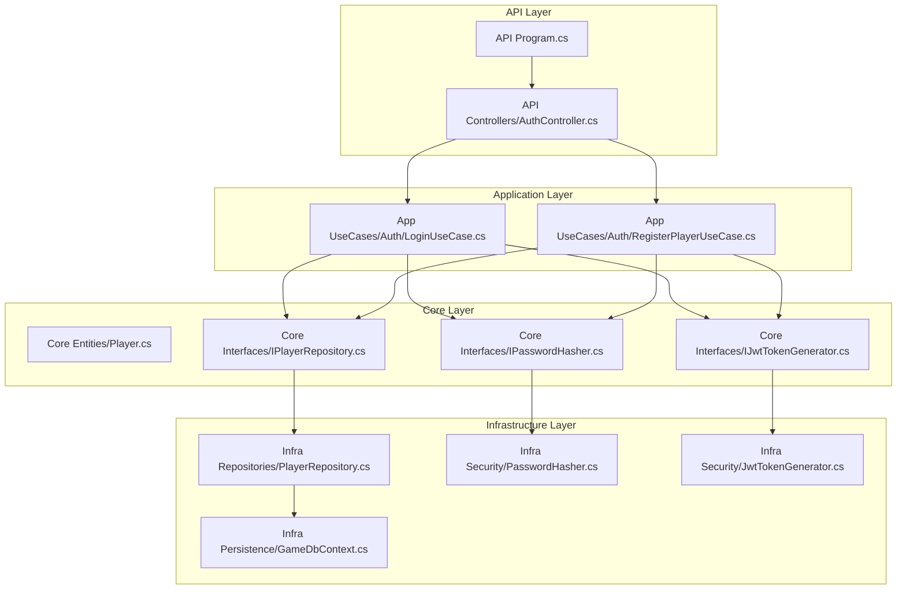
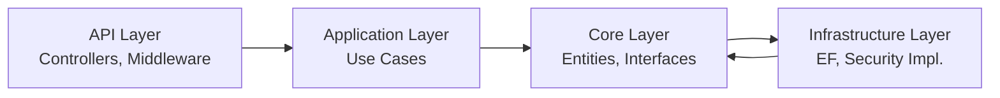
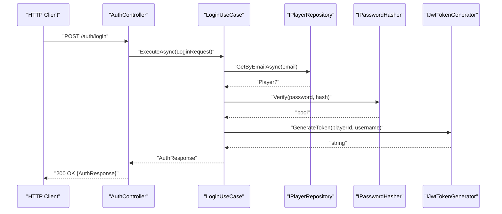
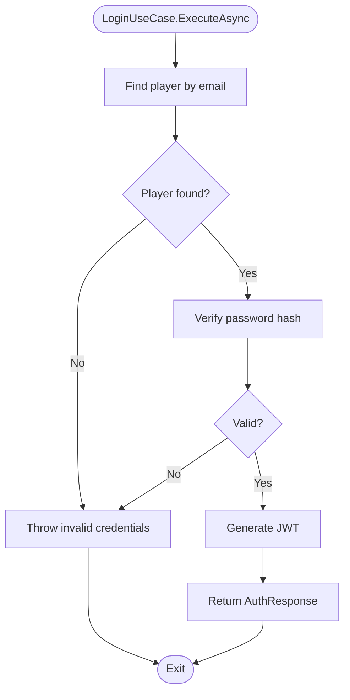
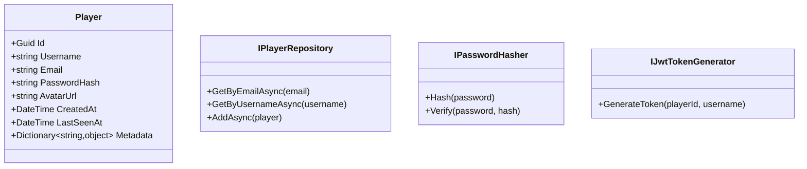
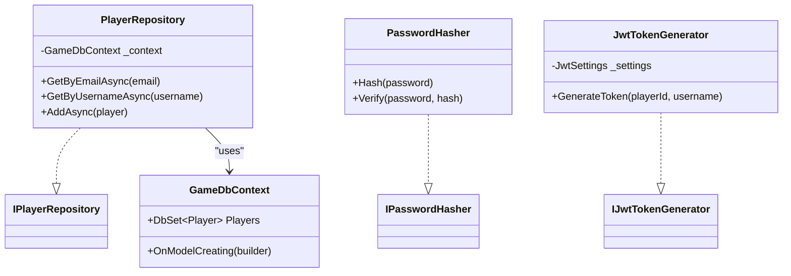
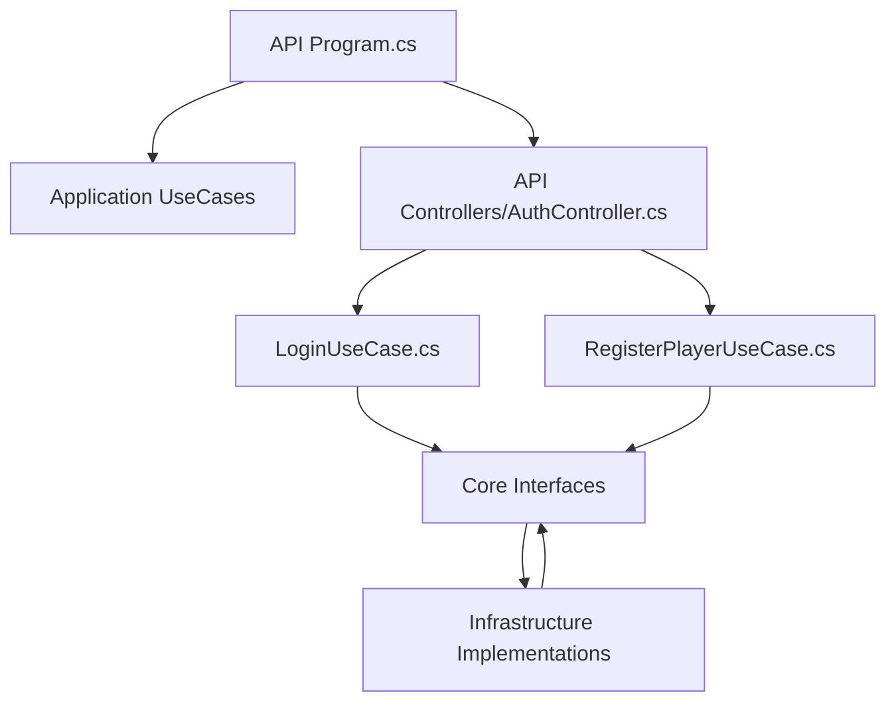

# Layer Responsibilities & Boundaries

<cite>
**Referenced Files in This Document**
- [Program.cs](file://GameBackend.API/Program.cs)
- [AuthController.cs](file://GameBackend.API/Controllers/AuthController.cs)
- [LoginUseCase.cs](file://GameBackend.Application/Contracts/UseCases/Auth/LoginUseCase.cs)
- [RegisterPlayerUseCase.cs](file://GameBackend.Application/Contracts/UseCases/Auth/RegisterPlayerUseCase.cs)
- [Player.cs](file://GameBackend.Core/Entities/Player.cs)
- [IPlayerRepository.cs](file://GameBackend.Core/Interfaces/IPlayerRepository.cs)
- [IPasswordHasher.cs](file://GameBackend.Core/Interfaces/IPasswordHasher.cs)
- [IJwtTokenGenerator.cs](file://GameBackend.Core/Interfaces/IJwtTokenGenerator.cs)
- [PlayerRepository.cs](file://GameBackend.Infrastructure/Repositories/PlayerRepository.cs)
- [GameDbContext.cs](file://GameBackend.Infrastructure/Persistence/GameDbContext.cs)
- [JwtTokenGenerator.cs](file://GameBackend.Infrastructure/Security/JwtTokenGenerator.cs)
- [PasswordHasher.cs](file://GameBackend.Infrastructure/Security/PasswordHasher.cs)
- [appsettings.json](file://GameBackend.API/appsettings.json)
</cite>

## Table of Contents
1. [Introduction](#introduction)
2. [Project Structure](#project-structure)
3. [Core Components](#core-components)
4. [Architecture Overview](#architecture-overview)
5. [Detailed Component Analysis](#detailed-component-analysis)
6. [Dependency Analysis](#dependency-analysis)
7. [Performance Considerations](#performance-considerations)
8. [Troubleshooting Guide](#troubleshooting-guide)
9. [Conclusion](#conclusion)

## Introduction
This document explains the layered architecture of the GameBackend system and defines the responsibilities and boundaries of each layer. The system follows clean architecture principles:
- API layer: Handles HTTP requests/responses and routes them to application use cases.
- Application layer: Implements business logic via use cases and orchestrates domain operations.
- Core layer: Defines domain entities and abstractions (interfaces) that encapsulate business rules.
- Infrastructure layer: Provides implementations for persistence, cryptography, and JWT generation.

Each layer communicates through well-defined interfaces, ensuring separation of concerns and testability.

## Project Structure
The solution is organized into four projects, each representing a distinct layer:
- GameBackend.API: HTTP entry point, controllers, middleware, and DI registration.
- GameBackend.Application: Application contracts and use cases.
- GameBackend.Core: Domain entities and core interfaces.
- GameBackend.Infrastructure: Entity Framework DbContext, repositories, and security implementations.

**Diagram sources**
- [Program.cs:1-72](file://GameBackend.API/Program.cs#L1-L72)
- [AuthController.cs:1-49](file://GameBackend.API/Controllers/AuthController.cs#L1-L49)
- [LoginUseCase.cs:1-45](file://GameBackend.Application/Contracts/UseCases/Auth/LoginUseCase.cs#L1-L45)
- [RegisterPlayerUseCase.cs:1-58](file://GameBackend.Application/Contracts/UseCases/Auth/RegisterPlayerUseCase.cs#L1-L58)
- [Player.cs:1-13](file://GameBackend.Core/Entities/Player.cs#L1-L13)
- [IPlayerRepository.cs:1-10](file://GameBackend.Core/Interfaces/IPlayerRepository.cs#L1-L10)
- [IPasswordHasher.cs:1-7](file://GameBackend.Core/Interfaces/IPasswordHasher.cs#L1-L7)
- [IJwtTokenGenerator.cs:1-6](file://GameBackend.Core/Interfaces/IJwtTokenGenerator.cs#L1-L6)
- [PlayerRepository.cs:1-34](file://GameBackend.Infrastructure/Repositories/PlayerRepository.cs#L1-L34)
- [GameDbContext.cs:1-28](file://GameBackend.Infrastructure/Persistence/GameDbContext.cs#L1-L28)
- [JwtTokenGenerator.cs:1-44](file://GameBackend.Infrastructure/Security/JwtTokenGenerator.cs#L1-L44)
- [PasswordHasher.cs:1-16](file://GameBackend.Infrastructure/Security/PasswordHasher.cs#L1-L16)

**Section sources**
- [Program.cs:1-72](file://GameBackend.API/Program.cs#L1-L72)
- [AuthController.cs:1-49](file://GameBackend.API/Controllers/AuthController.cs#L1-L49)

## Core Components
This section outlines responsibilities per layer and how they interact.

- API Layer
  - Responsibilities:
    - Define HTTP endpoints and route requests to application use cases.
    - Configure middleware (authentication, authorization, HTTPS).
    - Manage DI registrations for controllers and application services.
  - Key interactions:
    - Controllers depend on application use cases.
    - Uses JWT settings and connection strings from configuration.

- Application Layer
  - Responsibilities:
    - Encapsulate business logic in use cases.
    - Orchestrate domain operations via interfaces from Core.
    - Return application-specific responses (e.g., AuthResponse).
  - Key interactions:
    - Use cases depend on Core interfaces (repositories, hashing, token generation).
    - Produces domain entities (e.g., Player) and returns DTO-like responses.

- Core Layer
  - Responsibilities:
    - Define domain entities and business rules.
    - Provide abstractions (interfaces) for infrastructure concerns.
  - Key elements:
    - Player entity with identity and metadata.
    - Interfaces for persistence, hashing, and token generation.

- Infrastructure Layer
  - Responsibilities:
    - Implement persistence (Entity Framework) and external integrations (JWT, hashing).
    - Provide concrete implementations for Core interfaces.
  - Key interactions:
    - Repositories implement Core interfaces and operate on DbContext.
    - Security implementations provide hashing and token generation.

**Section sources**
- [Program.cs:1-72](file://GameBackend.API/Program.cs#L1-L72)
- [AuthController.cs:1-49](file://GameBackend.API/Controllers/AuthController.cs#L1-L49)
- [LoginUseCase.cs:1-45](file://GameBackend.Application/Contracts/UseCases/Auth/LoginUseCase.cs#L1-L45)
- [RegisterPlayerUseCase.cs:1-58](file://GameBackend.Application/Contracts/UseCases/Auth/RegisterPlayerUseCase.cs#L1-L58)
- [Player.cs:1-13](file://GameBackend.Core/Entities/Player.cs#L1-L13)
- [IPlayerRepository.cs:1-10](file://GameBackend.Core/Interfaces/IPlayerRepository.cs#L1-L10)
- [IPasswordHasher.cs:1-7](file://GameBackend.Core/Interfaces/IPasswordHasher.cs#L1-L7)
- [IJwtTokenGenerator.cs:1-6](file://GameBackend.Core/Interfaces/IJwtTokenGenerator.cs#L1-L6)
- [PlayerRepository.cs:1-34](file://GameBackend.Infrastructure/Repositories/PlayerRepository.cs#L1-L34)
- [GameDbContext.cs:1-28](file://GameBackend.Infrastructure/Persistence/GameDbContext.cs#L1-L28)
- [JwtTokenGenerator.cs:1-44](file://GameBackend.Infrastructure/Security/JwtTokenGenerator.cs#L1-L44)
- [PasswordHasher.cs:1-16](file://GameBackend.Infrastructure/Security/PasswordHasher.cs#L1-L16)

## Architecture Overview
The system enforces unidirectional dependency flow: API depends on Application, Application depends on Core, and Infrastructure implements Core abstractions. This ensures business logic remains independent of frameworks and external systems.

[No sources needed since this diagram shows conceptual workflow, not actual code structure]

## Detailed Component Analysis

### API Layer: AuthController
- Purpose: Expose HTTP endpoints for authentication and delegate to application use cases.
- Responsibilities:
  - Accept HTTP requests and map to application contracts.
  - Return appropriate HTTP responses and handle exceptions.
- Dependencies:
  - Depends on application use cases for business logic.
  - Uses configuration for JWT and database connections.

**Diagram sources**
- [AuthController.cs:1-49](file://GameBackend.API/Controllers/AuthController.cs#L1-L49)
- [LoginUseCase.cs:1-45](file://GameBackend.Application/Contracts/UseCases/Auth/LoginUseCase.cs#L1-L45)
- [IPlayerRepository.cs:1-10](file://GameBackend.Core/Interfaces/IPlayerRepository.cs#L1-L10)
- [IPasswordHasher.cs:1-7](file://GameBackend.Core/Interfaces/IPasswordHasher.cs#L1-L7)
- [IJwtTokenGenerator.cs:1-6](file://GameBackend.Core/Interfaces/IJwtTokenGenerator.cs#L1-L6)

**Section sources**
- [AuthController.cs:1-49](file://GameBackend.API/Controllers/AuthController.cs#L1-L49)
- [Program.cs:1-72](file://GameBackend.API/Program.cs#L1-L72)

### Application Layer: Use Cases
- LoginUseCase
  - Responsibilities:
    - Authenticate a user by email and password.
    - Generate a JWT upon successful verification.
  - Interactions:
    - Reads from IPlayerRepository, verifies via IPasswordHasher, generates via IJwtTokenGenerator.

- RegisterPlayerUseCase
  - Responsibilities:
    - Create a new player after validating uniqueness and hashing the password.
    - Issue a JWT for the newly registered player.
  - Interactions:
    - Persists Player via IPlayerRepository and uses IPasswordHasher and IJwtTokenGenerator.

**Diagram sources**
- [LoginUseCase.cs:1-45](file://GameBackend.Application/Contracts/UseCases/Auth/LoginUseCase.cs#L1-L45)

**Section sources**
- [LoginUseCase.cs:1-45](file://GameBackend.Application/Contracts/UseCases/Auth/LoginUseCase.cs#L1-L45)
- [RegisterPlayerUseCase.cs:1-58](file://GameBackend.Application/Contracts/UseCases/Auth/RegisterPlayerUseCase.cs#L1-L58)

### Core Layer: Entities and Interfaces
- Player
  - Represents the domain entity with identity, credentials, timestamps, and metadata.
- Core Interfaces
  - IPlayerRepository: Abstraction for player persistence operations.
  - IPasswordHasher: Abstraction for password hashing and verification.
  - IJwtTokenGenerator: Abstraction for issuing JWT tokens.

**Diagram sources**
- [Player.cs:1-13](file://GameBackend.Core/Entities/Player.cs#L1-L13)
- [IPlayerRepository.cs:1-10](file://GameBackend.Core/Interfaces/IPlayerRepository.cs#L1-L10)
- [IPasswordHasher.cs:1-7](file://GameBackend.Core/Interfaces/IPasswordHasher.cs#L1-L7)
- [IJwtTokenGenerator.cs:1-6](file://GameBackend.Core/Interfaces/IJwtTokenGenerator.cs#L1-L6)

**Section sources**
- [Player.cs:1-13](file://GameBackend.Core/Entities/Player.cs#L1-L13)
- [IPlayerRepository.cs:1-10](file://GameBackend.Core/Interfaces/IPlayerRepository.cs#L1-L10)
- [IPasswordHasher.cs:1-7](file://GameBackend.Core/Interfaces/IPasswordHasher.cs#L1-L7)
- [IJwtTokenGenerator.cs:1-6](file://GameBackend.Core/Interfaces/IJwtTokenGenerator.cs#L1-L6)

### Infrastructure Layer: Implementations
- PlayerRepository
  - Implements IPlayerRepository using Entity Framework.
  - Provides queries and persistence for Player.
- GameDbContext
  - Configures EF model and indexes for Player.
- Security Implementations
  - PasswordHasher: Implements hashing and verification.
  - JwtTokenGenerator: Generates signed JWTs using configured settings.

**Diagram sources**
- [PlayerRepository.cs:1-34](file://GameBackend.Infrastructure/Repositories/PlayerRepository.cs#L1-L34)
- [GameDbContext.cs:1-28](file://GameBackend.Infrastructure/Persistence/GameDbContext.cs#L1-L28)
- [PasswordHasher.cs:1-16](file://GameBackend.Infrastructure/Security/PasswordHasher.cs#L1-L16)
- [JwtTokenGenerator.cs:1-44](file://GameBackend.Infrastructure/Security/JwtTokenGenerator.cs#L1-L44)
- [IPlayerRepository.cs:1-10](file://GameBackend.Core/Interfaces/IPlayerRepository.cs#L1-L10)
- [IPasswordHasher.cs:1-7](file://GameBackend.Core/Interfaces/IPasswordHasher.cs#L1-L7)
- [IJwtTokenGenerator.cs:1-6](file://GameBackend.Core/Interfaces/IJwtTokenGenerator.cs#L1-L6)

**Section sources**
- [PlayerRepository.cs:1-34](file://GameBackend.Infrastructure/Repositories/PlayerRepository.cs#L1-L34)
- [GameDbContext.cs:1-28](file://GameBackend.Infrastructure/Persistence/GameDbContext.cs#L1-L28)
- [PasswordHasher.cs:1-16](file://GameBackend.Infrastructure/Security/PasswordHasher.cs#L1-L16)
- [JwtTokenGenerator.cs:1-44](file://GameBackend.Infrastructure/Security/JwtTokenGenerator.cs#L1-L44)

## Dependency Analysis
The dependency graph enforces clean architecture boundaries:
- API depends on Application (controllers depend on use cases).
- Application depends on Core (use cases depend on Core interfaces).
- Infrastructure implements Core interfaces and depends on external libraries (EF, JWT, bcrypt).

**Diagram sources**
- [Program.cs:1-72](file://GameBackend.API/Program.cs#L1-L72)
- [AuthController.cs:1-49](file://GameBackend.API/Controllers/AuthController.cs#L1-L49)
- [LoginUseCase.cs:1-45](file://GameBackend.Application/Contracts/UseCases/Auth/LoginUseCase.cs#L1-L45)
- [RegisterPlayerUseCase.cs:1-58](file://GameBackend.Application/Contracts/UseCases/Auth/RegisterPlayerUseCase.cs#L1-L58)
- [IPlayerRepository.cs:1-10](file://GameBackend.Core/Interfaces/IPlayerRepository.cs#L1-L10)
- [IPasswordHasher.cs:1-7](file://GameBackend.Core/Interfaces/IPasswordHasher.cs#L1-L7)
- [IJwtTokenGenerator.cs:1-6](file://GameBackend.Core/Interfaces/IJwtTokenGenerator.cs#L1-L6)
- [PlayerRepository.cs:1-34](file://GameBackend.Infrastructure/Repositories/PlayerRepository.cs#L1-L34)
- [JwtTokenGenerator.cs:1-44](file://GameBackend.Infrastructure/Security/JwtTokenGenerator.cs#L1-L44)
- [PasswordHasher.cs:1-16](file://GameBackend.Infrastructure/Security/PasswordHasher.cs#L1-L16)

**Section sources**
- [Program.cs:1-72](file://GameBackend.API/Program.cs#L1-L72)
- [AuthController.cs:1-49](file://GameBackend.API/Controllers/AuthController.cs#L1-L49)
- [LoginUseCase.cs:1-45](file://GameBackend.Application/Contracts/UseCases/Auth/LoginUseCase.cs#L1-L45)
- [RegisterPlayerUseCase.cs:1-58](file://GameBackend.Application/Contracts/UseCases/Auth/RegisterPlayerUseCase.cs#L1-L58)

## Performance Considerations
- Use asynchronous repository methods consistently to avoid blocking threads.
- Minimize round-trips to the database by batching operations where appropriate.
- Cache frequently accessed immutable data (e.g., JWT issuer/audience settings) to reduce configuration overhead.
- Keep DTOs lightweight to reduce serialization costs.
- Use connection pooling and configure EF appropriately for production workloads.

[No sources needed since this section provides general guidance]

## Troubleshooting Guide
Common issues and resolutions:
- Authentication failures
  - Ensure JWT settings are present and correct in configuration.
  - Verify token validation parameters match issuer, audience, and signing key.
- Database connectivity errors
  - Confirm connection string matches runtime environment.
  - Check migrations and database availability.
- Repository method errors
  - Validate that repository methods are awaited and exceptions are handled.
- Password hashing mismatches
  - Confirm the hashing algorithm and salt strategy align across components.

**Section sources**
- [appsettings.json:1-17](file://GameBackend.API/appsettings.json#L1-L17)
- [Program.cs:1-72](file://GameBackend.API/Program.cs#L1-L72)

## Conclusion
The GameBackend system cleanly separates concerns across four layers:
- API: HTTP orchestration and middleware.
- Application: Business logic via use cases.
- Core: Domain entities and abstractions.
- Infrastructure: Implementations for persistence and security.

By depending on abstractions and keeping framework-specific code in the outer layers, the system remains maintainable, testable, and aligned with clean architecture principles.