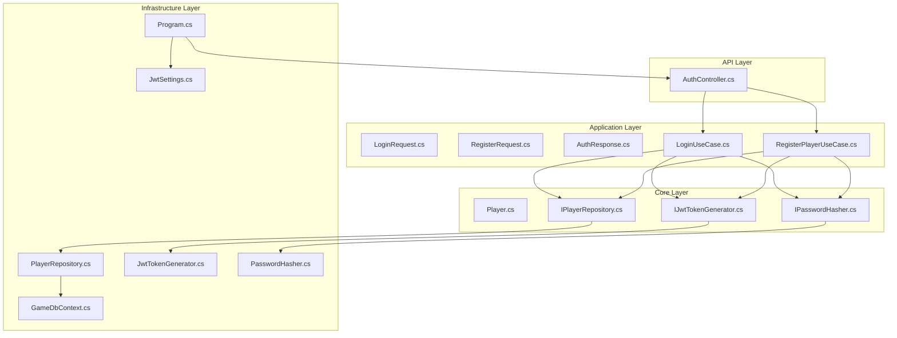
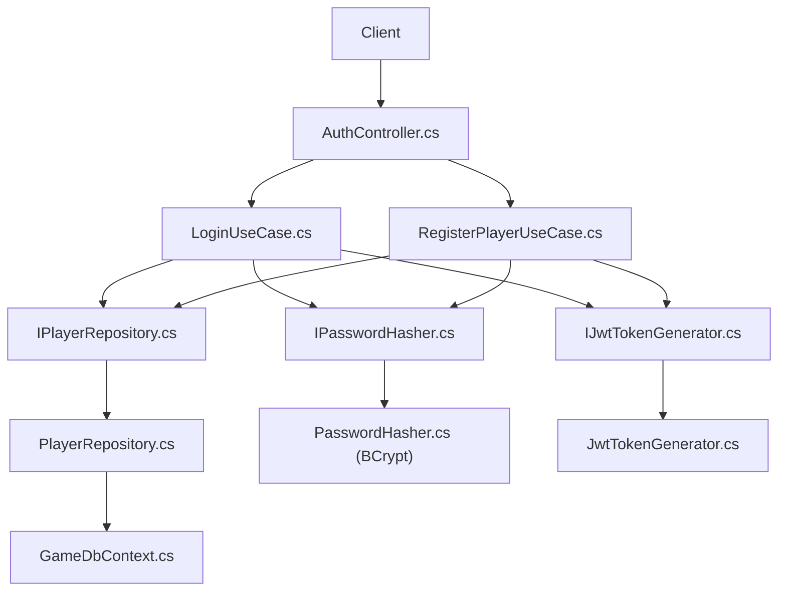
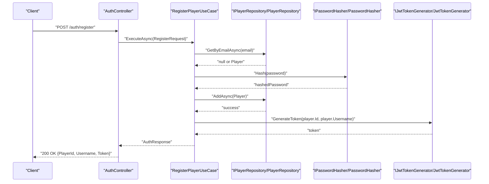
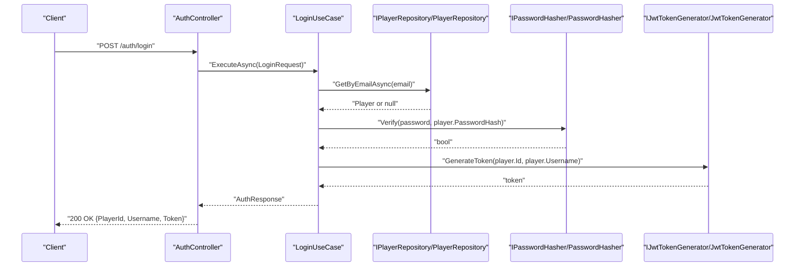
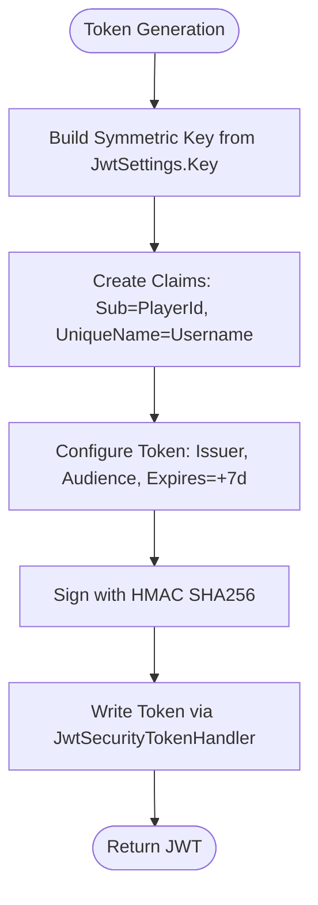
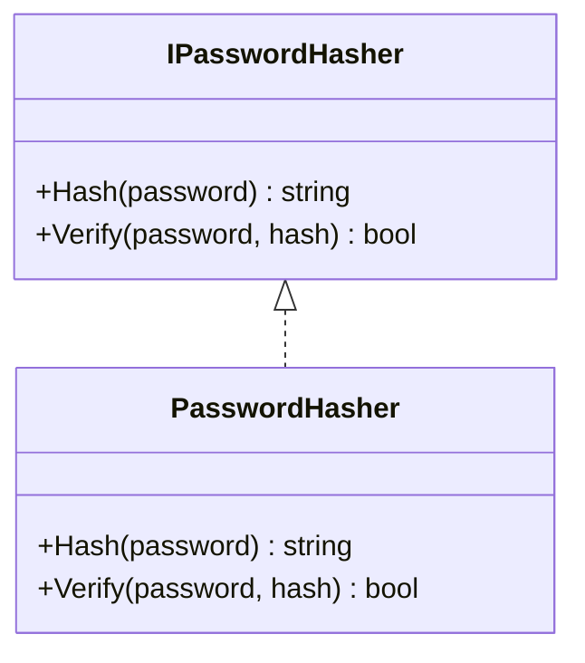
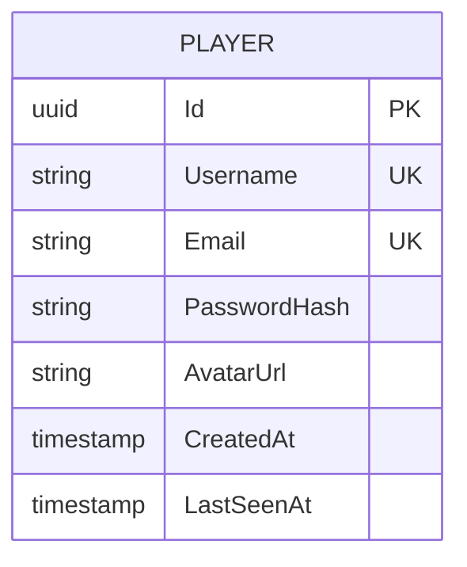
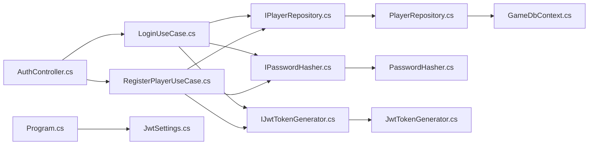

# Authentication System

<cite>
**Referenced Files in This Document**
- [AuthController.cs](file://GameBackend.API/Controllers/AuthController.cs)
- [Program.cs](file://GameBackend.API/Program.cs)
- [LoginRequest.cs](file://GameBackend.Application/Contracts/Auth/LoginRequest.cs)
- [RegisterRequest.cs](file://GameBackend.Application/Contracts/Auth/RegisterRequest.cs)
- [AuthResponse.cs](file://GameBackend.Application/Contracts/Auth/AuthResponse.cs)
- [LoginUseCase.cs](file://GameBackend.Application/Contracts/UseCases/Auth/LoginUseCase.cs)
- [RegisterPlayerUseCase.cs](file://GameBackend.Application/Contracts/UseCases/Auth/RegisterPlayerUseCase.cs)
- [Player.cs](file://GameBackend.Core/Entities/Player.cs)
- [IPlayerRepository.cs](file://GameBackend.Core/Interfaces/IPlayerRepository.cs)
- [PlayerRepository.cs](file://GameBackend.Infrastructure/Repositories/PlayerRepository.cs)
- [IJwtTokenGenerator.cs](file://GameBackend.Core/Interfaces/IJwtTokenGenerator.cs)
- [IPasswordHasher.cs](file://GameBackend.Core/Interfaces/IPasswordHasher.cs)
- [JwtTokenGenerator.cs](file://GameBackend.Infrastructure/Security/JwtTokenGenerator.cs)
- [PasswordHasher.cs](file://GameBackend.Infrastructure/Security/PasswordHasher.cs)
- [JwtSettings.cs](file://GameBackend.Infrastructure/Security/JwtSettings.cs)
- [GameDbContext.cs](file://GameBackend.Infrastructure/Persistence/GameDbContext.cs)
</cite>

## Table of Contents
1. [Introduction](#introduction)
2. [Project Structure](#project-structure)
3. [Core Components](#core-components)
4. [Architecture Overview](#architecture-overview)
5. [Detailed Component Analysis](#detailed-component-analysis)
6. [Dependency Analysis](#dependency-analysis)
7. [Performance Considerations](#performance-considerations)
8. [Troubleshooting Guide](#troubleshooting-guide)
9. [Conclusion](#conclusion)

## Introduction
This document describes the authentication system for the GameBackend project. It covers the complete authentication workflow for user registration and login, the JWT token-based authentication mechanism, password hashing with BCrypt, and credential validation. It also documents request/response contracts, use case implementations, middleware configuration, and security considerations. Practical examples of authentication flows, error handling, and integration patterns are included, along with best practices for token expiration and protection against common authentication vulnerabilities.

## Project Structure
The authentication system spans four layers:
- API presentation layer: HTTP endpoints and controller orchestration
- Application layer: use cases and request/response contracts
- Core domain layer: entities and interfaces
- Infrastructure layer: persistence, security utilities, and DI configuration

**Diagram sources**
- [AuthController.cs:1-49](file://GameBackend.API/Controllers/AuthController.cs#L1-L49)
- [LoginUseCase.cs:1-45](file://GameBackend.Application/Contracts/UseCases/Auth/LoginUseCase.cs#L1-L45)
- [RegisterPlayerUseCase.cs:1-58](file://GameBackend.Application/Contracts/UseCases/Auth/RegisterPlayerUseCase.cs#L1-L58)
- [PlayerRepository.cs:1-34](file://GameBackend.Infrastructure/Repositories/PlayerRepository.cs#L1-L34)
- [JwtTokenGenerator.cs:1-44](file://GameBackend.Infrastructure/Security/JwtTokenGenerator.cs#L1-L44)
- [PasswordHasher.cs:1-16](file://GameBackend.Infrastructure/Security/PasswordHasher.cs#L1-L16)
- [JwtSettings.cs:1-8](file://GameBackend.Infrastructure/Security/JwtSettings.cs#L1-L8)
- [GameDbContext.cs:1-28](file://GameBackend.Infrastructure/Persistence/GameDbContext.cs#L1-L28)
- [Program.cs:1-72](file://GameBackend.API/Program.cs#L1-L72)

**Section sources**
- [AuthController.cs:1-49](file://GameBackend.API/Controllers/AuthController.cs#L1-L49)
- [Program.cs:1-72](file://GameBackend.API/Program.cs#L1-L72)

## Core Components
- AuthController: Exposes HTTP endpoints for registration and login, delegates to use cases, and handles exceptions.
- Use Cases: Encapsulate business logic for registration and login, including validation, persistence, hashing, and token generation.
- Contracts: Define request/response DTOs for authentication operations.
- Domain Model: Player entity stores identity and credentials.
- Repositories: Data access abstraction and implementation using Entity Framework.
- Security Services: Password hashing with BCrypt and JWT token generation/validation.
- Configuration: JWT settings and ASP.NET Core authentication pipeline.

**Section sources**
- [AuthController.cs:1-49](file://GameBackend.API/Controllers/AuthController.cs#L1-L49)
- [LoginUseCase.cs:1-45](file://GameBackend.Application/Contracts/UseCases/Auth/LoginUseCase.cs#L1-L45)
- [RegisterPlayerUseCase.cs:1-58](file://GameBackend.Application/Contracts/UseCases/Auth/RegisterPlayerUseCase.cs#L1-L58)
- [LoginRequest.cs:1-7](file://GameBackend.Application/Contracts/Auth/LoginRequest.cs#L1-L7)
- [RegisterRequest.cs:1-8](file://GameBackend.Application/Contracts/Auth/RegisterRequest.cs#L1-L8)
- [AuthResponse.cs:1-8](file://GameBackend.Application/Contracts/Auth/AuthResponse.cs#L1-L8)
- [Player.cs:1-13](file://GameBackend.Core/Entities/Player.cs#L1-L13)
- [IPlayerRepository.cs:1-10](file://GameBackend.Core/Interfaces/IPlayerRepository.cs#L1-L10)
- [PlayerRepository.cs:1-34](file://GameBackend.Infrastructure/Repositories/PlayerRepository.cs#L1-L34)
- [IJwtTokenGenerator.cs:1-6](file://GameBackend.Core/Interfaces/IJwtTokenGenerator.cs#L1-L6)
- [IPasswordHasher.cs:1-7](file://GameBackend.Core/Interfaces/IPasswordHasher.cs#L1-L7)
- [JwtTokenGenerator.cs:1-44](file://GameBackend.Infrastructure/Security/JwtTokenGenerator.cs#L1-L44)
- [PasswordHasher.cs:1-16](file://GameBackend.Infrastructure/Security/PasswordHasher.cs#L1-L16)
- [JwtSettings.cs:1-8](file://GameBackend.Infrastructure/Security/JwtSettings.cs#L1-L8)
- [GameDbContext.cs:1-28](file://GameBackend.Infrastructure/Persistence/GameDbContext.cs#L1-L28)
- [Program.cs:1-72](file://GameBackend.API/Program.cs#L1-L72)

## Architecture Overview
The authentication architecture follows clean architecture principles:
- API layer depends on application contracts and use cases.
- Application layer depends on core interfaces and domain entities.
- Infrastructure implements core interfaces and integrates with EF Core and JWT libraries.
- DI container wires up repositories, security services, and JWT configuration.

**Diagram sources**
- [AuthController.cs:1-49](file://GameBackend.API/Controllers/AuthController.cs#L1-L49)
- [LoginUseCase.cs:1-45](file://GameBackend.Application/Contracts/UseCases/Auth/LoginUseCase.cs#L1-L45)
- [RegisterPlayerUseCase.cs:1-58](file://GameBackend.Application/Contracts/UseCases/Auth/RegisterPlayerUseCase.cs#L1-L58)
- [IPlayerRepository.cs:1-10](file://GameBackend.Core/Interfaces/IPlayerRepository.cs#L1-L10)
- [PlayerRepository.cs:1-34](file://GameBackend.Infrastructure/Repositories/PlayerRepository.cs#L1-L34)
- [GameDbContext.cs:1-28](file://GameBackend.Infrastructure/Persistence/GameDbContext.cs#L1-L28)
- [IPasswordHasher.cs:1-7](file://GameBackend.Core/Interfaces/IPasswordHasher.cs#L1-L7)
- [PasswordHasher.cs:1-16](file://GameBackend.Infrastructure/Security/PasswordHasher.cs#L1-L16)
- [IJwtTokenGenerator.cs:1-6](file://GameBackend.Core/Interfaces/IJwtTokenGenerator.cs#L1-L6)
- [JwtTokenGenerator.cs:1-44](file://GameBackend.Infrastructure/Security/JwtTokenGenerator.cs#L1-L44)

## Detailed Component Analysis

### Authentication Endpoints and Controller
- Registration endpoint POST /auth/register accepts RegisterRequest and returns AuthResponse.
- Login endpoint POST /auth/login accepts LoginRequest and returns AuthResponse.
- Exceptions are caught and mapped to HTTP responses:
  - Registration: catches exceptions and responds with 400 Bad Request containing an error message.
  - Login: catches exceptions and responds with 401 Unauthorized containing an error message.

**Diagram sources**
- [AuthController.cs:22-34](file://GameBackend.API/Controllers/AuthController.cs#L22-L34)
- [RegisterPlayerUseCase.cs:23-57](file://GameBackend.Application/Contracts/UseCases/Auth/RegisterPlayerUseCase.cs#L23-L57)
- [IPlayerRepository.cs:7-10](file://GameBackend.Core/Interfaces/IPlayerRepository.cs#L7-L10)
- [PlayerRepository.cs:17-33](file://GameBackend.Infrastructure/Repositories/PlayerRepository.cs#L17-L33)
- [IPasswordHasher.cs:5-6](file://GameBackend.Core/Interfaces/IPasswordHasher.cs#L5-L6)
- [PasswordHasher.cs:7-10](file://GameBackend.Infrastructure/Security/PasswordHasher.cs#L7-L10)
- [IJwtTokenGenerator.cs:5](file://GameBackend.Core/Interfaces/IJwtTokenGenerator.cs#L5)
- [JwtTokenGenerator.cs:20-43](file://GameBackend.Infrastructure/Security/JwtTokenGenerator.cs#L20-L43)

**Section sources**
- [AuthController.cs:22-34](file://GameBackend.API/Controllers/AuthController.cs#L22-L34)
- [RegisterPlayerUseCase.cs:23-57](file://GameBackend.Application/Contracts/UseCases/Auth/RegisterPlayerUseCase.cs#L23-L57)
- [PlayerRepository.cs:17-33](file://GameBackend.Infrastructure/Repositories/PlayerRepository.cs#L17-L33)
- [PasswordHasher.cs:7-10](file://GameBackend.Infrastructure/Security/PasswordHasher.cs#L7-L10)
- [JwtTokenGenerator.cs:20-43](file://GameBackend.Infrastructure/Security/JwtTokenGenerator.cs#L20-L43)

### Login Use Case
- Retrieves player by email.
- Verifies password using BCrypt.
- Generates JWT token with claims and expiration.
- Returns AuthResponse with PlayerId, Username, and Token.

**Diagram sources**
- [AuthController.cs:36-48](file://GameBackend.API/Controllers/AuthController.cs#L36-L48)
- [LoginUseCase.cs:22-44](file://GameBackend.Application/Contracts/UseCases/Auth/LoginUseCase.cs#L22-L44)
- [IPlayerRepository.cs:7](file://GameBackend.Core/Interfaces/IPlayerRepository.cs#L7)
- [PlayerRepository.cs:17-21](file://GameBackend.Infrastructure/Repositories/PlayerRepository.cs#L17-L21)
- [IPasswordHasher.cs:5-7](file://GameBackend.Core/Interfaces/IPasswordHasher.cs#L5-L7)
- [PasswordHasher.cs:12-15](file://GameBackend.Infrastructure/Security/PasswordHasher.cs#L12-L15)
- [IJwtTokenGenerator.cs:5](file://GameBackend.Core/Interfaces/IJwtTokenGenerator.cs#L5)
- [JwtTokenGenerator.cs:20-43](file://GameBackend.Infrastructure/Security/JwtTokenGenerator.cs#L20-L43)

**Section sources**
- [LoginUseCase.cs:22-44](file://GameBackend.Application/Contracts/UseCases/Auth/LoginUseCase.cs#L22-L44)
- [PasswordHasher.cs:12-15](file://GameBackend.Infrastructure/Security/PasswordHasher.cs#L12-L15)
- [JwtTokenGenerator.cs:20-43](file://GameBackend.Infrastructure/Security/JwtTokenGenerator.cs#L20-L43)

### JWT Token Generation and Validation
- Token generation includes issuer, audience, HMAC signature, and 7-day expiration.
- Authentication middleware validates issuer, audience, signing key, and lifetime.

**Diagram sources**
- [JwtTokenGenerator.cs:20-43](file://GameBackend.Infrastructure/Security/JwtTokenGenerator.cs#L20-L43)
- [JwtSettings.cs:5-7](file://GameBackend.Infrastructure/Security/JwtSettings.cs#L5-L7)
- [Program.cs:32-50](file://GameBackend.API/Program.cs#L32-L50)

**Section sources**
- [JwtTokenGenerator.cs:20-43](file://GameBackend.Infrastructure/Security/JwtTokenGenerator.cs#L20-L43)
- [Program.cs:32-50](file://GameBackend.API/Program.cs#L32-L50)

### Password Hashing with BCrypt
- Hashing uses BCrypt.Net library.
- Verification compares provided password against stored hash.

**Diagram sources**
- [IPasswordHasher.cs:3-7](file://GameBackend.Core/Interfaces/IPasswordHasher.cs#L3-L7)
- [PasswordHasher.cs:5-16](file://GameBackend.Infrastructure/Security/PasswordHasher.cs#L5-L16)

**Section sources**
- [PasswordHasher.cs:7-15](file://GameBackend.Infrastructure/Security/PasswordHasher.cs#L7-L15)
- [IPasswordHasher.cs:5-7](file://GameBackend.Core/Interfaces/IPasswordHasher.cs#L5-L7)

### Data Model and Persistence
- Player entity holds identity and credentials.
- EF Core model configures unique indexes for Email and Username.

**Diagram sources**
- [Player.cs:3-13](file://GameBackend.Core/Entities/Player.cs#L3-L13)
- [GameDbContext.cs:19-26](file://GameBackend.Infrastructure/Persistence/GameDbContext.cs#L19-L26)

**Section sources**
- [Player.cs:3-13](file://GameBackend.Core/Entities/Player.cs#L3-L13)
- [GameDbContext.cs:19-26](file://GameBackend.Infrastructure/Persistence/GameDbContext.cs#L19-L26)

### Request and Response Contracts
- RegisterRequest: Username, Email, Password
- LoginRequest: Email, Password
- AuthResponse: PlayerId, Username, Token

These contracts define the shape of authentication requests and responses across the API and application layers.

**Section sources**
- [RegisterRequest.cs:3-8](file://GameBackend.Application/Contracts/Auth/RegisterRequest.cs#L3-L8)
- [LoginRequest.cs:3-7](file://GameBackend.Application/Contracts/Auth/LoginRequest.cs#L3-L7)
- [AuthResponse.cs:3-8](file://GameBackend.Application/Contracts/Auth/AuthResponse.cs#L3-L8)

## Dependency Analysis
The system exhibits clean separation of concerns:
- API depends on application use cases.
- Application depends on core interfaces and domain entities.
- Infrastructure implements core interfaces and integrates with external libraries and EF Core.
- DI registers repositories, security services, and JWT configuration.

**Diagram sources**
- [AuthController.cs:1-49](file://GameBackend.API/Controllers/AuthController.cs#L1-L49)
- [LoginUseCase.cs:1-45](file://GameBackend.Application/Contracts/UseCases/Auth/LoginUseCase.cs#L1-L45)
- [RegisterPlayerUseCase.cs:1-58](file://GameBackend.Application/Contracts/UseCases/Auth/RegisterPlayerUseCase.cs#L1-L58)
- [IPlayerRepository.cs:1-10](file://GameBackend.Core/Interfaces/IPlayerRepository.cs#L1-L10)
- [PlayerRepository.cs:1-34](file://GameBackend.Infrastructure/Repositories/PlayerRepository.cs#L1-L34)
- [GameDbContext.cs:1-28](file://GameBackend.Infrastructure/Persistence/GameDbContext.cs#L1-L28)
- [IPasswordHasher.cs:1-7](file://GameBackend.Core/Interfaces/IPasswordHasher.cs#L1-L7)
- [PasswordHasher.cs:1-16](file://GameBackend.Infrastructure/Security/PasswordHasher.cs#L1-L16)
- [IJwtTokenGenerator.cs:1-6](file://GameBackend.Core/Interfaces/IJwtTokenGenerator.cs#L1-L6)
- [JwtTokenGenerator.cs:1-44](file://GameBackend.Infrastructure/Security/JwtTokenGenerator.cs#L1-L44)
- [JwtSettings.cs:1-8](file://GameBackend.Infrastructure/Security/JwtSettings.cs#L1-L8)
- [Program.cs:1-72](file://GameBackend.API/Program.cs#L1-L72)

**Section sources**
- [Program.cs:13-24](file://GameBackend.API/Program.cs#L13-L24)
- [IPlayerRepository.cs:5-10](file://GameBackend.Core/Interfaces/IPlayerRepository.cs#L5-L10)
- [PlayerRepository.cs:8-34](file://GameBackend.Infrastructure/Repositories/PlayerRepository.cs#L8-L34)

## Performance Considerations
- Password hashing with BCrypt is computationally intensive; avoid excessive re-hashing and cache tokens where appropriate.
- Database queries for email/username lookups rely on unique indexes; ensure proper indexing and connection pooling.
- JWT token generation is lightweight; keep payload minimal to reduce overhead.
- Consider asynchronous patterns throughout the stack to prevent thread blocking.

## Troubleshooting Guide
Common issues and resolutions:
- Registration fails with user already exists:
  - Cause: Duplicate email detected during pre-registration check.
  - Resolution: Prompt user to log in or change email.
- Login fails with invalid credentials:
  - Cause: Nonexistent email or incorrect password.
  - Resolution: Provide generic error messaging; avoid leaking account existence.
- Unauthorized on protected routes:
  - Cause: Missing or invalid JWT in Authorization header.
  - Resolution: Ensure client sends bearer token; verify token issuer/audience/signing key configuration.
- Token validation errors:
  - Cause: Expired token, wrong issuer/audience, or tampered token.
  - Resolution: Regenerate token; confirm server-side JWT settings match client expectations.

Operational checks:
- Confirm JWT settings are loaded from configuration and applied to authentication middleware.
- Verify database connectivity and unique index constraints for Email and Username.
- Ensure HTTPS is enabled to protect tokens in transit.

**Section sources**
- [RegisterPlayerUseCase.cs:25-28](file://GameBackend.Application/Contracts/UseCases/Auth/RegisterPlayerUseCase.cs#L25-L28)
- [LoginUseCase.cs:24-32](file://GameBackend.Application/Contracts/UseCases/Auth/LoginUseCase.cs#L24-L32)
- [Program.cs:32-50](file://GameBackend.API/Program.cs#L32-L50)
- [GameDbContext.cs:22-23](file://GameBackend.Infrastructure/Persistence/GameDbContext.cs#L22-L23)

## Conclusion
The GameBackend authentication system implements a secure, layered approach using JWT for sessionless authentication, BCrypt for robust password hashing, and clean architecture boundaries. The controller endpoints delegate to use cases that encapsulate business logic, while infrastructure services handle persistence and cryptographic operations. Proper configuration of the authentication middleware ensures tokens are validated consistently. Following the best practices outlined here will help maintain a resilient and secure authentication flow.