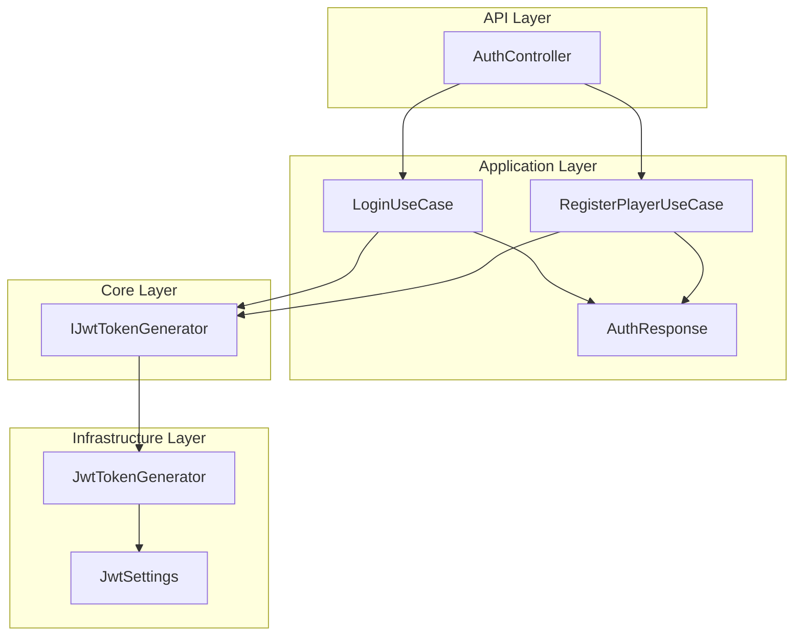
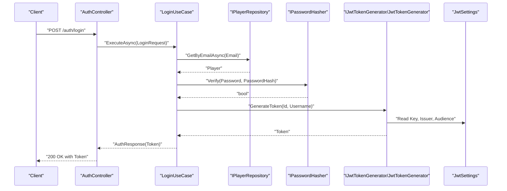
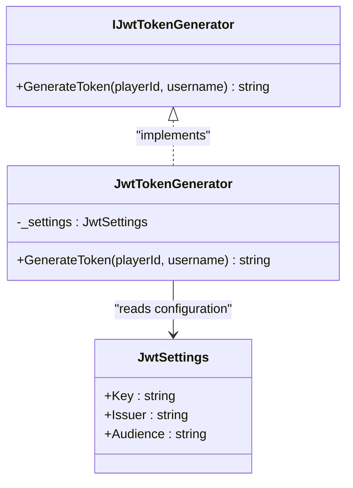
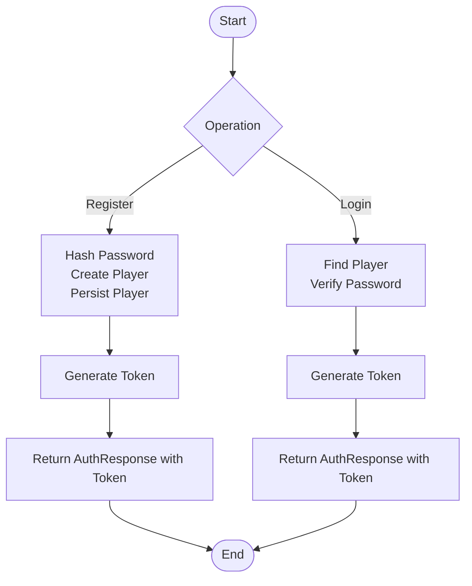
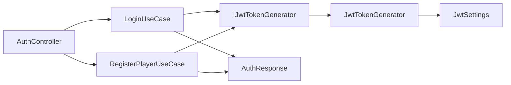

# JWT Token Management

<cite>
**Referenced Files in This Document**
- [IJwtTokenGenerator.cs](file://GameBackend.Core/Interfaces/IJwtTokenGenerator.cs)
- [JwtSettings.cs](file://GameBackend.Infrastructure/Security/JwtSettings.cs)
- [JwtTokenGenerator.cs](file://GameBackend.Infrastructure/Security/JwtTokenGenerator.cs)
- [AuthController.cs](file://GameBackend.API/Controllers/AuthController.cs)
- [LoginUseCase.cs](file://GameBackend.Application/Contracts/UseCases/Auth/LoginUseCase.cs)
- [RegisterPlayerUseCase.cs](file://GameBackend.Application/Contracts/UseCases/Auth/RegisterPlayerUseCase.cs)
- [AuthResponse.cs](file://GameBackend.Application/Contracts/Auth/AuthResponse.cs)
- [LoginRequest.cs](file://GameBackend.Application/Contracts/Auth/LoginRequest.cs)
- [RegisterRequest.cs](file://GameBackend.Application/Contracts/Auth/RegisterRequest.cs)
- [appsettings.json](file://GameBackend.API/appsettings.json)
</cite>

## Table of Contents
1. [Introduction](#introduction)
2. [Project Structure](#project-structure)
3. [Core Components](#core-components)
4. [Architecture Overview](#architecture-overview)
5. [Detailed Component Analysis](#detailed-component-analysis)
6. [Dependency Analysis](#dependency-analysis)
7. [Performance Considerations](#performance-considerations)
8. [Troubleshooting Guide](#troubleshooting-guide)
9. [Conclusion](#conclusion)

## Introduction
This document explains the JWT token management system in the GameBackend project. It covers the token generation process, configuration settings, security implementation, and integration with authentication workflows. It also provides guidance on token expiration policies, security best practices, refresh strategies, adding custom claims, and troubleshooting common JWT-related issues.

## Project Structure
The JWT implementation spans three layers:
- Core: Defines the token generator interface used by application use cases.
- Infrastructure: Implements the token generator and holds configuration settings.
- Application: Orchestrates authentication flows and integrates the token generator.
- API: Exposes authentication endpoints that return tokens.

**Diagram sources**
- [AuthController.cs:1-49](file://GameBackend.API/Controllers/AuthController.cs#L1-L49)
- [LoginUseCase.cs:1-45](file://GameBackend.Application/Contracts/UseCases/Auth/LoginUseCase.cs#L1-L45)
- [RegisterPlayerUseCase.cs:1-58](file://GameBackend.Application/Contracts/UseCases/Auth/RegisterPlayerUseCase.cs#L1-L58)
- [IJwtTokenGenerator.cs:1-6](file://GameBackend.Core/Interfaces/IJwtTokenGenerator.cs#L1-L6)
- [JwtTokenGenerator.cs:1-44](file://GameBackend.Infrastructure/Security/JwtTokenGenerator.cs#L1-L44)
- [JwtSettings.cs:1-8](file://GameBackend.Infrastructure/Security/JwtSettings.cs#L1-L8)
- [AuthResponse.cs:1-8](file://GameBackend.Application/Contracts/Auth/AuthResponse.cs#L1-L8)

**Section sources**
- [AuthController.cs:1-49](file://GameBackend.API/Controllers/AuthController.cs#L1-L49)
- [LoginUseCase.cs:1-45](file://GameBackend.Application/Contracts/UseCases/Auth/LoginUseCase.cs#L1-L45)
- [RegisterPlayerUseCase.cs:1-58](file://GameBackend.Application/Contracts/UseCases/Auth/RegisterPlayerUseCase.cs#L1-L58)
- [IJwtTokenGenerator.cs:1-6](file://GameBackend.Core/Interfaces/IJwtTokenGenerator.cs#L1-L6)
- [JwtTokenGenerator.cs:1-44](file://GameBackend.Infrastructure/Security/JwtTokenGenerator.cs#L1-L44)
- [JwtSettings.cs:1-8](file://GameBackend.Infrastructure/Security/JwtSettings.cs#L1-L8)
- [AuthResponse.cs:1-8](file://GameBackend.Application/Contracts/Auth/AuthResponse.cs#L1-L8)

## Core Components
- JwtTokenGenerator: Implements token generation using HMAC SHA-256 with symmetric key, configured via JwtSettings. It produces a signed JWT with subject and unique name claims and sets an expiration of seven days from now.
- JwtSettings: Holds the secret key, issuer, and audience used during token generation.
- IJwtTokenGenerator: Interface that abstracts token generation for use in application use cases.
- AuthController: Exposes authentication endpoints that trigger use cases returning tokens.
- LoginUseCase and RegisterPlayerUseCase: Execute authentication logic and delegate token creation to the token generator.
- AuthResponse: DTO returned by authentication operations containing the generated token.

Practical examples of token creation and configuration are demonstrated below.

**Section sources**
- [JwtTokenGenerator.cs:20-43](file://GameBackend.Infrastructure/Security/JwtTokenGenerator.cs#L20-L43)
- [JwtSettings.cs:3-8](file://GameBackend.Infrastructure/Security/JwtSettings.cs#L3-L8)
- [IJwtTokenGenerator.cs:3-6](file://GameBackend.Core/Interfaces/IJwtTokenGenerator.cs#L3-L6)
- [AuthController.cs:22-48](file://GameBackend.API/Controllers/AuthController.cs#L22-L48)
- [LoginUseCase.cs:22-44](file://GameBackend.Application/Contracts/UseCases/Auth/LoginUseCase.cs#L22-L44)
- [RegisterPlayerUseCase.cs:23-57](file://GameBackend.Application/Contracts/UseCases/Auth/RegisterPlayerUseCase.cs#L23-L57)
- [AuthResponse.cs:3-8](file://GameBackend.Application/Contracts/Auth/AuthResponse.cs#L3-L8)

## Architecture Overview
The authentication flow integrates the API, application, core, and infrastructure layers to produce a JWT upon successful login or registration.

**Diagram sources**
- [AuthController.cs:36-48](file://GameBackend.API/Controllers/AuthController.cs#L36-L48)
- [LoginUseCase.cs:22-44](file://GameBackend.Application/Contracts/UseCases/Auth/LoginUseCase.cs#L22-L44)
- [JwtTokenGenerator.cs:20-43](file://GameBackend.Infrastructure/Security/JwtTokenGenerator.cs#L20-L43)
- [JwtSettings.cs:3-8](file://GameBackend.Infrastructure/Security/JwtSettings.cs#L3-L8)

## Detailed Component Analysis

### JwtTokenGenerator Implementation
- Purpose: Produces a signed JWT with HMAC SHA-256 using a symmetric key.
- Claims: Includes subject (player identifier) and unique name (username).
- Expiration: Seven days from current UTC time.
- Signing: Uses the configured key, issuer, and audience.

**Diagram sources**
- [IJwtTokenGenerator.cs:3-6](file://GameBackend.Core/Interfaces/IJwtTokenGenerator.cs#L3-L6)
- [JwtTokenGenerator.cs:11-43](file://GameBackend.Infrastructure/Security/JwtTokenGenerator.cs#L11-L43)
- [JwtSettings.cs:3-8](file://GameBackend.Infrastructure/Security/JwtSettings.cs#L3-L8)

**Section sources**
- [JwtTokenGenerator.cs:11-43](file://GameBackend.Infrastructure/Security/JwtTokenGenerator.cs#L11-L43)
- [JwtSettings.cs:3-8](file://GameBackend.Infrastructure/Security/JwtSettings.cs#L3-L8)

### JwtSettings Configuration Options
- Key: Secret key for HMAC signing.
- Issuer: Issuer value embedded in the token.
- Audience: Audience value embedded in the token.

These values are loaded from configuration and injected into the token generator.

**Section sources**
- [JwtSettings.cs:3-8](file://GameBackend.Infrastructure/Security/JwtSettings.cs#L3-L8)
- [appsettings.json:9-13](file://GameBackend.API/appsettings.json#L9-L13)

### Authentication Workflows and Token Delivery
- Registration: Hashes the password, persists the player, generates a token, and returns an AuthResponse containing the token.
- Login: Validates credentials, generates a token, and returns an AuthResponse containing the token.

**Diagram sources**
- [RegisterPlayerUseCase.cs:23-57](file://GameBackend.Application/Contracts/UseCases/Auth/RegisterPlayerUseCase.cs#L23-L57)
- [LoginUseCase.cs:22-44](file://GameBackend.Application/Contracts/UseCases/Auth/LoginUseCase.cs#L22-L44)
- [AuthResponse.cs:3-8](file://GameBackend.Application/Contracts/Auth/AuthResponse.cs#L3-L8)

**Section sources**
- [RegisterPlayerUseCase.cs:23-57](file://GameBackend.Application/Contracts/UseCases/Auth/RegisterPlayerUseCase.cs#L23-L57)
- [LoginUseCase.cs:22-44](file://GameBackend.Application/Contracts/UseCases/Auth/LoginUseCase.cs#L22-L44)
- [AuthResponse.cs:3-8](file://GameBackend.Application/Contracts/Auth/AuthResponse.cs#L3-L8)

### Token Validation Mechanisms
- Current implementation: The token generator does not include validation logic in the provided files. Validation would typically occur in middleware or filters that verify signature, issuer, audience, and expiration before allowing protected routes.
- Recommended approach: Add ASP.NET Core authentication middleware configured with the same key, issuer, and audience to validate incoming tokens.

[No sources needed since this section provides general guidance]

### Practical Examples

- Example: Generating a token after successful login
  - Steps: Retrieve player by email, verify password, call token generator with player identifier and username, return AuthResponse with token.
  - Reference: [LoginUseCase.cs:22-44](file://GameBackend.Application/Contracts/UseCases/Auth/LoginUseCase.cs#L22-L44), [JwtTokenGenerator.cs:20-43](file://GameBackend.Infrastructure/Security/JwtTokenGenerator.cs#L20-L43)

- Example: Generating a token after successful registration
  - Steps: Hash password, create player entity, persist player, call token generator with new player identifier and username, return AuthResponse with token.
  - Reference: [RegisterPlayerUseCase.cs:23-57](file://GameBackend.Application/Contracts/UseCases/Auth/RegisterPlayerUseCase.cs#L23-L57), [JwtTokenGenerator.cs:20-43](file://GameBackend.Infrastructure/Security/JwtTokenGenerator.cs#L20-L43)

- Example: Configuration parameters
  - Configure Jwt.Key, Jwt.Issuer, and Jwt.Audience in appsettings.
  - Reference: [appsettings.json:9-13](file://GameBackend.API/appsettings.json#L9-L13)

**Section sources**
- [LoginUseCase.cs:22-44](file://GameBackend.Application/Contracts/UseCases/Auth/LoginUseCase.cs#L22-L44)
- [RegisterPlayerUseCase.cs:23-57](file://GameBackend.Application/Contracts/UseCases/Auth/RegisterPlayerUseCase.cs#L23-L57)
- [JwtTokenGenerator.cs:20-43](file://GameBackend.Infrastructure/Security/JwtTokenGenerator.cs#L20-L43)
- [appsettings.json:9-13](file://GameBackend.API/appsettings.json#L9-L13)

## Dependency Analysis
- AuthController depends on application use cases for authentication operations.
- Use cases depend on IJwtTokenGenerator to produce tokens.
- JwtTokenGenerator depends on JwtSettings for cryptographic material and token metadata.
- AuthResponse carries the token to the client.

**Diagram sources**
- [AuthController.cs:14-20](file://GameBackend.API/Controllers/AuthController.cs#L14-L20)
- [LoginUseCase.cs:12-20](file://GameBackend.Application/Contracts/UseCases/Auth/LoginUseCase.cs#L12-L20)
- [RegisterPlayerUseCase.cs:13-21](file://GameBackend.Application/Contracts/UseCases/Auth/RegisterPlayerUseCase.cs#L13-L21)
- [IJwtTokenGenerator.cs:3-6](file://GameBackend.Core/Interfaces/IJwtTokenGenerator.cs#L3-L6)
- [JwtTokenGenerator.cs:13-18](file://GameBackend.Infrastructure/Security/JwtTokenGenerator.cs#L13-L18)
- [JwtSettings.cs:3-8](file://GameBackend.Infrastructure/Security/JwtSettings.cs#L3-L8)
- [AuthResponse.cs:3-8](file://GameBackend.Application/Contracts/Auth/AuthResponse.cs#L3-L8)

**Section sources**
- [AuthController.cs:14-20](file://GameBackend.API/Controllers/AuthController.cs#L14-L20)
- [LoginUseCase.cs:12-20](file://GameBackend.Application/Contracts/UseCases/Auth/LoginUseCase.cs#L12-L20)
- [RegisterPlayerUseCase.cs:13-21](file://GameBackend.Application/Contracts/UseCases/Auth/RegisterPlayerUseCase.cs#L13-L21)
- [IJwtTokenGenerator.cs:3-6](file://GameBackend.Core/Interfaces/IJwtTokenGenerator.cs#L3-L6)
- [JwtTokenGenerator.cs:13-18](file://GameBackend.Infrastructure/Security/JwtTokenGenerator.cs#L13-L18)
- [JwtSettings.cs:3-8](file://GameBackend.Infrastructure/Security/JwtSettings.cs#L3-L8)
- [AuthResponse.cs:3-8](file://GameBackend.Application/Contracts/Auth/AuthResponse.cs#L3-L8)

## Performance Considerations
- Token generation cost: Minimal overhead; HMAC SHA-256 is fast and suitable for typical request rates.
- Expiration policy: Tokens expire in seven days. Consider shorter expirations for higher security and refresh tokens for seamless sessions.
- Storage: Keep JwtSettings in secure configuration stores; avoid embedding secrets in code.
- Network: Transmit tokens over HTTPS/TLS to prevent interception.

[No sources needed since this section provides general guidance]

## Troubleshooting Guide
- Invalid credentials errors during login: Thrown when user is not found or password verification fails.
  - Reference: [LoginUseCase.cs:24-32](file://GameBackend.Application/Contracts/UseCases/Auth/LoginUseCase.cs#L24-L32)

- User already exists during registration: Thrown when attempting to register an email that is already registered.
  - Reference: [RegisterPlayerUseCase.cs:26-28](file://GameBackend.Application/Contracts/UseCases/Auth/RegisterPlayerUseCase.cs#L26-L28)

- Token not accepted by downstream services: Ensure issuer, audience, and key match the server’s configuration.
  - References: [JwtSettings.cs:3-8](file://GameBackend.Infrastructure/Security/JwtSettings.cs#L3-L8), [appsettings.json:9-13](file://GameBackend.API/appsettings.json#L9-L13)

- Token validation failures: Add ASP.NET Core authentication middleware configured with the same key, issuer, and audience to validate tokens on protected endpoints.

**Section sources**
- [LoginUseCase.cs:24-32](file://GameBackend.Application/Contracts/UseCases/Auth/LoginUseCase.cs#L24-L32)
- [RegisterPlayerUseCase.cs:26-28](file://GameBackend.Application/Contracts/UseCases/Auth/RegisterPlayerUseCase.cs#L26-L28)
- [JwtSettings.cs:3-8](file://GameBackend.Infrastructure/Security/JwtSettings.cs#L3-L8)
- [appsettings.json:9-13](file://GameBackend.API/appsettings.json#L9-L13)

## Conclusion
The JWT token management system in GameBackend provides a clean separation of concerns: the core defines the token generation contract, the infrastructure implements it with configurable settings, and the application orchestrates authentication flows around it. The current implementation focuses on generating signed tokens with a fixed expiration and minimal claims. To harden the system, integrate robust token validation middleware, adopt short-lived access tokens with refresh tokens, and apply security best practices for key management and transport encryption.