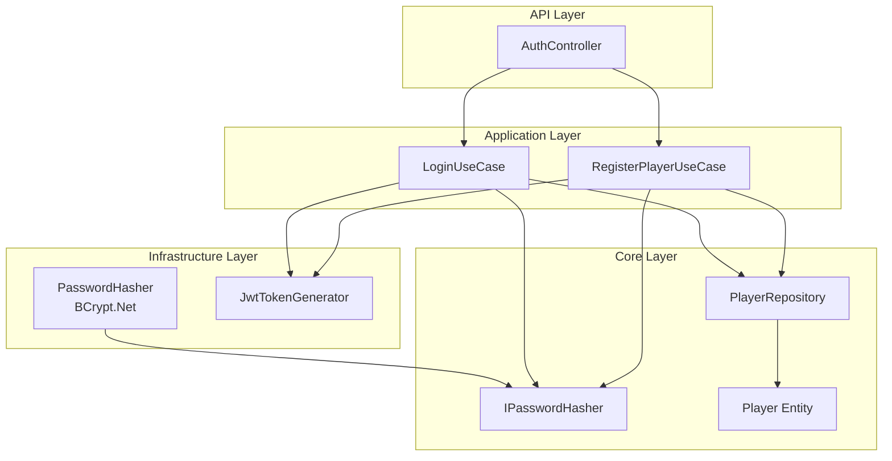
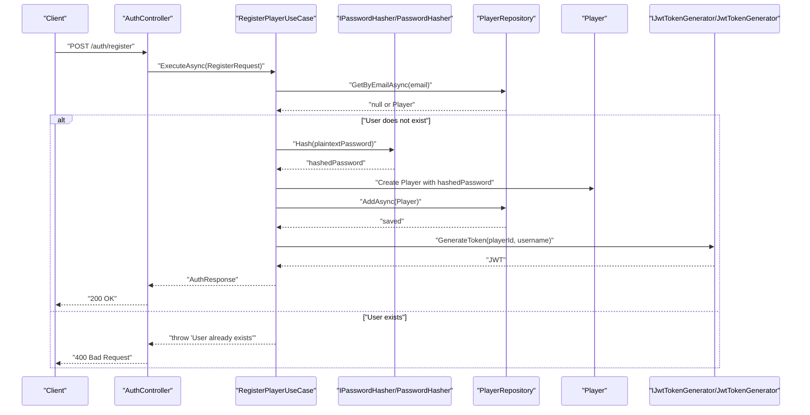
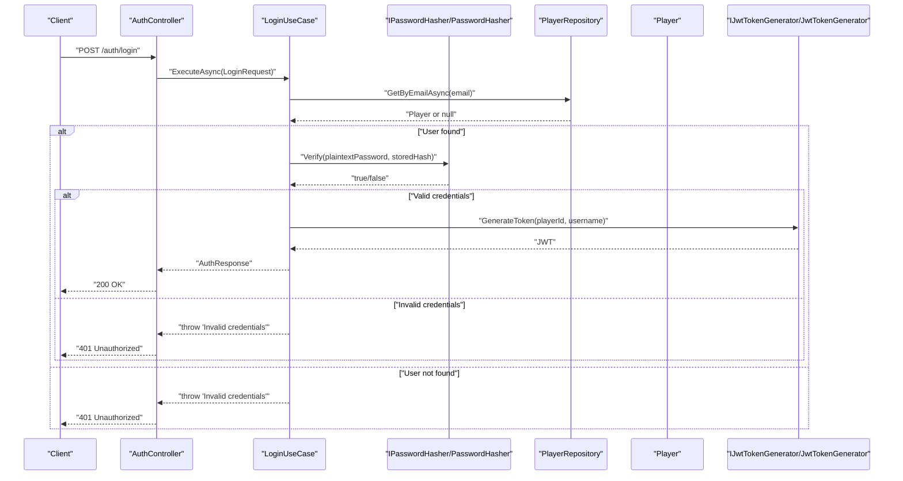
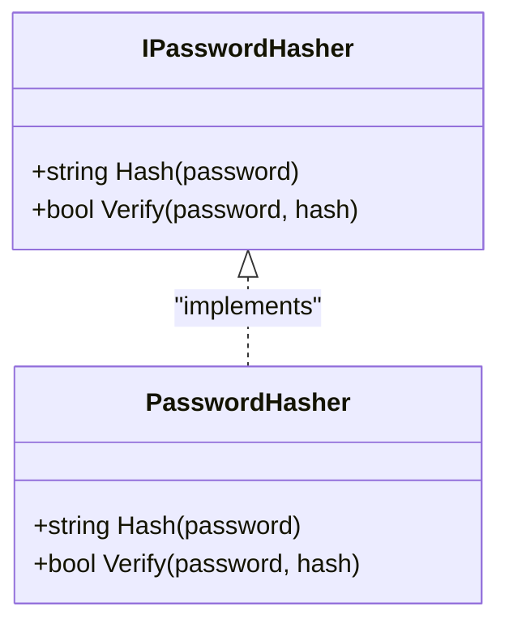
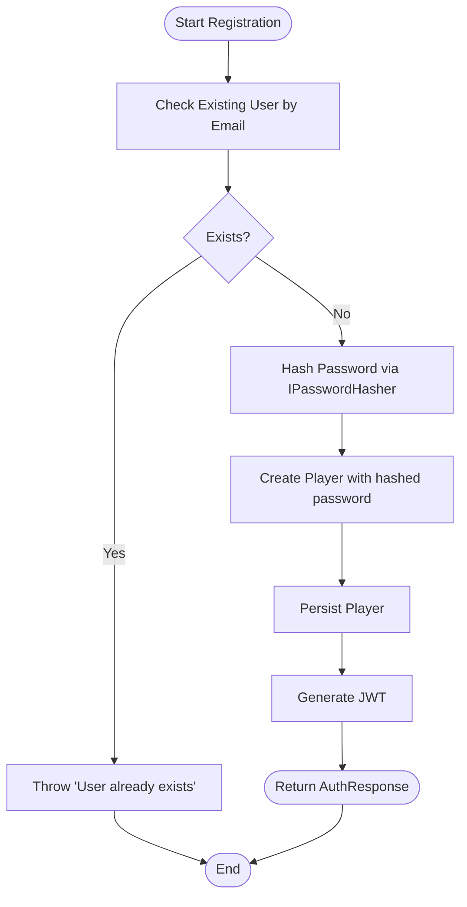
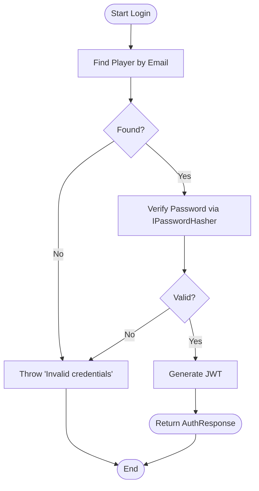
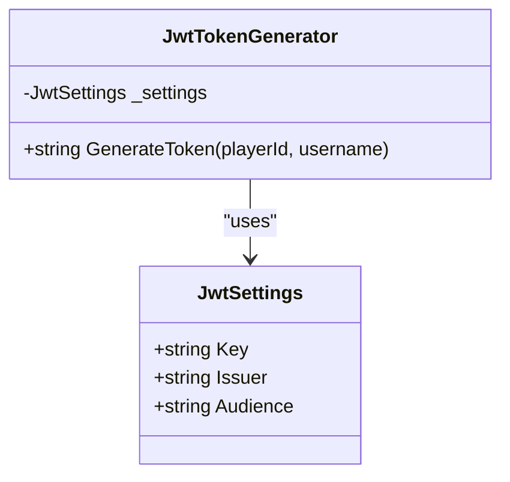
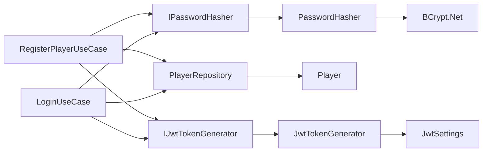

# Password Security

<cite>
**Referenced Files in This Document**
- [IPasswordHasher.cs](file://GameBackend.Core/Interfaces/IPasswordHasher.cs)
- [PasswordHasher.cs](file://GameBackend.Infrastructure/Security/PasswordHasher.cs)
- [RegisterPlayerUseCase.cs](file://GameBackend.Application/Contracts/UseCases/Auth/RegisterPlayerUseCase.cs)
- [LoginUseCase.cs](file://GameBackend.Application/Contracts/UseCases/Auth/LoginUseCase.cs)
- [AuthController.cs](file://GameBackend.API/Controllers/AuthController.cs)
- [Player.cs](file://GameBackend.Core/Entities/Player.cs)
- [PlayerRepository.cs](file://GameBackend.Infrastructure/Repositories/PlayerRepository.cs)
- [IJwtTokenGenerator.cs](file://GameBackend.Core/Interfaces/IJwtTokenGenerator.cs)
- [JwtTokenGenerator.cs](file://GameBackend.Infrastructure/Security/JwtTokenGenerator.cs)
- [JwtSettings.cs](file://GameBackend.Infrastructure/Security/JwtSettings.cs)
- [appsettings.json](file://GameBackend.API/appsettings.json)
</cite>

## Table of Contents
1. [Introduction](#introduction)
2. [Project Structure](#project-structure)
3. [Core Components](#core-components)
4. [Architecture Overview](#architecture-overview)
5. [Detailed Component Analysis](#detailed-component-analysis)
6. [Dependency Analysis](#dependency-analysis)
7. [Performance Considerations](#performance-considerations)
8. [Troubleshooting Guide](#troubleshooting-guide)
9. [Conclusion](#conclusion)
10. [Appendices](#appendices)

## Introduction
This document explains the password security implementation in the project, focusing on BCrypt-based password hashing, the IPasswordHasher interface and its PasswordHasher implementation, and the end-to-end flows for registration and login. It covers salt generation, cost factors, performance characteristics, and best practices for secure password storage. It also provides practical examples, security guidelines, compliance considerations, policy enforcement, migration strategies, and troubleshooting advice.

## Project Structure
The password security stack spans three layers:
- Application layer: Use cases orchestrate registration and login flows and depend on IPasswordHasher and IJwtTokenGenerator.
- Infrastructure layer: PasswordHasher implements BCrypt-based hashing and verification; JwtTokenGenerator creates signed JWTs.
- Core layer: Entities and repositories persist and retrieve user records; IPasswordHasher defines the hashing contract.

**Diagram sources**
- [AuthController.cs:1-49](file://GameBackend.API/Controllers/AuthController.cs#L1-L49)
- [RegisterPlayerUseCase.cs:1-58](file://GameBackend.Application/Contracts/UseCases/Auth/RegisterPlayerUseCase.cs#L1-L58)
- [LoginUseCase.cs:1-45](file://GameBackend.Application/Contracts/UseCases/Auth/LoginUseCase.cs#L1-L45)
- [PasswordHasher.cs:1-16](file://GameBackend.Infrastructure/Security/PasswordHasher.cs#L1-L16)
- [JwtTokenGenerator.cs:1-44](file://GameBackend.Infrastructure/Security/JwtTokenGenerator.cs#L1-L44)
- [Player.cs:1-13](file://GameBackend.Core/Entities/Player.cs#L1-L13)
- [PlayerRepository.cs:1-34](file://GameBackend.Infrastructure/Repositories/PlayerRepository.cs#L1-L34)
- [IPasswordHasher.cs:1-7](file://GameBackend.Core/Interfaces/IPasswordHasher.cs#L1-L7)

**Section sources**
- [AuthController.cs:1-49](file://GameBackend.API/Controllers/AuthController.cs#L1-L49)
- [RegisterPlayerUseCase.cs:1-58](file://GameBackend.Application/Contracts/UseCases/Auth/RegisterPlayerUseCase.cs#L1-L58)
- [LoginUseCase.cs:1-45](file://GameBackend.Application/Contracts/UseCases/Auth/LoginUseCase.cs#L1-L45)
- [PasswordHasher.cs:1-16](file://GameBackend.Infrastructure/Security/PasswordHasher.cs#L1-L16)
- [JwtTokenGenerator.cs:1-44](file://GameBackend.Infrastructure/Security/JwtTokenGenerator.cs#L1-L44)
- [Player.cs:1-13](file://GameBackend.Core/Entities/Player.cs#L1-L13)
- [PlayerRepository.cs:1-34](file://GameBackend.Infrastructure/Repositories/PlayerRepository.cs#L1-L34)
- [IPasswordHasher.cs:1-7](file://GameBackend.Core/Interfaces/IPasswordHasher.cs#L1-L7)

## Core Components
- IPasswordHasher: Defines two operations—Hash and Verify—to encapsulate password hashing and verification logic.
- PasswordHasher: Implements IPasswordHasher using BCrypt.Net, providing automatic salt generation and robust verification.
- RegisterPlayerUseCase: Hashes the plaintext password before creating a Player record and storing the hash.
- LoginUseCase: Retrieves the stored hash and verifies the provided password against it.
- Player: Persists the hashed password alongside user metadata.
- PlayerRepository: Provides persistence operations for Player entities.
- IJwtTokenGenerator and JwtTokenGenerator: Produce signed JWTs after successful authentication.

Key security properties:
- BCrypt automatically manages salts and includes a work factor (cost) that controls computational cost.
- The PasswordHasher delegates hashing and verification to BCrypt.Net, ensuring industry-grade defaults.

Practical examples (paths only):
- Registration hashing: [RegisterPlayerUseCase.cs:30-31](file://GameBackend.Application/Contracts/UseCases/Auth/RegisterPlayerUseCase.cs#L30-L31)
- Login verification: [LoginUseCase.cs:29-32](file://GameBackend.Application/Contracts/UseCases/Auth/LoginUseCase.cs#L29-L32)
- Hashing implementation: [PasswordHasher.cs:7-15](file://GameBackend.Infrastructure/Security/PasswordHasher.cs#L7-L15)

**Section sources**
- [IPasswordHasher.cs:1-7](file://GameBackend.Core/Interfaces/IPasswordHasher.cs#L1-L7)
- [PasswordHasher.cs:1-16](file://GameBackend.Infrastructure/Security/PasswordHasher.cs#L1-L16)
- [RegisterPlayerUseCase.cs:1-58](file://GameBackend.Application/Contracts/UseCases/Auth/RegisterPlayerUseCase.cs#L1-L58)
- [LoginUseCase.cs:1-45](file://GameBackend.Application/Contracts/UseCases/Auth/LoginUseCase.cs#L1-L45)
- [Player.cs:1-13](file://GameBackend.Core/Entities/Player.cs#L1-L13)
- [PlayerRepository.cs:1-34](file://GameBackend.Infrastructure/Repositories/PlayerRepository.cs#L1-L34)

## Architecture Overview
The authentication pipeline integrates hashing, persistence, and token generation:

**Diagram sources**
- [AuthController.cs:22-34](file://GameBackend.API/Controllers/AuthController.cs#L22-L34)
- [RegisterPlayerUseCase.cs:23-57](file://GameBackend.Application/Contracts/UseCases/Auth/RegisterPlayerUseCase.cs#L23-L57)
- [PasswordHasher.cs:7-10](file://GameBackend.Infrastructure/Security/PasswordHasher.cs#L7-L10)
- [PlayerRepository.cs:17-33](file://GameBackend.Infrastructure/Repositories/PlayerRepository.cs#L17-L33)
- [Player.cs:3-12](file://GameBackend.Core/Entities/Player.cs#L3-L12)
- [IJwtTokenGenerator.cs:1-6](file://GameBackend.Core/Interfaces/IJwtTokenGenerator.cs#L1-L6)
- [JwtTokenGenerator.cs:20-43](file://GameBackend.Infrastructure/Security/JwtTokenGenerator.cs#L20-L43)

**Diagram sources**
- [AuthController.cs:36-48](file://GameBackend.API/Controllers/AuthController.cs#L36-L48)
- [LoginUseCase.cs:22-44](file://GameBackend.Application/Contracts/UseCases/Auth/LoginUseCase.cs#L22-L44)
- [PasswordHasher.cs:12-15](file://GameBackend.Infrastructure/Security/PasswordHasher.cs#L12-L15)
- [PlayerRepository.cs:17-21](file://GameBackend.Infrastructure/Repositories/PlayerRepository.cs#L17-L21)
- [IJwtTokenGenerator.cs:1-6](file://GameBackend.Core/Interfaces/IJwtTokenGenerator.cs#L1-L6)
- [JwtTokenGenerator.cs:20-43](file://GameBackend.Infrastructure/Security/JwtTokenGenerator.cs#L20-L43)

## Detailed Component Analysis

### IPasswordHasher and PasswordHasher
- Purpose: Encapsulate password hashing and verification behind a simple interface.
- Implementation: Delegates to BCrypt.Net for hashing and verification.
- Behavior:
  - Hash: Produces a BCrypt-compatible hash including salt and cost parameters.
  - Verify: Compares a plaintext password against a stored hash using BCrypt’s built-in logic.

**Diagram sources**
- [IPasswordHasher.cs:1-7](file://GameBackend.Core/Interfaces/IPasswordHasher.cs#L1-L7)
- [PasswordHasher.cs:1-16](file://GameBackend.Infrastructure/Security/PasswordHasher.cs#L1-L16)

**Section sources**
- [IPasswordHasher.cs:1-7](file://GameBackend.Core/Interfaces/IPasswordHasher.cs#L1-L7)
- [PasswordHasher.cs:1-16](file://GameBackend.Infrastructure/Security/PasswordHasher.cs#L1-L16)

### Registration Flow and Storage
- Steps:
  1. Check for existing user by email.
  2. Hash the plaintext password via IPasswordHasher.
  3. Create a Player entity with the hashed password.
  4. Persist the Player.
  5. Generate a JWT token.
  6. Return an AuthResponse.

**Diagram sources**
- [RegisterPlayerUseCase.cs:23-57](file://GameBackend.Application/Contracts/UseCases/Auth/RegisterPlayerUseCase.cs#L23-L57)
- [PasswordHasher.cs:7-10](file://GameBackend.Infrastructure/Security/PasswordHasher.cs#L7-L10)
- [Player.cs:3-12](file://GameBackend.Core/Entities/Player.cs#L3-L12)
- [PlayerRepository.cs:29-33](file://GameBackend.Infrastructure/Repositories/PlayerRepository.cs#L29-L33)

**Section sources**
- [RegisterPlayerUseCase.cs:1-58](file://GameBackend.Application/Contracts/UseCases/Auth/RegisterPlayerUseCase.cs#L1-L58)
- [Player.cs:1-13](file://GameBackend.Core/Entities/Player.cs#L1-L13)
- [PlayerRepository.cs:1-34](file://GameBackend.Infrastructure/Repositories/PlayerRepository.cs#L1-L34)

### Login Flow and Verification
- Steps:
  1. Retrieve the Player by email.
  2. Verify the plaintext password against the stored hash.
  3. On success, generate a JWT token.
  4. Return an AuthResponse.

**Diagram sources**
- [LoginUseCase.cs:22-44](file://GameBackend.Application/Contracts/UseCases/Auth/LoginUseCase.cs#L22-L44)
- [PasswordHasher.cs:12-15](file://GameBackend.Infrastructure/Security/PasswordHasher.cs#L12-L15)
- [PlayerRepository.cs:17-21](file://GameBackend.Infrastructure/Repositories/PlayerRepository.cs#L17-L21)
- [IJwtTokenGenerator.cs:1-6](file://GameBackend.Core/Interfaces/IJwtTokenGenerator.cs#L1-L6)
- [JwtTokenGenerator.cs:20-43](file://GameBackend.Infrastructure/Security/JwtTokenGenerator.cs#L20-L43)

**Section sources**
- [LoginUseCase.cs:1-45](file://GameBackend.Application/Contracts/UseCases/Auth/LoginUseCase.cs#L1-L45)

### JWT Configuration and Token Generation
- JwtSettings holds issuer, audience, and symmetric key.
- JwtTokenGenerator signs tokens using HMAC SHA-256 with the configured key.
- Tokens are valid for seven days.

**Diagram sources**
- [JwtSettings.cs:1-8](file://GameBackend.Infrastructure/Security/JwtSettings.cs#L1-L8)
- [JwtTokenGenerator.cs:1-44](file://GameBackend.Infrastructure/Security/JwtTokenGenerator.cs#L1-L44)
- [appsettings.json:9-13](file://GameBackend.API/appsettings.json#L9-L13)

**Section sources**
- [JwtSettings.cs:1-8](file://GameBackend.Infrastructure/Security/JwtSettings.cs#L1-L8)
- [JwtTokenGenerator.cs:1-44](file://GameBackend.Infrastructure/Security/JwtTokenGenerator.cs#L1-L44)
- [appsettings.json:1-17](file://GameBackend.API/appsettings.json#L1-L17)

## Dependency Analysis
- Coupling:
  - Use cases depend on abstractions (IPasswordHasher, IJwtTokenGenerator) and repositories.
  - PasswordHasher depends on BCrypt.Net.
  - JwtTokenGenerator depends on configuration and cryptographic primitives.
- Cohesion:
  - Hashing and verification logic is centralized in PasswordHasher.
  - Token generation is centralized in JwtTokenGenerator.
- External dependencies:
  - BCrypt.Net for hashing and verification.
  - Microsoft IdentityModel.Tokens and System.IdentityModel.Tokens.Jwt for JWT creation.

**Diagram sources**
- [RegisterPlayerUseCase.cs:1-58](file://GameBackend.Application/Contracts/UseCases/Auth/RegisterPlayerUseCase.cs#L1-L58)
- [LoginUseCase.cs:1-45](file://GameBackend.Application/Contracts/UseCases/Auth/LoginUseCase.cs#L1-L45)
- [IPasswordHasher.cs:1-7](file://GameBackend.Core/Interfaces/IPasswordHasher.cs#L1-L7)
- [PasswordHasher.cs:1-16](file://GameBackend.Infrastructure/Security/PasswordHasher.cs#L1-L16)
- [PlayerRepository.cs:1-34](file://GameBackend.Infrastructure/Repositories/PlayerRepository.cs#L1-L34)
- [Player.cs:1-13](file://GameBackend.Core/Entities/Player.cs#L1-L13)
- [IJwtTokenGenerator.cs:1-6](file://GameBackend.Core/Interfaces/IJwtTokenGenerator.cs#L1-L6)
- [JwtTokenGenerator.cs:1-44](file://GameBackend.Infrastructure/Security/JwtTokenGenerator.cs#L1-L44)
- [JwtSettings.cs:1-8](file://GameBackend.Infrastructure/Security/JwtSettings.cs#L1-L8)

**Section sources**
- [RegisterPlayerUseCase.cs:1-58](file://GameBackend.Application/Contracts/UseCases/Auth/RegisterPlayerUseCase.cs#L1-L58)
- [LoginUseCase.cs:1-45](file://GameBackend.Application/Contracts/UseCases/Auth/LoginUseCase.cs#L1-L45)
- [PasswordHasher.cs:1-16](file://GameBackend.Infrastructure/Security/PasswordHasher.cs#L1-L16)
- [JwtTokenGenerator.cs:1-44](file://GameBackend.Infrastructure/Security/JwtTokenGenerator.cs#L1-L44)

## Performance Considerations
- BCrypt cost factor: The current implementation uses BCrypt.Net defaults. To tune performance:
  - Increase computational cost on powerful servers to slow down brute-force attempts.
  - Monitor login latency; adjust cost to balance security and user experience.
- Hashing overhead:
  - Hashing occurs once per registration and verification on each login.
  - Consider caching verified sessions or tokens to reduce repeated verification costs.
- Database load:
  - Indexes on Email and Username improve lookup performance.
- Asynchronous operations:
  - All repository operations are asynchronous; keep the call chain asynchronous to avoid thread blocking.

[No sources needed since this section provides general guidance]

## Troubleshooting Guide
Common issues and resolutions:
- Invalid credentials on login:
  - Cause: Incorrect password or mismatched hash.
  - Resolution: Ensure the same plaintext password is passed to Verify; confirm the stored hash is unchanged.
  - References: [LoginUseCase.cs:29-32](file://GameBackend.Application/Contracts/UseCases/Auth/LoginUseCase.cs#L29-L32), [PasswordHasher.cs:12-15](file://GameBackend.Infrastructure/Security/PasswordHasher.cs#L12-L15)
- User already exists during registration:
  - Cause: Duplicate email detected.
  - Resolution: Prompt the user to log in or reset their password.
  - References: [RegisterPlayerUseCase.cs:25-28](file://GameBackend.Application/Contracts/UseCases/Auth/RegisterPlayerUseCase.cs#L25-L28)
- Unauthorized responses:
  - Cause: Authentication failure or missing/invalid token.
  - Resolution: Confirm token generation and client-side handling.
  - References: [AuthController.cs:36-48](file://GameBackend.API/Controllers/AuthController.cs#L36-L48), [JwtTokenGenerator.cs:20-43](file://GameBackend.Infrastructure/Security/JwtTokenGenerator.cs#L20-L43)
- Configuration errors:
  - Cause: Missing or invalid JWT key/issuer/audience.
  - Resolution: Validate appsettings and ensure secrets are properly loaded.
  - References: [appsettings.json:9-13](file://GameBackend.API/appsettings.json#L9-L13), [JwtSettings.cs:1-8](file://GameBackend.Infrastructure/Security/JwtSettings.cs#L1-L8)

**Section sources**
- [LoginUseCase.cs:1-45](file://GameBackend.Application/Contracts/UseCases/Auth/LoginUseCase.cs#L1-L45)
- [RegisterPlayerUseCase.cs:1-58](file://GameBackend.Application/Contracts/UseCases/Auth/RegisterPlayerUseCase.cs#L1-L58)
- [AuthController.cs:1-49](file://GameBackend.API/Controllers/AuthController.cs#L1-L49)
- [JwtTokenGenerator.cs:1-44](file://GameBackend.Infrastructure/Security/JwtTokenGenerator.cs#L1-L44)
- [appsettings.json:1-17](file://GameBackend.API/appsettings.json#L1-L17)

## Conclusion
The project implements robust password security using BCrypt.Net via a clean abstraction (IPasswordHasher) and a straightforward PasswordHasher implementation. Registration and login flows securely handle hashing and verification, while JWT-based authentication ensures protected session tokens. By tuning BCrypt cost factors, maintaining strong configuration, and enforcing policies, the system meets modern security expectations.

[No sources needed since this section summarizes without analyzing specific files]

## Appendices

### Security Guidelines and Best Practices
- Use BCrypt with an appropriately high cost factor for your environment.
- Never store plaintext passwords; only store hashes.
- Protect against rainbow table attacks by relying on BCrypt’s integrated salt and cost.
- Enforce strong password policies at the application boundary (length, character sets, history).
- Rotate secrets regularly and restrict access to JWT keys.
- Apply rate limiting and account lockout mechanisms to mitigate brute-force attempts.
- Audit and monitor authentication events.

[No sources needed since this section provides general guidance]

### Compliance Considerations
- Align hashing and tokenization with organizational security standards.
- Ensure secret management and key rotation procedures are followed.
- Validate that tokens are transmitted over HTTPS/TLS only.

[No sources needed since this section provides general guidance]

### Practical Examples (Paths Only)
- Registration hashing: [RegisterPlayerUseCase.cs:30-31](file://GameBackend.Application/Contracts/UseCases/Auth/RegisterPlayerUseCase.cs#L30-L31)
- Login verification: [LoginUseCase.cs:29-32](file://GameBackend.Application/Contracts/UseCases/Auth/LoginUseCase.cs#L29-L32)
- Hashing implementation: [PasswordHasher.cs:7-15](file://GameBackend.Infrastructure/Security/PasswordHasher.cs#L7-L15)

### Password Policy Enforcement
- Enforce minimum length and complexity before calling the hashing layer.
- Reject weak or commonly used passwords.
- Optionally enforce periodic password changes and reuse restrictions.

[No sources needed since this section provides general guidance]

### Migration Strategies for Existing Users
- Batch process existing plaintext or weakly hashed passwords by re-hashing with BCrypt.
- Store migrated hashes alongside a flag indicating migration status.
- Serve traffic during migration by accepting both legacy and new hashes until completion.

[No sources needed since this section provides general guidance]