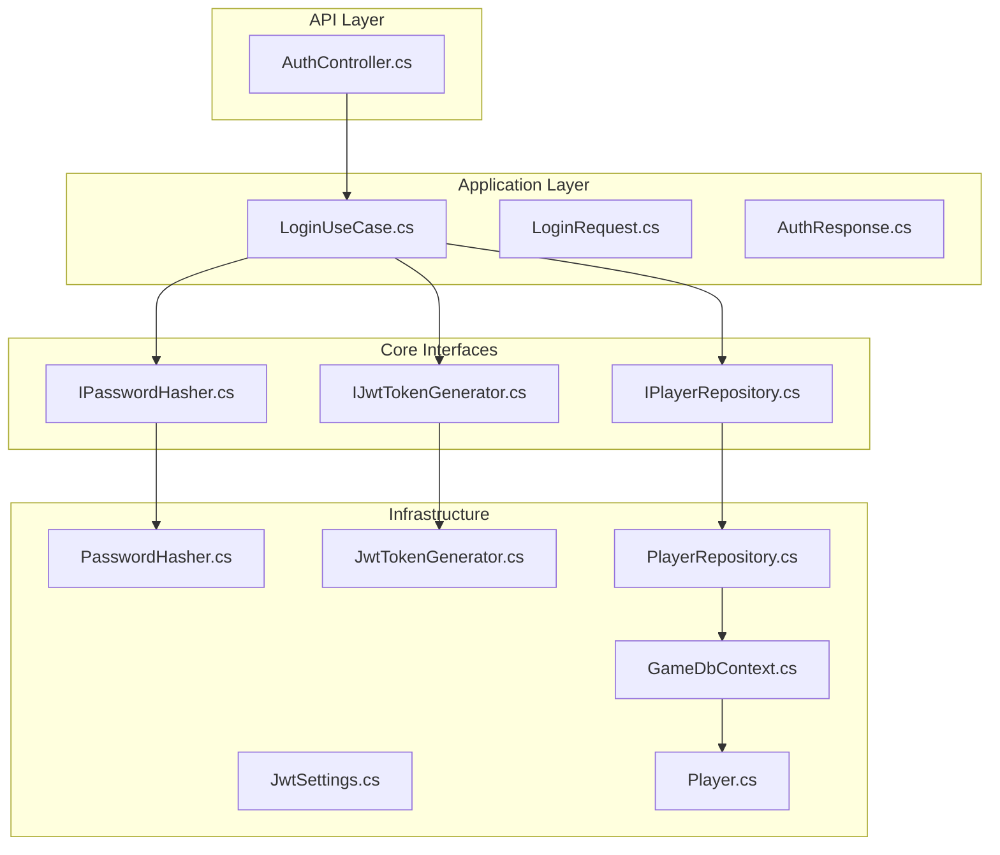
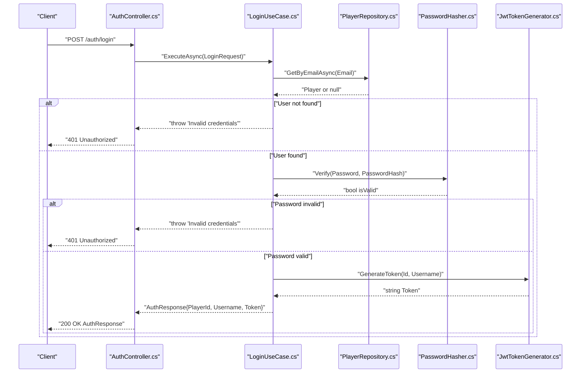
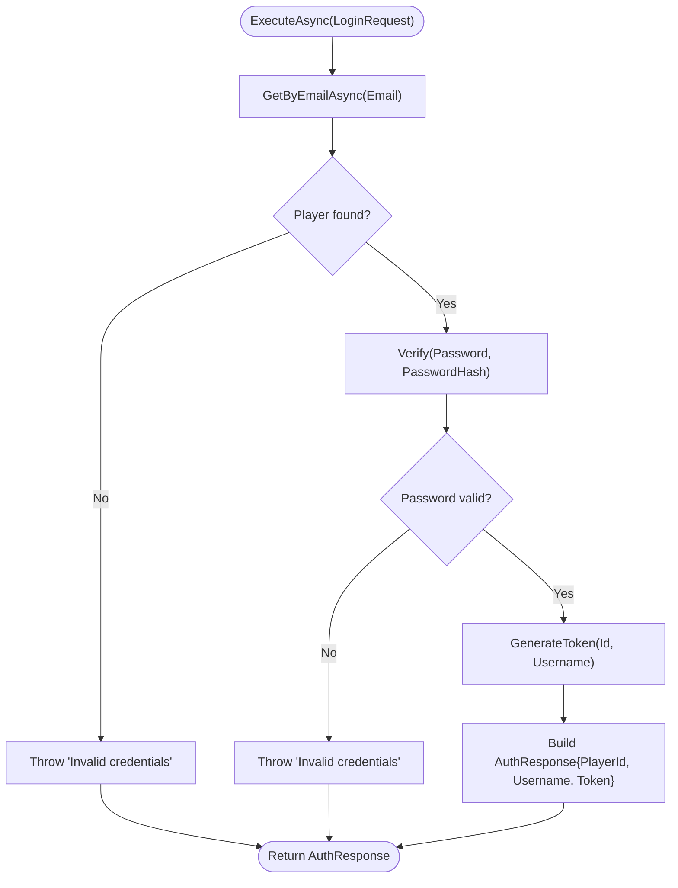
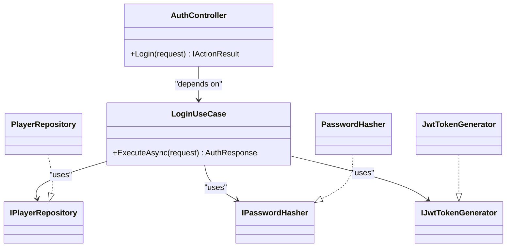

# User Login

<cite>
**Referenced Files in This Document**
- [AuthController.cs](file://GameBackend.API/Controllers/AuthController.cs)
- [LoginUseCase.cs](file://GameBackend.Application/Contracts/UseCases/Auth/LoginUseCase.cs)
- [LoginRequest.cs](file://GameBackend.Application/Contracts/Auth/LoginRequest.cs)
- [AuthResponse.cs](file://GameBackend.Application/Contracts/Auth/AuthResponse.cs)
- [IPasswordHasher.cs](file://GameBackend.Core/Interfaces/IPasswordHasher.cs)
- [IJwtTokenGenerator.cs](file://GameBackend.Core/Interfaces/IJwtTokenGenerator.cs)
- [PasswordHasher.cs](file://GameBackend.Infrastructure/Security/PasswordHasher.cs)
- [JwtTokenGenerator.cs](file://GameBackend.Infrastructure/Security/JwtTokenGenerator.cs)
- [JwtSettings.cs](file://GameBackend.Infrastructure/Security/JwtSettings.cs)
- [PlayerRepository.cs](file://GameBackend.Infrastructure/Repositories/PlayerRepository.cs)
- [IPlayerRepository.cs](file://GameBackend.Core/Interfaces/IPlayerRepository.cs)
- [Player.cs](file://GameBackend.Core/Entities/Player.cs)
- [GameDbContext.cs](file://GameBackend.Infrastructure/Persistence/GameDbContext.cs)
</cite>

## Table of Contents
1. [Introduction](#introduction)
2. [Project Structure](#project-structure)
3. [Core Components](#core-components)
4. [Architecture Overview](#architecture-overview)
5. [Detailed Component Analysis](#detailed-component-analysis)
6. [Dependency Analysis](#dependency-analysis)
7. [Performance Considerations](#performance-considerations)
8. [Troubleshooting Guide](#troubleshooting-guide)
9. [Conclusion](#conclusion)
10. [Appendices](#appendices)

## Introduction
This document explains the complete user authentication login workflow in the system. It covers how login requests are validated, how credentials are verified against stored hashed passwords, how JWT tokens are generated, and how responses are formatted. It also documents the LoginUseCase implementation, the LoginRequest contract, and the AuthResponse format. Practical examples of request and response structures are included, along with security considerations, brute-force protections, troubleshooting steps, and best practices.

## Project Structure
The authentication flow spans three layers:
- API layer: HTTP endpoint receives login requests and delegates to application use cases.
- Application layer: Use cases orchestrate business logic and coordinate repositories and infrastructure services.
- Infrastructure layer: Implements hashing, token generation, and persistence.

**Diagram sources**
- [AuthController.cs:36-48](file://GameBackend.API/Controllers/AuthController.cs#L36-L48)
- [LoginUseCase.cs:22-44](file://GameBackend.Application/Contracts/UseCases/Auth/LoginUseCase.cs#L22-L44)
- [LoginRequest.cs:3-7](file://GameBackend.Application/Contracts/Auth/LoginRequest.cs#L3-L7)
- [AuthResponse.cs:3-8](file://GameBackend.Application/Contracts/Auth/AuthResponse.cs#L3-L8)
- [IPasswordHasher.cs:3-7](file://GameBackend.Core/Interfaces/IPasswordHasher.cs#L3-L7)
- [IJwtTokenGenerator.cs:3-6](file://GameBackend.Core/Interfaces/IJwtTokenGenerator.cs#L3-L6)
- [IPlayerRepository.cs:5-10](file://GameBackend.Core/Interfaces/IPlayerRepository.cs#L5-L10)
- [PasswordHasher.cs:5-16](file://GameBackend.Infrastructure/Security/PasswordHasher.cs#L5-L16)
- [JwtTokenGenerator.cs:11-44](file://GameBackend.Infrastructure/Security/JwtTokenGenerator.cs#L11-L44)
- [JwtSettings.cs:3-8](file://GameBackend.Infrastructure/Security/JwtSettings.cs#L3-L8)
- [PlayerRepository.cs:8-34](file://GameBackend.Infrastructure/Repositories/PlayerRepository.cs#L8-L34)
- [Player.cs:3-13](file://GameBackend.Core/Entities/Player.cs#L3-L13)
- [GameDbContext.cs:6-28](file://GameBackend.Infrastructure/Persistence/GameDbContext.cs#L6-L28)

**Section sources**
- [AuthController.cs:1-49](file://GameBackend.API/Controllers/AuthController.cs#L1-L49)
- [LoginUseCase.cs:1-45](file://GameBackend.Application/Contracts/UseCases/Auth/LoginUseCase.cs#L1-L45)
- [LoginRequest.cs:1-7](file://GameBackend.Application/Contracts/Auth/LoginRequest.cs#L1-L7)
- [AuthResponse.cs:1-8](file://GameBackend.Application/Contracts/Auth/AuthResponse.cs#L1-L8)
- [IPasswordHasher.cs:1-7](file://GameBackend.Core/Interfaces/IPasswordHasher.cs#L1-L7)
- [IJwtTokenGenerator.cs:1-6](file://GameBackend.Core/Interfaces/IJwtTokenGenerator.cs#L1-L6)
- [IPlayerRepository.cs:1-10](file://GameBackend.Core/Interfaces/IPlayerRepository.cs#L1-L10)
- [PasswordHasher.cs:1-16](file://GameBackend.Infrastructure/Security/PasswordHasher.cs#L1-L16)
- [JwtTokenGenerator.cs:1-44](file://GameBackend.Infrastructure/Security/JwtTokenGenerator.cs#L1-L44)
- [JwtSettings.cs:1-8](file://GameBackend.Infrastructure/Security/JwtSettings.cs#L1-L8)
- [PlayerRepository.cs:1-34](file://GameBackend.Infrastructure/Repositories/PlayerRepository.cs#L1-L34)
- [Player.cs:1-13](file://GameBackend.Core/Entities/Player.cs#L1-L13)
- [GameDbContext.cs:1-28](file://GameBackend.Infrastructure/Persistence/GameDbContext.cs#L1-L28)

## Core Components
- LoginRequest: Defines the shape of incoming login data with email and password fields.
- AuthResponse: Defines the shape of the login response containing player identity and JWT token.
- LoginUseCase: Orchestrates finding the user, verifying the password, generating a JWT token, and returning a structured response.
- AuthController: Exposes the HTTP endpoint for login and maps exceptions to appropriate HTTP statuses.

Key behaviors:
- Credential validation occurs via repository lookup by email.
- Password verification uses a secure hashing interface.
- JWT token generation uses configured signing keys and claims.
- Response formatting is standardized via AuthResponse.

**Section sources**
- [LoginRequest.cs:3-7](file://GameBackend.Application/Contracts/Auth/LoginRequest.cs#L3-L7)
- [AuthResponse.cs:3-8](file://GameBackend.Application/Contracts/Auth/AuthResponse.cs#L3-L8)
- [LoginUseCase.cs:22-44](file://GameBackend.Application/Contracts/UseCases/Auth/LoginUseCase.cs#L22-L44)
- [AuthController.cs:36-48](file://GameBackend.API/Controllers/AuthController.cs#L36-L48)

## Architecture Overview
The login flow is a controlled sequence from HTTP request to response, passing through the controller, use case, and infrastructure services.

**Diagram sources**
- [AuthController.cs:36-48](file://GameBackend.API/Controllers/AuthController.cs#L36-L48)
- [LoginUseCase.cs:22-44](file://GameBackend.Application/Contracts/UseCases/Auth/LoginUseCase.cs#L22-L44)
- [PlayerRepository.cs:17-21](file://GameBackend.Infrastructure/Repositories/PlayerRepository.cs#L17-L21)
- [PasswordHasher.cs:12-15](file://GameBackend.Infrastructure/Security/PasswordHasher.cs#L12-L15)
- [JwtTokenGenerator.cs:20-43](file://GameBackend.Infrastructure/Security/JwtTokenGenerator.cs#L20-L43)

## Detailed Component Analysis

### LoginUseCase Implementation
Responsibilities:
- Retrieve player by email.
- Verify password using a hashing interface.
- Generate a JWT token.
- Return a strongly-typed AuthResponse.

Processing logic:
- If user does not exist, throws an exception indicating invalid credentials.
- If password verification fails, throws an exception indicating invalid credentials.
- On success, generates a token and returns AuthResponse.

**Diagram sources**
- [LoginUseCase.cs:22-44](file://GameBackend.Application/Contracts/UseCases/Auth/LoginUseCase.cs#L22-L44)
- [PlayerRepository.cs:17-21](file://GameBackend.Infrastructure/Repositories/PlayerRepository.cs#L17-L21)
- [PasswordHasher.cs:12-15](file://GameBackend.Infrastructure/Security/PasswordHasher.cs#L12-L15)
- [JwtTokenGenerator.cs:20-43](file://GameBackend.Infrastructure/Security/JwtTokenGenerator.cs#L20-L43)

**Section sources**
- [LoginUseCase.cs:6-44](file://GameBackend.Application/Contracts/UseCases/Auth/LoginUseCase.cs#L6-L44)

### LoginRequest Contract
Structure:
- Email: string
- Password: string

Usage:
- Received from HTTP body in the login endpoint.
- Passed to LoginUseCase.ExecuteAsync.

Validation:
- No explicit validation logic is present in the use case; downstream errors are surfaced as “Invalid credentials”.

**Section sources**
- [LoginRequest.cs:3-7](file://GameBackend.Application/Contracts/Auth/LoginRequest.cs#L3-L7)
- [AuthController.cs:36-48](file://GameBackend.API/Controllers/AuthController.cs#L36-L48)

### AuthResponse Format
Structure:
- PlayerId: Guid
- Username: string
- Token: string

Usage:
- Returned on successful login.
- Serialized as JSON by the controller.

**Section sources**
- [AuthResponse.cs:3-8](file://GameBackend.Application/Contracts/Auth/AuthResponse.cs#L3-L8)
- [LoginUseCase.cs:38-43](file://GameBackend.Application/Contracts/UseCases/Auth/LoginUseCase.cs#L38-L43)

### Authentication Controller Endpoint
Behavior:
- POST /auth/login accepts LoginRequest.
- Calls LoginUseCase.ExecuteAsync.
- Returns 200 OK with AuthResponse on success.
- Returns 401 Unauthorized with error object on failure.

**Section sources**
- [AuthController.cs:36-48](file://GameBackend.API/Controllers/AuthController.cs#L36-L48)

### Password Hashing and Verification
Implementation:
- Uses a hashing interface with Hash and Verify methods.
- Infrastructure implementation leverages a cryptographic library for bcrypt-based hashing and verification.

Security characteristics:
- One-way hashing prevents plaintext storage.
- Salted hashing mitigates rainbow table attacks.

**Section sources**
- [IPasswordHasher.cs:3-7](file://GameBackend.Core/Interfaces/IPasswordHasher.cs#L3-L7)
- [PasswordHasher.cs:5-16](file://GameBackend.Infrastructure/Security/PasswordHasher.cs#L5-L16)

### JWT Token Generation
Implementation:
- Generates HMAC-SHA256 signed JWT with configured key, issuer, and audience.
- Claims include subject (player identifier) and unique name (username).
- Token expiration is set to seven days.

Configuration:
- Settings are injected via JwtSettings (key, issuer, audience).

**Section sources**
- [IJwtTokenGenerator.cs:3-6](file://GameBackend.Core/Interfaces/IJwtTokenGenerator.cs#L3-L6)
- [JwtTokenGenerator.cs:11-44](file://GameBackend.Infrastructure/Security/JwtTokenGenerator.cs#L11-L44)
- [JwtSettings.cs:3-8](file://GameBackend.Infrastructure/Security/JwtSettings.cs#L3-L8)

### Persistence Layer
Repository:
- Retrieves players by email or username.
- Adds new players during registration.

Entity model:
- Stores Id, Username, Email, PasswordHash, timestamps, and metadata.

Database:
- Enforces unique indexes on Email and Username.
- Ignores Metadata property for persistence.

**Section sources**
- [PlayerRepository.cs:8-34](file://GameBackend.Infrastructure/Repositories/PlayerRepository.cs#L8-L34)
- [Player.cs:3-13](file://GameBackend.Core/Entities/Player.cs#L3-L13)
- [GameDbContext.cs:15-27](file://GameBackend.Infrastructure/Persistence/GameDbContext.cs#L15-L27)

## Dependency Analysis
The LoginUseCase depends on abstractions defined in Core and implemented in Infrastructure. The controller depends on the use case. The repository depends on the persistence layer.

**Diagram sources**
- [LoginUseCase.cs:8-20](file://GameBackend.Application/Contracts/UseCases/Auth/LoginUseCase.cs#L8-L20)
- [IPlayerRepository.cs:5-10](file://GameBackend.Core/Interfaces/IPlayerRepository.cs#L5-L10)
- [IPasswordHasher.cs:3-7](file://GameBackend.Core/Interfaces/IPasswordHasher.cs#L3-L7)
- [IJwtTokenGenerator.cs:3-6](file://GameBackend.Core/Interfaces/IJwtTokenGenerator.cs#L3-L6)
- [PlayerRepository.cs:8-15](file://GameBackend.Infrastructure/Repositories/PlayerRepository.cs#L8-L15)
- [PasswordHasher.cs:5-10](file://GameBackend.Infrastructure/Security/PasswordHasher.cs#L5-L10)
- [JwtTokenGenerator.cs:11-18](file://GameBackend.Infrastructure/Security/JwtTokenGenerator.cs#L11-L18)
- [AuthController.cs:14-20](file://GameBackend.API/Controllers/AuthController.cs#L14-L20)

**Section sources**
- [LoginUseCase.cs:1-45](file://GameBackend.Application/Contracts/UseCases/Auth/LoginUseCase.cs#L1-L45)
- [AuthController.cs:1-49](file://GameBackend.API/Controllers/AuthController.cs#L1-L49)

## Performance Considerations
- Hashing cost: bcrypt is computationally intensive; ensure hashing is not performed unnecessarily (e.g., avoid re-hashing on login).
- Database queries: Email uniqueness index supports efficient lookup; ensure similar indexes exist for username if used elsewhere.
- Token lifetime: Shorter lifetimes reduce long-term exposure; adjust JwtSettings accordingly.
- Network overhead: Keep AuthResponse minimal; current structure is compact and suitable.

[No sources needed since this section provides general guidance]

## Troubleshooting Guide
Common issues and resolutions:
- 401 Unauthorized with message “Invalid credentials”
  - Cause: User not found or password mismatch.
  - Actions: Verify email spelling, confirm password, ensure user exists.
- Empty or malformed request body
  - Cause: Missing Email or Password fields.
  - Actions: Ensure JSON payload matches LoginRequest structure.
- Token not received
  - Cause: Exception thrown before token generation.
  - Actions: Check server logs for thrown exceptions; confirm repository and hashing implementations are registered.
- Duplicate email/username
  - Cause: Unique constraints violated during registration.
  - Actions: Use distinct identifiers; review database schema.

Operational tips:
- Validate request shape client-side to prevent unnecessary server calls.
- Log sanitized error messages on the server for diagnostics without leaking sensitive data.
- Monitor failed login attempts to detect potential abuse.

**Section sources**
- [AuthController.cs:44-47](file://GameBackend.API/Controllers/AuthController.cs#L44-L47)
- [LoginUseCase.cs:26-32](file://GameBackend.Application/Contracts/UseCases/Auth/LoginUseCase.cs#L26-L32)
- [GameDbContext.cs:22-23](file://GameBackend.Infrastructure/Persistence/GameDbContext.cs#L22-L23)

## Conclusion
The login process follows a clean separation of concerns: the controller handles transport, the use case coordinates business logic, and infrastructure services handle hashing and tokenization. The design emphasizes security through bcrypt-based hashing and JWT signing, with a standardized response format. By adhering to the outlined best practices and implementing additional protections (rate limiting, secure headers, and audit logging), the system can maintain robust and secure authentication.

[No sources needed since this section summarizes without analyzing specific files]

## Appendices

### Example Login Request
- Content-Type: application/json
- Body fields:
  - email: string
  - password: string

Example payload:
{
  "email": "player@example.com",
  "password": "SecurePass!23"
}

**Section sources**
- [LoginRequest.cs:3-7](file://GameBackend.Application/Contracts/Auth/LoginRequest.cs#L3-L7)

### Successful Authentication Response
- Status: 200 OK
- Body fields:
  - playerId: string (Guid)
  - username: string
  - token: string (JWT)

Example payload:
{
  "playerId": "f5a7b8c9-d1e2-f3a4-b5c6-d7e8f9a0b1c2",
  "username": "gamer123",
  "token": "eyJhb...long-jwt-token..."
}

**Section sources**
- [AuthResponse.cs:3-8](file://GameBackend.Application/Contracts/Auth/AuthResponse.cs#L3-L8)
- [LoginUseCase.cs:38-43](file://GameBackend.Application/Contracts/UseCases/Auth/LoginUseCase.cs#L38-L43)

### Unsuccessful Authentication Response
- Status: 401 Unauthorized
- Body:
  - error: string ("Invalid credentials")

Example payload:
{
  "error": "Invalid credentials"
}

**Section sources**
- [AuthController.cs:44-47](file://GameBackend.API/Controllers/AuthController.cs#L44-L47)
- [LoginUseCase.cs:26-32](file://GameBackend.Application/Contracts/UseCases/Auth/LoginUseCase.cs#L26-L32)

### Security Best Practices for Login
- Credential verification
  - Never compare plaintext passwords; always verify against stored hashes.
  - Treat missing user and invalid password cases identically to prevent user enumeration.
- Token generation
  - Use strong random keys for signing; rotate keys periodically.
  - Limit token lifetime; implement refresh token strategies if needed.
  - Include only necessary claims; avoid sensitive data in tokens.
- Protection against brute force
  - Implement rate limiting per email or IP address.
  - Add account lockout after repeated failures.
  - Consider CAPTCHA or challenge-response for high-risk scenarios.
- Transport and storage
  - Enforce HTTPS/TLS for all authentication endpoints.
  - Sanitize logs to avoid capturing credentials or tokens.
  - Use secure, httpOnly cookies if tokens are stored client-side.

[No sources needed since this section provides general guidance]