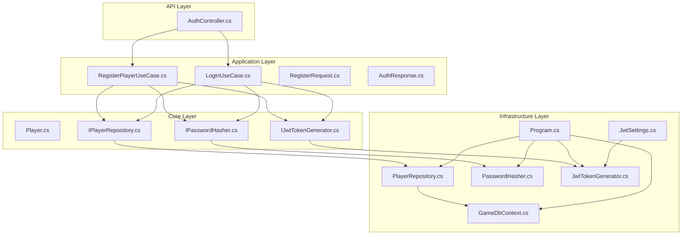
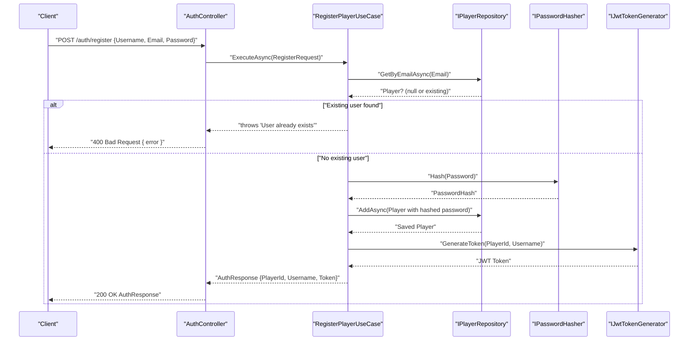
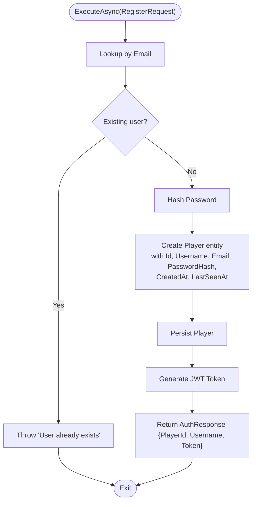
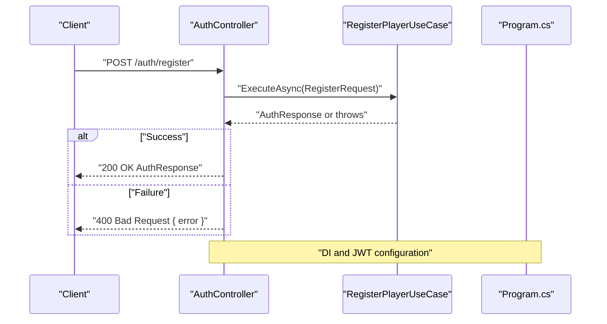
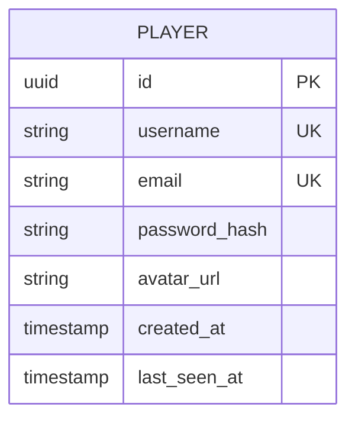
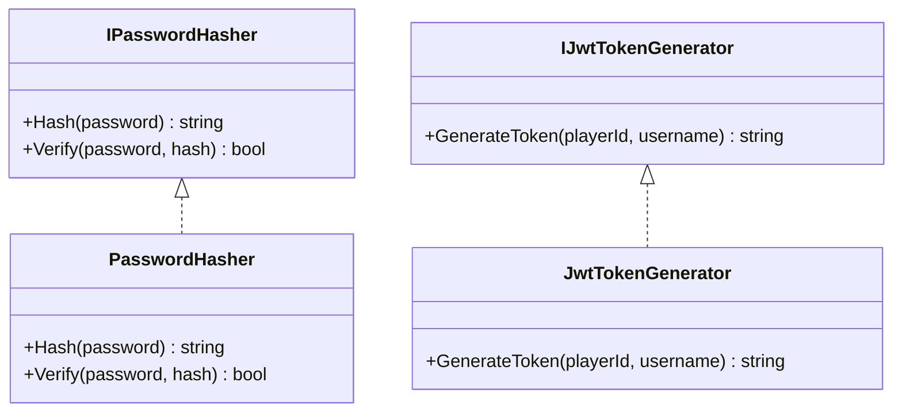
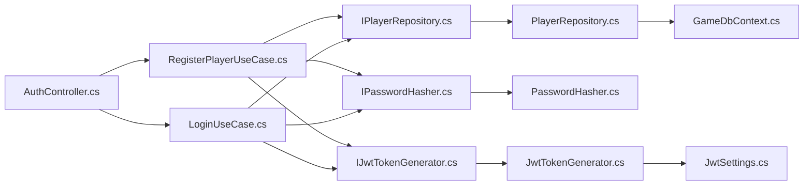

# User Registration

<cite>
**Referenced Files in This Document**
- [AuthController.cs](file://GameBackend.API/Controllers/AuthController.cs)
- [RegisterPlayerUseCase.cs](file://GameBackend.Application/Contracts/UseCases/Auth/RegisterPlayerUseCase.cs)
- [RegisterRequest.cs](file://GameBackend.Application/Contracts/Auth/RegisterRequest.cs)
- [AuthResponse.cs](file://GameBackend.Application/Contracts/Auth/AuthResponse.cs)
- [LoginUseCase.cs](file://GameBackend.Application/Contracts/UseCases/Auth/LoginUseCase.cs)
- [Player.cs](file://GameBackend.Core/Entities/Player.cs)
- [IPlayerRepository.cs](file://GameBackend.Core/Interfaces/IPlayerRepository.cs)
- [IPasswordHasher.cs](file://GameBackend.Core/Interfaces/IPasswordHasher.cs)
- [IJwtTokenGenerator.cs](file://GameBackend.Core/Interfaces/IJwtTokenGenerator.cs)
- [PlayerRepository.cs](file://GameBackend.Infrastructure/Repositories/PlayerRepository.cs)
- [PasswordHasher.cs](file://GameBackend.Infrastructure/Security/PasswordHasher.cs)
- [JwtTokenGenerator.cs](file://GameBackend.Infrastructure/Security/JwtTokenGenerator.cs)
- [GameDbContext.cs](file://GameBackend.Infrastructure/Persistence/GameDbContext.cs)
- [Program.cs](file://GameBackend.API/Program.cs)
- [JwtSettings.cs](file://GameBackend.Infrastructure/Security/JwtSettings.cs)
</cite>

## Table of Contents
1. [Introduction](#introduction)
2. [Project Structure](#project-structure)
3. [Core Components](#core-components)
4. [Architecture Overview](#architecture-overview)
5. [Detailed Component Analysis](#detailed-component-analysis)
6. [Dependency Analysis](#dependency-analysis)
7. [Performance Considerations](#performance-considerations)
8. [Troubleshooting Guide](#troubleshooting-guide)
9. [Conclusion](#conclusion)

## Introduction
This document explains the complete user registration workflow in the backend. It covers the end-to-end flow from HTTP request to database persistence, including input validation, email uniqueness checks, password hashing with BCrypt, player entity creation, and JWT token generation. It documents the RegisterPlayerUseCase implementation, the RegisterRequest contract, and the AuthResponse format. Practical examples, error handling scenarios, security considerations, and troubleshooting guidance are included to help developers integrate and extend the registration process safely and efficiently.

## Project Structure
Registration spans three layers:
- API layer: HTTP endpoint binding and error mapping
- Application layer: Use case orchestration and domain contracts
- Infrastructure layer: Persistence, hashing, and token generation

**Diagram sources**
- [AuthController.cs:1-49](file://GameBackend.API/Controllers/AuthController.cs#L1-L49)
- [RegisterPlayerUseCase.cs:1-58](file://GameBackend.Application/Contracts/UseCases/Auth/RegisterPlayerUseCase.cs#L1-L58)
- [LoginUseCase.cs:1-45](file://GameBackend.Application/Contracts/UseCases/Auth/LoginUseCase.cs#L1-L45)
- [RegisterRequest.cs:1-8](file://GameBackend.Application/Contracts/Auth/RegisterRequest.cs#L1-L8)
- [AuthResponse.cs:1-8](file://GameBackend.Application/Contracts/Auth/AuthResponse.cs#L1-L8)
- [Player.cs:1-13](file://GameBackend.Core/Entities/Player.cs#L1-L13)
- [IPlayerRepository.cs:1-10](file://GameBackend.Core/Interfaces/IPlayerRepository.cs#L1-L10)
- [IPasswordHasher.cs:1-7](file://GameBackend.Core/Interfaces/IPasswordHasher.cs#L1-L7)
- [IJwtTokenGenerator.cs:1-6](file://GameBackend.Core/Interfaces/IJwtTokenGenerator.cs#L1-L6)
- [PlayerRepository.cs:1-34](file://GameBackend.Infrastructure/Repositories/PlayerRepository.cs#L1-L34)
- [PasswordHasher.cs:1-16](file://GameBackend.Infrastructure/Security/PasswordHasher.cs#L1-L16)
- [JwtTokenGenerator.cs:1-44](file://GameBackend.Infrastructure/Security/JwtTokenGenerator.cs#L1-L44)
- [GameDbContext.cs:1-28](file://GameBackend.Infrastructure/Persistence/GameDbContext.cs#L1-L28)
- [Program.cs:1-38](file://GameBackend.API/Program.cs#L1-L38)
- [JwtSettings.cs:1-8](file://GameBackend.Infrastructure/Security/JwtSettings.cs#L1-L8)

**Section sources**
- [AuthController.cs:1-49](file://GameBackend.API/Controllers/AuthController.cs#L1-L49)
- [RegisterPlayerUseCase.cs:1-58](file://GameBackend.Application/Contracts/UseCases/Auth/RegisterPlayerUseCase.cs#L1-L58)
- [RegisterRequest.cs:1-8](file://GameBackend.Application/Contracts/Auth/RegisterRequest.cs#L1-L8)
- [AuthResponse.cs:1-8](file://GameBackend.Application/Contracts/Auth/AuthResponse.cs#L1-L8)
- [Player.cs:1-13](file://GameBackend.Core/Entities/Player.cs#L1-L13)
- [IPlayerRepository.cs:1-10](file://GameBackend.Core/Interfaces/IPlayerRepository.cs#L1-L10)
- [IPasswordHasher.cs:1-7](file://GameBackend.Core/Interfaces/IPasswordHasher.cs#L1-L7)
- [IJwtTokenGenerator.cs:1-6](file://GameBackend.Core/Interfaces/IJwtTokenGenerator.cs#L1-L6)
- [PlayerRepository.cs:1-34](file://GameBackend.Infrastructure/Repositories/PlayerRepository.cs#L1-L34)
- [PasswordHasher.cs:1-16](file://GameBackend.Infrastructure/Security/PasswordHasher.cs#L1-L16)
- [JwtTokenGenerator.cs:1-44](file://GameBackend.Infrastructure/Security/JwtTokenGenerator.cs#L1-L44)
- [GameDbContext.cs:1-28](file://GameBackend.Infrastructure/Persistence/GameDbContext.cs#L1-L28)
- [Program.cs:1-38](file://GameBackend.API/Program.cs#L1-L38)
- [JwtSettings.cs:1-8](file://GameBackend.Infrastructure/Security/JwtSettings.cs#L1-L8)

## Core Components
- RegisterRequest: Contract for registration input with Username, Email, and Password.
- AuthResponse: Standardized response containing PlayerId, Username, and Token after successful registration.
- RegisterPlayerUseCase: Orchestrates registration steps: existence check, password hashing, entity creation, persistence, and token generation.
- Player entity: Core model persisted to the database with identity, credentials, timestamps, and metadata container.
- IPlayerRepository: Abstraction for player data access with email/username lookup and add operations.
- IPasswordHasher: Abstraction for secure password hashing and verification.
- IJwtTokenGenerator: Abstraction for generating signed JWT tokens.
- PlayerRepository: EF Core implementation enforcing unique indexes and saving players.
- PasswordHasher: BCrypt-based implementation for hashing and verifying passwords.
- JwtTokenGenerator: JWT token generation using HMAC SHA-256 with configurable issuer, audience, and key.
- GameDbContext: Entity configuration with unique indexes on Email and Username.
- AuthController: HTTP endpoint exposing POST /auth/register and mapping exceptions to appropriate HTTP statuses.

**Section sources**
- [RegisterRequest.cs:1-8](file://GameBackend.Application/Contracts/Auth/RegisterRequest.cs#L1-L8)
- [AuthResponse.cs:1-8](file://GameBackend.Application/Contracts/Auth/AuthResponse.cs#L1-L8)
- [RegisterPlayerUseCase.cs:1-58](file://GameBackend.Application/Contracts/UseCases/Auth/RegisterPlayerUseCase.cs#L1-L58)
- [Player.cs:1-13](file://GameBackend.Core/Entities/Player.cs#L1-L13)
- [IPlayerRepository.cs:1-10](file://GameBackend.Core/Interfaces/IPlayerRepository.cs#L1-L10)
- [IPasswordHasher.cs:1-7](file://GameBackend.Core/Interfaces/IPasswordHasher.cs#L1-L7)
- [IJwtTokenGenerator.cs:1-6](file://GameBackend.Core/Interfaces/IJwtTokenGenerator.cs#L1-L6)
- [PlayerRepository.cs:1-34](file://GameBackend.Infrastructure/Repositories/PlayerRepository.cs#L1-L34)
- [PasswordHasher.cs:1-16](file://GameBackend.Infrastructure/Security/PasswordHasher.cs#L1-L16)
- [JwtTokenGenerator.cs:1-44](file://GameBackend.Infrastructure/Security/JwtTokenGenerator.cs#L1-L44)
- [GameDbContext.cs:1-28](file://GameBackend.Infrastructure/Persistence/GameDbContext.cs#L1-L28)
- [AuthController.cs:1-49](file://GameBackend.API/Controllers/AuthController.cs#L1-L49)

## Architecture Overview
The registration flow is a layered pipeline:
- HTTP request enters via AuthController
- Use case validates preconditions and orchestrates domain operations
- Infrastructure handles persistence and cryptographic operations
- Unique constraints in the database prevent duplicate emails/usernames
- JWT token is returned for immediate session establishment

**Diagram sources**
- [AuthController.cs:22-34](file://GameBackend.API/Controllers/AuthController.cs#L22-L34)
- [RegisterPlayerUseCase.cs:23-57](file://GameBackend.Application/Contracts/UseCases/Auth/RegisterPlayerUseCase.cs#L23-L57)
- [IPlayerRepository.cs:7-9](file://GameBackend.Core/Interfaces/IPlayerRepository.cs#L7-L9)
- [IPasswordHasher.cs:5-6](file://GameBackend.Core/Interfaces/IPasswordHasher.cs#L5-L6)
- [IJwtTokenGenerator.cs:5](file://GameBackend.Core/Interfaces/IJwtTokenGenerator.cs#L5)
- [PlayerRepository.cs:29-33](file://GameBackend.Infrastructure/Repositories/PlayerRepository.cs#L29-L33)

## Detailed Component Analysis

### RegisterPlayerUseCase
Responsibilities:
- Prevent duplicate registrations by checking email uniqueness
- Hash the plaintext password using BCrypt
- Construct a Player entity with generated identifiers and timestamps
- Persist the player and return an AuthResponse with a JWT token

Processing logic highlights:
- Existence check against email index enforced by database unique constraint
- Password hashing via IPasswordHasher
- Entity creation with Id, Username, Email, PasswordHash, and timestamps
- Async save via IPlayerRepository
- JWT token generation via IJwtTokenGenerator

**Diagram sources**
- [RegisterPlayerUseCase.cs:23-57](file://GameBackend.Application/Contracts/UseCases/Auth/RegisterPlayerUseCase.cs#L23-L57)
- [PlayerRepository.cs:17-33](file://GameBackend.Infrastructure/Repositories/PlayerRepository.cs#L17-L33)
- [PasswordHasher.cs:7-15](file://GameBackend.Infrastructure/Security/PasswordHasher.cs#L7-L15)
- [JwtTokenGenerator.cs:20-43](file://GameBackend.Infrastructure/Security/JwtTokenGenerator.cs#L20-L43)

**Section sources**
- [RegisterPlayerUseCase.cs:1-58](file://GameBackend.Application/Contracts/UseCases/Auth/RegisterPlayerUseCase.cs#L1-L58)

### RegisterRequest Contract
Fields:
- Username: string
- Email: string
- Password: string

Validation rules implemented in the use case:
- Non-empty values are required (enforced by presence checks)
- Email uniqueness is enforced by repository lookup and database unique index

Note: Additional server-side validations (e.g., email format, password strength) are not present in the current implementation and should be added to improve robustness.

**Section sources**
- [RegisterRequest.cs:1-8](file://GameBackend.Application/Contracts/Auth/RegisterRequest.cs#L1-L8)
- [RegisterPlayerUseCase.cs:25-28](file://GameBackend.Application/Contracts/UseCases/Auth/RegisterPlayerUseCase.cs#L25-L28)
- [GameDbContext.cs:22-23](file://GameBackend.Infrastructure/Persistence/GameDbContext.cs#L22-L23)

### AuthResponse Format
Fields:
- PlayerId: Guid
- Username: string
- Token: string (JWT)

Returned upon successful registration and login to enable client-side session establishment.

**Section sources**
- [AuthResponse.cs:1-8](file://GameBackend.Application/Contracts/Auth/AuthResponse.cs#L1-L8)
- [RegisterPlayerUseCase.cs:51-56](file://GameBackend.Application/Contracts/UseCases/Auth/RegisterPlayerUseCase.cs#L51-L56)

### Authentication Controller Integration
HTTP endpoint:
- POST /auth/register accepts RegisterRequest
- Returns 200 OK with AuthResponse on success
- Returns 400 Bad Request with error message on failure

Integration pattern:
- DI registers RegisterPlayerUseCase, IPlayerRepository, IPasswordHasher, IJwtTokenGenerator
- Program configures JWT settings and authentication scheme

**Diagram sources**
- [AuthController.cs:22-34](file://GameBackend.API/Controllers/AuthController.cs#L22-L34)
- [RegisterPlayerUseCase.cs:23-57](file://GameBackend.Application/Contracts/UseCases/Auth/RegisterPlayerUseCase.cs#L23-L57)
- [Program.cs:13-24](file://GameBackend.API/Program.cs#L13-L24)

**Section sources**
- [AuthController.cs:1-49](file://GameBackend.API/Controllers/AuthController.cs#L1-L49)
- [Program.cs:1-38](file://GameBackend.API/Program.cs#L1-L38)

### Data Model and Persistence
Player entity fields:
- Id: Guid
- Username: string
- Email: string
- PasswordHash: string
- AvatarUrl: string
- CreatedAt: DateTime
- LastSeenAt: DateTime
- Metadata: Dictionary<string, object>

Database constraints:
- Unique indexes on Email and Username enforced by EF Core configuration

Persistence flow:
- PlayerRepository adds the entity and saves changes
- Unique constraints prevent duplicates at the database level

**Diagram sources**
- [Player.cs:1-13](file://GameBackend.Core/Entities/Player.cs#L1-L13)
- [GameDbContext.cs:19-26](file://GameBackend.Infrastructure/Persistence/GameDbContext.cs#L19-L26)

**Section sources**
- [Player.cs:1-13](file://GameBackend.Core/Entities/Player.cs#L1-L13)
- [GameDbContext.cs:1-28](file://GameBackend.Infrastructure/Persistence/GameDbContext.cs#L1-L28)
- [PlayerRepository.cs:1-34](file://GameBackend.Infrastructure/Repositories/PlayerRepository.cs#L1-L34)

### Security Components
Password hashing:
- IPasswordHasher.Hash uses BCrypt to produce a salted hash
- Verification uses IPasswordHasher.Verify with the stored hash

JWT token generation:
- IJwtTokenGenerator produces signed JWT with HMAC SHA-256
- Configuration includes Key, Issuer, and Audience from JwtSettings
- Token expiration is set to 7 days

**Diagram sources**
- [IPasswordHasher.cs:1-7](file://GameBackend.Core/Interfaces/IPasswordHasher.cs#L1-L7)
- [PasswordHasher.cs:1-16](file://GameBackend.Infrastructure/Security/PasswordHasher.cs#L1-L16)
- [IJwtTokenGenerator.cs:1-6](file://GameBackend.Core/Interfaces/IJwtTokenGenerator.cs#L1-L6)
- [JwtTokenGenerator.cs:1-44](file://GameBackend.Infrastructure/Security/JwtTokenGenerator.cs#L1-L44)
- [JwtSettings.cs:1-8](file://GameBackend.Infrastructure/Security/JwtSettings.cs#L1-L8)

**Section sources**
- [IPasswordHasher.cs:1-7](file://GameBackend.Core/Interfaces/IPasswordHasher.cs#L1-L7)
- [PasswordHasher.cs:1-16](file://GameBackend.Infrastructure/Security/PasswordHasher.cs#L1-L16)
- [IJwtTokenGenerator.cs:1-6](file://GameBackend.Core/Interfaces/IJwtTokenGenerator.cs#L1-L6)
- [JwtTokenGenerator.cs:1-44](file://GameBackend.Infrastructure/Security/JwtTokenGenerator.cs#L1-L44)
- [JwtSettings.cs:1-8](file://GameBackend.Infrastructure/Security/JwtSettings.cs#L1-L8)

## Dependency Analysis
Key dependencies and their roles:
- AuthController depends on RegisterPlayerUseCase and LoginUseCase
- RegisterPlayerUseCase depends on IPlayerRepository, IPasswordHasher, and IJwtTokenGenerator
- PlayerRepository implements IPlayerRepository and uses GameDbContext
- PasswordHasher implements IPasswordHasher using BCrypt
- JwtTokenGenerator implements IJwtTokenGenerator using HMAC SHA-256 and JwtSettings
- GameDbContext defines unique indexes and ignores Metadata property

**Diagram sources**
- [AuthController.cs:11-20](file://GameBackend.API/Controllers/AuthController.cs#L11-L20)
- [RegisterPlayerUseCase.cs:9-21](file://GameBackend.Application/Contracts/UseCases/Auth/RegisterPlayerUseCase.cs#L9-L21)
- [LoginUseCase.cs:8-20](file://GameBackend.Application/Contracts/UseCases/Auth/LoginUseCase.cs#L8-L20)
- [IPlayerRepository.cs:5-10](file://GameBackend.Core/Interfaces/IPlayerRepository.cs#L5-L10)
- [IPasswordHasher.cs:3-7](file://GameBackend.Core/Interfaces/IPasswordHasher.cs#L3-L7)
- [IJwtTokenGenerator.cs:3-6](file://GameBackend.Core/Interfaces/IJwtTokenGenerator.cs#L3-L6)
- [PlayerRepository.cs:8-15](file://GameBackend.Infrastructure/Repositories/PlayerRepository.cs#L8-L15)
- [PasswordHasher.cs:5-16](file://GameBackend.Infrastructure/Security/PasswordHasher.cs#L5-L16)
- [JwtTokenGenerator.cs:11-18](file://GameBackend.Infrastructure/Security/JwtTokenGenerator.cs#L11-L18)
- [GameDbContext.cs:6-13](file://GameBackend.Infrastructure/Persistence/GameDbContext.cs#L6-L13)
- [JwtSettings.cs:3-8](file://GameBackend.Infrastructure/Security/JwtSettings.cs#L3-L8)

**Section sources**
- [AuthController.cs:1-49](file://GameBackend.API/Controllers/AuthController.cs#L1-L49)
- [RegisterPlayerUseCase.cs:1-58](file://GameBackend.Application/Contracts/UseCases/Auth/RegisterPlayerUseCase.cs#L1-L58)
- [LoginUseCase.cs:1-45](file://GameBackend.Application/Contracts/UseCases/Auth/LoginUseCase.cs#L1-L45)
- [PlayerRepository.cs:1-34](file://GameBackend.Infrastructure/Repositories/PlayerRepository.cs#L1-L34)
- [PasswordHasher.cs:1-16](file://GameBackend.Infrastructure/Security/PasswordHasher.cs#L1-L16)
- [JwtTokenGenerator.cs:1-44](file://GameBackend.Infrastructure/Security/JwtTokenGenerator.cs#L1-L44)
- [GameDbContext.cs:1-28](file://GameBackend.Infrastructure/Persistence/GameDbContext.cs#L1-L28)
- [JwtSettings.cs:1-8](file://GameBackend.Infrastructure/Security/JwtSettings.cs#L1-L8)

## Performance Considerations
- Asynchronous operations: All repository and hashing operations are asynchronous, preventing thread blocking.
- Single round-trip uniqueness check: The use case queries by email before hashing and persisting, minimizing unnecessary work.
- Index-backed lookups: Database unique indexes on Email and Username optimize existence checks.
- Token generation cost: JWT generation is lightweight; keep payload minimal to reduce overhead.
- Connection and transaction boundaries: PlayerRepository saves changes immediately after insert; consider batching if throughput demands it.

[No sources needed since this section provides general guidance]

## Troubleshooting Guide
Common registration issues and resolutions:
- Duplicate email error
  - Symptom: HTTP 400 with "User already exists"
  - Cause: Email already registered
  - Resolution: Prompt user to choose another email or log in instead
  - Section sources
    - [RegisterPlayerUseCase.cs:27-28](file://GameBackend.Application/Contracts/UseCases/Auth/RegisterPlayerUseCase.cs#L27-L28)
    - [AuthController.cs:30-33](file://GameBackend.API/Controllers/AuthController.cs#L30-L33)

- Invalid input (empty fields)
  - Symptom: Immediate failure during existence check or persistence
  - Cause: Missing required fields in RegisterRequest
  - Resolution: Validate inputs on the client and ensure non-empty values before sending
  - Section sources
    - [RegisterRequest.cs:5-7](file://GameBackend.Application/Contracts/Auth/RegisterRequest.cs#L5-L7)
    - [RegisterPlayerUseCase.cs:25-28](file://GameBackend.Application/Contracts/UseCases/Auth/RegisterPlayerUseCase.cs#L25-L28)

- Database constraint violations
  - Symptom: Exceptions thrown during save or unique index conflicts
  - Cause: Duplicate Username or Email despite client checks
  - Resolution: Ensure unique indexes are enforced and handle exceptions gracefully
  - Section sources
    - [GameDbContext.cs:22-23](file://GameBackend.Infrastructure/Persistence/GameDbContext.cs#L22-L23)
    - [PlayerRepository.cs:31-33](file://GameBackend.Infrastructure/Repositories/PlayerRepository.cs#L31-L33)

- JWT configuration errors
  - Symptom: Token generation failures or authentication issues
  - Cause: Missing or invalid JwtSettings (Key, Issuer, Audience)
  - Resolution: Verify configuration and ensure symmetric key length and issuer/audience match client expectations
  - Section sources
    - [JwtSettings.cs:5-7](file://GameBackend.Infrastructure/Security/JwtSettings.cs#L5-L7)
    - [JwtTokenGenerator.cs:22-42](file://GameBackend.Infrastructure/Security/JwtTokenGenerator.cs#L22-L42)
    - [Program.cs:13-14](file://GameBackend.API/Program.cs#L13-L14)

- Password hashing mismatches
  - Symptom: Login fails even with correct credentials
  - Cause: Incorrect hashing or mismatched secret key
  - Resolution: Confirm BCrypt usage and shared secret configuration
  - Section sources
    - [PasswordHasher.cs:7-15](file://GameBackend.Infrastructure/Security/PasswordHasher.cs#L7-L15)
    - [JwtTokenGenerator.cs:22-26](file://GameBackend.Infrastructure/Security/JwtTokenGenerator.cs#L22-L26)

Best practices for extending the registration process:
- Add input validation (email format, password strength) in the application layer before invoking the use case
- Introduce pre-registration hooks (e.g., CAPTCHA, rate limiting) at the API boundary
- Enforce minimum password entropy and disallow common passwords
- Emit structured logs for failed attempts while avoiding sensitive data disclosure
- Consider adding optional fields (e.g., AvatarUrl) and metadata initialization during entity creation

[No sources needed since this section provides general guidance]

## Conclusion
The registration flow is cleanly separated across layers, leveraging DI, asynchronous operations, and strong security primitives. The use case enforces uniqueness, securely hashes passwords, persists the player, and returns a signed JWT for immediate session establishment. Extending the process should focus on input validation, robust error handling, and maintaining security best practices.

[No sources needed since this section summarizes without analyzing specific files]