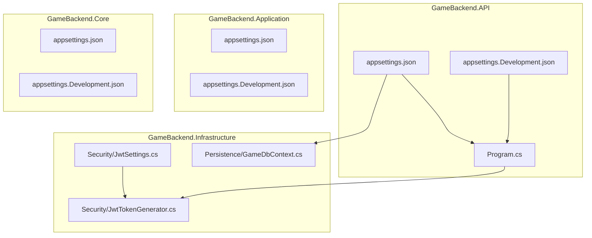
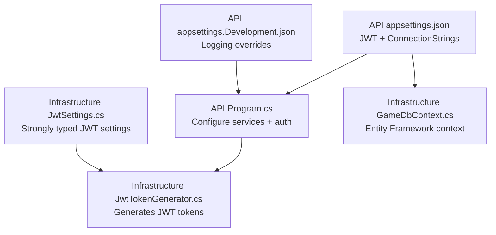
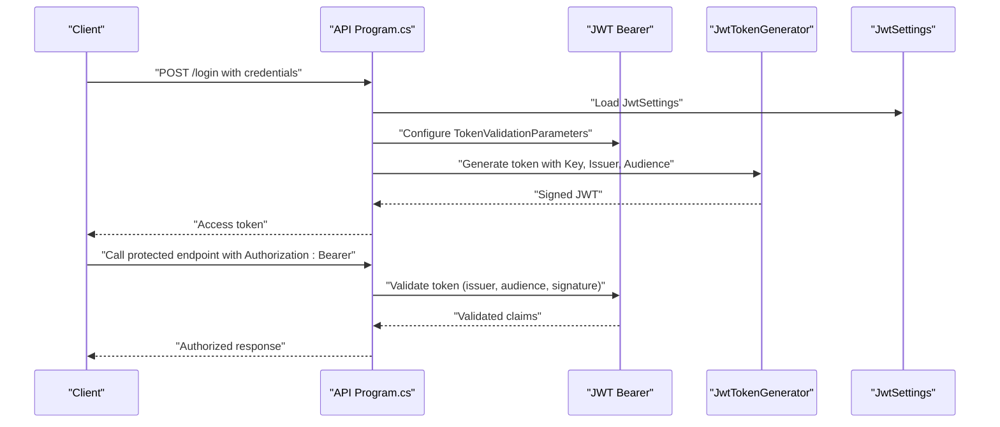
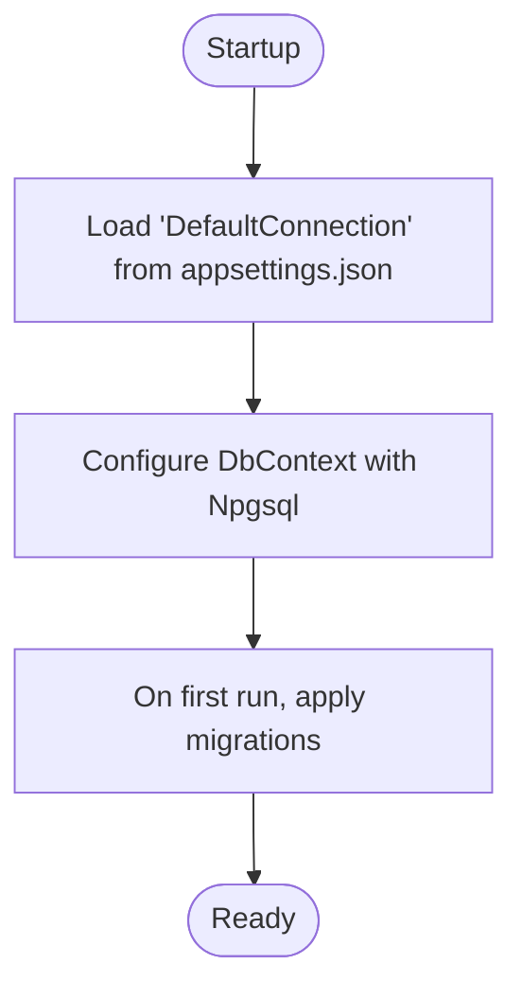
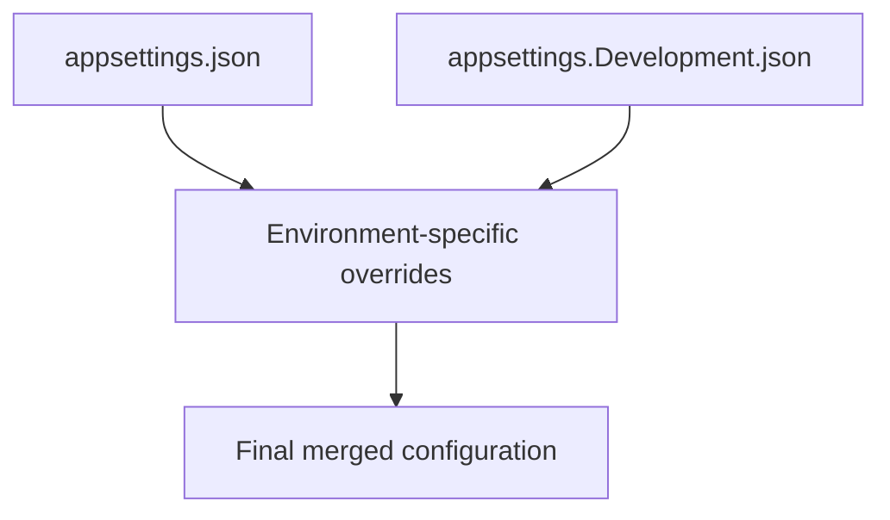
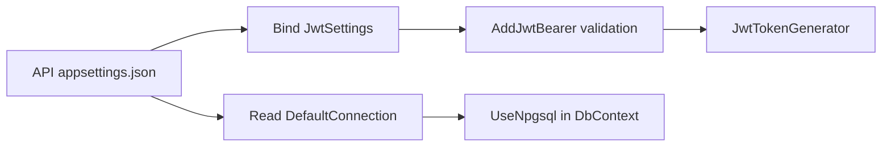

# Configuration & Settings

<cite>
**Referenced Files in This Document**
- [GameBackend.API\appsettings.json](file://GameBackend.API/appsettings.json)
- [GameBackend.API\appsettings.Development.json](file://GameBackend.API/appsettings.Development.json)
- [GameBackend.API\Program.cs](file://GameBackend.API/Program.cs)
- [GameBackend.Infrastructure\Security\JwtSettings.cs](file://GameBackend.Infrastructure/Security/JwtSettings.cs)
- [GameBackend.Infrastructure\Security\JwtTokenGenerator.cs](file://GameBackend.Infrastructure/Security/JwtTokenGenerator.cs)
- [GameBackend.Infrastructure\Persistence\GameDbContext.cs](file://GameBackend.Infrastructure/Persistence/GameDbContext.cs)
- [GameBackend.Application\appsettings.json](file://GameBackend.Application/appsettings.json)
- [GameBackend.Application\appsettings.Development.json](file://GameBackend.Application/appsettings.Development.json)
- [GameBackend.Core\appsettings.json](file://GameBackend.Core/appsettings.json)
- [GameBackend.Core\appsettings.Development.json](file://GameBackend.Core/appsettings.Development.json)
- [GameBackend.Infrastructure\appsettings.json](file://GameBackend.Infrastructure/appsettings.json)
- [GameBackend.Infrastructure\appsettings.Development.json](file://GameBackend.Infrastructure/appsettings.Development.json)
</cite>

## Table of Contents
1. [Introduction](#introduction)
2. [Project Structure](#project-structure)
3. [Core Components](#core-components)
4. [Architecture Overview](#architecture-overview)
5. [Detailed Component Analysis](#detailed-component-analysis)
6. [Dependency Analysis](#dependency-analysis)
7. [Performance Considerations](#performance-considerations)
8. [Troubleshooting Guide](#troubleshooting-guide)
9. [Conclusion](#conclusion)
10. [Appendices](#appendices)

## Introduction
This document provides comprehensive configuration and settings guidance for the GameBackend project. It explains how configuration is organized across the solution, how environment-specific settings are applied, how JWT and database settings are loaded and validated, and how to manage secrets securely. It also covers development versus production differences, environment variable overrides, and best practices for configuration management.

## Project Structure
The project follows a layered architecture with separate configuration files per project. The API project hosts the primary configuration for logging, allowed hosts, JWT settings, and database connection strings. Other projects include minimal configuration files that primarily inherit logging and allowed hosts defaults.

**Diagram sources**
- [GameBackend.API\appsettings.json:1-17](file://GameBackend.API/appsettings.json#L1-L17)
- [GameBackend.API\appsettings.Development.json:1-9](file://GameBackend.API/appsettings.Development.json#L1-L9)
- [GameBackend.API\Program.cs:1-72](file://GameBackend.API/Program.cs#L1-L72)
- [GameBackend.Infrastructure\Security\JwtSettings.cs:1-8](file://GameBackend.Infrastructure/Security/JwtSettings.cs#L1-L8)
- [GameBackend.Infrastructure\Security\JwtTokenGenerator.cs:1-44](file://GameBackend.Infrastructure/Security/JwtTokenGenerator.cs#L1-L44)
- [GameBackend.Infrastructure\Persistence\GameDbContext.cs:1-28](file://GameBackend.Infrastructure/Persistence/GameDbContext.cs#L1-L28)
- [GameBackend.Application\appsettings.json:1-10](file://GameBackend.Application/appsettings.json#L1-L10)
- [GameBackend.Application\appsettings.Development.json:1-9](file://GameBackend.Application/appsettings.Development.json#L1-L9)
- [GameBackend.Core\appsettings.json:1-10](file://GameBackend.Core/appsettings.json#L1-L10)
- [GameBackend.Core\appsettings.Development.json:1-9](file://GameBackend.Core/appsettings.Development.json#L1-L9)

**Section sources**
- [GameBackend.API\appsettings.json:1-17](file://GameBackend.API/appsettings.json#L1-L17)
- [GameBackend.API\appsettings.Development.json:1-9](file://GameBackend.API/appsettings.Development.json#L1-L9)
- [GameBackend.API\Program.cs:1-72](file://GameBackend.API/Program.cs#L1-L72)
- [GameBackend.Infrastructure\Security\JwtSettings.cs:1-8](file://GameBackend.Infrastructure/Security/JwtSettings.cs#L1-L8)
- [GameBackend.Infrastructure\Security\JwtTokenGenerator.cs:1-44](file://GameBackend.Infrastructure/Security/JwtTokenGenerator.cs#L1-L44)
- [GameBackend.Infrastructure\Persistence\GameDbContext.cs:1-28](file://GameBackend.Infrastructure/Persistence/GameDbContext.cs#L1-L28)
- [GameBackend.Application\appsettings.json:1-10](file://GameBackend.Application/appsettings.json#L1-L10)
- [GameBackend.Application\appsettings.Development.json:1-9](file://GameBackend.Application/appsettings.Development.json#L1-L9)
- [GameBackend.Core\appsettings.json:1-10](file://GameBackend.Core/appsettings.json#L1-L10)
- [GameBackend.Core\appsettings.Development.json:1-9](file://GameBackend.Core/appsettings.Development.json#L1-L9)

## Core Components
This section documents the primary configuration categories and their roles in the system.

- Logging configuration
  - Controls log verbosity and target providers.
  - Found in each project’s appsettings.json and appsettings.Development.json.
  - Example locations:
    - [GameBackend.API\appsettings.json:2-6](file://GameBackend.API/appsettings.json#L2-L6)
    - [GameBackend.API\appsettings.Development.json:2-7](file://GameBackend.API/appsettings.Development.json#L2-L7)
    - [GameBackend.Application\appsettings.json:2-7](file://GameBackend.Application/appsettings.json#L2-L7)
    - [GameBackend.Core\appsettings.json:2-7](file://GameBackend.Core/appsettings.json#L2-L7)
    - [GameBackend.Infrastructure\appsettings.json:2-7](file://GameBackend.Infrastructure/appsettings.json#L2-L7)

- Allowed hosts
  - Defines permitted hosts for requests.
  - Present in API and other project appsettings.json.
  - Example locations:
    - [GameBackend.API\appsettings.json:7-7](file://GameBackend.API/appsettings.json#L7-L7)
    - [GameBackend.Application\appsettings.json:8-8](file://GameBackend.Application/appsettings.json#L8-L8)
    - [GameBackend.Core\appsettings.json:8-8](file://GameBackend.Core/appsettings.json#L8-L8)
    - [GameBackend.Infrastructure\appsettings.json:8-8](file://GameBackend.Infrastructure/appsettings.json#L8-L8)

- JWT settings
  - Includes signing key, issuer, and audience.
  - Loaded into strongly typed JwtSettings and consumed by authentication middleware and token generator.
  - Example locations:
    - [GameBackend.API\appsettings.json:9-13](file://GameBackend.API/appsettings.json#L9-L13)
    - [GameBackend.Infrastructure\Security\JwtSettings.cs:3-8](file://GameBackend.Infrastructure/Security/JwtSettings.cs#L3-L8)
    - [GameBackend.API\Program.cs:13-14](file://GameBackend.API/Program.cs#L13-L14)
    - [GameBackend.API\Program.cs:28-28](file://GameBackend.API/Program.cs#L28-L28)
    - [GameBackend.API\Program.cs:37-50](file://GameBackend.API/Program.cs#L37-L50)
    - [GameBackend.Infrastructure\Security\JwtTokenGenerator.cs:11-18](file://GameBackend.Infrastructure/Security/JwtTokenGenerator.cs#L11-L18)

- Database connection strings
  - Default connection string for PostgreSQL via Entity Framework.
  - Example locations:
    - [GameBackend.API\appsettings.json:14-16](file://GameBackend.API/appsettings.json#L14-L16)
    - [GameBackend.API\Program.cs:16-17](file://GameBackend.API/Program.cs#L16-L17)
    - [GameBackend.Infrastructure\Persistence\GameDbContext.cs:8-11](file://GameBackend.Infrastructure/Persistence/GameDbContext.cs#L8-L11)

**Section sources**
- [GameBackend.API\appsettings.json:1-17](file://GameBackend.API/appsettings.json#L1-L17)
- [GameBackend.API\appsettings.Development.json:1-9](file://GameBackend.API/appsettings.Development.json#L1-L9)
- [GameBackend.Application\appsettings.json:1-10](file://GameBackend.Application/appsettings.json#L1-L10)
- [GameBackend.Core\appsettings.json:1-10](file://GameBackend.Core/appsettings.json#L1-L10)
- [GameBackend.Infrastructure\appsettings.json:1-10](file://GameBackend.Infrastructure/appsettings.json#L1-L10)
- [GameBackend.Infrastructure\Security\JwtSettings.cs:1-8](file://GameBackend.Infrastructure/Security/JwtSettings.cs#L1-L8)
- [GameBackend.API\Program.cs:1-72](file://GameBackend.API/Program.cs#L1-L72)
- [GameBackend.Infrastructure\Security\JwtTokenGenerator.cs:1-44](file://GameBackend.Infrastructure/Security/JwtTokenGenerator.cs#L1-L44)
- [GameBackend.Infrastructure\Persistence\GameDbContext.cs:1-28](file://GameBackend.Infrastructure/Persistence/GameDbContext.cs#L1-L28)

## Architecture Overview
The configuration architecture centers around the API project’s configuration files and the Program.cs bootstrapping logic. The API project reads JWT settings and connection strings, registers authentication with JWT Bearer, and configures the database context. The Infrastructure project consumes JWT settings to generate tokens.

**Diagram sources**
- [GameBackend.API\appsettings.json:1-17](file://GameBackend.API/appsettings.json#L1-L17)
- [GameBackend.API\appsettings.Development.json:1-9](file://GameBackend.API/appsettings.Development.json#L1-L9)
- [GameBackend.API\Program.cs:1-72](file://GameBackend.API/Program.cs#L1-L72)
- [GameBackend.Infrastructure\Security\JwtSettings.cs:1-8](file://GameBackend.Infrastructure/Security/JwtSettings.cs#L1-L8)
- [GameBackend.Infrastructure\Security\JwtTokenGenerator.cs:1-44](file://GameBackend.Infrastructure/Security/JwtTokenGenerator.cs#L1-L44)
- [GameBackend.Infrastructure\Persistence\GameDbContext.cs:1-28](file://GameBackend.Infrastructure/Persistence/GameDbContext.cs#L1-L28)

## Detailed Component Analysis

### JWT Configuration and Validation
- Configuration source
  - JWT settings are defined under the “Jwt” section in the API appsettings.json.
  - These settings are bound to the JwtSettings class and injected into services.
- Authentication middleware
  - The API Program.cs configures JWT Bearer authentication and sets issuer, audience, and signing key validation parameters.
- Token generation
  - The JwtTokenGenerator reads JwtSettings to sign tokens with HMAC SHA-256.

**Diagram sources**
- [GameBackend.API\Program.cs:13-14](file://GameBackend.API/Program.cs#L13-L14)
- [GameBackend.API\Program.cs:28-50](file://GameBackend.API/Program.cs#L28-L50)
- [GameBackend.Infrastructure\Security\JwtSettings.cs:3-8](file://GameBackend.Infrastructure/Security/JwtSettings.cs#L3-L8)
- [GameBackend.Infrastructure\Security\JwtTokenGenerator.cs:20-43](file://GameBackend.Infrastructure/Security/JwtTokenGenerator.cs#L20-L43)

**Section sources**
- [GameBackend.API\appsettings.json:9-13](file://GameBackend.API/appsettings.json#L9-L13)
- [GameBackend.API\Program.cs:13-14](file://GameBackend.API/Program.cs#L13-L14)
- [GameBackend.API\Program.cs:28-50](file://GameBackend.API/Program.cs#L28-L50)
- [GameBackend.Infrastructure\Security\JwtSettings.cs:3-8](file://GameBackend.Infrastructure/Security/JwtSettings.cs#L3-L8)
- [GameBackend.Infrastructure\Security\JwtTokenGenerator.cs:11-18](file://GameBackend.Infrastructure/Security/JwtTokenGenerator.cs#L11-L18)
- [GameBackend.Infrastructure\Security\JwtTokenGenerator.cs:20-43](file://GameBackend.Infrastructure/Security/JwtTokenGenerator.cs#L20-L43)

### Database Connection Configuration
- Connection string location
  - The default connection string is defined in the API appsettings.json.
- EF Core setup
  - The API Program.cs reads the connection string and configures Npgsql provider for Entity Framework.
- Model configuration
  - The GameDbContext defines entity indexes and metadata behavior.

**Diagram sources**
- [GameBackend.API\appsettings.json:14-16](file://GameBackend.API/appsettings.json#L14-L16)
- [GameBackend.API\Program.cs:16-17](file://GameBackend.API/Program.cs#L16-L17)
- [GameBackend.Infrastructure\Persistence\GameDbContext.cs:8-11](file://GameBackend.Infrastructure/Persistence/GameDbContext.cs#L8-L11)

**Section sources**
- [GameBackend.API\appsettings.json:14-16](file://GameBackend.API/appsettings.json#L14-L16)
- [GameBackend.API\Program.cs:16-17](file://GameBackend.API/Program.cs#L16-L17)
- [GameBackend.Infrastructure\Persistence\GameDbContext.cs:15-27](file://GameBackend.Infrastructure/Persistence/GameDbContext.cs#L15-L27)

### Environment-Specific Configurations
- Development overrides
  - Each project includes an appsettings.Development.json that adjusts logging levels.
- API-specific development
  - The API appsettings.Development.json further refines logging verbosity for ASP.NET Core.

**Diagram sources**
- [GameBackend.API\appsettings.json:1-17](file://GameBackend.API/appsettings.json#L1-L17)
- [GameBackend.API\appsettings.Development.json:1-9](file://GameBackend.API/appsettings.Development.json#L1-L9)
- [GameBackend.Application\appsettings.json:1-10](file://GameBackend.Application/appsettings.json#L1-L10)
- [GameBackend.Application\appsettings.Development.json:1-9](file://GameBackend.Application/appsettings.Development.json#L1-L9)
- [GameBackend.Core\appsettings.json:1-10](file://GameBackend.Core/appsettings.json#L1-L10)
- [GameBackend.Core\appsettings.Development.json:1-9](file://GameBackend.Core/appsettings.Development.json#L1-L9)
- [GameBackend.Infrastructure\appsettings.json:1-10](file://GameBackend.Infrastructure/appsettings.json#L1-L10)
- [GameBackend.Infrastructure\appsettings.Development.json:1-9](file://GameBackend.Infrastructure/appsettings.Development.json#L1-L9)

**Section sources**
- [GameBackend.API\appsettings.Development.json:1-9](file://GameBackend.API/appsettings.Development.json#L1-L9)
- [GameBackend.Application\appsettings.Development.json:1-9](file://GameBackend.Application/appsettings.Development.json#L1-L9)
- [GameBackend.Core\appsettings.Development.json:1-9](file://GameBackend.Core/appsettings.Development.json#L1-L9)
- [GameBackend.Infrastructure\appsettings.Development.json:1-9](file://GameBackend.Infrastructure/appsettings.Development.json#L1-L9)

## Dependency Analysis
Configuration dependencies are primarily declared in the API Program.cs and consumed by services and middleware.

**Diagram sources**
- [GameBackend.API\Program.cs:13-14](file://GameBackend.API/Program.cs#L13-L14)
- [GameBackend.API\Program.cs:28-50](file://GameBackend.API/Program.cs#L28-L50)
- [GameBackend.API\Program.cs:16-17](file://GameBackend.API/Program.cs#L16-L17)
- [GameBackend.API\appsettings.json:9-16](file://GameBackend.API/appsettings.json#L9-L16)
- [GameBackend.Infrastructure\Security\JwtTokenGenerator.cs:11-18](file://GameBackend.Infrastructure/Security/JwtTokenGenerator.cs#L11-L18)

**Section sources**
- [GameBackend.API\Program.cs:13-14](file://GameBackend.API/Program.cs#L13-L14)
- [GameBackend.API\Program.cs:16-17](file://GameBackend.API/Program.cs#L16-L17)
- [GameBackend.API\Program.cs:28-50](file://GameBackend.API/Program.cs#L28-L50)
- [GameBackend.API\appsettings.json:9-16](file://GameBackend.API/appsettings.json#L9-L16)
- [GameBackend.Infrastructure\Security\JwtTokenGenerator.cs:11-18](file://GameBackend.Infrastructure/Security/JwtTokenGenerator.cs#L11-L18)

## Performance Considerations
- Keep logging levels appropriate for environments:
  - Reduce verbose logging in production to minimize I/O overhead.
- Avoid loading heavy diagnostics in production unless necessary.
- Ensure database connection pooling is configured via connection string parameters for optimal throughput.

## Troubleshooting Guide
Common configuration issues and resolutions:

- JWT validation failures
  - Symptoms: Unauthorized responses when calling protected endpoints.
  - Causes:
    - Mismatched issuer or audience.
    - Incorrect signing key.
    - Token expiration or clock skew.
  - Checks:
    - Confirm Jwt settings in appsettings.json match the client expectations.
    - Verify TokenValidationParameters in Program.cs.
    - Ensure the generated token uses the same Key, Issuer, and Audience.
  - References:
    - [GameBackend.API\appsettings.json:9-13](file://GameBackend.API/appsettings.json#L9-L13)
    - [GameBackend.API\Program.cs:37-50](file://GameBackend.API/Program.cs#L37-L50)
    - [GameBackend.Infrastructure\Security\JwtTokenGenerator.cs:20-43](file://GameBackend.Infrastructure/Security/JwtTokenGenerator.cs#L20-L43)

- Database connectivity errors
  - Symptoms: Startup exceptions related to database connection.
  - Causes:
    - Incorrect connection string.
    - Network or credentials issues.
  - Checks:
    - Validate DefaultConnection in appsettings.json.
    - Confirm provider and server accessibility.
  - References:
    - [GameBackend.API\appsettings.json:14-16](file://GameBackend.API/appsettings.json#L14-L16)
    - [GameBackend.API\Program.cs:16-17](file://GameBackend.API/Program.cs#L16-L17)

- Host header or CORS issues
  - Symptoms: Blocked requests or host policy violations.
  - Checks:
    - Review AllowedHosts setting.
  - References:
    - [GameBackend.API\appsettings.json:7-7](file://GameBackend.API/appsettings.json#L7-L7)

- Environment-specific logging noise
  - Symptoms: Excessive logs in development.
  - Resolution:
    - Adjust logging levels in appsettings.Development.json.
  - References:
    - [GameBackend.API\appsettings.Development.json:2-7](file://GameBackend.API/appsettings.Development.json#L2-L7)

**Section sources**
- [GameBackend.API\appsettings.json:7-16](file://GameBackend.API/appsettings.json#L7-L16)
- [GameBackend.API\Program.cs:37-50](file://GameBackend.API/Program.cs#L37-L50)
- [GameBackend.Infrastructure\Security\JwtTokenGenerator.cs:20-43](file://GameBackend.Infrastructure/Security/JwtTokenGenerator.cs#L20-L43)
- [GameBackend.API\appsettings.Development.json:2-7](file://GameBackend.API/appsettings.Development.json#L2-L7)

## Conclusion
The GameBackend project centralizes configuration in the API project’s appsettings.json and leverages environment-specific files for development. JWT and database settings are strongly typed and validated during startup. Following the best practices outlined here will help maintain secure, reliable, and environment-appropriate configurations.

## Appendices

### Configuration Scenarios

- Development scenario
  - Use appsettings.json for local defaults.
  - Use appsettings.Development.json to adjust logging.
  - Example references:
    - [GameBackend.API\appsettings.json:1-17](file://GameBackend.API/appsettings.json#L1-L17)
    - [GameBackend.API\appsettings.Development.json:1-9](file://GameBackend.API/appsettings.Development.json#L1-L9)

- Production scenario
  - Override secrets via environment variables or secret stores.
  - Keep AllowedHosts restrictive.
  - Ensure robust logging and health checks.
  - Example references:
    - [GameBackend.API\appsettings.json:7-16](file://GameBackend.API/appsettings.json#L7-L16)
    - [GameBackend.API\Program.cs:58-63](file://GameBackend.API/Program.cs#L58-L63)

### Environment Variable Overrides
- Override patterns
  - Use section prefixes to map environment variables to configuration sections.
  - For example, “Jwt__Key”, “Jwt__Issuer”, “Jwt__Audience” map to the Jwt section.
  - Connection strings can be overridden using “ConnectionStrings__DefaultConnection”.
- References:
  - [GameBackend.API\Program.cs:13-14](file://GameBackend.API/Program.cs#L13-L14)
  - [GameBackend.API\Program.cs:28-28](file://GameBackend.API/Program.cs#L28-L28)
  - [GameBackend.API\Program.cs:16-17](file://GameBackend.API/Program.cs#L16-L17)
  - [GameBackend.API\appsettings.json:9-16](file://GameBackend.API/appsettings.json#L9-L16)

### Secrets Management Best Practices
- Do not commit secrets to source control.
- Prefer environment variables or secret managers in CI/CD pipelines.
- Rotate keys periodically and update Issuer/Audience consistently across services.
- Limit AllowedHosts in production and validate incoming requests.
- References:
  - [GameBackend.API\appsettings.json:9-16](file://GameBackend.API/appsettings.json#L9-L16)
  - [GameBackend.API\Program.cs:37-50](file://GameBackend.API/Program.cs#L37-L50)