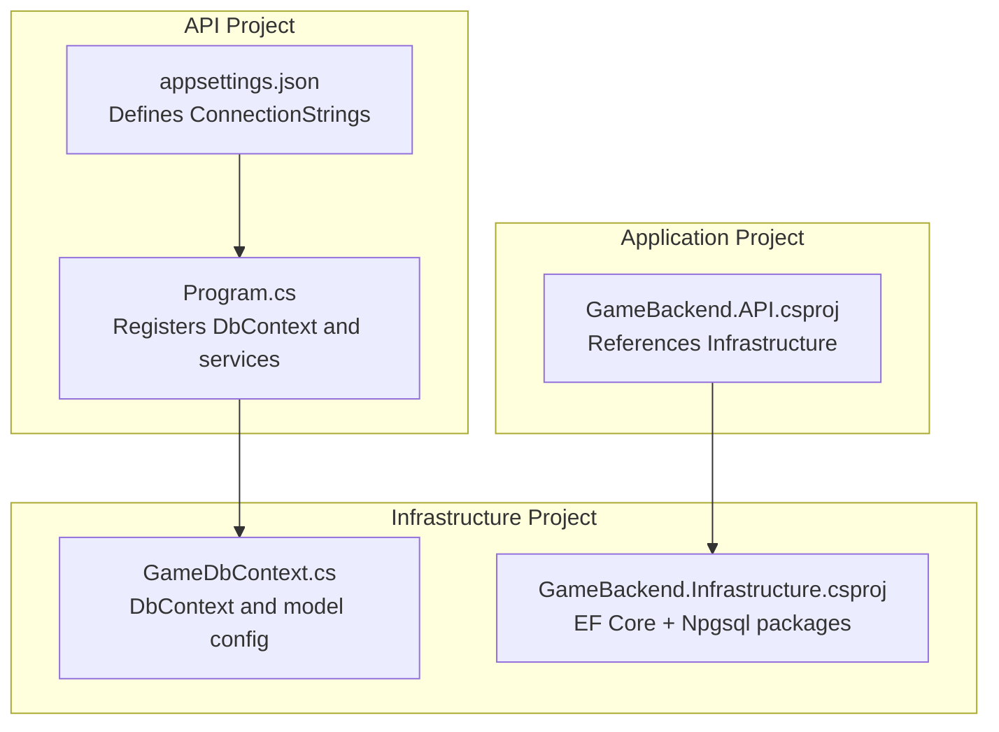
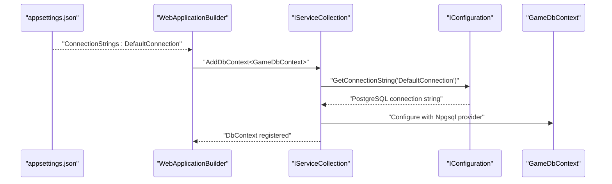
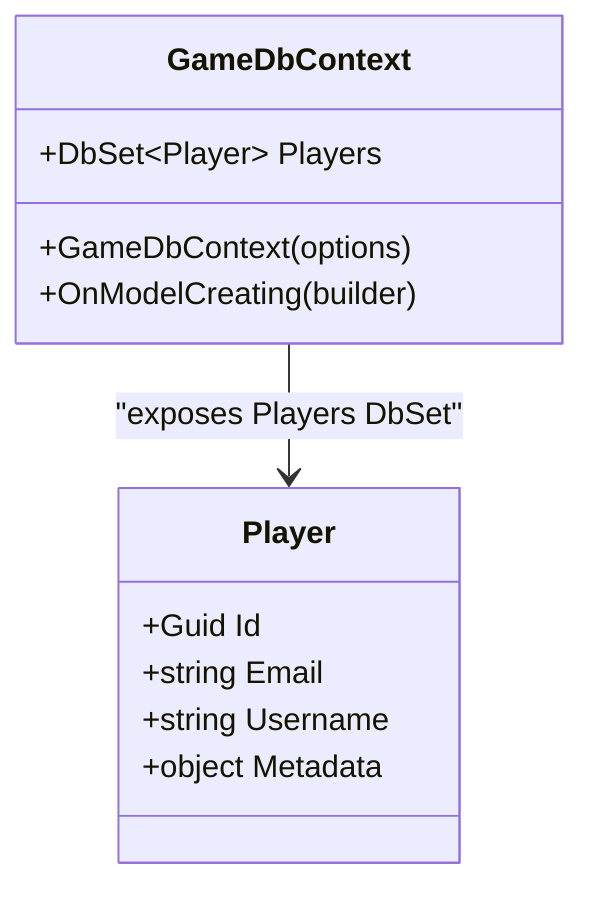
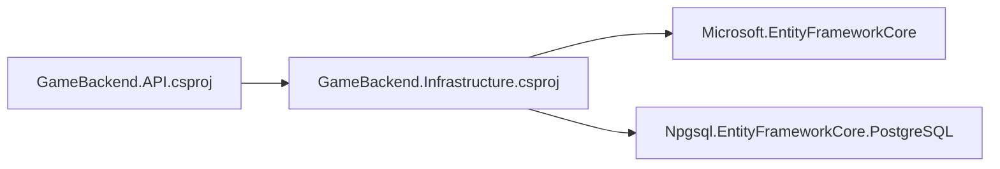

# Database Configuration

<cite>
**Referenced Files in This Document**
- [GameDbContext.cs](file://GameBackend.Infrastructure/Persistence/GameDbContext.cs)
- [Program.cs](file://GameBackend.API/Program.cs)
- [appsettings.json](file://GameBackend.API/appsettings.json)
- [appsettings.Development.json](file://GameBackend.API/appsettings.Development.json)
- [GameBackend.Infrastructure.csproj](file://GameBackend.Infrastructure/GameBackend.Infrastructure.csproj)
- [GameBackend.API.csproj](file://GameBackend.API/GameBackend.API.csproj)
</cite>

## Table of Contents
1. [Introduction](#introduction)
2. [Project Structure](#project-structure)
3. [Core Components](#core-components)
4. [Architecture Overview](#architecture-overview)
5. [Detailed Component Analysis](#detailed-component-analysis)
6. [Dependency Analysis](#dependency-analysis)
7. [Performance Considerations](#performance-considerations)
8. [Troubleshooting Guide](#troubleshooting-guide)
9. [Conclusion](#conclusion)

## Introduction
This document provides comprehensive database configuration guidance for the GameBackend project. It focuses on the PostgreSQL database setup, the Entity Framework Core configuration using Npgsql, the connection string format and parameters, and operational aspects such as initialization, migrations, connection pooling, security, environment-specific configuration, and troubleshooting connectivity issues.

## Project Structure
The database configuration spans several projects:
- The API project configures the service container and registers the Entity Framework Core services.
- The Infrastructure project defines the Entity Framework Core DbContext and model configuration.
- Settings are managed via JSON configuration files, with environment-specific overrides.

**Diagram sources**
- [Program.cs:16-17](file://GameBackend.API/Program.cs#L16-L17)
- [appsettings.json:14-16](file://GameBackend.API/appsettings.json#L14-L16)
- [GameDbContext.cs:6-11](file://GameBackend.Infrastructure/Persistence/GameDbContext.cs#L6-L11)
- [GameBackend.Infrastructure.csproj:12-18](file://GameBackend.Infrastructure/GameBackend.Infrastructure.csproj#L12-L18)
- [GameBackend.API.csproj:16-19](file://GameBackend.API/GameBackend.API.csproj#L16-L19)

**Section sources**
- [Program.cs:16-17](file://GameBackend.API/Program.cs#L16-L17)
- [appsettings.json:14-16](file://GameBackend.API/appsettings.json#L14-L16)
- [GameBackend.Infrastructure.csproj:12-18](file://GameBackend.Infrastructure/GameBackend.Infrastructure.csproj#L12-L18)
- [GameBackend.API.csproj:16-19](file://GameBackend.API/GameBackend.API.csproj#L16-L19)

## Core Components
- Connection String Definition: The default connection string is defined under the "ConnectionStrings" section with the key "DefaultConnection".
- DbContext Registration: The API project registers the DbContext using the Npgsql provider and binds it to the configured connection string.
- Model Configuration: The Infrastructure project configures the Player entity, including keys and unique indexes.

Key configuration locations:
- Connection string definition: [appsettings.json:14-16](file://GameBackend.API/appsettings.json#L14-L16)
- DbContext registration: [Program.cs:16-17](file://GameBackend.API/Program.cs#L16-L17)
- Model configuration: [GameDbContext.cs:19-26](file://GameBackend.Infrastructure/Persistence/GameDbContext.cs#L19-L26)

**Section sources**
- [appsettings.json:14-16](file://GameBackend.API/appsettings.json#L14-L16)
- [Program.cs:16-17](file://GameBackend.API/Program.cs#L16-L17)
- [GameDbContext.cs:19-26](file://GameBackend.Infrastructure/Persistence/GameDbContext.cs#L19-L26)

## Architecture Overview
The runtime database configuration flow connects configuration files to the DbContext through the service registration in the API project.

**Diagram sources**
- [appsettings.json:14-16](file://GameBackend.API/appsettings.json#L14-L16)
- [Program.cs:16-17](file://GameBackend.API/Program.cs#L16-L17)

## Detailed Component Analysis

### Connection String Format and Parameters
- Provider: PostgreSQL via Npgsql.
- Required Parameters:
  - Host: Database server hostname or IP address.
  - Port: PostgreSQL port number.
  - Database: Target database name.
  - Username: Database user.
  - Password: Database user password.
- Example location: [appsettings.json:14-16](file://GameBackend.API/appsettings.json#L14-L16)

Operational notes:
- The API project retrieves the connection string by key "DefaultConnection" and passes it to the Npgsql provider during DbContext registration. See: [Program.cs:16-17](file://GameBackend.API/Program.cs#L16-L17).

**Section sources**
- [appsettings.json:14-16](file://GameBackend.API/appsettings.json#L14-L16)
- [Program.cs:16-17](file://GameBackend.API/Program.cs#L16-L17)

### PostgreSQL Setup Requirements
- Provider Package: The Infrastructure project references the Npgsql Entity Framework Core provider package. See: [GameBackend.Infrastructure.csproj](file://GameBackend.Infrastructure/GameBackend.Infrastructure.csproj#L18).
- EF Core Runtime Package: The Infrastructure project references the EF Core runtime package. See: [GameBackend.Infrastructure.csproj](file://GameBackend.Infrastructure/GameBackend.Infrastructure.csproj#L12).
- Application References: The API project references the Infrastructure project. See: [GameBackend.API.csproj:16-19](file://GameBackend.API/GameBackend.API.csproj#L16-L19).

Entity model configuration:
- The Player entity defines primary key and unique indexes for Email and Username. See: [GameDbContext.cs:19-26](file://GameBackend.Infrastructure/Persistence/GameDbContext.cs#L19-L26).

**Section sources**
- [GameBackend.Infrastructure.csproj:12-18](file://GameBackend.Infrastructure/GameBackend.Infrastructure.csproj#L12-L18)
- [GameBackend.API.csproj:16-19](file://GameBackend.API/GameBackend.API.csproj#L16-L19)
- [GameDbContext.cs:19-26](file://GameBackend.Infrastructure/Persistence/GameDbContext.cs#L19-L26)

### Entity Framework Core Configuration
- DbContext Class: Declares the DbContext and exposes a DbSet for the Player entity. See: [GameDbContext.cs:6-13](file://GameBackend.Infrastructure/Persistence/GameDbContext.cs#L6-L13).
- Provider Registration: The API project configures the DbContext to use Npgsql with the connection string. See: [Program.cs:16-17](file://GameBackend.API/Program.cs#L16-L17).

**Diagram sources**
- [GameDbContext.cs:6-27](file://GameBackend.Infrastructure/Persistence/GameDbContext.cs#L6-L27)

**Section sources**
- [GameDbContext.cs:6-27](file://GameBackend.Infrastructure/Persistence/GameDbContext.cs#L6-L27)
- [Program.cs:16-17](file://GameBackend.API/Program.cs#L16-L17)

### Database Initialization and Migrations
- Design-Time Support: The Infrastructure project includes the EF Core design-time package, enabling migration tooling. See: [GameBackend.Infrastructure.csproj:13-16](file://GameBackend.Infrastructure/GameBackend.Infrastructure.csproj#L13-L16).
- Migration Workflow: Use the dotnet ef CLI to scaffold and apply migrations against the configured connection string. Typical commands include:
  - Scaffold a new migration: dotnet ef migrations add InitialCreate
  - Apply migrations: dotnet ef database update
- Connection String Source: The CLI reads the connection string from the "DefaultConnection" key in the active configuration. See: [appsettings.json:14-16](file://GameBackend.API/appsettings.json#L14-L16).

Notes:
- Ensure the target PostgreSQL database exists and is reachable before applying migrations.
- The design-time package enables tooling; runtime behavior is governed by the runtime EF Core package.

**Section sources**
- [GameBackend.Infrastructure.csproj:13-16](file://GameBackend.Infrastructure/GameBackend.Infrastructure.csproj#L13-L16)
- [appsettings.json:14-16](file://GameBackend.API/appsettings.json#L14-L16)

### Connection Pooling Configuration
- Default Behavior: Entity Framework Core relies on the underlying provider’s default connection pooling semantics when no explicit pool settings are provided.
- Provider Options: To tune pooling behavior (e.g., min/max pool size, connection timeout), pass provider-specific options when registering the DbContext. For Npgsql, options are set via UseNpgsql overloads that accept a delegate to configure Npgsql-specific options.
- Reference: DbContext registration in the API project uses UseNpgsql with the connection string. See: [Program.cs:16-17](file://GameBackend.API/Program.cs#L16-L17).

Recommendations:
- Define provider options in the service registration to control pool sizing and timeouts.
- Monitor pool exhaustion symptoms (timeouts, queue waits) and adjust accordingly.

**Section sources**
- [Program.cs:16-17](file://GameBackend.API/Program.cs#L16-L17)

### Database Security Considerations
- Connection String Storage:
  - Do not commit secrets to source control. Use environment variables or secret stores in production.
  - Override the "DefaultConnection" value via environment variables or secret managers in development and staging.
- Credential Rotation:
  - Change passwords regularly and update configuration values centrally.
- Network Security:
  - Prefer TLS-enabled connections to PostgreSQL.
  - Restrict network access to the database host.
- Least Privilege:
  - Use a dedicated database user with minimal required permissions for the application.

Environment-specific overrides:
- The API project supports environment-specific settings files. See: [appsettings.Development.json:1-9](file://GameBackend.API/appsettings.Development.json#L1-L9).

**Section sources**
- [appsettings.Development.json:1-9](file://GameBackend.API/appsettings.Development.json#L1-L9)

### Environment-Specific Configuration Management
- Base Settings: The API project defines the "DefaultConnection" key in its appsettings.json. See: [appsettings.json:14-16](file://GameBackend.API/appsettings.json#L14-L16).
- Development Overrides: The API project includes a development settings file for logging and other environment-specific values. See: [appsettings.Development.json:1-9](file://GameBackend.API/appsettings.Development.json#L1-L9).
- Recommended Practice:
  - Store sensitive values in environment variables or secret stores.
  - Use environment variables to override "ConnectionStrings:DefaultConnection" per environment.

**Section sources**
- [appsettings.json:14-16](file://GameBackend.API/appsettings.json#L14-L16)
- [appsettings.Development.json:1-9](file://GameBackend.API/appsettings.Development.json#L1-L9)

## Dependency Analysis
The API project depends on the Infrastructure project for the DbContext and model configuration. The Infrastructure project depends on EF Core and Npgsql packages.

**Diagram sources**
- [GameBackend.API.csproj:16-19](file://GameBackend.API/GameBackend.API.csproj#L16-L19)
- [GameBackend.Infrastructure.csproj:12-18](file://GameBackend.Infrastructure/GameBackend.Infrastructure.csproj#L12-L18)

**Section sources**
- [GameBackend.API.csproj:16-19](file://GameBackend.API/GameBackend.API.csproj#L16-L19)
- [GameBackend.Infrastructure.csproj:12-18](file://GameBackend.Infrastructure/GameBackend.Infrastructure.csproj#L12-L18)

## Performance Considerations
- Connection Pooling: Tune pool size and timeouts via provider options in the DbContext registration to match workload characteristics.
- Indexes: The Player entity includes unique indexes on Email and Username, supporting efficient lookups and uniqueness enforcement. See: [GameDbContext.cs:21-23](file://GameBackend.Infrastructure/Persistence/GameDbContext.cs#L21-L23).
- Logging: Enable appropriate logging levels to monitor database operations and potential bottlenecks. See: [appsettings.json:2-6](file://GameBackend.API/appsettings.json#L2-L6).

[No sources needed since this section provides general guidance]

## Troubleshooting Guide
Common connectivity issues and resolutions:
- Wrong Connection String Format:
  - Verify the "DefaultConnection" key contains all required parameters (Host, Port, Database, Username, Password). See: [appsettings.json:14-16](file://GameBackend.API/appsettings.json#L14-L16).
- Provider Not Installed:
  - Ensure the Npgsql EF Core provider is referenced in the Infrastructure project. See: [GameBackend.Infrastructure.csproj](file://GameBackend.Infrastructure/GameBackend.Infrastructure.csproj#L18).
- Migration Tooling Not Available:
  - Confirm the EF Core design-time package is present in the Infrastructure project. See: [GameBackend.Infrastructure.csproj:13-16](file://GameBackend.Infrastructure/GameBackend.Infrastructure.csproj#L13-L16).
- Environment Overrides:
  - Confirm environment variables override the connection string as intended in the current environment. See: [appsettings.Development.json:1-9](file://GameBackend.API/appsettings.Development.json#L1-L9).
- DbContext Registration:
  - Ensure the DbContext is registered with the Npgsql provider and the correct connection string key. See: [Program.cs:16-17](file://GameBackend.API/Program.cs#L16-L17).

**Section sources**
- [appsettings.json:14-16](file://GameBackend.API/appsettings.json#L14-L16)
- [GameBackend.Infrastructure.csproj:13-16](file://GameBackend.Infrastructure/GameBackend.Infrastructure.csproj#L13-L16)
- [Program.cs:16-17](file://GameBackend.API/Program.cs#L16-L17)
- [appsettings.Development.json:1-9](file://GameBackend.API/appsettings.Development.json#L1-L9)

## Conclusion
The GameBackend project uses Entity Framework Core with the Npgsql provider to connect to PostgreSQL. Configuration is centralized in the API project’s settings under the "DefaultConnection" key and bound during DbContext registration. The Infrastructure project defines the model and indexes for the Player entity. For production, manage secrets securely, tune connection pooling, and use migrations for schema updates. The troubleshooting guidance helps diagnose common connectivity and configuration issues.

[No sources needed since this section summarizes without analyzing specific files]