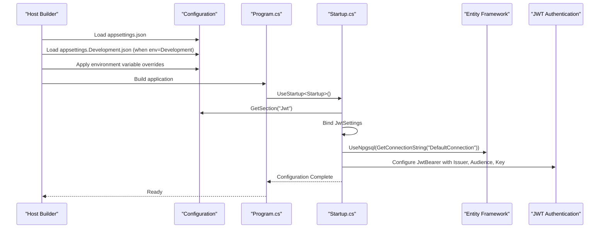
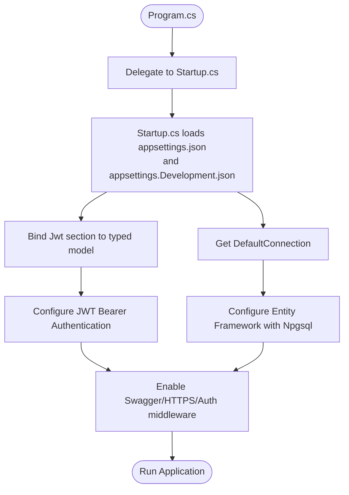
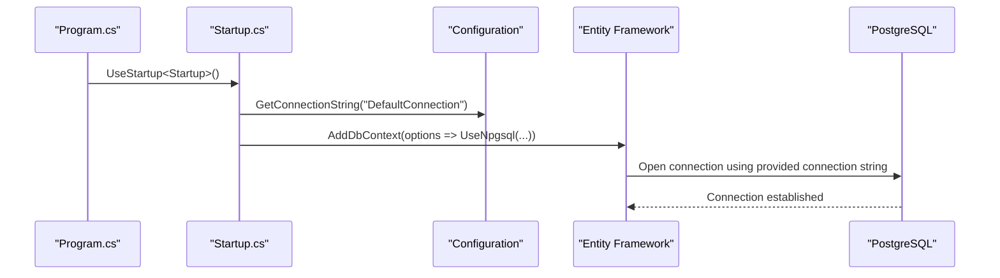
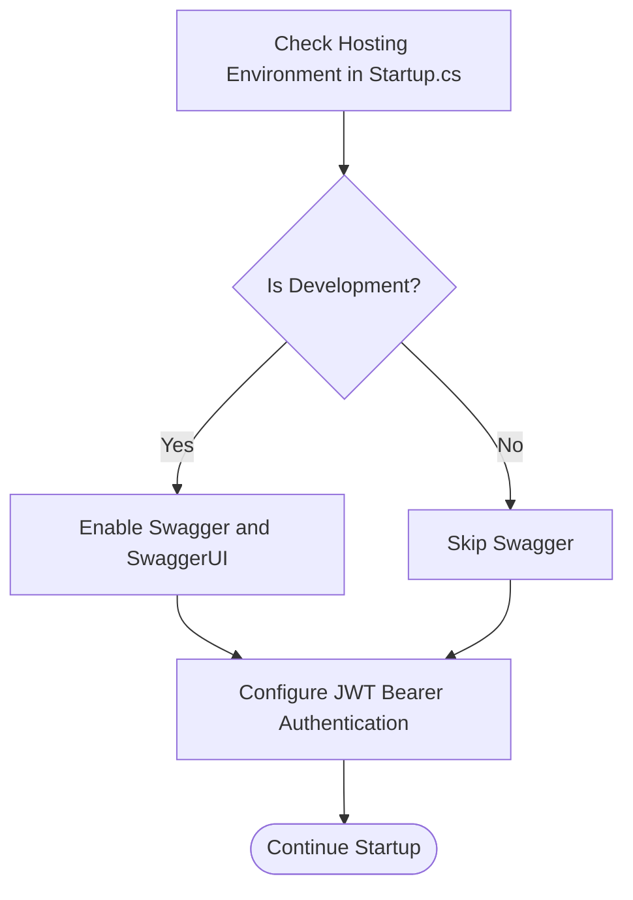
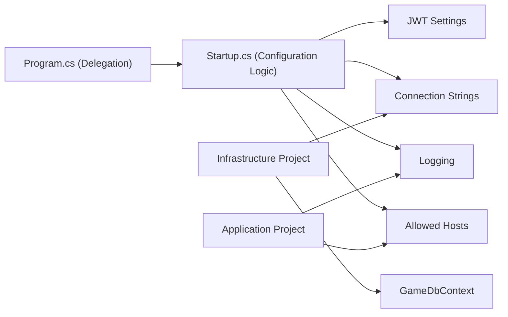

# Environment Configuration

<cite>
**Referenced Files in This Document**
- [GameBackend.API/appsettings.json](file://GameBackend.API/appsettings.json)
- [GameBackend.API/appsettings.Development.json](file://GameBackend.API/appsettings.Development.json)
- [GameBackend.API/Properties/launchSettings.json](file://GameBackend.API/Properties/launchSettings.json)
- [GameBackend.API/Program.cs](file://GameBackend.API/Program.cs)
- [GameBackend.API/Startup.cs](file://GameBackend.API/Startup.cs)
- [GameBackend.Application/appsettings.json](file://GameBackend.Application/appsettings.json)
- [GameBackend.Application/appsettings.Development.json](file://GameBackend.Application/appsettings.Development.json)
- [GameBackend.Application/Properties/launchSettings.json](file://GameBackend.Application/Properties/launchSettings.json)
- [GameBackend.Application/Program.cs](file://GameBackend.Application/Program.cs)
- [GameBackend.Core/appsettings.json](file://GameBackend.Core/appsettings.json)
- [GameBackend.Core/appsettings.Development.json](file://GameBackend.Core/appsettings.Development.json)
- [GameBackend.Infrastructure/appsettings.json](file://GameBackend.Infrastructure/appsettings.json)
- [GameBackend.Infrastructure/appsettings.Development.json](file://GameBackend.Infrastructure/appsettings.Development.json)
- [GameBackend.Tests/appsettings.json](file://GameBackend.Tests/appsettings.json)
- [GameBackend.Tests/appsettings.Development.json](file://GameBackend.Tests/appsettings.Development.json)
- [GameBackend.Infrastructure/Persistence/GameDbContext.cs](file://GameBackend.Infrastructure/Persistence/GameDbContext.cs)
</cite>

## Update Summary
**Changes Made**
- Updated configuration consumption examples to reflect the new Startup.cs pattern where Program.cs delegates configuration to Startup.cs
- Revised detailed component analysis to show how configuration logic moved from Program.cs to Startup.cs
- Updated architecture diagrams to demonstrate the delegation pattern from Program.cs to Startup.cs
- Enhanced dependency analysis to show the relationship between Program.cs and Startup.cs configuration flow

## Table of Contents
1. [Introduction](#introduction)
2. [Project Structure](#project-structure)
3. [Core Components](#core-components)
4. [Architecture Overview](#architecture-overview)
5. [Detailed Component Analysis](#detailed-component-analysis)
6. [Dependency Analysis](#dependency-analysis)
7. [Performance Considerations](#performance-considerations)
8. [Troubleshooting Guide](#troubleshooting-guide)
9. [Conclusion](#conclusion)
10. [Appendices](#appendices)

## Introduction
This document explains how environment configuration is organized and applied across the GameBackend solution. It covers the configuration hierarchy using appsettings.json and environment-specific files such as appsettings.Development.json, environment variable overrides via launch profiles, and practical strategies for managing secrets. The documentation now reflects the updated Startup.cs pattern where Program.cs delegates configuration responsibilities to the Startup.cs class while maintaining the same configuration consumption patterns.

## Project Structure
Each project in the solution follows a consistent pattern for configuration with the new Startup.cs delegation pattern:
- A base configuration file named appsettings.json defines default settings.
- An environment-specific file appsettings.Development.json extends or overrides settings for local development.
- Launch settings define environment variables (notably ASPNETCORE_ENVIRONMENT) and runtime URLs.
- Application code now uses Program.cs to delegate configuration to Startup.cs, which handles service registration and middleware setup.

```mermaid
graph TB
subgraph "API Project"
A1["appsettings.json"]
A2["appsettings.Development.json"]
A3["Properties/launchSettings.json"]
A4["Program.cs (Delegation)"]
A5["Startup.cs (Configuration Logic)"]
end
subgraph "Application Project"
B1["appsettings.json"]
B2["appsettings.Development.json"]
B3["Properties/launchSettings.json"]
B4["Program.cs (Minimal)"]
end
subgraph "Core Project"
C1["appsettings.json"]
C2["appsettings.Development.json"]
end
subgraph "Infrastructure Project"
D1["appsettings.json"]
D2["appsettings.Development.json"]
end
subgraph "Tests Project"
E1["appsettings.json"]
E2["appsettings.Development.json"]
end
A1 --> A2
A3 --> A4
A4 --> A5
B1 --> B2
B3 --> B4
C1 --> C2
D1 --> D2
E1 --> E2
```

**Diagram sources**
- [GameBackend.API/appsettings.json:1-17](file://GameBackend.API/appsettings.json#L1-L17)
- [GameBackend.API/appsettings.Development.json:1-9](file://GameBackend.API/appsettings.Development.json#L1-L9)
- [GameBackend.API/Properties/launchSettings.json:1-42](file://GameBackend.API/Properties/launchSettings.json#L1-L42)
- [GameBackend.API/Program.cs:1-16](file://GameBackend.API/Program.cs#L1-L16)
- [GameBackend.API/Startup.cs:1-117](file://GameBackend.API/Startup.cs#L1-L117)
- [GameBackend.Application/appsettings.json:1-10](file://GameBackend.Application/appsettings.json#L1-L10)
- [GameBackend.Application/appsettings.Development.json:1-9](file://GameBackend.Application/appsettings.Development.json#L1-L9)
- [GameBackend.Application/Properties/launchSettings.json:1-42](file://GameBackend.Application/Properties/launchSettings.json#L1-L42)
- [GameBackend.Application/Program.cs:1-44](file://GameBackend.Application/Program.cs#L1-L44)
- [GameBackend.Core/appsettings.json:1-10](file://GameBackend.Core/appsettings.json#L1-L10)
- [GameBackend.Core/appsettings.Development.json:1-9](file://GameBackend.Core/appsettings.Development.json#L1-L9)
- [GameBackend.Infrastructure/appsettings.json:1-10](file://GameBackend.Infrastructure/appsettings.json#L1-L10)
- [GameBackend.Infrastructure/appsettings.Development.json:1-9](file://GameBackend.Infrastructure/appsettings.Development.json#L1-L9)
- [GameBackend.Tests/appsettings.json:1-10](file://GameBackend.Tests/appsettings.json#L1-L10)
- [GameBackend.Tests/appsettings.Development.json:1-9](file://GameBackend.Tests/appsettings.Development.json#L1-L9)

**Section sources**
- [GameBackend.API/appsettings.json:1-17](file://GameBackend.API/appsettings.json#L1-L17)
- [GameBackend.API/appsettings.Development.json:1-9](file://GameBackend.API/appsettings.Development.json#L1-L9)
- [GameBackend.API/Properties/launchSettings.json:1-42](file://GameBackend.API/Properties/launchSettings.json#L1-L42)
- [GameBackend.API/Program.cs:1-16](file://GameBackend.API/Program.cs#L1-L16)
- [GameBackend.API/Startup.cs:1-117](file://GameBackend.API/Startup.cs#L1-L117)
- [GameBackend.Application/appsettings.json:1-10](file://GameBackend.Application/appsettings.json#L1-L10)
- [GameBackend.Application/appsettings.Development.json:1-9](file://GameBackend.Application/appsettings.Development.json#L1-L9)
- [GameBackend.Application/Properties/launchSettings.json:1-42](file://GameBackend.Application/Properties/launchSettings.json#L1-L42)
- [GameBackend.Application/Program.cs:1-44](file://GameBackend.Application/Program.cs#L1-L44)
- [GameBackend.Core/appsettings.json:1-10](file://GameBackend.Core/appsettings.json#L1-L10)
- [GameBackend.Core/appsettings.Development.json:1-9](file://GameBackend.Core/appsettings.Development.json#L1-L9)
- [GameBackend.Infrastructure/appsettings.json:1-10](file://GameBackend.Infrastructure/appsettings.json#L1-L10)
- [GameBackend.Infrastructure/appsettings.Development.json:1-9](file://GameBackend.Infrastructure/appsettings.Development.json#L1-L9)
- [GameBackend.Tests/appsettings.json:1-10](file://GameBackend.Tests/appsettings.json#L1-L10)
- [GameBackend.Tests/appsettings.Development.json:1-9](file://GameBackend.Tests/appsettings.Development.json#L1-L9)

## Core Components
- Configuration hierarchy: appsettings.json provides defaults; environment-specific files (e.g., appsettings.Development.json) override or extend them.
- Environment detection: The hosting environment is set via launch settings using the ASPNETCORE_ENVIRONMENT variable.
- Strongly-typed configuration: Projects bind configuration sections (for example, Jwt and ConnectionStrings) to strongly-typed models.
- Configuration delegation pattern: Program.cs now delegates configuration responsibilities to Startup.cs while maintaining the same configuration consumption patterns.
- Runtime configuration consumption: Services and middleware read configuration during startup to configure logging, authentication, and database connectivity.

Examples of configuration sections present in the API project:
- Logging: Controls log levels for default categories and specific frameworks.
- Allowed hosts: Defines permitted hosts for the application.
- JWT: Contains issuer, audience, and signing key used for authentication.
- Connection strings: Provides the default connection string for the database.

**Updated** The configuration consumption pattern now flows through Startup.cs where the actual configuration logic resides, while Program.cs handles the delegation.

**Section sources**
- [GameBackend.API/appsettings.json:1-17](file://GameBackend.API/appsettings.json#L1-L17)
- [GameBackend.API/Program.cs:1-16](file://GameBackend.API/Program.cs#L1-L16)
- [GameBackend.API/Startup.cs:24-93](file://GameBackend.API/Startup.cs#L24-L93)
- [GameBackend.Application/Program.cs:1-44](file://GameBackend.Application/Program.cs#L1-L44)

## Architecture Overview
The configuration architecture relies on the .NET host builder and configuration system with the new Startup.cs delegation pattern. At startup, the host loads configuration from multiple providers, merges them according to precedence, and exposes a unified configuration object to the application. The API project now demonstrates:
- Program.cs delegating configuration to Startup.cs
- Startup.cs binding JWT settings to a typed model
- Startup.cs using the connection string to configure Entity Framework Core
- Startup.cs configuring authentication with JWT bearer tokens
- Conditional middleware activation based on the environment

**Diagram sources**
- [GameBackend.API/Program.cs:10-15](file://GameBackend.API/Program.cs#L10-L15)
- [GameBackend.API/Startup.cs:24-93](file://GameBackend.API/Startup.cs#L24-L93)
- [GameBackend.API/appsettings.json:9-16](file://GameBackend.API/appsettings.json#L9-L16)
- [GameBackend.API/Properties/launchSettings.json:18-20](file://GameBackend.API/Properties/launchSettings.json#L18-L20)

**Section sources**
- [GameBackend.API/Program.cs:10-15](file://GameBackend.API/Program.cs#L10-L15)
- [GameBackend.API/Startup.cs:24-93](file://GameBackend.API/Startup.cs#L24-L93)
- [GameBackend.API/appsettings.json:9-16](file://GameBackend.API/appsettings.json#L9-L16)
- [GameBackend.API/Properties/launchSettings.json:18-20](file://GameBackend.API/Properties/launchSettings.json#L18-L20)

## Detailed Component Analysis

### Configuration Hierarchy and Environment-Specific Files
- Base configuration: appsettings.json contains shared defaults such as logging levels, allowed hosts, JWT settings, and connection strings.
- Development overrides: appsettings.Development.json augments logging levels for development convenience.
- Environment detection: launchSettings.json sets ASPNETCORE_ENVIRONMENT to Development for all profiles, ensuring the development configuration is loaded.

Practical implications:
- Local development benefits from more verbose logging and environment-specific settings.
- Production should rely on environment variables and external secret stores to override sensitive values without committing them to source control.

**Section sources**
- [GameBackend.API/appsettings.json:1-17](file://GameBackend.API/appsettings.json#L1-L17)
- [GameBackend.API/appsettings.Development.json:1-9](file://GameBackend.API/appsettings.Development.json#L1-L9)
- [GameBackend.API/Properties/launchSettings.json:18-20](file://GameBackend.API/Properties/launchSettings.json#L18-L20)

### Environment Variable Overrides and Launch Profiles
- Launch profiles define environment variables per profile (http, https, IIS Express), setting ASPNETCORE_ENVIRONMENT to Development.
- These profiles also control application URLs and whether the browser launches automatically.
- Environment variables can override configuration at runtime; however, the current launch settings primarily set the environment.

Recommendations:
- For staging and production, set ASPNETCORE_ENVIRONMENT to match the target environment so the appropriate appsettings.<Environment>.json is loaded.
- Use environment variables to override sensitive values such as JWT keys and connection strings.

**Section sources**
- [GameBackend.API/Properties/launchSettings.json:11-40](file://GameBackend.API/Properties/launchSettings.json#L11-L40)
- [GameBackend.Application/Properties/launchSettings.json:11-40](file://GameBackend.Application/Properties/launchSettings.json#L11-L40)

### Secret Management Strategies
Observed configuration includes:
- A JWT signing key under the Jwt section.
- A PostgreSQL connection string under ConnectionStrings.

Current state:
- Secrets are embedded in configuration files for demonstration purposes.

Recommended strategies:
- Use environment variables to override sensitive values in non-development environments.
- Use Azure Key Vault, AWS Secrets Manager, or equivalent secret stores in cloud environments.
- For local development, consider using user-secrets or environment variables to avoid committing secrets.

**Section sources**
- [GameBackend.API/appsettings.json:9-16](file://GameBackend.API/appsettings.json#L9-L16)

### Configuration Consumption in Application Code
- **Updated** Configuration delegation pattern: Program.cs now delegates configuration to Startup.cs using `webBuilder.UseStartup<Startup>()`.
- **Updated** Startup.cs handles all configuration logic including JWT settings binding, database configuration, and middleware setup.
- JWT settings binding: The Startup.cs class binds the Jwt section to a typed model and configures JWT bearer authentication with issuer, audience, and signing key.
- Database configuration: The Startup.cs class retrieves the DefaultConnection string and configures Entity Framework Core to use Npgsql.
- Environment-aware middleware: The Startup.cs class conditionally enables Swagger and SwaggerUI when the environment is Development.

**Diagram sources**
- [GameBackend.API/Program.cs:10-15](file://GameBackend.API/Program.cs#L10-L15)
- [GameBackend.API/Startup.cs:24-93](file://GameBackend.API/Startup.cs#L24-L93)
- [GameBackend.API/appsettings.json:9-16](file://GameBackend.API/appsettings.json#L9-L16)

**Section sources**
- [GameBackend.API/Program.cs:10-15](file://GameBackend.API/Program.cs#L10-L15)
- [GameBackend.API/Startup.cs:24-93](file://GameBackend.API/Startup.cs#L24-L93)

### Database Connectivity and Validation
- The Startup.cs class reads the DefaultConnection string and passes it to Entity Framework Core with Npgsql.
- The Infrastructure project defines the DbContext and entity mappings, which rely on the connection string being available at startup.

**Diagram sources**
- [GameBackend.API/Program.cs:14](file://GameBackend.API/Program.cs#L14)
- [GameBackend.API/Startup.cs:27-28](file://GameBackend.API/Startup.cs#L27-L28)
- [GameBackend.API/appsettings.json:14-16](file://GameBackend.API/appsettings.json#L14-L16)
- [GameBackend.Infrastructure/Persistence/GameDbContext.cs:8-11](file://GameBackend.Infrastructure/Persistence/GameDbContext.cs#L8-L11)

**Section sources**
- [GameBackend.API/Program.cs:14](file://GameBackend.API/Program.cs#L14)
- [GameBackend.API/Startup.cs:27-28](file://GameBackend.API/Startup.cs#L27-L28)
- [GameBackend.API/appsettings.json:14-16](file://GameBackend.API/appsettings.json#L14-L16)
- [GameBackend.Infrastructure/Persistence/GameDbContext.cs:8-11](file://GameBackend.Infrastructure/Persistence/GameDbContext.cs#L8-L11)

### Security Configuration and Environment Detection
- JWT authentication is configured using issuer, audience, and a signing key retrieved from configuration in Startup.cs.
- Environment detection is performed using the hosting environment in Startup.cs; middleware enabling Swagger is only active in Development.

**Diagram sources**
- [GameBackend.API/Startup.cs:95-101](file://GameBackend.API/Startup.cs#L95-L101)
- [GameBackend.API/Startup.cs:44-66](file://GameBackend.API/Startup.cs#L44-L66)

**Section sources**
- [GameBackend.API/Startup.cs:95-101](file://GameBackend.API/Startup.cs#L95-L101)
- [GameBackend.API/Startup.cs:44-66](file://GameBackend.API/Startup.cs#L44-L66)

## Dependency Analysis
Configuration dependencies across projects with the new delegation pattern:
- The API project now delegates configuration to Startup.cs while maintaining the same configuration consumption patterns.
- The Startup.cs class handles all configuration logic including services registration, middleware setup, and environment detection.
- The Infrastructure project depends on the connection string being available to configure the DbContext.
- The Application project includes minimal configuration and relies on environment detection for optional middleware.

**Diagram sources**
- [GameBackend.API/Program.cs:10-15](file://GameBackend.API/Program.cs#L10-L15)
- [GameBackend.API/Startup.cs:24-93](file://GameBackend.API/Startup.cs#L24-L93)
- [GameBackend.Infrastructure/Persistence/GameDbContext.cs:8-11](file://GameBackend.Infrastructure/Persistence/GameDbContext.cs#L8-L11)

**Section sources**
- [GameBackend.API/Program.cs:10-15](file://GameBackend.API/Program.cs#L10-L15)
- [GameBackend.API/Startup.cs:24-93](file://GameBackend.API/Startup.cs#L24-L93)
- [GameBackend.Infrastructure/Persistence/GameDbContext.cs:8-11](file://GameBackend.Infrastructure/Persistence/GameDbContext.cs#L8-L11)

## Performance Considerations
- Keep configuration retrieval minimal during startup; bind only the sections needed by services.
- Avoid loading heavy logging configurations in production unless necessary.
- Use environment variables for hot-swappable settings to reduce restarts when tuning non-sensitive parameters.
- **Updated** Leverage the delegation pattern to separate concerns between application startup and configuration logic.

## Troubleshooting Guide
Common issues and resolutions:
- Environment not detected as Development: Verify ASPNETCORE_ENVIRONMENT is set to Development in the active launch profile.
- JWT validation failures: Confirm issuer, audience, and signing key match the configuration values in Startup.cs.
- Database connection errors: Ensure the connection string is correct and accessible from the deployment environment.
- Missing configuration sections: Validate that required sections (for example, Jwt and ConnectionStrings) exist in the active configuration files.
- **Updated** Startup.cs not found: Ensure the Startup.cs file exists in the API project root and is properly configured in Program.cs.

**Section sources**
- [GameBackend.API/Properties/launchSettings.json:18-20](file://GameBackend.API/Properties/launchSettings.json#L18-L20)
- [GameBackend.API/Startup.cs:44-66](file://GameBackend.API/Startup.cs#L44-L66)
- [GameBackend.API/appsettings.json:9-16](file://GameBackend.API/appsettings.json#L9-L16)
- [GameBackend.API/Program.cs:14](file://GameBackend.API/Program.cs#L14)

## Conclusion
The GameBackend solution employs a clear configuration hierarchy with environment-specific files and launch profiles to manage settings across development, staging, and production. The new Startup.cs delegation pattern enhances maintainability by separating application startup concerns from configuration logic while preserving the same configuration consumption patterns. By binding strongly-typed models, using environment variables for overrides, and applying environment-aware middleware, the system supports secure and maintainable deployments. Adopting secret stores and environment-specific configuration files ensures robustness across diverse deployment targets.

## Appendices
- Best practices summary:
  - Store secrets externally (secret stores or environment variables) and override configuration in non-development environments.
  - Use appsettings.<Environment>.json for environment-specific settings.
  - Keep sensitive values out of source control; leverage user-secrets locally when appropriate.
  - Validate configuration bindings early in startup and fail fast on missing or invalid values.
  - **Updated** Implement the Startup.cs delegation pattern for better separation of concerns.