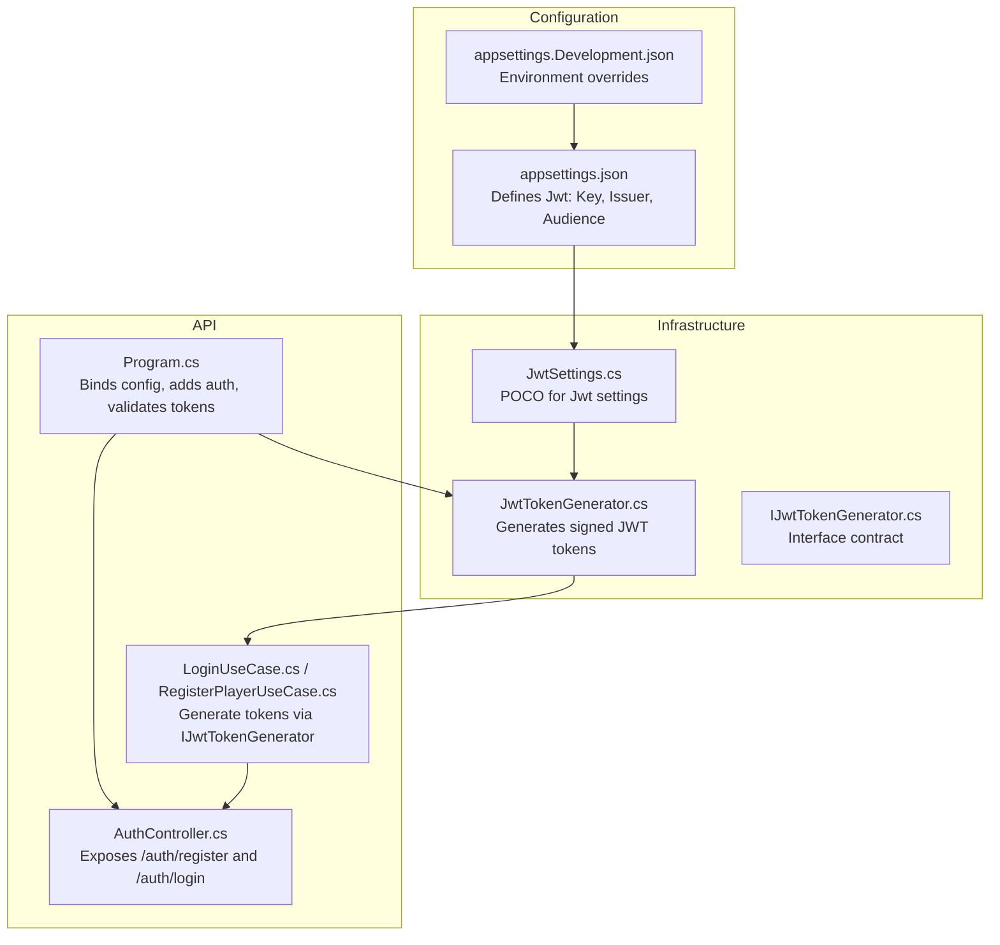
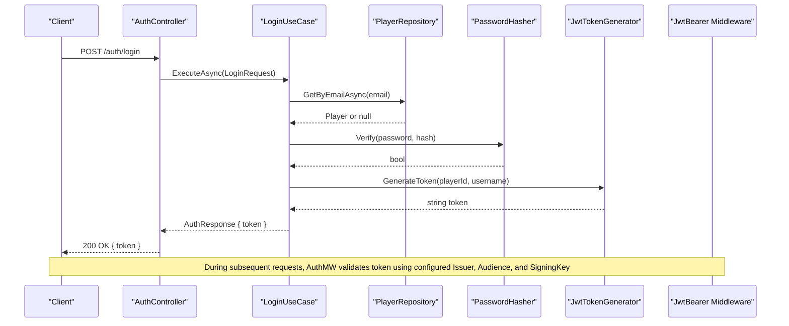
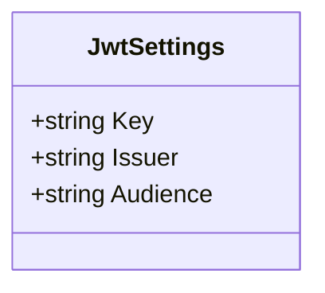
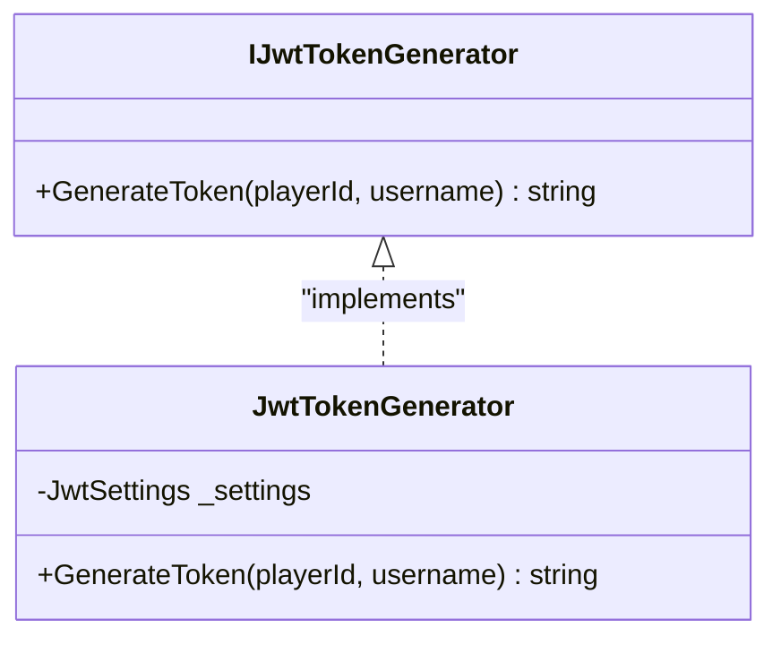
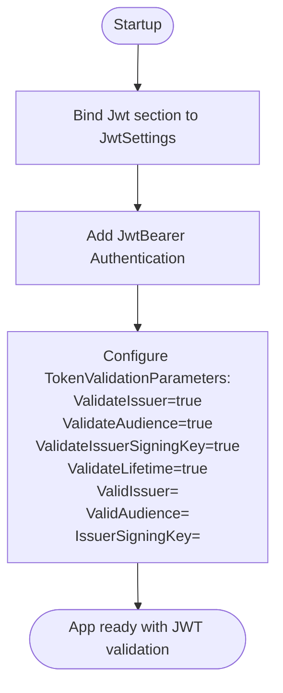
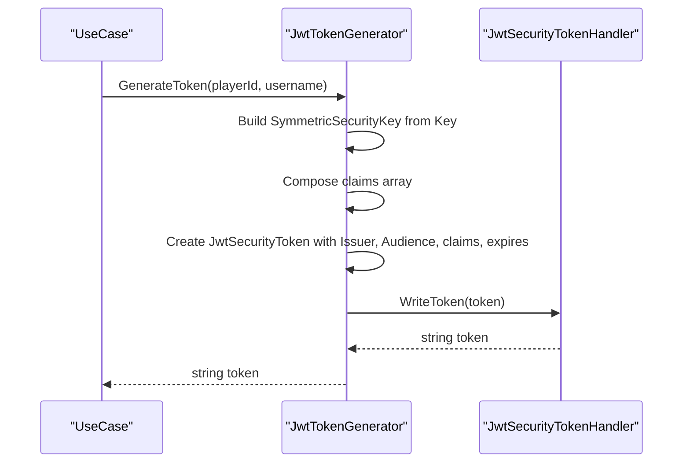
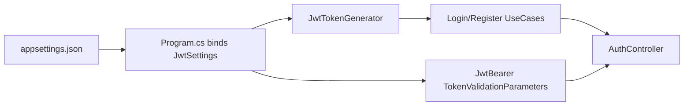

# JWT Configuration

<cite>
**Referenced Files in This Document**
- [appsettings.json](file://GameBackend.API/appsettings.json)
- [appsettings.Development.json](file://GameBackend.API/appsettings.Development.json)
- [Program.cs](file://GameBackend.API/Program.cs)
- [JwtSettings.cs](file://GameBackend.Infrastructure/Security/JwtSettings.cs)
- [JwtTokenGenerator.cs](file://GameBackend.Infrastructure/Security/JwtTokenGenerator.cs)
- [IJwtTokenGenerator.cs](file://GameBackend.Core/Interfaces/IJwtTokenGenerator.cs)
- [LoginUseCase.cs](file://GameBackend.Application/Contracts/UseCases/Auth/LoginUseCase.cs)
- [RegisterPlayerUseCase.cs](file://GameBackend.Application/Contracts/UseCases/Auth/RegisterPlayerUseCase.cs)
- [AuthController.cs](file://GameBackend.API/Controllers/AuthController.cs)
</cite>

## Table of Contents
1. [Introduction](#introduction)
2. [Project Structure](#project-structure)
3. [Core Components](#core-components)
4. [Architecture Overview](#architecture-overview)
5. [Detailed Component Analysis](#detailed-component-analysis)
6. [Dependency Analysis](#dependency-analysis)
7. [Performance Considerations](#performance-considerations)
8. [Troubleshooting Guide](#troubleshooting-guide)
9. [Conclusion](#conclusion)
10. [Appendices](#appendices)

## Introduction
This document provides comprehensive guidance for JWT configuration in the GameBackend authentication system. It explains how the Key, Issuer, and Audience parameters are defined and used for token generation and validation, outlines secure key management practices, and offers best practices for production deployments, environment-specific settings, key rotation strategies, and troubleshooting common authentication issues.

## Project Structure
The JWT configuration spans three layers:
- Configuration layer: appsettings.json defines the Jwt section with Key, Issuer, and Audience.
- Infrastructure layer: JwtSettings model and JwtTokenGenerator implement token creation using HMAC-SHA256 with a symmetric key.
- API layer: Program.cs binds configuration to JwtSettings, registers authentication with JwtBearer defaults, and configures token validation parameters.

**Diagram sources**
- [appsettings.json:1-17](file://GameBackend.API/appsettings.json#L1-L17)
- [appsettings.Development.json:1-9](file://GameBackend.API/appsettings.Development.json#L1-L9)
- [JwtSettings.cs:1-8](file://GameBackend.Infrastructure/Security/JwtSettings.cs#L1-L8)
- [JwtTokenGenerator.cs:1-44](file://GameBackend.Infrastructure/Security/JwtTokenGenerator.cs#L1-L44)
- [IJwtTokenGenerator.cs:1-6](file://GameBackend.Core/Interfaces/IJwtTokenGenerator.cs#L1-L6)
- [Program.cs:1-72](file://GameBackend.API/Program.cs#L1-L72)
- [LoginUseCase.cs:1-45](file://GameBackend.Application/Contracts/UseCases/Auth/LoginUseCase.cs#L1-L45)
- [RegisterPlayerUseCase.cs:1-58](file://GameBackend.Application/Contracts/UseCases/Auth/RegisterPlayerUseCase.cs#L1-L58)
- [AuthController.cs:1-49](file://GameBackend.API/Controllers/AuthController.cs#L1-L49)

**Section sources**
- [appsettings.json:1-17](file://GameBackend.API/appsettings.json#L1-L17)
- [appsettings.Development.json:1-9](file://GameBackend.API/appsettings.Development.json#L1-L9)
- [Program.cs:11-50](file://GameBackend.API/Program.cs#L11-L50)
- [JwtSettings.cs:1-8](file://GameBackend.Infrastructure/Security/JwtSettings.cs#L1-L8)
- [JwtTokenGenerator.cs:11-44](file://GameBackend.Infrastructure/Security/JwtTokenGenerator.cs#L11-L44)
- [IJwtTokenGenerator.cs:1-6](file://GameBackend.Core/Interfaces/IJwtTokenGenerator.cs#L1-L6)
- [LoginUseCase.cs:22-44](file://GameBackend.Application/Contracts/UseCases/Auth/LoginUseCase.cs#L22-L44)
- [RegisterPlayerUseCase.cs:23-57](file://GameBackend.Application/Contracts/UseCases/Auth/RegisterPlayerUseCase.cs#L23-L57)
- [AuthController.cs:7-49](file://GameBackend.API/Controllers/AuthController.cs#L7-L49)

## Core Components
- JwtSettings: Strongly typed configuration model for JWT settings (Key, Issuer, Audience).
- JwtTokenGenerator: Implements token generation using HMAC-SHA256 with a symmetric key derived from the configured Key.
- Authentication registration: Program.cs binds configuration to JwtSettings, registers JwtBearer authentication, and sets TokenValidationParameters for issuer, audience, signing key, and lifetime validation.

Key configuration locations:
- Jwt settings definition: [appsettings.json:9-13](file://GameBackend.API/appsettings.json#L9-L13)
- Settings binding and service registration: [Program.cs:13-24](file://GameBackend.API/Program.cs#L13-L24)
- Validation parameters setup: [Program.cs:37-50](file://GameBackend.API/Program.cs#L37-L50)
- Token generation logic: [JwtTokenGenerator.cs:20-43](file://GameBackend.Infrastructure/Security/JwtTokenGenerator.cs#L20-L43)

**Section sources**
- [appsettings.json:9-13](file://GameBackend.API/appsettings.json#L9-L13)
- [Program.cs:13-24](file://GameBackend.API/Program.cs#L13-L24)
- [Program.cs:37-50](file://GameBackend.API/Program.cs#L37-L50)
- [JwtSettings.cs:3-8](file://GameBackend.Infrastructure/Security/JwtSettings.cs#L3-L8)
- [JwtTokenGenerator.cs:11-44](file://GameBackend.Infrastructure/Security/JwtTokenGenerator.cs#L11-L44)

## Architecture Overview
The authentication flow integrates configuration-driven JWT settings with runtime token generation and validation middleware.

**Diagram sources**
- [AuthController.cs:36-48](file://GameBackend.API/Controllers/AuthController.cs#L36-L48)
- [LoginUseCase.cs:22-44](file://GameBackend.Application/Contracts/UseCases/Auth/LoginUseCase.cs#L22-L44)
- [RegisterPlayerUseCase.cs:23-57](file://GameBackend.Application/Contracts/UseCases/Auth/RegisterPlayerUseCase.cs#L23-L57)
- [JwtTokenGenerator.cs:20-43](file://GameBackend.Infrastructure/Security/JwtTokenGenerator.cs#L20-L43)
- [Program.cs:32-50](file://GameBackend.API/Program.cs#L32-L50)

## Detailed Component Analysis

### JwtSettings Model
- Purpose: Provides a strongly typed representation of the Jwt configuration section.
- Properties: Key, Issuer, Audience.
- Binding: Configured in Program.cs via builder.Configuration.GetSection("Jwt").

**Diagram sources**
- [JwtSettings.cs:3-8](file://GameBackend.Infrastructure/Security/JwtSettings.cs#L3-L8)

**Section sources**
- [JwtSettings.cs:3-8](file://GameBackend.Infrastructure/Security/JwtSettings.cs#L3-L8)
- [Program.cs:13-14](file://GameBackend.API/Program.cs#L13-L14)

### JwtTokenGenerator
- Role: Generates signed JWT tokens using HMAC-SHA256 with a symmetric key.
- Inputs: Player identity and username become registered claims.
- Outputs: Signed JWT string with configured Issuer, Audience, and expiration.
- Validation: Uses the configured Key to construct the signing key and applies issuer/audience constraints during generation.

**Diagram sources**
- [IJwtTokenGenerator.cs:3-6](file://GameBackend.Core/Interfaces/IJwtTokenGenerator.cs#L3-L6)
- [JwtTokenGenerator.cs:11-44](file://GameBackend.Infrastructure/Security/JwtTokenGenerator.cs#L11-L44)

**Section sources**
- [JwtTokenGenerator.cs:11-44](file://GameBackend.Infrastructure/Security/JwtTokenGenerator.cs#L11-L44)
- [IJwtTokenGenerator.cs:3-6](file://GameBackend.Core/Interfaces/IJwtTokenGenerator.cs#L3-L6)

### Authentication Registration and Validation
- Binding: The Jwt section is bound to JwtSettings and services are registered.
- Authentication: Adds JwtBearer authentication with default schemes.
- Validation: TokenValidationParameters enforces issuer, audience, signing key, and lifetime checks using the configured values.

**Diagram sources**
- [Program.cs:13-24](file://GameBackend.API/Program.cs#L13-L24)
- [Program.cs:32-50](file://GameBackend.API/Program.cs#L32-L50)

**Section sources**
- [Program.cs:13-24](file://GameBackend.API/Program.cs#L13-L24)
- [Program.cs:32-50](file://GameBackend.API/Program.cs#L32-L50)

### Token Generation Workflow
- Claims: Subject and UniqueName claims are populated from player identity and username.
- Signing: HMAC-SHA256 with a symmetric key derived from the configured Key.
- Expiration: Tokens expire after seven days from issue time.

**Diagram sources**
- [JwtTokenGenerator.cs:20-43](file://GameBackend.Infrastructure/Security/JwtTokenGenerator.cs#L20-L43)

**Section sources**
- [JwtTokenGenerator.cs:20-43](file://GameBackend.Infrastructure/Security/JwtTokenGenerator.cs#L20-L43)

## Dependency Analysis
- Configuration dependency: Program.cs depends on appsettings.json for Jwt settings.
- Runtime dependency: JwtTokenGenerator depends on JwtSettings for issuer, audience, and key.
- Validation dependency: JwtBearer middleware depends on Program.cs configuration for TokenValidationParameters.
- Application integration: Use cases depend on IJwtTokenGenerator to produce tokens returned to clients.

**Diagram sources**
- [appsettings.json:9-13](file://GameBackend.API/appsettings.json#L9-L13)
- [Program.cs:13-24](file://GameBackend.API/Program.cs#L13-L24)
- [Program.cs:37-50](file://GameBackend.API/Program.cs#L37-L50)
- [JwtTokenGenerator.cs:11-18](file://GameBackend.Infrastructure/Security/JwtTokenGenerator.cs#L11-L18)
- [LoginUseCase.cs:10-20](file://GameBackend.Application/Contracts/UseCases/Auth/LoginUseCase.cs#L10-L20)
- [RegisterPlayerUseCase.cs:11-21](file://GameBackend.Application/Contracts/UseCases/Auth/RegisterPlayerUseCase.cs#L11-L21)
- [AuthController.cs:7-20](file://GameBackend.API/Controllers/AuthController.cs#L7-L20)

**Section sources**
- [Program.cs:13-24](file://GameBackend.API/Program.cs#L13-L24)
- [Program.cs:37-50](file://GameBackend.API/Program.cs#L37-L50)
- [JwtTokenGenerator.cs:11-18](file://GameBackend.Infrastructure/Security/JwtTokenGenerator.cs#L11-L18)
- [LoginUseCase.cs:10-20](file://GameBackend.Application/Contracts/UseCases/Auth/LoginUseCase.cs#L10-L20)
- [RegisterPlayerUseCase.cs:11-21](file://GameBackend.Application/Contracts/UseCases/Auth/RegisterPlayerUseCase.cs#L11-L21)
- [AuthController.cs:7-20](file://GameBackend.API/Controllers/AuthController.cs#L7-L20)

## Performance Considerations
- Token size: Keep claims minimal to reduce payload size and transmission overhead.
- Expiration policy: Shorter expirations improve security but increase refresh frequency; balance based on risk tolerance.
- Signing algorithm: HMAC-SHA256 is efficient; avoid overly expensive algorithms for high-throughput scenarios.
- Validation caching: Consider caching frequently accessed keys if rotating keys across instances.

## Troubleshooting Guide
Common JWT-related authentication issues and resolutions:

- Invalid issuer
  - Symptom: Authentication fails with issuer mismatch.
  - Cause: Client sends token with a different Issuer than configured.
  - Resolution: Ensure client uses tokens issued by the configured Issuer.

- Invalid audience
  - Symptom: Authentication fails with audience mismatch.
  - Cause: Token intended for a different Audience.
  - Resolution: Ensure the application consumes tokens for the configured Audience.

- Invalid issuer signing key
  - Symptom: Signature validation errors.
  - Cause: Mismatch between signing key used to generate the token and the key configured for validation.
  - Resolution: Align the Key value across all instances and environments.

- Expired token
  - Symptom: Authentication fails due to lifetime validation.
  - Cause: Token expired per configured expiration.
  - Resolution: Regenerate token or adjust expiration policy.

- Misconfigured token validation parameters
  - Symptom: Unexpected authentication failures.
  - Cause: Validation disabled or incorrectly set.
  - Resolution: Confirm ValidateIssuer, ValidateAudience, ValidateIssuerSigningKey, and ValidateLifetime are enabled with correct values.

Operational checks:
- Verify configuration binding: Ensure the Jwt section is correctly bound to JwtSettings.
- Verify middleware order: Authentication and Authorization middleware must be configured before controller actions.
- Environment overrides: Confirm environment-specific appsettings do not override Jwt settings unintentionally.

**Section sources**
- [Program.cs:39-50](file://GameBackend.API/Program.cs#L39-L50)
- [appsettings.json:9-13](file://GameBackend.API/appsettings.json#L9-L13)
- [appsettings.Development.json:1-9](file://GameBackend.API/appsettings.Development.json#L1-L9)

## Conclusion
The GameBackend authentication system uses a straightforward JWT configuration with symmetric key signing. By centralizing Key, Issuer, and Audience in configuration, binding them at startup, and enforcing strict validation parameters, the system achieves predictable and secure token-based authentication. For production, prioritize secure key management, environment isolation, and robust operational monitoring.

## Appendices

### JWT Configuration Best Practices
- Secure key management
  - Store the Key in environment variables or secret stores; avoid committing secrets to source control.
  - Rotate keys regularly and support key versioning for seamless transitions.
- Production hardening
  - Enforce HTTPS to protect tokens in transit.
  - Use short-lived access tokens with refresh token mechanisms if applicable.
  - Monitor and log authentication failures for anomaly detection.
- Environment-specific settings
  - Use separate appsettings.{Environment}.json files for distinct Issuer, Audience, and Key per environment.
  - Ensure environment variables override configuration for sensitive values in production.

### Key Rotation Strategies
- Dual-key validation: Temporarily accept tokens signed by the previous and current keys during rotation.
- Gradual rollout: Update IssuerSigningKey to the new key while still accepting the old key for a grace period.
- Decommissioning: Remove old key after all clients have migrated and the grace period ends.

### Example Configuration References
- Jwt section definition: [appsettings.json:9-13](file://GameBackend.API/appsettings.json#L9-L13)
- Settings binding: [Program.cs:13-14](file://GameBackend.API/Program.cs#L13-L14)
- Validation parameters: [Program.cs:39-50](file://GameBackend.API/Program.cs#L39-L50)
- Token generation: [JwtTokenGenerator.cs:20-43](file://GameBackend.Infrastructure/Security/JwtTokenGenerator.cs#L20-L43)