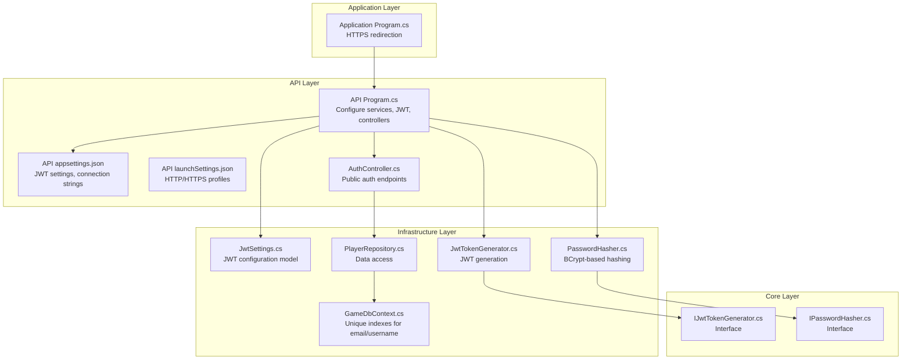
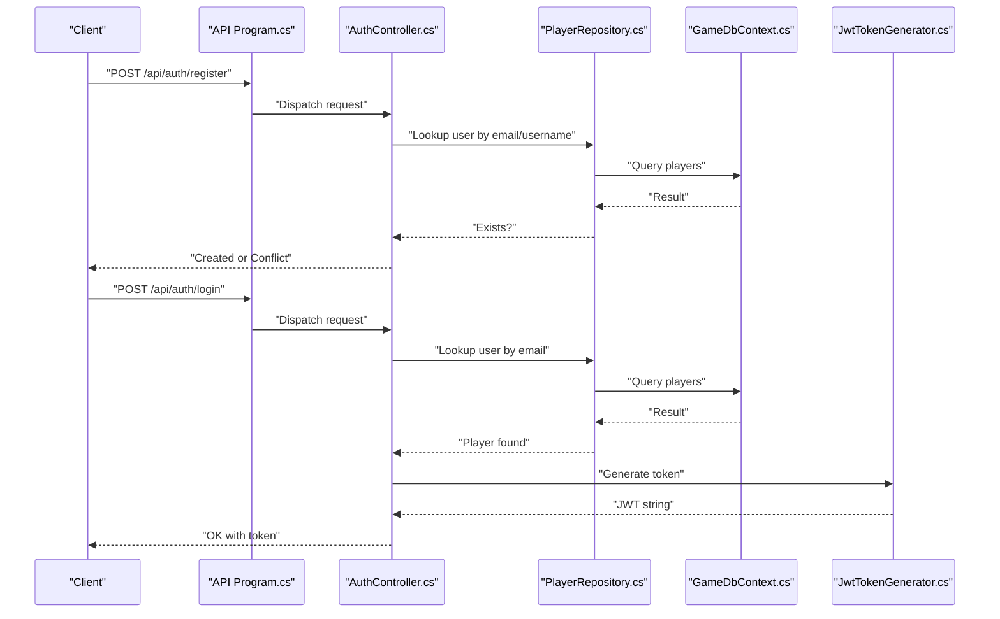
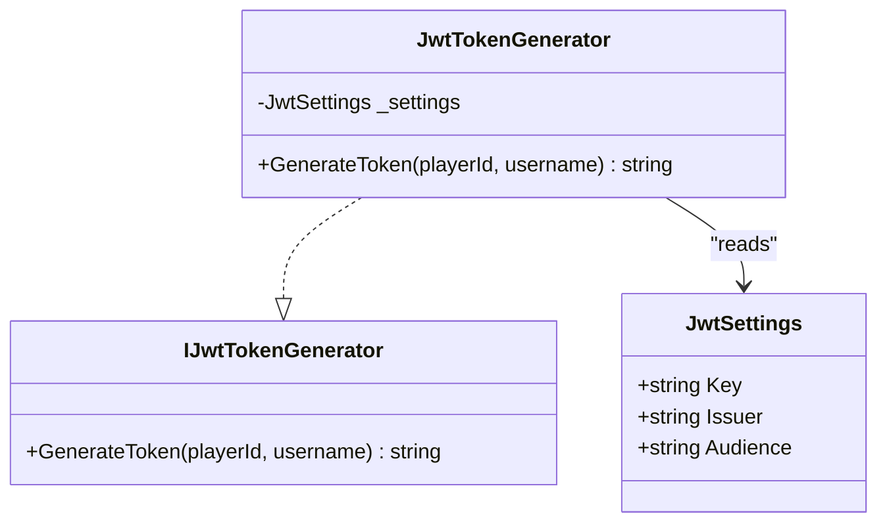
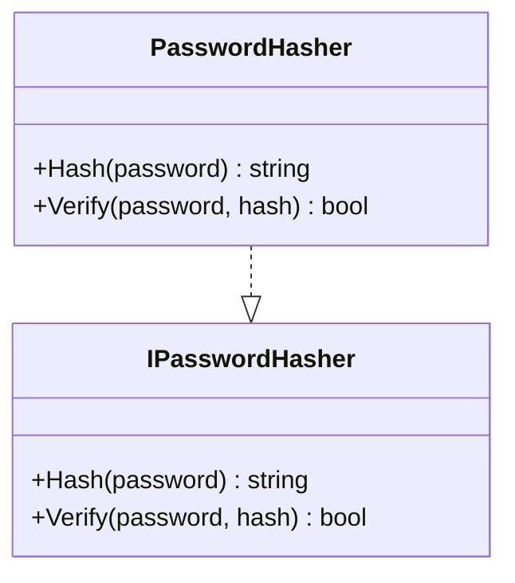
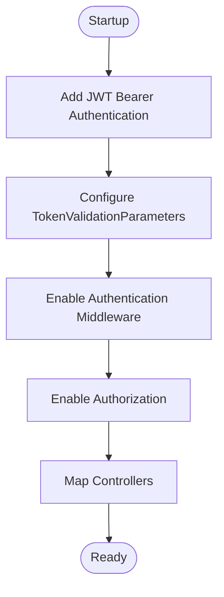
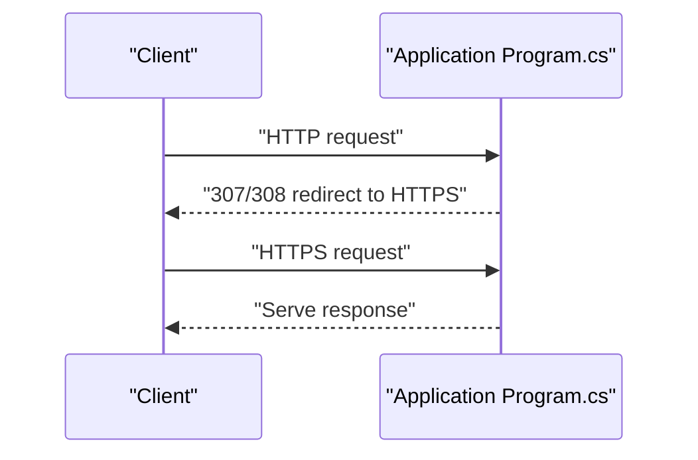
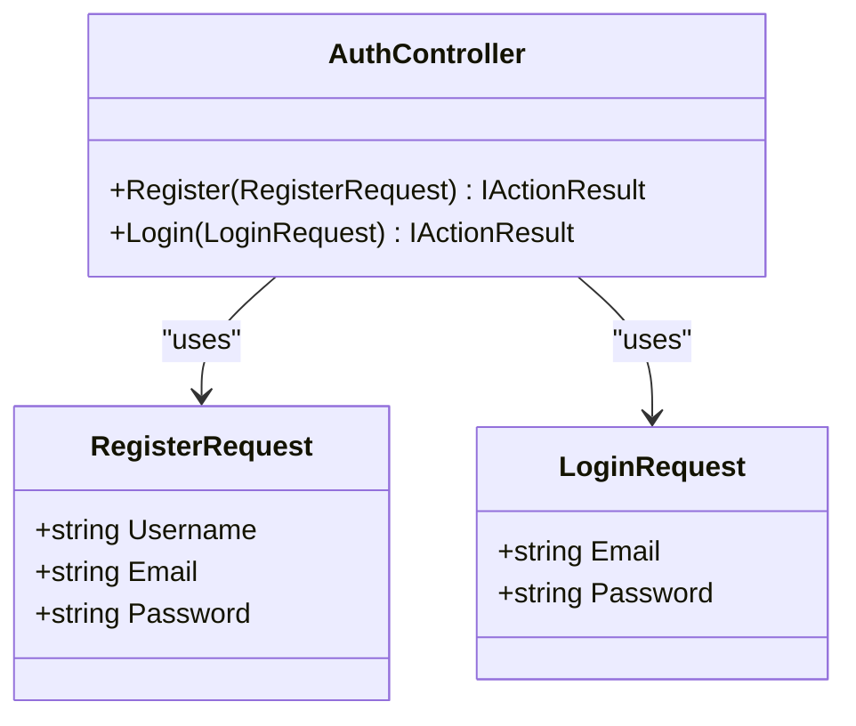
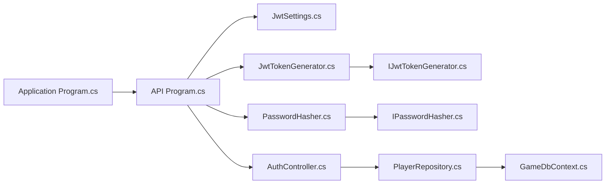

# Security Settings

<cite>
**Referenced Files in This Document**
- [Program.cs](file://GameBackend.API/Program.cs)
- [appsettings.json](file://GameBackend.API/appsettings.json)
- [appsettings.Development.json](file://GameBackend.API/appsettings.Development.json)
- [Program.cs](file://GameBackend.Application/Program.cs)
- [launchSettings.json](file://GameBackend.API/Properties/launchSettings.json)
- [JwtSettings.cs](file://GameBackend.Infrastructure/Security/JwtSettings.cs)
- [JwtTokenGenerator.cs](file://GameBackend.Infrastructure/Security/JwtTokenGenerator.cs)
- [PasswordHasher.cs](file://GameBackend.Infrastructure/Security/PasswordHasher.cs)
- [IJwtTokenGenerator.cs](file://GameBackend.Core/Interfaces/IJwtTokenGenerator.cs)
- [IPasswordHasher.cs](file://GameBackend.Core/Interfaces/IPasswordHasher.cs)
- [AuthController.cs](file://GameBackend.API/Controllers/AuthController.cs)
- [GameDbContext.cs](file://GameBackend.Infrastructure/Persistence/GameDbContext.cs)
- [PlayerRepository.cs](file://GameBackend.Infrastructure/Repositories/PlayerRepository.cs)
- [LoginRequest.cs](file://GameBackend.Application/Contracts/Auth/LoginRequest.cs)
- [RegisterRequest.cs](file://GameBackend.Application/Contracts/Auth/RegisterRequest.cs)
</cite>

## Table of Contents
1. [Introduction](#introduction)
2. [Project Structure](#project-structure)
3. [Core Components](#core-components)
4. [Architecture Overview](#architecture-overview)
5. [Detailed Component Analysis](#detailed-component-analysis)
6. [Dependency Analysis](#dependency-analysis)
7. [Performance Considerations](#performance-considerations)
8. [Troubleshooting Guide](#troubleshooting-guide)
9. [Conclusion](#conclusion)
10. [Appendices](#appendices)

## Introduction
This document provides comprehensive security settings documentation for the GameBackend project. It focuses on JWT security configurations, password hashing settings, authentication middleware configuration, security headers, CORS policies, HTTPS enforcement, secure configuration practices, vulnerability prevention, compliance considerations, security monitoring, audit logging configuration, and incident response settings. Guidance is grounded in the actual implementation present in the repository.

## Project Structure
The security-relevant parts of the project are distributed across:
- API project: application bootstrapping, authentication middleware, and configuration loading
- Infrastructure project: JWT settings model, JWT token generator, and password hasher
- Application project: program initialization and HTTPS redirection
- Core project: interfaces for JWT and password hashing
- Data persistence: database context and repository for player data

**Diagram sources**
- [Program.cs:1-61](file://GameBackend.API/Program.cs#L1-L61)
- [appsettings.json:1-17](file://GameBackend.API/appsettings.json#L1-L17)
- [launchSettings.json:1-41](file://GameBackend.API/Properties/launchSettings.json#L1-L41)
- [JwtSettings.cs:1-8](file://GameBackend.Infrastructure/Security/JwtSettings.cs#L1-L8)
- [JwtTokenGenerator.cs:1-40](file://GameBackend.Infrastructure/Security/JwtTokenGenerator.cs#L1-L40)
- [PasswordHasher.cs:1-16](file://GameBackend.Infrastructure/Security/PasswordHasher.cs#L1-L16)
- [GameDbContext.cs:1-28](file://GameBackend.Infrastructure/Persistence/GameDbContext.cs#L1-L28)
- [PlayerRepository.cs:1-34](file://GameBackend.Infrastructure/Repositories/PlayerRepository.cs#L1-L34)
- [IJwtTokenGenerator.cs:1-6](file://GameBackend.Core/Interfaces/IJwtTokenGenerator.cs#L1-L6)
- [IPasswordHasher.cs:1-7](file://GameBackend.Core/Interfaces/IPasswordHasher.cs#L1-L7)
- [AuthController.cs:1-47](file://GameBackend.API/Controllers/AuthController.cs#L1-L47)
- [Program.cs:1-44](file://GameBackend.Application/Program.cs#L1-L44)

**Section sources**
- [Program.cs:1-61](file://GameBackend.API/Program.cs#L1-L61)
- [Program.cs:1-44](file://GameBackend.Application/Program.cs#L1-L44)
- [appsettings.json:1-17](file://GameBackend.API/appsettings.json#L1-L17)
- [launchSettings.json:1-41](file://GameBackend.API/Properties/launchSettings.json#L1-L41)

## Core Components
- JWT configuration model and generator:
  - JwtSettings defines Key, Issuer, and Audience used by the JWT generator
  - JwtTokenGenerator creates signed tokens with HMAC SHA-256 and sets expiration
- Password hashing:
  - PasswordHasher uses BCrypt for secure hashing and verification
- Authentication middleware:
  - API Program configures JWT Bearer authentication with issuer, audience, and signing key validation
- HTTPS enforcement:
  - Application Program enables HTTPS redirection
- Data protection:
  - GameDbContext enforces unique indexes on email and username

**Section sources**
- [JwtSettings.cs:1-8](file://GameBackend.Infrastructure/Security/JwtSettings.cs#L1-L8)
- [JwtTokenGenerator.cs:1-40](file://GameBackend.Infrastructure/Security/JwtTokenGenerator.cs#L1-L40)
- [PasswordHasher.cs:1-16](file://GameBackend.Infrastructure/Security/PasswordHasher.cs#L1-L16)
- [Program.cs:28-46](file://GameBackend.API/Program.cs#L28-L46)
- [Program.cs:17-17](file://GameBackend.Application/Program.cs#L17-L17)
- [GameDbContext.cs:19-26](file://GameBackend.Infrastructure/Persistence/GameDbContext.cs#L19-L26)

## Architecture Overview
The authentication and security flow integrates configuration-driven JWT settings, a password hasher, and JWT bearer middleware. Requests hit the AuthController endpoints, which delegate to use cases that rely on repositories backed by a database enforcing uniqueness constraints.

**Diagram sources**
- [Program.cs:1-61](file://GameBackend.API/Program.cs#L1-L61)
- [AuthController.cs:1-47](file://GameBackend.API/Controllers/AuthController.cs#L1-L47)
- [PlayerRepository.cs:1-34](file://GameBackend.Infrastructure/Repositories/PlayerRepository.cs#L1-L34)
- [GameDbContext.cs:1-28](file://GameBackend.Infrastructure/Persistence/GameDbContext.cs#L1-L28)
- [JwtTokenGenerator.cs:1-40](file://GameBackend.Infrastructure/Security/JwtTokenGenerator.cs#L1-L40)

## Detailed Component Analysis

### JWT Security Configuration
- Configuration model:
  - JwtSettings exposes Key, Issuer, and Audience
- Token generation:
  - Uses HMAC SHA-256 with a symmetric key derived from the configured Key
  - Sets issuer and audience from configuration
  - Sets expiration to seven days
- Authentication middleware:
  - Validates issuer, audience, lifetime, and signing key
  - Loads signing key from configuration
  - Enables authorization and maps controllers

**Diagram sources**
- [JwtSettings.cs:1-8](file://GameBackend.Infrastructure/Security/JwtSettings.cs#L1-L8)
- [JwtTokenGenerator.cs:1-40](file://GameBackend.Infrastructure/Security/JwtTokenGenerator.cs#L1-L40)
- [IJwtTokenGenerator.cs:1-6](file://GameBackend.Core/Interfaces/IJwtTokenGenerator.cs#L1-L6)

**Section sources**
- [JwtSettings.cs:1-8](file://GameBackend.Infrastructure/Security/JwtSettings.cs#L1-L8)
- [JwtTokenGenerator.cs:19-39](file://GameBackend.Infrastructure/Security/JwtTokenGenerator.cs#L19-L39)
- [Program.cs:28-46](file://GameBackend.API/Program.cs#L28-L46)

### Password Hashing Settings
- Implementation:
  - Uses BCrypt for hashing and verification
- Security benefits:
  - Adaptive cost factors and salt per hash
- Recommendations:
  - Ensure secrets are managed externally (e.g., environment variables or secret managers)
  - Enforce minimum password length and complexity policies at the application level

**Diagram sources**
- [PasswordHasher.cs:1-16](file://GameBackend.Infrastructure/Security/PasswordHasher.cs#L1-L16)
- [IPasswordHasher.cs:1-7](file://GameBackend.Core/Interfaces/IPasswordHasher.cs#L1-L7)

**Section sources**
- [PasswordHasher.cs:7-15](file://GameBackend.Infrastructure/Security/PasswordHasher.cs#L7-L15)

### Authentication Middleware Configuration
- Enabled in API Program:
  - Adds JWT Bearer authentication
  - Configures TokenValidationParameters with issuer, audience, lifetime, and signing key validation
  - Adds authorization and maps controllers
- Authorization:
  - Authorization is enabled; apply authorization attributes to controllers or actions as needed

**Diagram sources**
- [Program.cs:31-59](file://GameBackend.API/Program.cs#L31-L59)

**Section sources**
- [Program.cs:31-59](file://GameBackend.API/Program.cs#L31-L59)

### HTTPS Enforcement
- Application Program enables HTTPS redirection
- Development launch settings include both HTTP and HTTPS profiles

**Diagram sources**
- [Program.cs:17-17](file://GameBackend.Application/Program.cs#L17-L17)
- [launchSettings.json:22-30](file://GameBackend.API/Properties/launchSettings.json#L22-L30)

**Section sources**
- [Program.cs:17-17](file://GameBackend.Application/Program.cs#L17-L17)
- [launchSettings.json:22-30](file://GameBackend.API/Properties/launchSettings.json#L22-L30)

### Security Headers, CORS, and Allowed Hosts
- Current state:
  - No explicit security headers are configured in the API Program
  - No CORS policy is configured in the API Program
  - AllowedHosts is set to wildcard in appsettings
- Recommendations:
  - Add security headers (e.g., Content-Security-Policy, X-Content-Type-Options, X-Frame-Options, Referrer-Policy)
  - Configure CORS with precise origins, methods, and headers
  - Limit AllowedHosts to trusted domains in production

**Section sources**
- [appsettings.json:16-16](file://GameBackend.API/appsettings.json#L16-L16)

### Data Protection and Secrets Management
- Database constraints:
  - Unique indexes on email and username reduce risk of duplicates
- Secrets:
  - JWT Key and connection strings are embedded in appsettings; move to secure secret stores in production

**Section sources**
- [GameDbContext.cs:22-23](file://GameBackend.Infrastructure/Persistence/GameDbContext.cs#L22-L23)
- [appsettings.json:3-8](file://GameBackend.API/appsettings.json#L3-L8)

### Authentication Endpoints and Request Contracts
- Public endpoints:
  - Register and Login exposed via AuthController
- Request contracts:
  - RegisterRequest and LoginRequest define payload shape

**Diagram sources**
- [RegisterRequest.cs:1-8](file://GameBackend.Application/Contracts/Auth/RegisterRequest.cs#L1-L8)
- [LoginRequest.cs:1-7](file://GameBackend.Application/Contracts/Auth/LoginRequest.cs#L1-L7)
- [AuthController.cs:1-47](file://GameBackend.API/Controllers/AuthController.cs#L1-L47)

**Section sources**
- [AuthController.cs:20-46](file://GameBackend.API/Controllers/AuthController.cs#L20-L46)
- [RegisterRequest.cs:1-8](file://GameBackend.Application/Contracts/Auth/RegisterRequest.cs#L1-L8)
- [LoginRequest.cs:1-7](file://GameBackend.Application/Contracts/Auth/LoginRequest.cs#L1-L7)

## Dependency Analysis
- API Program depends on:
  - JwtSettings and JwtTokenGenerator for token creation
  - PasswordHasher for credential hashing
  - AuthController for endpoint orchestration
- Application Program depends on:
  - API Program for middleware pipeline
- Infrastructure depends on:
  - Core interfaces for abstractions
  - Entity Framework for persistence

**Diagram sources**
- [Program.cs:1-61](file://GameBackend.API/Program.cs#L1-L61)
- [Program.cs:1-44](file://GameBackend.Application/Program.cs#L1-L44)
- [JwtSettings.cs:1-8](file://GameBackend.Infrastructure/Security/JwtSettings.cs#L1-L8)
- [JwtTokenGenerator.cs:1-40](file://GameBackend.Infrastructure/Security/JwtTokenGenerator.cs#L1-L40)
- [PasswordHasher.cs:1-16](file://GameBackend.Infrastructure/Security/PasswordHasher.cs#L1-L16)
- [IJwtTokenGenerator.cs:1-6](file://GameBackend.Core/Interfaces/IJwtTokenGenerator.cs#L1-L6)
- [IPasswordHasher.cs:1-7](file://GameBackend.Core/Interfaces/IPasswordHasher.cs#L1-L7)
- [AuthController.cs:1-47](file://GameBackend.API/Controllers/AuthController.cs#L1-L47)
- [PlayerRepository.cs:1-34](file://GameBackend.Infrastructure/Repositories/PlayerRepository.cs#L1-L34)
- [GameDbContext.cs:1-28](file://GameBackend.Infrastructure/Persistence/GameDbContext.cs#L1-L28)

**Section sources**
- [Program.cs:1-61](file://GameBackend.API/Program.cs#L1-L61)
- [Program.cs:1-44](file://GameBackend.Application/Program.cs#L1-L44)

## Performance Considerations
- Token validation occurs on every request; keep signing keys and validation parameters minimal and efficient
- Avoid excessive logging of sensitive data in production
- Consider rate limiting and circuit breakers around authentication endpoints

## Troubleshooting Guide
- Authentication failures:
  - Verify issuer, audience, and signing key match between client and server
  - Confirm token expiration is reasonable and clocks are synchronized
- Password hashing errors:
  - Ensure BCrypt is invoked consistently for hashing and verification
- HTTPS redirection:
  - Confirm reverse proxy headers are forwarded if behind a load balancer
- Allowed hosts:
  - Narrow AllowedHosts from wildcard to specific domains in production

**Section sources**
- [Program.cs:36-45](file://GameBackend.API/Program.cs#L36-L45)
- [PasswordHasher.cs:7-15](file://GameBackend.Infrastructure/Security/PasswordHasher.cs#L7-L15)
- [Program.cs:17-17](file://GameBackend.Application/Program.cs#L17-L17)
- [appsettings.json:16-16](file://GameBackend.API/appsettings.json#L16-L16)

## Conclusion
The GameBackend project implements a foundational JWT-based authentication system with BCrypt password hashing and HTTPS redirection. To harden security for production, externalize secrets, configure explicit security headers and CORS, enforce strict AllowedHosts, and adopt robust logging and monitoring practices.

## Appendices

### Hardened Production Configuration Examples
- JWT
  - Store Key in a secret manager; rotate periodically
  - Use distinct Issuer and Audience per environment
- HTTPS
  - Enforce HTTPS via redirects and HSTS headers
- Security Headers
  - Add CSP, X-Content-Type-Options, X-Frame-Options, Referrer-Policy
- CORS
  - Allow only trusted origins, methods, and headers
- Allowed Hosts
  - Replace wildcard with specific domains
- Logging and Monitoring
  - Log authentication events and anomalies; avoid sensitive data in logs
- Audit and Incident Response
  - Track failed logins, token validation failures, and administrative actions
  - Define escalation paths and remediation steps

[No sources needed since this section provides general guidance]