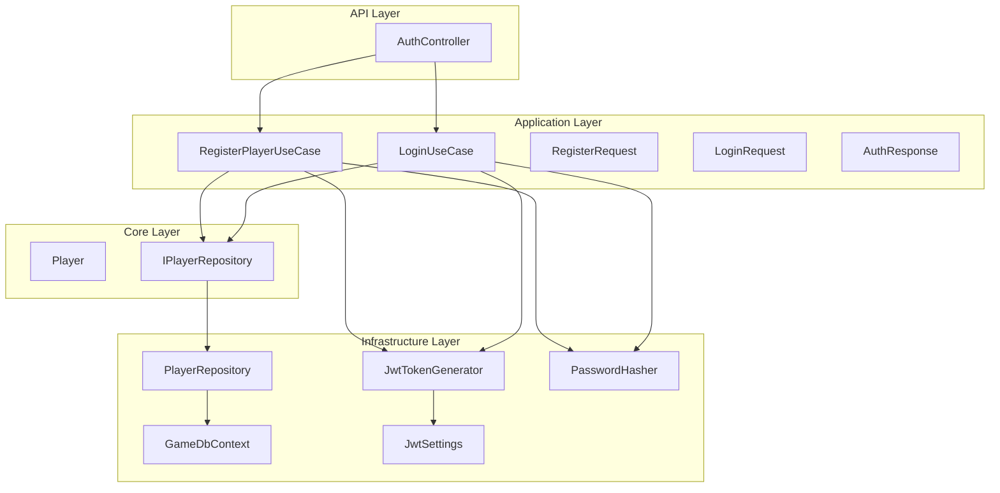
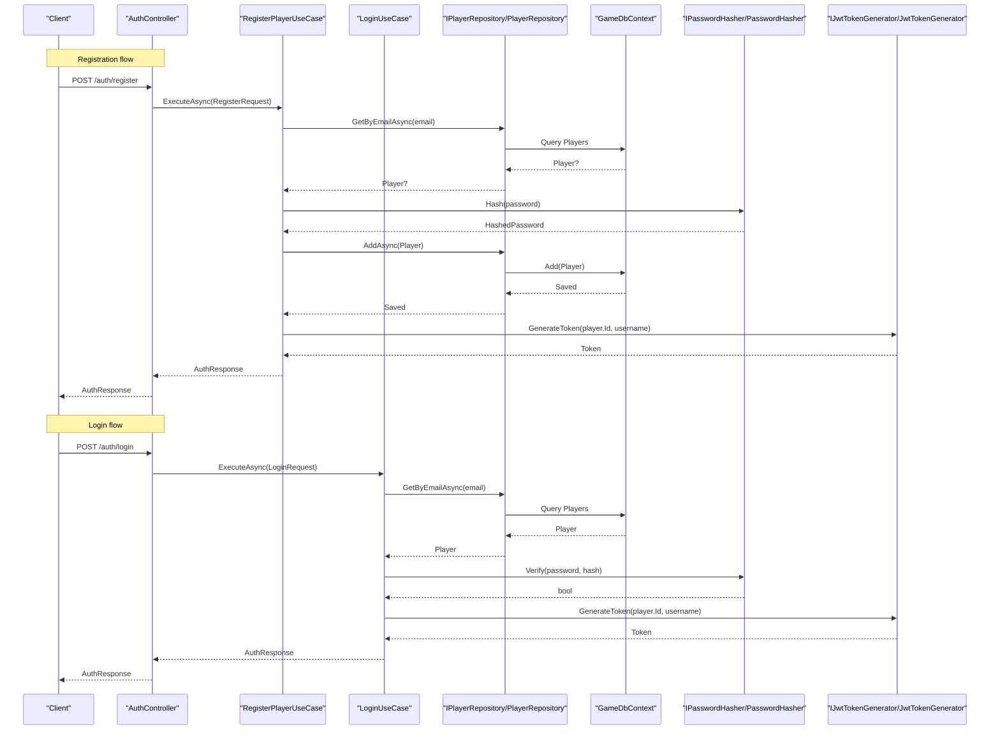
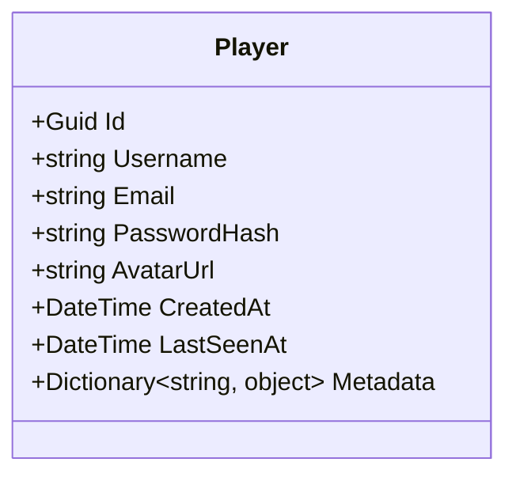
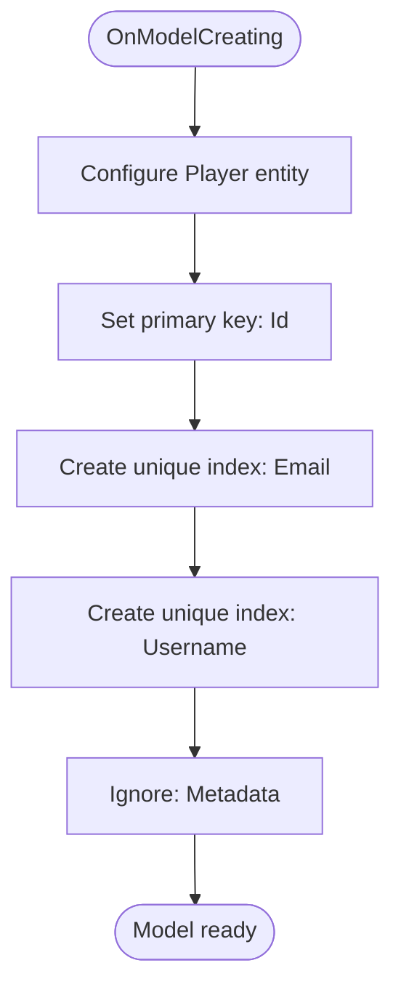
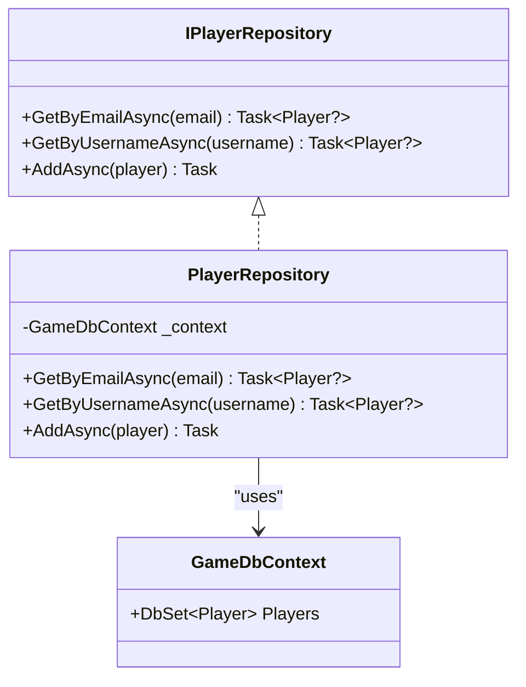
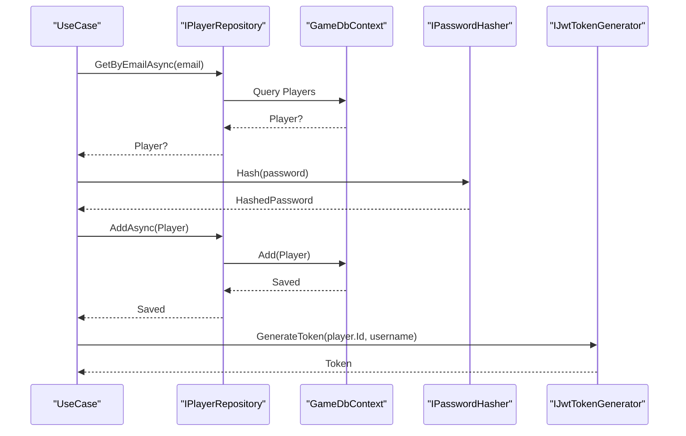
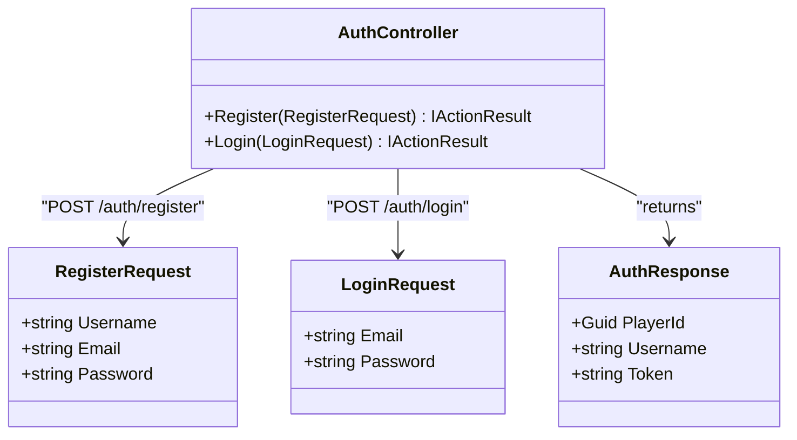
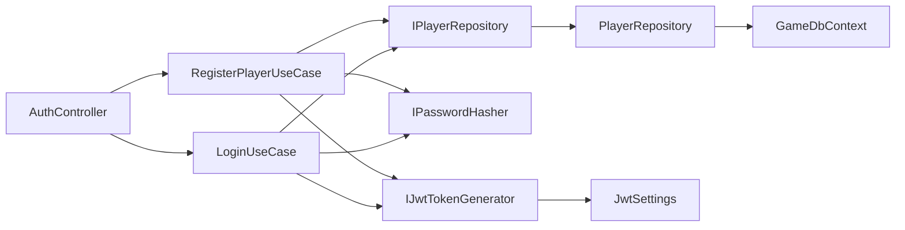

# Data Models & Database

<cite>
**Referenced Files in This Document**
- [Player.cs](file://GameBackend.Core/Entities/Player.cs)
- [GameDbContext.cs](file://GameBackend.Infrastructure/Persistence/GameDbContext.cs)
- [IPlayerRepository.cs](file://GameBackend.Core/Interfaces/IPlayerRepository.cs)
- [PlayerRepository.cs](file://GameBackend.Infrastructure/Repositories/PlayerRepository.cs)
- [RegisterPlayerUseCase.cs](file://GameBackend.Application/Contracts/UseCases/Auth/RegisterPlayerUseCase.cs)
- [LoginUseCase.cs](file://GameBackend.Application/Contracts/UseCases/Auth/LoginUseCase.cs)
- [RegisterRequest.cs](file://GameBackend.Application/Contracts/Auth/RegisterRequest.cs)
- [LoginRequest.cs](file://GameBackend.Application/Contracts/Auth/LoginRequest.cs)
- [AuthResponse.cs](file://GameBackend.Application/Contracts/Auth/AuthResponse.cs)
- [AuthController.cs](file://GameBackend.API/Controllers/AuthController.cs)
- [JwtTokenGenerator.cs](file://GameBackend.Infrastructure/Security/JwtTokenGenerator.cs)
- [JwtSettings.cs](file://GameBackend.Infrastructure/Security/JwtSettings.cs)
- [PasswordHasher.cs](file://GameBackend.Infrastructure/Security/PasswordHasher.cs)
- [appsettings.json](file://GameBackend.API/appsettings.json)
- [appsettings.Development.json](file://GameBackend.API/appsettings.Development.json)
</cite>

## Table of Contents
1. [Introduction](#introduction)
2. [Project Structure](#project-structure)
3. [Core Components](#core-components)
4. [Architecture Overview](#architecture-overview)
5. [Detailed Component Analysis](#detailed-component-analysis)
6. [Dependency Analysis](#dependency-analysis)
7. [Performance Considerations](#performance-considerations)
8. [Troubleshooting Guide](#troubleshooting-guide)
9. [Conclusion](#conclusion)
10. [Appendices](#appendices)

## Introduction
This document provides comprehensive data model documentation for the GameBackend system. It focuses on the Player entity, Entity Framework Core configuration, database schema design, and the repository pattern implementation. It also covers data relationships, indexing strategies, performance considerations, database migration procedures, connection string configuration, PostgreSQL-specific optimizations, and data security, privacy, and access control mechanisms.

## Project Structure
The GameBackend solution follows a layered architecture:
- API layer exposes HTTP endpoints for authentication.
- Application layer encapsulates use cases and orchestrates domain logic.
- Core layer defines domain entities and interfaces.
- Infrastructure layer implements persistence, repositories, and security helpers.

**Diagram sources**
- [AuthController.cs:1-49](file://GameBackend.API/Controllers/AuthController.cs#L1-L49)
- [RegisterPlayerUseCase.cs:1-58](file://GameBackend.Application/Contracts/UseCases/Auth/RegisterPlayerUseCase.cs#L1-L58)
- [LoginUseCase.cs:1-45](file://GameBackend.Application/Contracts/UseCases/Auth/LoginUseCase.cs#L1-L45)
- [RegisterRequest.cs:1-8](file://GameBackend.Application/Contracts/Auth/RegisterRequest.cs#L1-L8)
- [LoginRequest.cs:1-7](file://GameBackend.Application/Contracts/Auth/LoginRequest.cs#L1-L7)
- [AuthResponse.cs:1-8](file://GameBackend.Application/Contracts/Auth/AuthResponse.cs#L1-L8)
- [Player.cs:1-13](file://GameBackend.Core/Entities/Player.cs#L1-L13)
- [IPlayerRepository.cs:1-10](file://GameBackend.Core/Interfaces/IPlayerRepository.cs#L1-L10)
- [GameDbContext.cs:1-28](file://GameBackend.Infrastructure/Persistence/GameDbContext.cs#L1-L28)
- [PlayerRepository.cs:1-34](file://GameBackend.Infrastructure/Repositories/PlayerRepository.cs#L1-L34)
- [JwtTokenGenerator.cs:1-44](file://GameBackend.Infrastructure/Security/JwtTokenGenerator.cs#L1-L44)
- [JwtSettings.cs:1-8](file://GameBackend.Infrastructure/Security/JwtSettings.cs#L1-L8)
- [PasswordHasher.cs:1-16](file://GameBackend.Infrastructure/Security/PasswordHasher.cs#L1-L16)

**Section sources**
- [AuthController.cs:1-49](file://GameBackend.API/Controllers/AuthController.cs#L1-L49)
- [RegisterPlayerUseCase.cs:1-58](file://GameBackend.Application/Contracts/UseCases/Auth/RegisterPlayerUseCase.cs#L1-L58)
- [LoginUseCase.cs:1-45](file://GameBackend.Application/Contracts/UseCases/Auth/LoginUseCase.cs#L1-L45)
- [Player.cs:1-13](file://GameBackend.Core/Entities/Player.cs#L1-L13)
- [GameDbContext.cs:1-28](file://GameBackend.Infrastructure/Persistence/GameDbContext.cs#L1-L28)
- [PlayerRepository.cs:1-34](file://GameBackend.Infrastructure/Repositories/PlayerRepository.cs#L1-L34)
- [JwtTokenGenerator.cs:1-44](file://GameBackend.Infrastructure/Security/JwtTokenGenerator.cs#L1-L44)
- [JwtSettings.cs:1-8](file://GameBackend.Infrastructure/Security/JwtSettings.cs#L1-L8)
- [PasswordHasher.cs:1-16](file://GameBackend.Infrastructure/Security/PasswordHasher.cs#L1-L16)

## Core Components
This section documents the Player entity, EF Core configuration, and repository pattern.

- Player entity
  - Identity: Guid Id
  - Authentication: string Email, string PasswordHash
  - Profile: string Username, string AvatarUrl
  - Timestamps: DateTime CreatedAt, DateTime LastSeenAt
  - Flexible metadata: Dictionary<string, object> Metadata
  - Validation rules observed in code:
    - Non-empty Username and Email during registration
    - Unique constraints enforced via database indices on Email and Username
    - Passwords are hashed before persistence
    - Metadata is ignored by EF Core (not mapped to a column)

- EF Core configuration
  - DbContext: GameDbContext
  - DbSet: Players
  - Indices:
    - Unique index on Email
    - Unique index on Username
  - Ignored member:
    - Metadata is not persisted to the database

- Repository pattern
  - Interface: IPlayerRepository
    - Methods: GetByEmailAsync, GetByUsernameAsync, AddAsync
  - Implementation: PlayerRepository
    - Uses EF Core to query and insert Player entities
    - Asynchronous operations with async/await

**Section sources**
- [Player.cs:1-13](file://GameBackend.Core/Entities/Player.cs#L1-L13)
- [GameDbContext.cs:15-27](file://GameBackend.Infrastructure/Persistence/GameDbContext.cs#L15-L27)
- [IPlayerRepository.cs:1-10](file://GameBackend.Core/Interfaces/IPlayerRepository.cs#L1-L10)
- [PlayerRepository.cs:17-34](file://GameBackend.Infrastructure/Repositories/PlayerRepository.cs#L17-L34)

## Architecture Overview
The authentication flow integrates the API, application, core, and infrastructure layers.

**Diagram sources**
- [AuthController.cs:22-48](file://GameBackend.API/Controllers/AuthController.cs#L22-L48)
- [RegisterPlayerUseCase.cs:23-57](file://GameBackend.Application/Contracts/UseCases/Auth/RegisterPlayerUseCase.cs#L23-L57)
- [LoginUseCase.cs:22-44](file://GameBackend.Application/Contracts/UseCases/Auth/LoginUseCase.cs#L22-L44)
- [PlayerRepository.cs:17-33](file://GameBackend.Infrastructure/Repositories/PlayerRepository.cs#L17-L33)
- [GameDbContext.cs:13](file://GameBackend.Infrastructure/Persistence/GameDbContext.cs#L13)
- [PasswordHasher.cs:7-15](file://GameBackend.Infrastructure/Security/PasswordHasher.cs#L7-L15)
- [JwtTokenGenerator.cs:20-43](file://GameBackend.Infrastructure/Security/JwtTokenGenerator.cs#L20-L43)

## Detailed Component Analysis

### Player Entity Model
The Player entity defines the core identity and profile attributes for users, along with timestamps and a flexible metadata container.

**Diagram sources**
- [Player.cs:3-12](file://GameBackend.Core/Entities/Player.cs#L3-L12)

**Section sources**
- [Player.cs:1-13](file://GameBackend.Core/Entities/Player.cs#L1-L13)

### Entity Framework Core Configuration
EF Core configures the Player entity with primary key and unique indices, and ignores the Metadata property.

**Diagram sources**
- [GameDbContext.cs:15-27](file://GameBackend.Infrastructure/Persistence/GameDbContext.cs#L15-L27)

**Section sources**
- [GameDbContext.cs:15-27](file://GameBackend.Infrastructure/Persistence/GameDbContext.cs#L15-L27)

### Repository Pattern Implementation
The repository abstracts data access for Player entities and delegates persistence to EF Core.

**Diagram sources**
- [IPlayerRepository.cs:5-10](file://GameBackend.Core/Interfaces/IPlayerRepository.cs#L5-L10)
- [PlayerRepository.cs:8-34](file://GameBackend.Infrastructure/Repositories/PlayerRepository.cs#L8-L34)
- [GameDbContext.cs:13](file://GameBackend.Infrastructure/Persistence/GameDbContext.cs#L13)

**Section sources**
- [IPlayerRepository.cs:1-10](file://GameBackend.Core/Interfaces/IPlayerRepository.cs#L1-L10)
- [PlayerRepository.cs:1-34](file://GameBackend.Infrastructure/Repositories/PlayerRepository.cs#L1-L34)
- [GameDbContext.cs:1-28](file://GameBackend.Infrastructure/Persistence/GameDbContext.cs#L1-L28)

### Authentication Use Cases and Data Flow
Registration and login flows demonstrate how the application layer coordinates hashing, persistence, and token generation.

**Diagram sources**
- [RegisterPlayerUseCase.cs:23-57](file://GameBackend.Application/Contracts/UseCases/Auth/RegisterPlayerUseCase.cs#L23-L57)
- [LoginUseCase.cs:22-44](file://GameBackend.Application/Contracts/UseCases/Auth/LoginUseCase.cs#L22-L44)
- [PlayerRepository.cs:17-33](file://GameBackend.Infrastructure/Repositories/PlayerRepository.cs#L17-L33)
- [PasswordHasher.cs:7-15](file://GameBackend.Infrastructure/Security/PasswordHasher.cs#L7-L15)
- [JwtTokenGenerator.cs:20-43](file://GameBackend.Infrastructure/Security/JwtTokenGenerator.cs#L20-L43)

**Section sources**
- [RegisterPlayerUseCase.cs:1-58](file://GameBackend.Application/Contracts/UseCases/Auth/RegisterPlayerUseCase.cs#L1-L58)
- [LoginUseCase.cs:1-45](file://GameBackend.Application/Contracts/UseCases/Auth/LoginUseCase.cs#L1-L45)

### API Endpoints and Request/Response Contracts
The API layer exposes authentication endpoints and maps incoming requests to application use cases.

**Diagram sources**
- [AuthController.cs:7-49](file://GameBackend.API/Controllers/AuthController.cs#L7-L49)
- [RegisterRequest.cs:3-8](file://GameBackend.Application/Contracts/Auth/RegisterRequest.cs#L3-L8)
- [LoginRequest.cs:3-7](file://GameBackend.Application/Contracts/Auth/LoginRequest.cs#L3-L7)
- [AuthResponse.cs:3-8](file://GameBackend.Application/Contracts/Auth/AuthResponse.cs#L3-L8)

**Section sources**
- [AuthController.cs:1-49](file://GameBackend.API/Controllers/AuthController.cs#L1-L49)
- [RegisterRequest.cs:1-8](file://GameBackend.Application/Contracts/Auth/RegisterRequest.cs#L1-L8)
- [LoginRequest.cs:1-7](file://GameBackend.Application/Contracts/Auth/LoginRequest.cs#L1-L7)
- [AuthResponse.cs:1-8](file://GameBackend.Application/Contracts/Auth/AuthResponse.cs#L1-L8)

## Dependency Analysis
The following diagram shows key dependencies among components involved in data access and authentication.

**Diagram sources**
- [AuthController.cs:14-20](file://GameBackend.API/Controllers/AuthController.cs#L14-L20)
- [RegisterPlayerUseCase.cs:9-21](file://GameBackend.Application/Contracts/UseCases/Auth/RegisterPlayerUseCase.cs#L9-L21)
- [LoginUseCase.cs:8-20](file://GameBackend.Application/Contracts/UseCases/Auth/LoginUseCase.cs#L8-L20)
- [IPlayerRepository.cs:5-10](file://GameBackend.Core/Interfaces/IPlayerRepository.cs#L5-L10)
- [PlayerRepository.cs:10-15](file://GameBackend.Infrastructure/Repositories/PlayerRepository.cs#L10-L15)
- [GameDbContext.cs:6-13](file://GameBackend.Infrastructure/Persistence/GameDbContext.cs#L6-L13)
- [JwtTokenGenerator.cs:13-18](file://GameBackend.Infrastructure/Security/JwtTokenGenerator.cs#L13-L18)
- [JwtSettings.cs:3-8](file://GameBackend.Infrastructure/Security/JwtSettings.cs#L3-L8)
- [PasswordHasher.cs:5-16](file://GameBackend.Infrastructure/Security/PasswordHasher.cs#L5-L16)

**Section sources**
- [AuthController.cs:1-49](file://GameBackend.API/Controllers/AuthController.cs#L1-L49)
- [RegisterPlayerUseCase.cs:1-58](file://GameBackend.Application/Contracts/UseCases/Auth/RegisterPlayerUseCase.cs#L1-L58)
- [LoginUseCase.cs:1-45](file://GameBackend.Application/Contracts/UseCases/Auth/LoginUseCase.cs#L1-L45)
- [PlayerRepository.cs:1-34](file://GameBackend.Infrastructure/Repositories/PlayerRepository.cs#L1-L34)
- [GameDbContext.cs:1-28](file://GameBackend.Infrastructure/Persistence/GameDbContext.cs#L1-L28)
- [JwtTokenGenerator.cs:1-44](file://GameBackend.Infrastructure/Security/JwtTokenGenerator.cs#L1-L44)
- [JwtSettings.cs:1-8](file://GameBackend.Infrastructure/Security/JwtSettings.cs#L1-L8)
- [PasswordHasher.cs:1-16](file://GameBackend.Infrastructure/Security/PasswordHasher.cs#L1-L16)

## Performance Considerations
- Indexing strategy
  - Unique indices on Email and Username optimize lookups for authentication and prevent duplicates.
- Query patterns
  - Single-field lookups by Email and Username are efficient due to indices.
- Write operations
  - AddAsync persists immediately after insertion; consider batching writes if throughput increases.
- Memory and serialization
  - Metadata is ignored by EF Core, avoiding unnecessary mapping overhead.
- Connection and migrations
  - Configure connection strings for production environments and use EF Core migrations for schema updates.
- PostgreSQL-specific optimizations
  - Use appropriate PostgreSQL data types and collations for text fields.
  - Consider partial indexes for frequently filtered columns.
  - Tune connection pooling and statement timeouts.
  - Monitor slow queries and query plans.

[No sources needed since this section provides general guidance]

## Troubleshooting Guide
Common issues and resolutions:
- Duplicate email or username
  - Symptom: Registration fails with a duplicate constraint violation.
  - Cause: Unique indices on Email and Username.
  - Resolution: Ensure client-side validation and handle exceptions in the API.
- Invalid credentials
  - Symptom: Login returns unauthorized.
  - Cause: Incorrect email/password combination.
  - Resolution: Verify hashed password verification logic and ensure correct input.
- Token generation errors
  - Symptom: Token generation failures.
  - Cause: Missing or invalid JWT settings.
  - Resolution: Confirm JwtSettings values in configuration.
- Database connectivity
  - Symptom: Application fails to connect to the database.
  - Cause: Incorrect connection string.
  - Resolution: Validate connection string in configuration and network settings.

**Section sources**
- [RegisterPlayerUseCase.cs:25-28](file://GameBackend.Application/Contracts/UseCases/Auth/RegisterPlayerUseCase.cs#L25-L28)
- [LoginUseCase.cs:24-32](file://GameBackend.Application/Contracts/UseCases/Auth/LoginUseCase.cs#L24-L32)
- [JwtTokenGenerator.cs:20-43](file://GameBackend.Infrastructure/Security/JwtTokenGenerator.cs#L20-L43)
- [appsettings.json:14-16](file://GameBackend.API/appsettings.json#L14-L16)

## Conclusion
The GameBackend data model centers on the Player entity with robust uniqueness constraints on Email and Username, asynchronous repository operations, and secure password hashing. JWT tokens facilitate sessionless authentication. The EF Core configuration is minimal and effective, focusing on essential indices and ignoring non-persistent metadata. For production, ensure proper connection string management, apply EF Core migrations, and adopt PostgreSQL-specific tuning practices.

[No sources needed since this section summarizes without analyzing specific files]

## Appendices

### Database Schema Design
- Table: Players
  - Columns:
    - Id (Primary Key)
    - Username (Unique)
    - Email (Unique)
    - PasswordHash
    - AvatarUrl
    - CreatedAt
    - LastSeenAt
  - Notes:
    - Metadata is not persisted.
    - Unique constraints on Username and Email.

**Section sources**
- [GameDbContext.cs:19-26](file://GameBackend.Infrastructure/Persistence/GameDbContext.cs#L19-L26)
- [Player.cs:5-12](file://GameBackend.Core/Entities/Player.cs#L5-L12)

### Data Relationships
- One-to-one relationship per Player record.
- No explicit foreign keys in the current model; relationships are not defined.

**Section sources**
- [Player.cs:1-13](file://GameBackend.Core/Entities/Player.cs#L1-L13)

### Migration Procedures
- Create migration:
  - Use EF Core CLI to scaffold a new migration after updating the model.
- Apply migration:
  - Run the migration against the target environment.
- Rollback:
  - Revert to a previous migration if needed.

[No sources needed since this section provides general guidance]

### Connection String Configuration
- Location: appsettings.json under ConnectionStrings.DefaultConnection.
- Example fields: Host, Port, Database, Username, Password.
- Environment-specific overrides: appsettings.Development.json.

**Section sources**
- [appsettings.json:14-16](file://GameBackend.API/appsettings.json#L14-L16)
- [appsettings.Development.json:1-9](file://GameBackend.API/appsettings.Development.json#L1-L9)

### PostgreSQL-Specific Optimizations
- Choose appropriate data types for identifiers and timestamps.
- Consider collation and indexing strategies aligned with query patterns.
- Enable connection pooling and tune statement timeouts.
- Monitor and optimize slow queries.

[No sources needed since this section provides general guidance]

### Data Security, Privacy, and Access Control
- Password hashing:
  - Passwords are hashed using a strong hashing algorithm before storage.
- Token-based authentication:
  - JWT tokens are generated with issuer, audience, and expiration.
- Configuration:
  - JWT settings are loaded from configuration.
- Access control:
  - Enforce authorization policies at the API boundary for protected routes.

**Section sources**
- [PasswordHasher.cs:7-15](file://GameBackend.Infrastructure/Security/PasswordHasher.cs#L7-L15)
- [JwtTokenGenerator.cs:20-43](file://GameBackend.Infrastructure/Security/JwtTokenGenerator.cs#L20-L43)
- [JwtSettings.cs:3-8](file://GameBackend.Infrastructure/Security/JwtSettings.cs#L3-L8)
- [appsettings.json:9-13](file://GameBackend.API/appsettings.json#L9-L13)