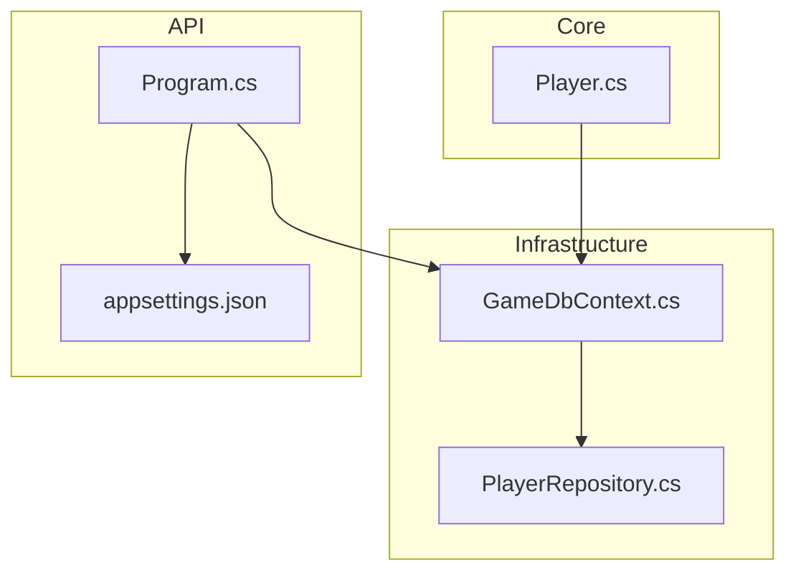
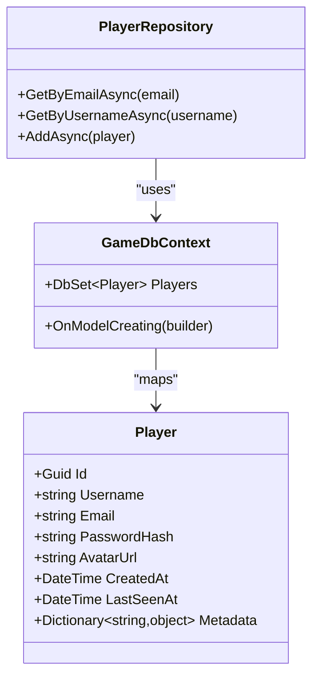
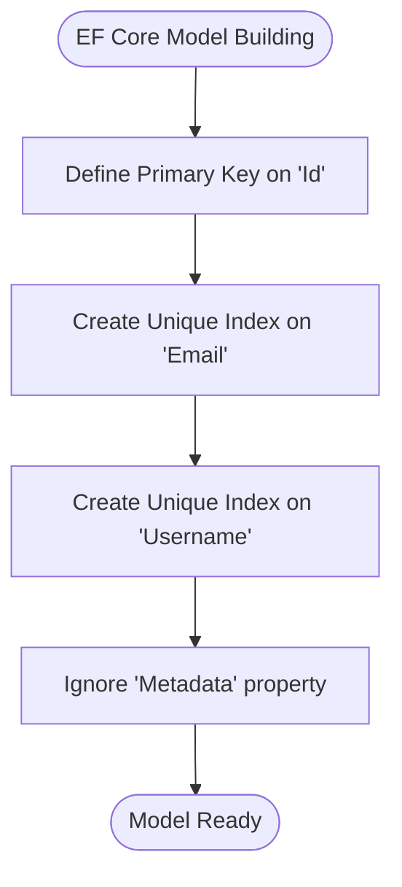
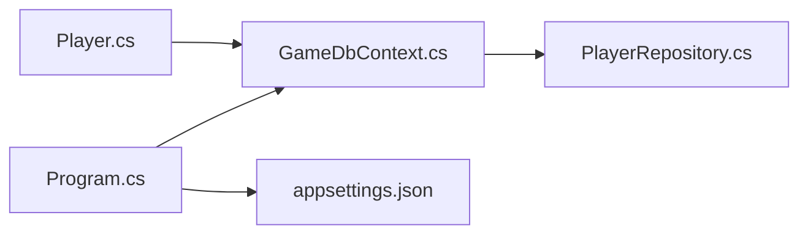

# Database Schema

<cite>
**Referenced Files in This Document**
- [Player.cs](file://GameBackend.Core/Entities/Player.cs)
- [GameDbContext.cs](file://GameBackend.Infrastructure/Persistence/GameDbContext.cs)
- [PlayerRepository.cs](file://GameBackend.Infrastructure/Repositories/PlayerRepository.cs)
- [Program.cs](file://GameBackend.API/Program.cs)
- [appsettings.json](file://GameBackend.API/appsettings.json)
- [GameBackend.Infrastructure.csproj](file://GameBackend.Infrastructure/GameBackend.Infrastructure.csproj)
- [GameBackend.Application.csproj](file://GameBackend.Application/GameBackend.Application.csproj)
</cite>

## Table of Contents
1. [Introduction](#introduction)
2. [Project Structure](#project-structure)
3. [Core Components](#core-components)
4. [Architecture Overview](#architecture-overview)
5. [Detailed Component Analysis](#detailed-component-analysis)
6. [Dependency Analysis](#dependency-analysis)
7. [Performance Considerations](#performance-considerations)
8. [Troubleshooting Guide](#troubleshooting-guide)
9. [Conclusion](#conclusion)
10. [Appendices](#appendices)

## Introduction
This document provides comprehensive database schema documentation for the GameBackend system with a focus on the Player table. It covers table structure, column definitions, data types, constraints, indexes, and unique constraints. It also explains the Entity Framework Core configuration (Fluent API mappings and data annotations), migration procedures, seed data requirements, schema evolution strategies, PostgreSQL-specific optimizations, connection pooling, and performance tuning recommendations.

## Project Structure
The Player domain and persistence are defined across the Core and Infrastructure projects. The API project configures the database provider and connection string.

**Diagram sources**
- [Player.cs:1-13](file://GameBackend.Core/Entities/Player.cs#L1-L13)
- [GameDbContext.cs:1-28](file://GameBackend.Infrastructure/Persistence/GameDbContext.cs#L1-L28)
- [PlayerRepository.cs:1-34](file://GameBackend.Infrastructure/Repositories/PlayerRepository.cs#L1-L34)
- [Program.cs:1-38](file://GameBackend.API/Program.cs#L1-L38)
- [appsettings.json:1-17](file://GameBackend.API/appsettings.json#L1-L17)

**Section sources**
- [Player.cs:1-13](file://GameBackend.Core/Entities/Player.cs#L1-L13)
- [GameDbContext.cs:1-28](file://GameBackend.Infrastructure/Persistence/GameDbContext.cs#L1-L28)
- [PlayerRepository.cs:1-34](file://GameBackend.Infrastructure/Repositories/PlayerRepository.cs#L1-L34)
- [Program.cs:1-38](file://GameBackend.API/Program.cs#L1-L38)
- [appsettings.json:1-17](file://GameBackend.API/appsettings.json#L1-L17)

## Core Components
- Player entity defines the logical model for a player, including identifiers, credentials, profile attributes, timestamps, and metadata.
- GameDbContext configures the EF Core model for the Player entity, including primary key, unique indexes, and ignored members.
- PlayerRepository encapsulates data access operations for Player, leveraging EF Core queries and change tracking.
- Program registers the DbContext with Npgsql provider and binds the connection string from configuration.
- appsettings.json provides the connection string used by the application.

**Section sources**
- [Player.cs:1-13](file://GameBackend.Core/Entities/Player.cs#L1-L13)
- [GameDbContext.cs:1-28](file://GameBackend.Infrastructure/Persistence/GameDbContext.cs#L1-L28)
- [PlayerRepository.cs:1-34](file://GameBackend.Infrastructure/Repositories/PlayerRepository.cs#L1-L34)
- [Program.cs:16-17](file://GameBackend.API/Program.cs#L16-L17)
- [appsettings.json:14-16](file://GameBackend.API/appsettings.json#L14-L16)

## Architecture Overview
The Player table is mapped via EF Core’s Fluent API in the DbContext. The application uses Npgsql to target a PostgreSQL database. Unique indexes are applied to Email and Username to enforce uniqueness at the database level. The repository pattern abstracts EF Core operations.

**Diagram sources**
- [Player.cs:1-13](file://GameBackend.Core/Entities/Player.cs#L1-L13)
- [GameDbContext.cs:13-26](file://GameBackend.Infrastructure/Persistence/GameDbContext.cs#L13-L26)
- [PlayerRepository.cs:8-33](file://GameBackend.Infrastructure/Repositories/PlayerRepository.cs#L8-L33)

## Detailed Component Analysis

### Player Table Schema
- Table name: Players
- Columns and types:
  - Id: UUID/GUID (Primary Key)
  - Username: String (Unique)
  - Email: String (Unique)
  - PasswordHash: String
  - AvatarUrl: String
  - CreatedAt: Timestamp
  - LastSeenAt: Timestamp
  - Metadata: JSON/JSONB (Ignored by EF Core mapping)
- Constraints:
  - Primary Key: Id
  - Unique Indexes: Email, Username
  - No foreign keys defined for this table in the current model
- Notes:
  - Metadata is present in the entity but is ignored by EF Core mapping, so it does not participate in migrations or schema generation.

**Section sources**
- [GameDbContext.cs:19-26](file://GameBackend.Infrastructure/Persistence/GameDbContext.cs#L19-L26)
- [Player.cs:5-12](file://GameBackend.Core/Entities/Player.cs#L5-L12)

### Entity Framework Core Configuration
- Provider: Npgsql.EntityFrameworkCore.PostgreSQL
- DbContext registration: Added in Program.cs with UseNpgsql and reads connection string from configuration.
- Model configuration:
  - Primary key: Id
  - Unique indexes: Email, Username
  - Ignored member: Metadata (not persisted)

**Diagram sources**
- [GameDbContext.cs:15-26](file://GameBackend.Infrastructure/Persistence/GameDbContext.cs#L15-L26)

**Section sources**
- [GameDbContext.cs:15-26](file://GameBackend.Infrastructure/Persistence/GameDbContext.cs#L15-L26)
- [Program.cs:16-17](file://GameBackend.API/Program.cs#L16-L17)

### Data Annotations vs Fluent API
- Fluent API is used in OnModelCreating to configure the Player entity.
- No data annotations are present in the Player entity for mapping.

**Section sources**
- [Player.cs:1-13](file://GameBackend.Core/Entities/Player.cs#L1-L13)
- [GameDbContext.cs:19-26](file://GameBackend.Infrastructure/Persistence/GameDbContext.cs#L19-L26)

### Migration Procedures
- Add-Migration: Use the package manager console or CLI to scaffold a new migration after model changes.
- Update-Database: Apply pending migrations to the target PostgreSQL database.
- Notes:
  - The project references the EF Core design-time package for migrations.
  - Ensure the connection string in configuration matches the target environment.

**Section sources**
- [GameBackend.Infrastructure.csproj:13-16](file://GameBackend.Infrastructure/GameBackend.Infrastructure.csproj#L13-L16)
- [appsettings.json:14-16](file://GameBackend.API/appsettings.json#L14-L16)

### Seed Data Requirements
- There is no seed data implementation in the current codebase.
- To seed initial data, implement a migration with data inserts or use a separate seeding mechanism invoked during application startup.

**Section sources**
- [GameDbContext.cs:1-28](file://GameBackend.Infrastructure/Persistence/GameDbContext.cs#L1-L28)

### Schema Evolution Strategies
- Plan incremental migrations for schema changes.
- Use descriptive migration names and keep transactions small.
- Back up the database before applying migrations to production.
- Test migrations in staging environments first.

**Section sources**
- [GameBackend.Infrastructure.csproj:13-16](file://GameBackend.Infrastructure/GameBackend.Infrastructure.csproj#L13-L16)

### PostgreSQL-Specific Optimizations
- Provider: Npgsql.EntityFrameworkCore.PostgreSQL is configured.
- Consider:
  - Using JSONB for Metadata if it becomes relevant to queries (currently ignored).
  - Connection pooling settings via connection string parameters.
  - Indexes on frequently filtered/sorted columns beyond the existing unique indexes.
  - Regular maintenance tasks (VACUUM/ANALYZE) and monitoring query performance.

**Section sources**
- [GameBackend.Infrastructure.csproj](file://GameBackend.Infrastructure/GameBackend.Infrastructure.csproj#L18)
- [Program.cs:16-17](file://GameBackend.API/Program.cs#L16-L17)
- [appsettings.json:14-16](file://GameBackend.API/appsettings.json#L14-L16)

### Connection Pooling
- Configure connection pool parameters in the connection string (e.g., Pool Size, MaxIdle, MinPoolSize).
- Ensure the application shuts down gracefully to release connections.

**Section sources**
- [appsettings.json:14-16](file://GameBackend.API/appsettings.json#L14-L16)

### Performance Tuning Recommendations
- Keep indexes minimal and aligned with query patterns.
- Monitor slow queries and add targeted indexes if needed.
- Use asynchronous repository methods consistently.
- Batch writes when inserting multiple players.
- Consider read-replicas for read-heavy workloads.

**Section sources**
- [PlayerRepository.cs:17-33](file://GameBackend.Infrastructure/Repositories/PlayerRepository.cs#L17-L33)

## Dependency Analysis
The Player entity is mapped by GameDbContext, which is injected into PlayerRepository. The API registers the DbContext with Npgsql and binds the connection string from configuration.

**Diagram sources**
- [Player.cs:1-13](file://GameBackend.Core/Entities/Player.cs#L1-L13)
- [GameDbContext.cs:1-28](file://GameBackend.Infrastructure/Persistence/GameDbContext.cs#L1-L28)
- [PlayerRepository.cs:1-34](file://GameBackend.Infrastructure/Repositories/PlayerRepository.cs#L1-L34)
- [Program.cs:16-17](file://GameBackend.API/Program.cs#L16-L17)
- [appsettings.json:14-16](file://GameBackend.API/appsettings.json#L14-L16)

**Section sources**
- [Player.cs:1-13](file://GameBackend.Core/Entities/Player.cs#L1-L13)
- [GameDbContext.cs:1-28](file://GameBackend.Infrastructure/Persistence/GameDbContext.cs#L1-L28)
- [PlayerRepository.cs:1-34](file://GameBackend.Infrastructure/Repositories/PlayerRepository.cs#L1-L34)
- [Program.cs:16-17](file://GameBackend.API/Program.cs#L16-L17)
- [appsettings.json:14-16](file://GameBackend.API/appsettings.json#L14-L16)

## Performance Considerations
- Asynchronous I/O: Repository methods are asynchronous; continue using async/await patterns.
- Index coverage: Unique indexes on Email and Username support fast lookups.
- Avoid N+1 queries: Fetch related data in single queries when extending the model.
- Connection pooling: Tune pool size and lifetime via connection string parameters.

[No sources needed since this section provides general guidance]

## Troubleshooting Guide
- Migration errors:
  - Ensure the design-time package is present and the connection string is correct.
  - Rebuild the solution and retry the migration commands.
- Connection failures:
  - Verify the connection string and PostgreSQL server availability.
  - Confirm the provider is registered in Program.cs.
- Unexpected schema changes:
  - Review OnModelCreating for explicit configurations.
  - Check for ignored members that may affect migrations.

**Section sources**
- [GameBackend.Infrastructure.csproj:13-16](file://GameBackend.Infrastructure/GameBackend.Infrastructure.csproj#L13-L16)
- [Program.cs:16-17](file://GameBackend.API/Program.cs#L16-L17)
- [appsettings.json:14-16](file://GameBackend.API/appsettings.json#L14-L16)
- [GameDbContext.cs:15-26](file://GameBackend.Infrastructure/Persistence/GameDbContext.cs#L15-L26)

## Conclusion
The Player table is modeled with a GUID primary key and unique indexes on Email and Username. EF Core’s Fluent API configures the mapping, while Npgsql targets a PostgreSQL backend. Migrations and seed data are not yet implemented in the codebase. Adopting the recommended schema evolution and performance strategies will help maintain a robust and scalable database layer.

[No sources needed since this section summarizes without analyzing specific files]

## Appendices

### Appendix A: Player Table Definition Summary
- Table: Players
- Columns:
  - Id (Primary Key)
  - Username (Unique)
  - Email (Unique)
  - PasswordHash
  - AvatarUrl
  - CreatedAt
  - LastSeenAt
  - Metadata (ignored by EF Core)
- Indexes:
  - Unique index on Email
  - Unique index on Username

**Section sources**
- [GameDbContext.cs:21-23](file://GameBackend.Infrastructure/Persistence/GameDbContext.cs#L21-L23)
- [Player.cs:5-12](file://GameBackend.Core/Entities/Player.cs#L5-L12)

### Appendix B: EF Core and Provider References
- EF Core version: 8.0.11
- Provider: Npgsql.EntityFrameworkCore.PostgreSQL 8.0.11
- Design-time support included for migrations

**Section sources**
- [GameBackend.Application.csproj](file://GameBackend.Application/GameBackend.Application.csproj#L11)
- [GameBackend.Infrastructure.csproj:12-18](file://GameBackend.Infrastructure/GameBackend.Infrastructure.csproj#L12-L18)