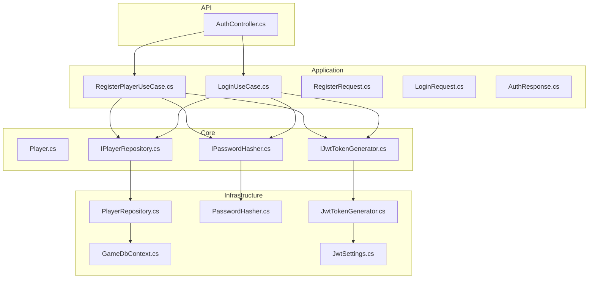
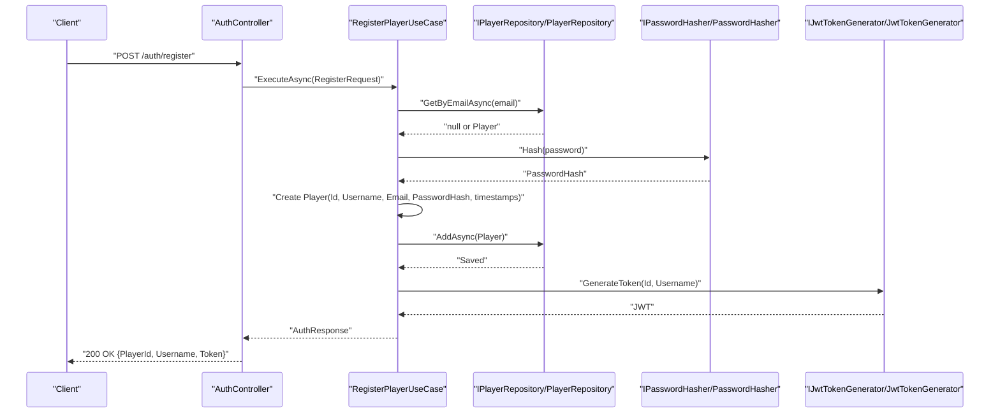
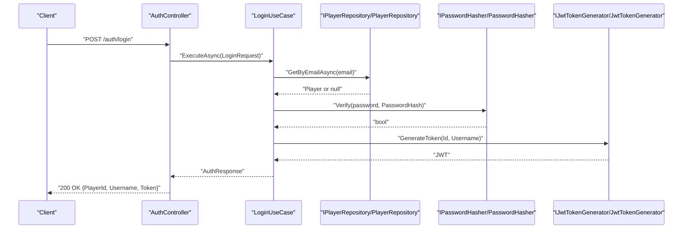
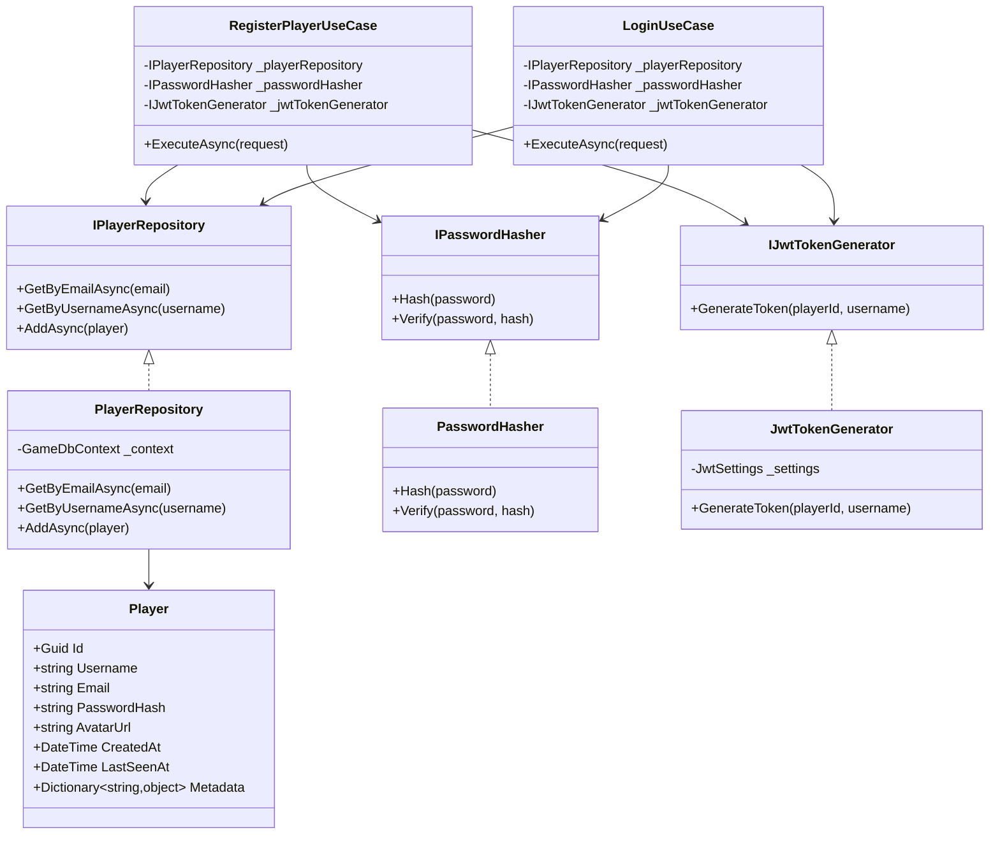

# Player Entity

<cite>
**Referenced Files in This Document**
- [Player.cs](file://GameBackend.Core/Entities/Player.cs)
- [GameDbContext.cs](file://GameBackend.Infrastructure/Persistence/GameDbContext.cs)
- [PlayerRepository.cs](file://GameBackend.Infrastructure/Repositories/PlayerRepository.cs)
- [RegisterPlayerUseCase.cs](file://GameBackend.Application/Contracts/UseCases/Auth/RegisterPlayerUseCase.cs)
- [LoginUseCase.cs](file://GameBackend.Application/Contracts/UseCases/Auth/LoginUseCase.cs)
- [RegisterRequest.cs](file://GameBackend.Application/Contracts/Auth/RegisterRequest.cs)
- [LoginRequest.cs](file://GameBackend.Application/Contracts/Auth/LoginRequest.cs)
- [AuthResponse.cs](file://GameBackend.Application/Contracts/Auth/AuthResponse.cs)
- [IPlayerRepository.cs](file://GameBackend.Core/Interfaces/IPlayerRepository.cs)
- [IPasswordHasher.cs](file://GameBackend.Core/Interfaces/IPasswordHasher.cs)
- [IJwtTokenGenerator.cs](file://GameBackend.Core/Interfaces/IJwtTokenGenerator.cs)
- [PasswordHasher.cs](file://GameBackend.Infrastructure/Security/PasswordHasher.cs)
- [JwtTokenGenerator.cs](file://GameBackend.Infrastructure/Security/JwtTokenGenerator.cs)
- [JwtSettings.cs](file://GameBackend.Infrastructure/Security/JwtSettings.cs)
- [AuthController.cs](file://GameBackend.API/Controllers/AuthController.cs)
</cite>

## Table of Contents
1. [Introduction](#introduction)
2. [Project Structure](#project-structure)
3. [Core Components](#core-components)
4. [Architecture Overview](#architecture-overview)
5. [Detailed Component Analysis](#detailed-component-analysis)
6. [Dependency Analysis](#dependency-analysis)
7. [Performance Considerations](#performance-considerations)
8. [Troubleshooting Guide](#troubleshooting-guide)
9. [Conclusion](#conclusion)

## Introduction
This document provides comprehensive documentation for the Player entity model used in the authentication system. It covers all properties, their data types, validation rules, business constraints, persistence mapping, and security considerations. It also explains how the Player entity integrates with the application’s authentication use cases, repositories, and infrastructure components, and outlines serialization and privacy implications.

## Project Structure
The Player entity resides in the Core layer and is consumed by Application use cases and Infrastructure persistence and security components. The API layer coordinates registration and login requests into the application layer.

**Diagram sources**
- [Player.cs:1-13](file://GameBackend.Core/Entities/Player.cs#L1-L13)
- [IPlayerRepository.cs:1-10](file://GameBackend.Core/Interfaces/IPlayerRepository.cs#L1-L10)
- [RegisterPlayerUseCase.cs:1-58](file://GameBackend.Application/Contracts/UseCases/Auth/RegisterPlayerUseCase.cs#L1-L58)
- [LoginUseCase.cs:1-45](file://GameBackend.Application/Contracts/UseCases/Auth/LoginUseCase.cs#L1-L45)
- [RegisterRequest.cs:1-8](file://GameBackend.Application/Contracts/Auth/RegisterRequest.cs#L1-L8)
- [LoginRequest.cs:1-7](file://GameBackend.Application/Contracts/Auth/LoginRequest.cs#L1-L7)
- [AuthResponse.cs:1-8](file://GameBackend.Application/Contracts/Auth/AuthResponse.cs#L1-L8)
- [GameDbContext.cs:1-28](file://GameBackend.Infrastructure/Persistence/GameDbContext.cs#L1-L28)
- [PlayerRepository.cs:1-34](file://GameBackend.Infrastructure/Repositories/PlayerRepository.cs#L1-L34)
- [PasswordHasher.cs:1-16](file://GameBackend.Infrastructure/Security/PasswordHasher.cs#L1-L16)
- [JwtTokenGenerator.cs:1-44](file://GameBackend.Infrastructure/Security/JwtTokenGenerator.cs#L1-L44)
- [JwtSettings.cs:1-8](file://GameBackend.Infrastructure/Security/JwtSettings.cs#L1-L8)
- [AuthController.cs:1-49](file://GameBackend.API/Controllers/AuthController.cs#L1-L49)

**Section sources**
- [Player.cs:1-13](file://GameBackend.Core/Entities/Player.cs#L1-L13)
- [GameDbContext.cs:1-28](file://GameBackend.Infrastructure/Persistence/GameDbContext.cs#L1-L28)
- [PlayerRepository.cs:1-34](file://GameBackend.Infrastructure/Repositories/PlayerRepository.cs#L1-L34)
- [RegisterPlayerUseCase.cs:1-58](file://GameBackend.Application/Contracts/UseCases/Auth/RegisterPlayerUseCase.cs#L1-L58)
- [LoginUseCase.cs:1-45](file://GameBackend.Application/Contracts/UseCases/Auth/LoginUseCase.cs#L1-L45)
- [AuthController.cs:1-49](file://GameBackend.API/Controllers/AuthController.cs#L1-L49)

## Core Components
This section documents the Player entity and its supporting interfaces and implementations.

- Player entity
  - Purpose: Represents an authenticated user in the system.
  - Properties:
    - Id: System-wide unique identifier for the player.
    - Username: Unique textual handle for the player.
    - Email: Unique email address used for authentication.
    - PasswordHash: Cryptographically hashed password value.
    - AvatarUrl: Optional URL to the player’s avatar image.
    - CreatedAt: Timestamp when the player record was created.
    - LastSeenAt: Timestamp of the player’s last activity.
    - Metadata: A flexible dictionary for storing additional attributes.

- Persistence mapping
  - The Player entity is mapped to a database table via Entity Framework.
  - Primary key: Id.
  - Unique indexes: Email, Username.
  - Metadata is ignored by the ORM (not persisted to the database).

- Authentication integration
  - Registration: Creates a new Player with a generated Id, hashed password, and timestamps; persists the entity; generates a JWT token.
  - Login: Retrieves a Player by email, verifies the provided password against PasswordHash, and generates a JWT token.

- Security and privacy
  - PasswordHash is used instead of plaintext passwords.
  - Metadata is not persisted; sensitive data stored here remains in-memory only.
  - Token generation uses secure signing keys configured separately.

**Section sources**
- [Player.cs:1-13](file://GameBackend.Core/Entities/Player.cs#L1-L13)
- [GameDbContext.cs:15-26](file://GameBackend.Infrastructure/Persistence/GameDbContext.cs#L15-L26)
- [RegisterPlayerUseCase.cs:23-57](file://GameBackend.Application/Contracts/UseCases/Auth/RegisterPlayerUseCase.cs#L23-L57)
- [LoginUseCase.cs:22-44](file://GameBackend.Application/Contracts/UseCases/Auth/LoginUseCase.cs#L22-L44)
- [PlayerRepository.cs:17-33](file://GameBackend.Infrastructure/Repositories/PlayerRepository.cs#L17-L33)

## Architecture Overview
The Player entity participates in a layered architecture:
- API layer handles HTTP requests and delegates to application use cases.
- Application layer orchestrates domain operations, including hashing passwords and generating tokens.
- Infrastructure layer manages persistence and security concerns.

**Diagram sources**
- [AuthController.cs:22-34](file://GameBackend.API/Controllers/AuthController.cs#L22-L34)
- [RegisterPlayerUseCase.cs:23-57](file://GameBackend.Application/Contracts/UseCases/Auth/RegisterPlayerUseCase.cs#L23-L57)
- [PlayerRepository.cs:29-33](file://GameBackend.Infrastructure/Repositories/PlayerRepository.cs#L29-L33)
- [IPasswordHasher.cs:1-7](file://GameBackend.Core/Interfaces/IPasswordHasher.cs#L1-L7)
- [PasswordHasher.cs:7-15](file://GameBackend.Infrastructure/Security/PasswordHasher.cs#L7-L15)
- [IJwtTokenGenerator.cs:1-6](file://GameBackend.Core/Interfaces/IJwtTokenGenerator.cs#L1-L6)
- [JwtTokenGenerator.cs:20-43](file://GameBackend.Infrastructure/Security/JwtTokenGenerator.cs#L20-L43)

## Detailed Component Analysis

### Player Entity Properties and Constraints
- Id
  - Type: System.Guid
  - Role: Primary key; must be unique and immutable after creation.
  - Validation: Must be a valid non-empty GUID.
  - Business constraint: Generated during registration; never null or empty.
  - Persistence: Mapped as primary key.
  - Serialization: Typically serialized as a string representation.

- Username
  - Type: string
  - Role: Human-readable identifier; used for display and lookup.
  - Validation: Should be non-empty and unique.
  - Business constraint: Unique index enforced at the database level.
  - Persistence: Unique index; not persisted as a separate column in the Player entity mapping.
  - Serialization: Included in responses and tokens.

- Email
  - Type: string
  - Role: Primary authentication credential.
  - Validation: Should be non-empty and unique.
  - Business constraint: Unique index enforced at the database level.
  - Persistence: Unique index; not persisted as a separate column in the Player entity mapping.
  - Serialization: Used in requests; included in responses.

- PasswordHash
  - Type: string
  - Role: Cryptographic hash of the user’s password.
  - Validation: Must be a valid hash produced by the configured hasher.
  - Business constraint: Never stored as plaintext; always verified via hasher.
  - Persistence: Stored in the Players table.
  - Serialization: Never serialized to client responses.

- AvatarUrl
  - Type: string
  - Role: Optional profile image URL.
  - Validation: Should be a valid absolute URL if present.
  - Business constraint: Optional; defaults to empty string.
  - Persistence: Not persisted (ignored by ORM).
  - Serialization: Optional in responses; consider redaction in sensitive contexts.

- CreatedAt
  - Type: DateTime (UTC)
  - Role: Audit timestamp for record creation.
  - Validation: Should be a valid UTC timestamp.
  - Business constraint: Set once during creation.
  - Persistence: Stored in the Players table.
  - Serialization: May be included in verbose responses; consider omitting for privacy.

- LastSeenAt
  - Type: DateTime (UTC)
  - Role: Audit timestamp for last activity.
  - Validation: Should be a valid UTC timestamp.
  - Business constraint: Updated on successful login or other authenticated actions.
  - Persistence: Stored in the Players table.
  - Serialization: Optional; consider omitting for privacy.

- Metadata
  - Type: Dictionary<string, object>
  - Role: Flexible storage for additional attributes.
  - Validation: Values depend on intended semantics; ensure safe serialization.
  - Business constraint: Not persisted; kept in memory only.
  - Persistence: Ignored by the ORM.
  - Serialization: Consider strict schema and redaction policies; avoid exposing sensitive keys.

**Section sources**
- [Player.cs:5-12](file://GameBackend.Core/Entities/Player.cs#L5-L12)
- [GameDbContext.cs:19-26](file://GameBackend.Infrastructure/Persistence/GameDbContext.cs#L19-L26)
- [RegisterPlayerUseCase.cs:34-42](file://GameBackend.Application/Contracts/UseCases/Auth/RegisterPlayerUseCase.cs#L34-L42)
- [LoginUseCase.cs:24-32](file://GameBackend.Application/Contracts/UseCases/Auth/LoginUseCase.cs#L24-L32)

### Persistence Mapping and Database Schema
- Entity mapping
  - Player is mapped to the Players table.
  - Id is the primary key.
  - Unique indexes on Email and Username.
  - Metadata is ignored by EF Core (not persisted).

- Typical database columns
  - Id (uniqueidentifier or equivalent)
  - Username (nvarchar or equivalent)
  - Email (nvarchar or equivalent)
  - PasswordHash (nvarchar or equivalent)
  - CreatedAt (datetimeoffset or datetime)
  - LastSeenAt (datetimeoffset or datetime)

- Notes
  - The Ignore for Metadata ensures it does not appear as a column in the Players table.
  - Unique constraints prevent duplicate usernames and emails.

**Section sources**
- [GameDbContext.cs:19-26](file://GameBackend.Infrastructure/Persistence/GameDbContext.cs#L19-L26)

### Authentication Workflow with Player
- Registration flow
  - Validates absence of existing user by email.
  - Hashes the provided password.
  - Constructs a Player with generated Id, timestamps, and hashed password.
  - Persists the Player.
  - Generates a JWT token for the new user.
  - Returns an AuthResponse containing PlayerId, Username, and Token.

- Login flow
  - Retrieves Player by email.
  - Verifies the provided password against PasswordHash.
  - Generates a JWT token for the user.
  - Returns an AuthResponse containing PlayerId, Username, and Token.

**Diagram sources**
- [AuthController.cs:36-48](file://GameBackend.API/Controllers/AuthController.cs#L36-L48)
- [LoginUseCase.cs:22-44](file://GameBackend.Application/Contracts/UseCases/Auth/LoginUseCase.cs#L22-L44)
- [PlayerRepository.cs:17-21](file://GameBackend.Infrastructure/Repositories/PlayerRepository.cs#L17-L21)
- [IPasswordHasher.cs:1-7](file://GameBackend.Core/Interfaces/IPasswordHasher.cs#L1-L7)
- [PasswordHasher.cs:12-15](file://GameBackend.Infrastructure/Security/PasswordHasher.cs#L12-L15)
- [IJwtTokenGenerator.cs:1-6](file://GameBackend.Core/Interfaces/IJwtTokenGenerator.cs#L1-L6)
- [JwtTokenGenerator.cs:20-43](file://GameBackend.Infrastructure/Security/JwtTokenGenerator.cs#L20-L43)

**Section sources**
- [RegisterPlayerUseCase.cs:23-57](file://GameBackend.Application/Contracts/UseCases/Auth/RegisterPlayerUseCase.cs#L23-L57)
- [LoginUseCase.cs:22-44](file://GameBackend.Application/Contracts/UseCases/Auth/LoginUseCase.cs#L22-L44)
- [AuthController.cs:22-48](file://GameBackend.API/Controllers/AuthController.cs#L22-L48)

### Entity Instantiation and Property Usage Patterns
- Registration instantiation pattern
  - Generate a new Id.
  - Assign Username, Email, PasswordHash, CreatedAt, LastSeenAt.
  - Persist via repository.
  - Generate token for response.

- Login usage pattern
  - Retrieve Player by Email.
  - Verify password using PasswordHasher.
  - Generate token for session.

- Property usage examples (descriptive)
  - Id: Used as a stable identity for tokens and logs.
  - Username/Email: Used for identification and uniqueness checks.
  - PasswordHash: Used only for verification; never exposed.
  - AvatarUrl: Optional; used for UI rendering.
  - CreatedAt/LastSeenAt: Used for analytics and audit trails.
  - Metadata: Used for extensibility; ensure controlled schema and privacy.

**Section sources**
- [RegisterPlayerUseCase.cs:34-45](file://GameBackend.Application/Contracts/UseCases/Auth/RegisterPlayerUseCase.cs#L34-L45)
- [LoginUseCase.cs:24-35](file://GameBackend.Application/Contracts/UseCases/Auth/LoginUseCase.cs#L24-L35)
- [PlayerRepository.cs:17-21](file://GameBackend.Infrastructure/Repositories/PlayerRepository.cs#L17-L21)

### Serialization Considerations
- Fields commonly serialized in responses
  - PlayerId, Username, Token (from AuthResponse).
  - Optionally Email in verbose endpoints.

- Fields typically not serialized
  - PasswordHash (never serialized).
  - Metadata (not persisted; avoid serializing).
  - Internal audit fields (CreatedAt, LastSeenAt) may be omitted for privacy.

- Recommendations
  - Use explicit DTOs for responses to avoid accidental exposure.
  - Redact sensitive keys from Metadata before serialization.
  - Consider attribute-based or policy-based filtering for JSON serialization.

**Section sources**
- [AuthResponse.cs:1-8](file://GameBackend.Application/Contracts/Auth/AuthResponse.cs#L1-L8)
- [RegisterRequest.cs:1-8](file://GameBackend.Application/Contracts/Auth/RegisterRequest.cs#L1-L8)
- [LoginRequest.cs:1-7](file://GameBackend.Application/Contracts/Auth/LoginRequest.cs#L1-L7)
- [GameDbContext.cs:25-25](file://GameBackend.Infrastructure/Persistence/GameDbContext.cs#L25-L25)

### Field-Level Security and Privacy Implications
- PasswordHash
  - Never log, cache, or serialize.
  - Ensure transport encryption (HTTPS/TLS).

- Email
  - Treat as PII; apply access controls and retention policies.
  - Avoid logging full values.

- Username
  - Treat as low-sensitivity; still protect from unauthorized disclosure.

- AvatarUrl
  - Validate URLs; avoid exposing internal paths.
  - Consider access control and expiration for hosted images.

- Metadata
  - Not persisted; keep in memory only.
  - Enforce strict schema and sanitize values.
  - Avoid storing sensitive personal data.

- Audit timestamps
  - Consider anonymization or aggregation for analytics.
  - Comply with data minimization principles.

**Section sources**
- [Player.cs:5-12](file://GameBackend.Core/Entities/Player.cs#L5-L12)
- [GameDbContext.cs:19-26](file://GameBackend.Infrastructure/Persistence/GameDbContext.cs#L19-L26)
- [RegisterPlayerUseCase.cs:30-41](file://GameBackend.Application/Contracts/UseCases/Auth/RegisterPlayerUseCase.cs#L30-L41)
- [LoginUseCase.cs:24-32](file://GameBackend.Application/Contracts/UseCases/Auth/LoginUseCase.cs#L24-L32)

## Dependency Analysis
The Player entity depends on interfaces defined in the Core layer and is implemented/consumed by Infrastructure and Application components.

**Diagram sources**
- [Player.cs:1-13](file://GameBackend.Core/Entities/Player.cs#L1-L13)
- [IPlayerRepository.cs:1-10](file://GameBackend.Core/Interfaces/IPlayerRepository.cs#L1-L10)
- [PlayerRepository.cs:1-34](file://GameBackend.Infrastructure/Repositories/PlayerRepository.cs#L1-L34)
- [IPasswordHasher.cs:1-7](file://GameBackend.Core/Interfaces/IPasswordHasher.cs#L1-L7)
- [PasswordHasher.cs:1-16](file://GameBackend.Infrastructure/Security/PasswordHasher.cs#L1-L16)
- [IJwtTokenGenerator.cs:1-6](file://GameBackend.Core/Interfaces/IJwtTokenGenerator.cs#L1-L6)
- [JwtTokenGenerator.cs:1-44](file://GameBackend.Infrastructure/Security/JwtTokenGenerator.cs#L1-L44)
- [RegisterPlayerUseCase.cs:1-58](file://GameBackend.Application/Contracts/UseCases/Auth/RegisterPlayerUseCase.cs#L1-L58)
- [LoginUseCase.cs:1-45](file://GameBackend.Application/Contracts/UseCases/Auth/LoginUseCase.cs#L1-L45)

**Section sources**
- [IPlayerRepository.cs:1-10](file://GameBackend.Core/Interfaces/IPlayerRepository.cs#L1-L10)
- [PlayerRepository.cs:1-34](file://GameBackend.Infrastructure/Repositories/PlayerRepository.cs#L1-L34)
- [IPasswordHasher.cs:1-7](file://GameBackend.Core/Interfaces/IPasswordHasher.cs#L1-L7)
- [PasswordHasher.cs:1-16](file://GameBackend.Infrastructure/Security/PasswordHasher.cs#L1-L16)
- [IJwtTokenGenerator.cs:1-6](file://GameBackend.Core/Interfaces/IJwtTokenGenerator.cs#L1-L6)
- [JwtTokenGenerator.cs:1-44](file://GameBackend.Infrastructure/Security/JwtTokenGenerator.cs#L1-L44)
- [RegisterPlayerUseCase.cs:1-58](file://GameBackend.Application/Contracts/UseCases/Auth/RegisterPlayerUseCase.cs#L1-L58)
- [LoginUseCase.cs:1-45](file://GameBackend.Application/Contracts/UseCases/Auth/LoginUseCase.cs#L1-L45)

## Performance Considerations
- Indexes
  - Unique indexes on Email and Username optimize lookup performance for authentication.
- Hashing cost
  - Password hashing is CPU-intensive; ensure batching and caching where appropriate.
- Token lifetime
  - Short-lived tokens reduce revocation overhead; rotate secrets periodically.
- Metadata
  - Since Metadata is not persisted, it avoids database I/O but requires careful memory management.

[No sources needed since this section provides general guidance]

## Troubleshooting Guide
- Duplicate email or username
  - Symptom: Registration fails with “User already exists”.
  - Cause: Unique index violation.
  - Resolution: Prompt user to change email/username or offer login instead.

- Invalid credentials
  - Symptom: Login fails with “Invalid credentials”.
  - Cause: Nonexistent user or incorrect password.
  - Resolution: Confirm email/password; consider account recovery flow.

- Persistence errors
  - Symptom: Exceptions during AddAsync.
  - Cause: Database connectivity or transaction failure.
  - Resolution: Retry with exponential backoff; inspect logs.

- Token generation failures
  - Symptom: Null or invalid token.
  - Cause: Misconfigured JwtSettings.
  - Resolution: Validate Key, Issuer, Audience; ensure secret rotation procedures.

**Section sources**
- [RegisterPlayerUseCase.cs:26-28](file://GameBackend.Application/Contracts/UseCases/Auth/RegisterPlayerUseCase.cs#L26-L28)
- [LoginUseCase.cs:26-32](file://GameBackend.Application/Contracts/UseCases/Auth/LoginUseCase.cs#L26-L32)
- [PlayerRepository.cs:29-33](file://GameBackend.Infrastructure/Repositories/PlayerRepository.cs#L29-L33)
- [JwtTokenGenerator.cs:20-43](file://GameBackend.Infrastructure/Security/JwtTokenGenerator.cs#L20-L43)
- [JwtSettings.cs:1-8](file://GameBackend.Infrastructure/Security/JwtSettings.cs#L1-L8)

## Conclusion
The Player entity is central to the authentication system, encapsulating identity, credentials, and metadata while enforcing uniqueness and security constraints. Its design separates persistence concerns via a repository, cryptographic verification via a hasher, and session management via JWT tokens. By following the outlined validation, serialization, and privacy guidelines, teams can maintain a robust and secure authentication pipeline.