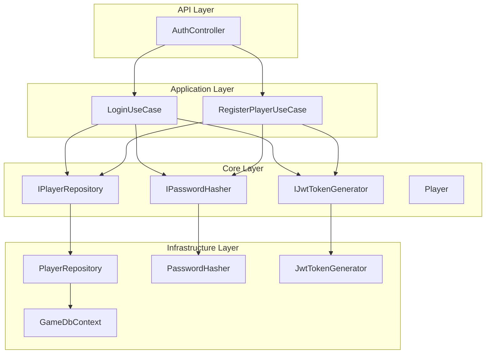
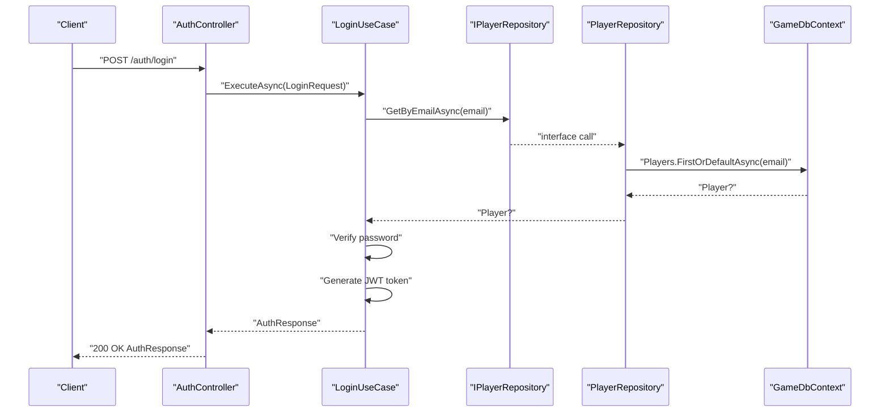
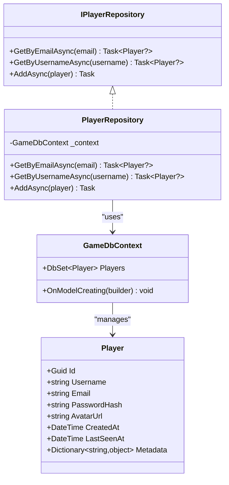
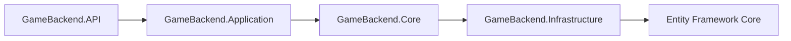

# Repository Pattern Implementation

<cite>
**Referenced Files in This Document**
- [IPlayerRepository.cs](file://GameBackend.Core/Interfaces/IPlayerRepository.cs)
- [PlayerRepository.cs](file://GameBackend.Infrastructure/Repositories/PlayerRepository.cs)
- [Player.cs](file://GameBackend.Core/Entities/Player.cs)
- [GameDbContext.cs](file://GameBackend.Infrastructure/Persistence/GameDbContext.cs)
- [LoginUseCase.cs](file://GameBackend.Application/Contracts/UseCases/Auth/LoginUseCase.cs)
- [RegisterPlayerUseCase.cs](file://GameBackend.Application/Contracts/UseCases/Auth/RegisterPlayerUseCase.cs)
- [AuthController.cs](file://GameBackend.API/Controllers/AuthController.cs)
- [Program.cs](file://GameBackend.API/Program.cs)
- [IPasswordHasher.cs](file://GameBackend.Core/Interfaces/IPasswordHasher.cs)
- [IJwtTokenGenerator.cs](file://GameBackend.Core/Interfaces/IJwtTokenGenerator.cs)
- [PasswordHasher.cs](file://GameBackend.Infrastructure/Security/PasswordHasher.cs)
- [JwtTokenGenerator.cs](file://GameBackend.Infrastructure/Security/JwtTokenGenerator.cs)
</cite>

## Table of Contents
1. [Introduction](#introduction)
2. [Project Structure](#project-structure)
3. [Core Components](#core-components)
4. [Architecture Overview](#architecture-overview)
5. [Detailed Component Analysis](#detailed-component-analysis)
6. [Dependency Analysis](#dependency-analysis)
7. [Performance Considerations](#performance-considerations)
8. [Testing Considerations](#testing-considerations)
9. [Troubleshooting Guide](#troubleshooting-guide)
10. [Conclusion](#conclusion)

## Introduction
This document provides comprehensive documentation for the repository pattern implementation in the GameBackend system. It focuses on the IPlayerRepository interface contract and the PlayerRepository implementation, detailing data access methods, query patterns, and transaction handling. It also covers dependency injection configuration, async/await usage, error handling strategies, performance optimization techniques, and testing considerations with mock repositories and in-memory databases.

## Project Structure
The GameBackend solution follows a clean architecture with separate projects for API, Application, Core, Infrastructure, and Tests. The repository pattern is implemented in the Infrastructure layer while the Core layer defines the domain entities and interfaces. The Application layer orchestrates business logic via use cases, and the API layer exposes HTTP endpoints.

**Diagram sources**
- [AuthController.cs:1-49](file://GameBackend.API/Controllers/AuthController.cs#L1-L49)
- [LoginUseCase.cs:1-45](file://GameBackend.Application/Contracts/UseCases/Auth/LoginUseCase.cs#L1-L45)
- [RegisterPlayerUseCase.cs:1-58](file://GameBackend.Application/Contracts/UseCases/Auth/RegisterPlayerUseCase.cs#L1-L58)
- [IPlayerRepository.cs:1-10](file://GameBackend.Core/Interfaces/IPlayerRepository.cs#L1-L10)
- [PlayerRepository.cs:1-34](file://GameBackend.Infrastructure/Repositories/PlayerRepository.cs#L1-L34)
- [Player.cs:1-13](file://GameBackend.Core/Entities/Player.cs#L1-L13)
- [GameDbContext.cs:1-28](file://GameBackend.Infrastructure/Persistence/GameDbContext.cs#L1-L28)
- [IPasswordHasher.cs:1-7](file://GameBackend.Core/Interfaces/IPasswordHasher.cs#L1-L7)
- [IJwtTokenGenerator.cs:1-6](file://GameBackend.Core/Interfaces/IJwtTokenGenerator.cs#L1-L6)
- [PasswordHasher.cs:1-16](file://GameBackend.Infrastructure/Security/PasswordHasher.cs#L1-L16)
- [JwtTokenGenerator.cs:1-44](file://GameBackend.Infrastructure/Security/JwtTokenGenerator.cs#L1-L44)

**Section sources**
- [Program.cs:1-72](file://GameBackend.API/Program.cs#L1-L72)

## Core Components
This section documents the repository interface and its implementation, including the domain entity and persistence context.

- IPlayerRepository interface contract:
  - Defines asynchronous retrieval by email and username.
  - Defines asynchronous addition of players.
  - Designed for minimal coupling and testability.

- PlayerRepository implementation:
  - Uses Entity Framework Core for data access.
  - Implements GetByEmailAsync and GetByUsernameAsync using LINQ with FirstOrDefaultAsync.
  - Implements AddAsync with AddAsync and SaveChangesAsync for transactional writes.

- Player entity:
  - Contains identity, credentials, metadata, and timestamps.
  - Excludes Metadata from database mapping to support flexible storage.

- GameDbContext:
  - Configures Player entity with primary key and unique indexes on Email and Username.
  - Ignores Metadata property during model creation.

**Section sources**
- [IPlayerRepository.cs:1-10](file://GameBackend.Core/Interfaces/IPlayerRepository.cs#L1-L10)
- [PlayerRepository.cs:1-34](file://GameBackend.Infrastructure/Repositories/PlayerRepository.cs#L1-L34)
- [Player.cs:1-13](file://GameBackend.Core/Entities/Player.cs#L1-L13)
- [GameDbContext.cs:1-28](file://GameBackend.Infrastructure/Persistence/GameDbContext.cs#L1-L28)

## Architecture Overview
The repository pattern sits between the Application layer (use cases) and the Infrastructure layer (data persistence). The API layer injects use cases, which depend on abstractions defined in the Core layer. The Infrastructure layer provides concrete implementations backed by Entity Framework Core.

**Diagram sources**
- [AuthController.cs:1-49](file://GameBackend.API/Controllers/AuthController.cs#L1-L49)
- [LoginUseCase.cs:1-45](file://GameBackend.Application/Contracts/UseCases/Auth/LoginUseCase.cs#L1-L45)
- [IPlayerRepository.cs:1-10](file://GameBackend.Core/Interfaces/IPlayerRepository.cs#L1-L10)
- [PlayerRepository.cs:1-34](file://GameBackend.Infrastructure/Repositories/PlayerRepository.cs#L1-L34)
- [GameDbContext.cs:1-28](file://GameBackend.Infrastructure/Persistence/GameDbContext.cs#L1-L28)

## Detailed Component Analysis

### IPlayerRepository Interface
- Purpose: Define the contract for player data access operations.
- Methods:
  - GetByEmailAsync: Retrieve a player by email.
  - GetByUsernameAsync: Retrieve a player by username.
  - AddAsync: Persist a new player.

- Design considerations:
  - Async methods enable non-blocking I/O.
  - Returns nullable types to indicate absence of data.
  - Minimal surface area promotes testability.

**Section sources**
- [IPlayerRepository.cs:1-10](file://GameBackend.Core/Interfaces/IPlayerRepository.cs#L1-L10)

### PlayerRepository Implementation
- Dependencies:
  - GameDbContext for data access.
- Methods:
  - GetByEmailAsync: Uses EF Core FirstOrDefaultAsync with email filter.
  - GetByUsernameAsync: Uses EF Core FirstOrDefaultAsync with username filter.
  - AddAsync: Adds entity asynchronously and saves changes synchronously.

- Transaction handling:
  - SaveChangesAsync ensures atomic write operations for AddAsync.
  - No explicit transaction scope is used; EF Core manages transactions per operation.

- Query patterns:
  - LINQ queries translated to SQL with index-backed filters.
  - Unique indexes on Email and Username optimize lookups.

**Section sources**
- [PlayerRepository.cs:1-34](file://GameBackend.Infrastructure/Repositories/PlayerRepository.cs#L1-L34)
- [GameDbContext.cs:1-28](file://GameBackend.Infrastructure/Persistence/GameDbContext.cs#L1-L28)

### Player Entity
- Properties:
  - Identity: Id (Guid).
  - Credentials: Username, Email, PasswordHash.
  - Media: AvatarUrl.
  - Timestamps: CreatedAt, LastSeenAt.
  - Metadata: Dictionary for extensible attributes.
- EF Core configuration:
  - Primary key on Id.
  - Unique indexes on Email and Username.
  - Metadata ignored for persistence.

**Section sources**
- [Player.cs:1-13](file://GameBackend.Core/Entities/Player.cs#L1-L13)
- [GameDbContext.cs:1-28](file://GameBackend.Infrastructure/Persistence/GameDbContext.cs#L1-L28)

### Dependency Injection Configuration
- Registration in Program.cs:
  - DbContext registration with Npgsql provider.
  - Scoped registration of IPlayerRepository mapped to PlayerRepository.
  - Scoped registrations for IPasswordHasher and IJwtTokenGenerator.
  - Use cases registered as scoped services.
- Lifetime:
  - Scoped services align with HTTP request lifetime.
  - DbContext instances scoped per request.

**Section sources**
- [Program.cs:1-72](file://GameBackend.API/Program.cs#L1-L72)

### Use Cases and Business Logic Integration
- LoginUseCase:
  - Retrieves player by email via repository.
  - Verifies password using IPasswordHasher.
  - Generates JWT token using IJwtTokenGenerator.
- RegisterPlayerUseCase:
  - Checks for existing user by email.
  - Hashes password and creates Player entity.
  - Persists player via repository and generates JWT token.

**Diagram sources**
- [IPlayerRepository.cs:1-10](file://GameBackend.Core/Interfaces/IPlayerRepository.cs#L1-L10)
- [PlayerRepository.cs:1-34](file://GameBackend.Infrastructure/Repositories/PlayerRepository.cs#L1-L34)
- [Player.cs:1-13](file://GameBackend.Core/Entities/Player.cs#L1-L13)
- [GameDbContext.cs:1-28](file://GameBackend.Infrastructure/Persistence/GameDbContext.cs#L1-L28)

**Section sources**
- [LoginUseCase.cs:1-45](file://GameBackend.Application/Contracts/UseCases/Auth/LoginUseCase.cs#L1-L45)
- [RegisterPlayerUseCase.cs:1-58](file://GameBackend.Application/Contracts/UseCases/Auth/RegisterPlayerUseCase.cs#L1-L58)

### API Controller Integration
- AuthController:
  - Exposes POST endpoints for register and login.
  - Injects RegisterPlayerUseCase and LoginUseCase.
  - Wraps use case execution in try-catch blocks.
  - Returns appropriate HTTP status codes with structured error responses.

**Section sources**
- [AuthController.cs:1-49](file://GameBackend.API/Controllers/AuthController.cs#L1-L49)

### Security Services
- IPasswordHasher and PasswordHasher:
  - Hashes passwords using BCrypt.
  - Verifies passwords against stored hashes.
- IJwtTokenGenerator and JwtTokenGenerator:
  - Generates signed JWT tokens with issuer, audience, and expiration.
  - Uses symmetric key signing with HMAC SHA-256.

**Section sources**
- [IPasswordHasher.cs:1-7](file://GameBackend.Core/Interfaces/IPasswordHasher.cs#L1-L7)
- [PasswordHasher.cs:1-16](file://GameBackend.Infrastructure/Security/PasswordHasher.cs#L1-L16)
- [IJwtTokenGenerator.cs:1-6](file://GameBackend.Core/Interfaces/IJwtTokenGenerator.cs#L1-L6)
- [JwtTokenGenerator.cs:1-44](file://GameBackend.Infrastructure/Security/JwtTokenGenerator.cs#L1-L44)

## Dependency Analysis
The dependency graph shows how the API depends on Application use cases, which depend on Core abstractions, and how Infrastructure provides concrete implementations backed by Entity Framework Core.

**Diagram sources**
- [Program.cs:1-72](file://GameBackend.API/Program.cs#L1-L72)
- [LoginUseCase.cs:1-45](file://GameBackend.Application/Contracts/UseCases/Auth/LoginUseCase.cs#L1-L45)
- [RegisterPlayerUseCase.cs:1-58](file://GameBackend.Application/Contracts/UseCases/Auth/RegisterPlayerUseCase.cs#L1-L58)
- [IPlayerRepository.cs:1-10](file://GameBackend.Core/Interfaces/IPlayerRepository.cs#L1-L10)
- [PlayerRepository.cs:1-34](file://GameBackend.Infrastructure/Repositories/PlayerRepository.cs#L1-L34)

**Section sources**
- [Program.cs:1-72](file://GameBackend.API/Program.cs#L1-L72)

## Performance Considerations
- Indexes:
  - Unique indexes on Email and Username reduce lookup complexity.
- Asynchronous operations:
  - All repository methods are asynchronous to avoid blocking threads.
- Transaction boundaries:
  - AddAsync performs SaveChangesAsync per operation; consider batching for bulk inserts.
- Query optimization:
  - Use projection to select only required fields when retrieving entities.
- Caching:
  - Consider caching frequently accessed players by Id or email.
- Connection management:
  - Ensure DbContext is properly scoped to requests to avoid long-lived contexts.

## Testing Considerations
- Mock repositories:
  - Create in-memory implementations of IPlayerRepository for unit tests.
  - Use frameworks like Moq to mock repository behavior.
- In-memory databases:
  - Use SQLite in-memory provider for integration tests.
  - Configure DbContextOptions with UseInMemoryDatabase for test isolation.
- Testable use cases:
  - Use cases depend on abstractions, enabling easy mocking of repository, hasher, and token generator.
- Controller tests:
  - Test endpoint behavior with mocked use cases to validate error handling and response formatting.

## Troubleshooting Guide
- Common exceptions:
  - Invalid credentials: Thrown when email not found or password verification fails.
  - User already exists: Thrown during registration when email duplicates occur.
- Error handling in controllers:
  - Register endpoint returns 400 with error message.
  - Login endpoint returns 401 with error message.
- Validation:
  - Ensure unique constraints on Email and Username are respected.
  - Verify password hashing and JWT generation configurations.

**Section sources**
- [LoginUseCase.cs:1-45](file://GameBackend.Application/Contracts/UseCases/Auth/LoginUseCase.cs#L1-L45)
- [RegisterPlayerUseCase.cs:1-58](file://GameBackend.Application/Contracts/UseCases/Auth/RegisterPlayerUseCase.cs#L1-L58)
- [AuthController.cs:1-49](file://GameBackend.API/Controllers/AuthController.cs#L1-L49)

## Conclusion
The GameBackend repository pattern implementation demonstrates clean separation of concerns with a well-defined interface, a concrete Entity Framework Core-backed implementation, and robust integration with dependency injection. The design supports asynchronous operations, clear transaction boundaries, and testability. By leveraging indexes, async patterns, and proper error handling, the system achieves maintainability and scalability suitable for authentication workflows.