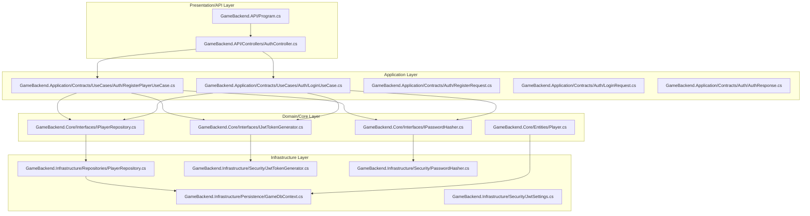
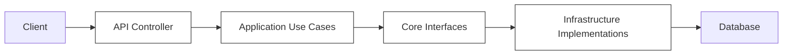
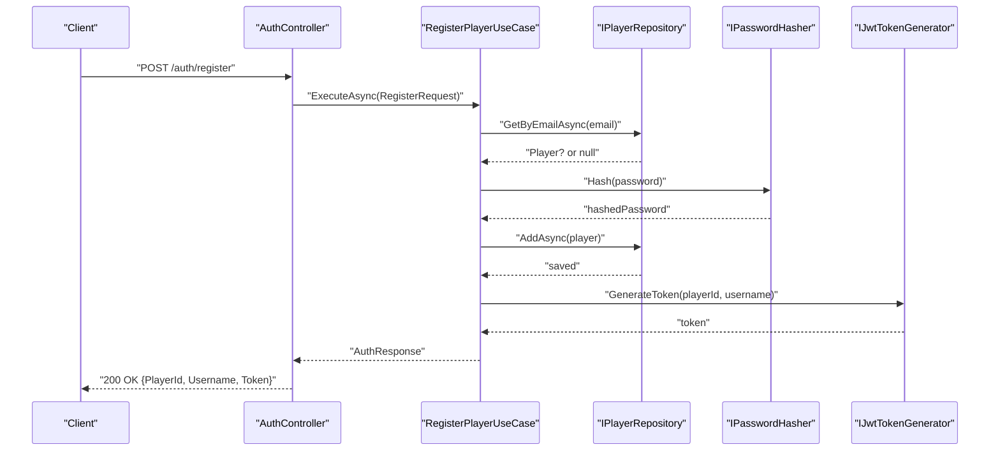
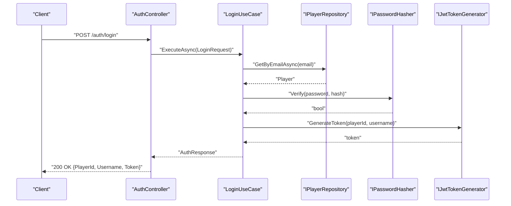
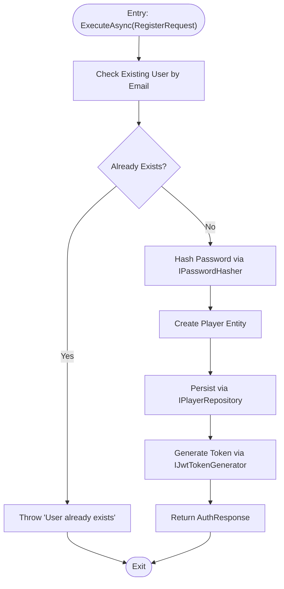
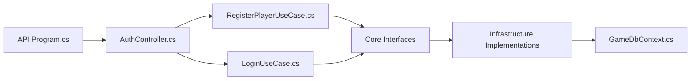

# Coding Standards & Conventions

<cite>
**Referenced Files in This Document**
- [Program.cs](file://GameBackend.API/Program.cs)
- [AuthController.cs](file://GameBackend.API/Controllers/AuthController.cs)
- [RegisterPlayerUseCase.cs](file://GameBackend.Application/Contracts/UseCases/Auth/RegisterPlayerUseCase.cs)
- [LoginUseCase.cs](file://GameBackend.Application/Contracts/UseCases/Auth/LoginUseCase.cs)
- [RegisterRequest.cs](file://GameBackend.Application/Contracts/Auth/RegisterRequest.cs)
- [LoginRequest.cs](file://GameBackend.Application/Contracts/Auth/LoginRequest.cs)
- [AuthResponse.cs](file://GameBackend.Application/Contracts/Auth/AuthResponse.cs)
- [Player.cs](file://GameBackend.Core/Entities/Player.cs)
- [IPlayerRepository.cs](file://GameBackend.Core/Interfaces/IPlayerRepository.cs)
- [IPasswordHasher.cs](file://GameBackend.Core/Interfaces/IPasswordHasher.cs)
- [IJwtTokenGenerator.cs](file://GameBackend.Core/Interfaces/IJwtTokenGenerator.cs)
- [GameDbContext.cs](file://GameBackend.Infrastructure/Persistence/GameDbContext.cs)
- [PlayerRepository.cs](file://GameBackend.Infrastructure/Repositories/PlayerRepository.cs)
- [JwtSettings.cs](file://GameBackend.Infrastructure/Security/JwtSettings.cs)
- [JwtTokenGenerator.cs](file://GameBackend.Infrastructure/Security/JwtTokenGenerator.cs)
- [PasswordHasher.cs](file://GameBackend.Infrastructure/Security/PasswordHasher.cs)
</cite>

## Table of Contents
1. [Introduction](#introduction)
2. [Project Structure](#project-structure)
3. [Core Components](#core-components)
4. [Architecture Overview](#architecture-overview)
5. [Detailed Component Analysis](#detailed-component-analysis)
6. [Dependency Analysis](#dependency-analysis)
7. [Performance Considerations](#performance-considerations)
8. [Troubleshooting Guide](#troubleshooting-guide)
9. [Conclusion](#conclusion)
10. [Appendices](#appendices)

## Introduction
This document defines the coding standards and conventions for the GameBackend project, aligning with Clean Architecture principles. It establishes naming patterns, architectural boundaries, layer-specific guidelines, interface design, dependency injection usage, formatting and commenting standards, namespace organization, SOLID adherence, error handling, logging practices, layer communication, service registration, configuration management, and code review checklists to maintain architectural integrity.

## Project Structure
The solution follows a layered architecture:
- Presentation/API Layer: ASP.NET Core controllers and startup configuration.
- Application Layer: Use cases, contracts, and application orchestration.
- Domain/Core Layer: Entities, interfaces, and domain logic.
- Infrastructure Layer: Persistence, external integrations, and cross-cutting concerns.

**Diagram sources**
- [Program.cs:1-72](file://GameBackend.API/Program.cs#L1-L72)
- [AuthController.cs:1-49](file://GameBackend.API/Controllers/AuthController.cs#L1-L49)
- [RegisterPlayerUseCase.cs:1-58](file://GameBackend.Application/Contracts/UseCases/Auth/RegisterPlayerUseCase.cs#L1-L58)
- [LoginUseCase.cs:1-45](file://GameBackend.Application/Contracts/UseCases/Auth/LoginUseCase.cs#L1-L45)
- [RegisterRequest.cs:1-8](file://GameBackend.Application/Contracts/Auth/RegisterRequest.cs#L1-L8)
- [LoginRequest.cs:1-7](file://GameBackend.Application/Contracts/Auth/LoginRequest.cs#L1-L7)
- [AuthResponse.cs:1-8](file://GameBackend.Application/Contracts/Auth/AuthResponse.cs#L1-L8)
- [Player.cs:1-13](file://GameBackend.Core/Entities/Player.cs#L1-L13)
- [IPlayerRepository.cs:1-10](file://GameBackend.Core/Interfaces/IPlayerRepository.cs#L1-L10)
- [IPasswordHasher.cs:1-7](file://GameBackend.Core/Interfaces/IPasswordHasher.cs#L1-L7)
- [IJwtTokenGenerator.cs:1-6](file://GameBackend.Core/Interfaces/IJwtTokenGenerator.cs#L1-L6)
- [GameDbContext.cs:1-28](file://GameBackend.Infrastructure/Persistence/GameDbContext.cs#L1-L28)
- [PlayerRepository.cs:1-34](file://GameBackend.Infrastructure/Repositories/PlayerRepository.cs#L1-L34)
- [JwtSettings.cs:1-8](file://GameBackend.Infrastructure/Security/JwtSettings.cs#L1-L8)
- [JwtTokenGenerator.cs:1-44](file://GameBackend.Infrastructure/Security/JwtTokenGenerator.cs#L1-L44)
- [PasswordHasher.cs:1-16](file://GameBackend.Infrastructure/Security/PasswordHasher.cs#L1-L16)

**Section sources**
- [Program.cs:1-72](file://GameBackend.API/Program.cs#L1-L72)
- [AuthController.cs:1-49](file://GameBackend.API/Controllers/AuthController.cs#L1-L49)

## Core Components
- Presentation/API Layer
  - Startup configures JWT authentication, registers DbContext and infrastructure services, and enables Swagger.
  - Controllers expose HTTP endpoints and delegate to application use cases.
- Application Layer
  - Use cases encapsulate application-specific workflows and coordinate domain services.
  - Contracts define requests/responses and are consumed by controllers.
- Domain/Core Layer
  - Entities model core domain data.
  - Interfaces define abstractions for repositories, hashing, and token generation.
- Infrastructure Layer
  - Implements interfaces using Entity Framework and external libraries.
  - Provides configuration models for JWT settings.

**Section sources**
- [Program.cs:11-50](file://GameBackend.API/Program.cs#L11-L50)
- [AuthController.cs:7-20](file://GameBackend.API/Controllers/AuthController.cs#L7-L20)
- [RegisterPlayerUseCase.cs:7-21](file://GameBackend.Application/Contracts/UseCases/Auth/RegisterPlayerUseCase.cs#L7-L21)
- [LoginUseCase.cs:6-20](file://GameBackend.Application/Contracts/UseCases/Auth/LoginUseCase.cs#L6-L20)
- [Player.cs:3-13](file://GameBackend.Core/Entities/Player.cs#L3-L13)
- [IPlayerRepository.cs:5-10](file://GameBackend.Core/Interfaces/IPlayerRepository.cs#L5-L10)
- [IPasswordHasher.cs:3-7](file://GameBackend.Core/Interfaces/IPasswordHasher.cs#L3-L7)
- [IJwtTokenGenerator.cs:3-6](file://GameBackend.Core/Interfaces/IJwtTokenGenerator.cs#L3-L6)
- [GameDbContext.cs:6-27](file://GameBackend.Infrastructure/Persistence/GameDbContext.cs#L6-L27)
- [PlayerRepository.cs:8-34](file://GameBackend.Infrastructure/Repositories/PlayerRepository.cs#L8-L34)
- [JwtSettings.cs:3-8](file://GameBackend.Infrastructure/Security/JwtSettings.cs#L3-L8)
- [JwtTokenGenerator.cs:11-44](file://GameBackend.Infrastructure/Security/JwtTokenGenerator.cs#L11-L44)
- [PasswordHasher.cs:5-16](file://GameBackend.Infrastructure/Security/PasswordHasher.cs#L5-L16)

## Architecture Overview
Clean Architecture boundaries:
- Inner layers (Domain/Core) must not depend on outer layers.
- Application layer orchestrates use cases and depends on domain interfaces.
- Infrastructure implements domain interfaces and depends on external libraries.
- Presentation depends on application contracts and delegates to use cases.

**Diagram sources**
- [Program.cs:1-72](file://GameBackend.API/Program.cs#L1-L72)
- [AuthController.cs:1-49](file://GameBackend.API/Controllers/AuthController.cs#L1-L49)
- [RegisterPlayerUseCase.cs:1-58](file://GameBackend.Application/Contracts/UseCases/Auth/RegisterPlayerUseCase.cs#L1-L58)
- [LoginUseCase.cs:1-45](file://GameBackend.Application/Contracts/UseCases/Auth/LoginUseCase.cs#L1-L45)
- [IPlayerRepository.cs:1-10](file://GameBackend.Core/Interfaces/IPlayerRepository.cs#L1-L10)
- [PlayerRepository.cs:1-34](file://GameBackend.Infrastructure/Repositories/PlayerRepository.cs#L1-L34)
- [GameDbContext.cs:1-28](file://GameBackend.Infrastructure/Persistence/GameDbContext.cs#L1-L28)

## Detailed Component Analysis

### API Layer Coding Guidelines
- Namespace Organization
  - Controllers reside under a dedicated Controllers folder with a consistent namespace pattern.
- Dependency Injection
  - Services are registered in the API project’s Program.cs using AddScoped for request-scoped services.
- Authentication and Authorization
  - JWT bearer authentication is configured with issuer, audience, and signing key loaded from configuration.
- Middleware Pipeline
  - HTTPS redirection, authentication, and authorization middleware are applied in order.
- Error Handling
  - Controllers wrap use case execution in try/catch blocks and return appropriate HTTP status codes with structured error payloads.
- Logging Practices
  - Use structured logging via the hosting framework; avoid ad-hoc Console logging in production paths.
- Comment Conventions
  - Prefer XML comments for public APIs; keep inline comments concise and focused on why, not what.

**Section sources**
- [Program.cs:13-50](file://GameBackend.API/Program.cs#L13-L50)
- [AuthController.cs:22-48](file://GameBackend.API/Controllers/AuthController.cs#L22-L48)

### Application Layer Coding Guidelines
- Use Case Design
  - Use cases are stateless, accept DTOs, and return DTOs; they orchestrate domain operations and coordinate external services.
- Contracts
  - Requests and responses are simple POCOs in the Contracts namespace; they are consumed by controllers and produced by use cases.
- Naming Patterns
  - UseCase classes are suffixed with UseCase; requests/responses match the feature area.
- SOLID Principles
  - Single Responsibility: Each use case handles a single workflow.
  - Open/Closed: New workflows are added by creating new use cases without modifying existing ones.
  - Dependency Inversion: Use cases depend on abstractions (interfaces), not concrete implementations.
- Error Handling
  - Throw domain-appropriate exceptions or return failure DTOs; leave HTTP response formatting to the controller.
- Logging Practices
  - Log at the boundary (controller) or via a dedicated mediator/logger; avoid logging inside use cases unless necessary.

**Section sources**
- [RegisterPlayerUseCase.cs:7-57](file://GameBackend.Application/Contracts/UseCases/Auth/RegisterPlayerUseCase.cs#L7-L57)
- [LoginUseCase.cs:6-44](file://GameBackend.Application/Contracts/UseCases/Auth/LoginUseCase.cs#L6-L44)
- [RegisterRequest.cs:3-8](file://GameBackend.Application/Contracts/Auth/RegisterRequest.cs#L3-L8)
- [LoginRequest.cs:3-7](file://GameBackend.Application/Contracts/Auth/LoginRequest.cs#L3-L7)
- [AuthResponse.cs:3-8](file://GameBackend.Application/Contracts/Auth/AuthResponse.cs#L3-L8)

### Domain/Core Layer Coding Guidelines
- Entities
  - Entities are simple POCOs with minimal behavior; they represent persisted data.
- Interfaces
  - Interfaces define capabilities required by higher layers; they live in the Core layer to prevent contamination from infrastructure.
- Naming Patterns
  - Entities: PascalCase singular; Interfaces: IPrefix + capability.
- SOLID Principles
  - Liskov Substitution: Implementations can replace interfaces without altering correctness.
  - Interface Segregation: Interfaces are small and cohesive.
- Error Handling
  - Domain logic throws meaningful exceptions; application layer translates to HTTP responses.
- Logging Practices
  - Domain code avoids logging; pass diagnostics up to the application/presentation layers.

**Section sources**
- [Player.cs:3-13](file://GameBackend.Core/Entities/Player.cs#L3-L13)
- [IPlayerRepository.cs:5-10](file://GameBackend.Core/Interfaces/IPlayerRepository.cs#L5-L10)
- [IPasswordHasher.cs:3-7](file://GameBackend.Core/Interfaces/IPasswordHasher.cs#L3-L7)
- [IJwtTokenGenerator.cs:3-6](file://GameBackend.Core/Interfaces/IJwtTokenGenerator.cs#L3-L6)

### Infrastructure Layer Coding Guidelines
- Implementations
  - Repositories implement domain interfaces; they encapsulate persistence logic.
  - Security services implement hashing and token generation using external libraries.
- Configuration
  - Settings are strongly typed and injected via IOptions<T>.
- Naming Patterns
  - Classes implement interfaces with matching capabilities; suffixes like Repository, Settings, Generator indicate roles.
- SOLID Principles
  - Dependency Inversion: Implementations depend on abstractions; higher layers depend on abstractions.
- Error Handling
  - Propagate domain exceptions or translate to infrastructure-specific exceptions; do not swallow errors silently.
- Logging Practices
  - Use ILogger<T>; avoid Console logging in production.

**Section sources**
- [GameDbContext.cs:6-27](file://GameBackend.Infrastructure/Persistence/GameDbContext.cs#L6-L27)
- [PlayerRepository.cs:8-34](file://GameBackend.Infrastructure/Repositories/PlayerRepository.cs#L8-L34)
- [JwtSettings.cs:3-8](file://GameBackend.Infrastructure/Security/JwtSettings.cs#L3-L8)
- [JwtTokenGenerator.cs:11-44](file://GameBackend.Infrastructure/Security/JwtTokenGenerator.cs#L11-L44)
- [PasswordHasher.cs:5-16](file://GameBackend.Infrastructure/Security/PasswordHasher.cs#L5-L16)

### Sequence: Registration Workflow

**Diagram sources**
- [AuthController.cs:22-34](file://GameBackend.API/Controllers/AuthController.cs#L22-L34)
- [RegisterPlayerUseCase.cs:23-57](file://GameBackend.Application/Contracts/UseCases/Auth/RegisterPlayerUseCase.cs#L23-L57)
- [IPlayerRepository.cs:7-9](file://GameBackend.Core/Interfaces/IPlayerRepository.cs#L7-L9)
- [IPasswordHasher.cs:5-6](file://GameBackend.Core/Interfaces/IPasswordHasher.cs#L5-L6)
- [IJwtTokenGenerator.cs:5-6](file://GameBackend.Core/Interfaces/IJwtTokenGenerator.cs#L5-L6)

### Sequence: Login Workflow

**Diagram sources**
- [AuthController.cs:36-48](file://GameBackend.API/Controllers/AuthController.cs#L36-L48)
- [LoginUseCase.cs:22-44](file://GameBackend.Application/Contracts/UseCases/Auth/LoginUseCase.cs#L22-L44)
- [IPlayerRepository.cs:7-9](file://GameBackend.Core/Interfaces/IPlayerRepository.cs#L7-L9)
- [IPasswordHasher.cs:5-6](file://GameBackend.Core/Interfaces/IPasswordHasher.cs#L5-L6)
- [IJwtTokenGenerator.cs:5-6](file://GameBackend.Core/Interfaces/IJwtTokenGenerator.cs#L5-L6)

### Flowchart: Use Case Execution (Registration)

**Diagram sources**
- [RegisterPlayerUseCase.cs:23-57](file://GameBackend.Application/Contracts/UseCases/Auth/RegisterPlayerUseCase.cs#L23-L57)

## Dependency Analysis
- API depends on Application contracts and use cases.
- Application depends on Core interfaces.
- Infrastructure implements Core interfaces.
- DbContext depends on Core entities.

**Diagram sources**
- [Program.cs:1-72](file://GameBackend.API/Program.cs#L1-L72)
- [AuthController.cs:1-49](file://GameBackend.API/Controllers/AuthController.cs#L1-L49)
- [RegisterPlayerUseCase.cs:1-58](file://GameBackend.Application/Contracts/UseCases/Auth/RegisterPlayerUseCase.cs#L1-L58)
- [LoginUseCase.cs:1-45](file://GameBackend.Application/Contracts/UseCases/Auth/LoginUseCase.cs#L1-L45)
- [IPlayerRepository.cs:1-10](file://GameBackend.Core/Interfaces/IPlayerRepository.cs#L1-L10)
- [GameDbContext.cs:1-28](file://GameBackend.Infrastructure/Persistence/GameDbContext.cs#L1-L28)

**Section sources**
- [Program.cs:19-24](file://GameBackend.API/Program.cs#L19-L24)
- [IPlayerRepository.cs:5-10](file://GameBackend.Core/Interfaces/IPlayerRepository.cs#L5-L10)
- [PlayerRepository.cs:8-15](file://GameBackend.Infrastructure/Repositories/PlayerRepository.cs#L8-L15)

## Performance Considerations
- Minimize allocations in hot paths (DTOs, tokens).
- Use async/await consistently to avoid blocking threads.
- Optimize database queries with appropriate indexes (as configured).
- Avoid unnecessary object creation in loops; reuse DTOs where safe.
- Cache infrequent reads at the application level if justified.

## Troubleshooting Guide
- Authentication Failures
  - Verify JWT settings (key, issuer, audience) in configuration.
  - Ensure the client sends Authorization headers with Bearer tokens.
- Database Connectivity
  - Confirm connection string resolution and provider configuration.
  - Validate migrations and schema expectations.
- Use Case Exceptions
  - Inspect thrown domain exceptions and ensure controllers map them to appropriate HTTP statuses.
- Logging
  - Enable detailed logs during development; ensure structured logging is configured in production.

**Section sources**
- [Program.cs:28-50](file://GameBackend.API/Program.cs#L28-L50)
- [GameDbContext.cs:15-27](file://GameBackend.Infrastructure/Persistence/GameDbContext.cs#L15-L27)
- [AuthController.cs:30-47](file://GameBackend.API/Controllers/AuthController.cs#L30-L47)

## Conclusion
These standards enforce Clean Architecture boundaries, promote SOLID compliance, and ensure maintainable, testable code. Adhering to these guidelines will preserve architectural integrity across layers and simplify future enhancements.

## Appendices

### A. C# Coding Conventions
- Naming
  - Types: PascalCase (e.g., Player, RegisterPlayerUseCase).
  - Methods: PascalCase (e.g., ExecuteAsync).
  - Fields: camelCase (e.g., _repository).
  - Constants: UPPER_SNAKE_CASE (e.g., MAX_RETRY_COUNT).
- Formatting
  - Use IDE defaults or EditorConfig for consistent indentation and spacing.
  - Prefer expression-bodied members for simple getters/setters.
- Comments
  - XML comments for public types and members.
  - Inline comments explain “why” and non-obvious logic.
- Nullability
  - Enable nullable reference types and annotate parameters and return values appropriately.

### B. Layer-Specific Guidelines
- Presentation
  - Keep controllers thin; delegate logic to use cases.
  - Centralize HTTP-specific concerns (filters, middleware).
- Application
  - Encapsulate workflows; avoid direct persistence calls.
  - Return DTOs; handle translation to domain entities at boundaries.
- Domain/Core
  - No external dependencies; no framework-specific code.
  - Focus on business rules and invariants.
- Infrastructure
  - Implement abstractions; encapsulate external concerns.
  - Manage connections and transactions carefully.

### C. Interface Design Patterns
- Repository Pattern
  - Define minimal, cohesive interfaces (e.g., GetByEmailAsync, AddAsync).
  - Return tasks for asynchronous operations.
- Factory/Strategy
  - Use factories for complex object construction when needed.
- Mediator
  - Consider a mediator for complex workflows to reduce coupling.

### D. Dependency Injection Usage
- Registration
  - Register scoped services in the API project’s Program.cs.
  - Bind configuration sections to strongly-typed settings.
- Lifetime
  - Scoped for request-scoped services; singleton for stateless helpers.
- Resolution
  - Inject interfaces, not implementations; resolve at constructor level.

**Section sources**
- [Program.cs:13-24](file://GameBackend.API/Program.cs#L13-L24)
- [JwtSettings.cs:3-8](file://GameBackend.Infrastructure/Security/JwtSettings.cs#L3-L8)

### E. Configuration Management
- Strongly-Typed Configuration
  - Bind sections to POCOs using IOptions<T>.
- Environment-Specific Settings
  - Use appsettings files per environment; avoid hardcoding secrets.
- Secrets
  - Store sensitive values in secure stores or environment variables.

**Section sources**
- [Program.cs:13-14](file://GameBackend.API/Program.cs#L13-L14)
- [JwtSettings.cs:3-8](file://GameBackend.Infrastructure/Security/JwtSettings.cs#L3-L8)

### F. Error Handling Patterns
- Domain Exceptions
  - Throw descriptive exceptions for invalid operations.
- HTTP Responses
  - Controllers translate domain exceptions to appropriate HTTP status codes.
- Validation
  - Validate inputs early; return 400/422 with structured error payloads.

**Section sources**
- [RegisterPlayerUseCase.cs:27-28](file://GameBackend.Application/Contracts/UseCases/Auth/RegisterPlayerUseCase.cs#L27-L28)
- [LoginUseCase.cs:26-32](file://GameBackend.Application/Contracts/UseCases/Auth/LoginUseCase.cs#L26-L32)
- [AuthController.cs:30-47](file://GameBackend.API/Controllers/AuthController.cs#L30-L47)

### G. Logging Practices
- Use ILogger<T> for structured logging.
- Log at appropriate levels (Debug, Information, Warning, Error).
- Avoid logging sensitive data; redact PII where necessary.

### H. Code Review Checklists
- Architectural Integrity
  - Does the change respect layer boundaries?
  - Are domain interfaces used instead of concrete implementations?
- SOLID Compliance
  - Is there a single responsibility per class/method?
  - Are abstractions preferred over implementations?
- Testing
  - Are new use cases covered by unit tests?
  - Are interfaces testable via mocks/fakes?
- Performance
  - Are async/await used consistently?
  - Are allocations minimized?
- Security
  - Are JWT settings validated?
  - Are passwords hashed and verified securely?
- Documentation
  - Are public APIs documented with XML comments?