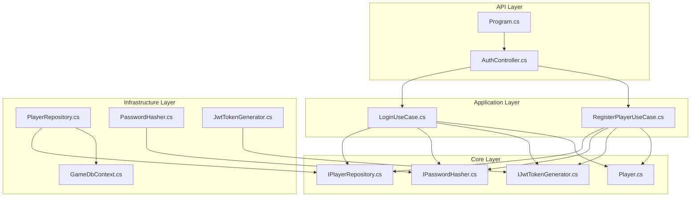
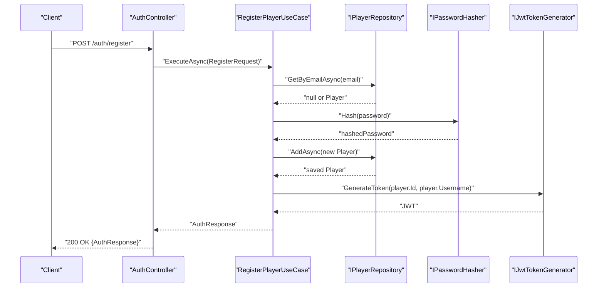
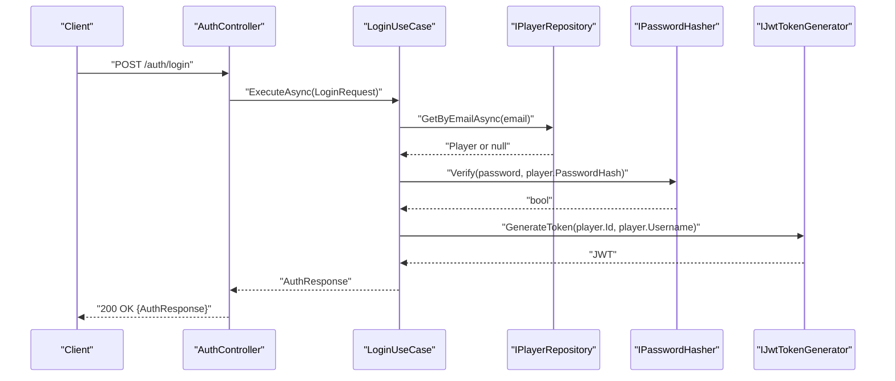
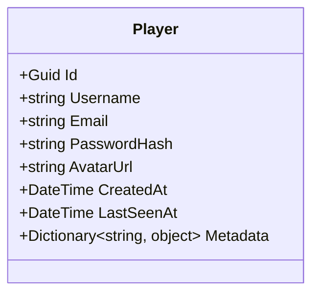
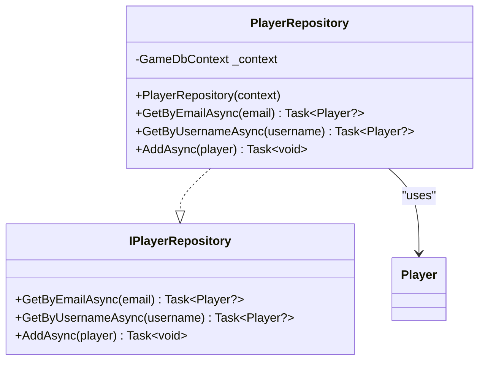
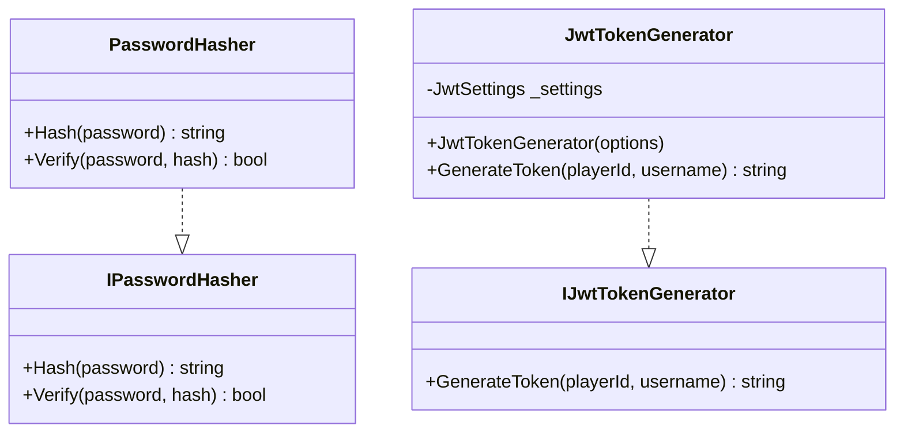
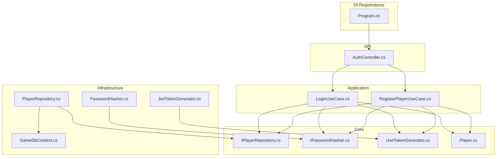

# Development Guide

<cite>
**Referenced Files in This Document**
- [Program.cs](file://GameBackend.API/Program.cs)
- [AuthController.cs](file://GameBackend.API/Controllers/AuthController.cs)
- [LoginUseCase.cs](file://GameBackend.Application/Contracts/UseCases/Auth/LoginUseCase.cs)
- [RegisterPlayerUseCase.cs](file://GameBackend.Application/Contracts/UseCases/Auth/RegisterPlayerUseCase.cs)
- [Player.cs](file://GameBackend.Core/Entities/Player.cs)
- [IPlayerRepository.cs](file://GameBackend.Core/Interfaces/IPlayerRepository.cs)
- [IPasswordHasher.cs](file://GameBackend.Core/Interfaces/IPasswordHasher.cs)
- [IJwtTokenGenerator.cs](file://GameBackend.Core/Interfaces/IJwtTokenGenerator.cs)
- [PlayerRepository.cs](file://GameBackend.Infrastructure/Repositories/PlayerRepository.cs)
- [JwtTokenGenerator.cs](file://GameBackend.Infrastructure/Security/JwtTokenGenerator.cs)
- [PasswordHasher.cs](file://GameBackend.Infrastructure/Security/PasswordHasher.cs)
- [GameDbContext.cs](file://GameBackend.Infrastructure/Persistence/GameDbContext.cs)
</cite>

## Table of Contents
1. [Introduction](#introduction)
2. [Project Structure](#project-structure)
3. [Core Components](#core-components)
4. [Architecture Overview](#architecture-overview)
5. [Detailed Component Analysis](#detailed-component-analysis)
6. [Dependency Analysis](#dependency-analysis)
7. [Performance Considerations](#performance-considerations)
8. [Testing Strategies](#testing-strategies)
9. [Extension Patterns](#extension-patterns)
10. [Code Review and QA](#code-review-and-qa)
11. [Continuous Integration](#continuous-integration)
12. [Troubleshooting Guide](#troubleshooting-guide)
13. [Conclusion](#conclusion)

## Introduction
This guide defines development standards, architecture enforcement, and extension patterns for the GameBackend project. It consolidates clean architecture principles, dependency injection, interface design, layer communication, testing strategies, and operational practices. The project follows a layered architecture:
- API layer exposes HTTP endpoints and delegates to application use cases.
- Application layer encapsulates business logic via use cases and requests/responses contracts.
- Core layer defines domain entities and abstractions (interfaces).
- Infrastructure layer implements abstractions with persistence and security utilities.

## Project Structure
The solution is organized into four projects plus tests:
- GameBackend.API: ASP.NET Core web host and controllers.
- GameBackend.Application: Application contracts and use cases.
- GameBackend.Core: Domain entities and core interfaces.
- GameBackend.Infrastructure: Entity Framework persistence and security implementations.
- GameBackend.Tests: Test project placeholder.



**Diagram sources**
- [Program.cs:1-72](file://GameBackend.API/Program.cs#L1-L72)
- [AuthController.cs:1-49](file://GameBackend.API/Controllers/AuthController.cs#L1-L49)
- [LoginUseCase.cs:1-45](file://GameBackend.Application/Contracts/UseCases/Auth/LoginUseCase.cs#L1-L45)
- [RegisterPlayerUseCase.cs:1-58](file://GameBackend.Application/Contracts/UseCases/Auth/RegisterPlayerUseCase.cs#L1-L58)
- [Player.cs:1-13](file://GameBackend.Core/Entities/Player.cs#L1-L13)
- [IPlayerRepository.cs:1-10](file://GameBackend.Core/Interfaces/IPlayerRepository.cs#L1-L10)
- [IPasswordHasher.cs:1-7](file://GameBackend.Core/Interfaces/IPasswordHasher.cs#L1-L7)
- [IJwtTokenGenerator.cs:1-6](file://GameBackend.Core/Interfaces/IJwtTokenGenerator.cs#L1-L6)
- [PlayerRepository.cs:1-34](file://GameBackend.Infrastructure/Repositories/PlayerRepository.cs#L1-L34)
- [PasswordHasher.cs:1-16](file://GameBackend.Infrastructure/Security/PasswordHasher.cs#L1-L16)
- [JwtTokenGenerator.cs:1-44](file://GameBackend.Infrastructure/Security/JwtTokenGenerator.cs#L1-L44)
- [GameDbContext.cs:1-28](file://GameBackend.Infrastructure/Persistence/GameDbContext.cs#L1-L28)

**Section sources**
- [Program.cs:1-72](file://GameBackend.API/Program.cs#L1-L72)
- [AuthController.cs:1-49](file://GameBackend.API/Controllers/AuthController.cs#L1-L49)

## Core Components
- API entrypoint configures services, authentication, middleware, and controller routing.
- Controllers expose HTTP endpoints and delegate to use cases.
- Use cases orchestrate application logic with injected interfaces.
- Core entities define the domain model; interfaces define contracts.
- Infrastructure implements persistence and security utilities.

Key responsibilities:
- API: HTTP pipeline, authentication, authorization, controller mapping.
- Application: Business logic, request/response contracts, use case orchestration.
- Core: Entities and abstractions to decouple layers.
- Infrastructure: EF Core context, repositories, hashing, JWT generation.

**Section sources**
- [Program.cs:1-72](file://GameBackend.API/Program.cs#L1-L72)
- [AuthController.cs:1-49](file://GameBackend.API/Controllers/AuthController.cs#L1-L49)
- [LoginUseCase.cs:1-45](file://GameBackend.Application/Contracts/UseCases/Auth/LoginUseCase.cs#L1-L45)
- [RegisterPlayerUseCase.cs:1-58](file://GameBackend.Application/Contracts/UseCases/Auth/RegisterPlayerUseCase.cs#L1-L58)
- [Player.cs:1-13](file://GameBackend.Core/Entities/Player.cs#L1-L13)
- [IPlayerRepository.cs:1-10](file://GameBackend.Core/Interfaces/IPlayerRepository.cs#L1-L10)
- [IPasswordHasher.cs:1-7](file://GameBackend.Core/Interfaces/IPasswordHasher.cs#L1-L7)
- [IJwtTokenGenerator.cs:1-6](file://GameBackend.Core/Interfaces/IJwtTokenGenerator.cs#L1-L6)
- [PlayerRepository.cs:1-34](file://GameBackend.Infrastructure/Repositories/PlayerRepository.cs#L1-L34)
- [PasswordHasher.cs:1-16](file://GameBackend.Infrastructure/Security/PasswordHasher.cs#L1-L16)
- [JwtTokenGenerator.cs:1-44](file://GameBackend.Infrastructure/Security/JwtTokenGenerator.cs#L1-L44)
- [GameDbContext.cs:1-28](file://GameBackend.Infrastructure/Persistence/GameDbContext.cs#L1-L28)

## Architecture Overview
Clean architecture enforces dependency inversion:
- API depends on Application (controllers depend on use cases).
- Application depends on Core (use cases depend on interfaces).
- Infrastructure implements Core interfaces and EF Core.

```mermaid
graph LR
API["API Layer<br/>Controllers, Program"] --> APP["Application Layer<br/>Use Cases, Requests/Responses"]
APP --> CORE["Core Layer<br/>Entities, Interfaces"]
CORE <-- INFRA_IMPL["Infrastructure Implementations"] --> INFRA["Infrastructure Layer<br/>EF Core, Security"]
INFRA --> DB["Database"]
API --> AUTH["Authentication & Authorization"]
AUTH --> APP
```

**Diagram sources**
- [Program.cs:1-72](file://GameBackend.API/Program.cs#L1-L72)
- [AuthController.cs:1-49](file://GameBackend.API/Controllers/AuthController.cs#L1-L49)
- [LoginUseCase.cs:1-45](file://GameBackend.Application/Contracts/UseCases/Auth/LoginUseCase.cs#L1-L45)
- [RegisterPlayerUseCase.cs:1-58](file://GameBackend.Application/Contracts/UseCases/Auth/RegisterPlayerUseCase.cs#L1-L58)
- [IPlayerRepository.cs:1-10](file://GameBackend.Core/Interfaces/IPlayerRepository.cs#L1-L10)
- [IJwtTokenGenerator.cs:1-6](file://GameBackend.Core/Interfaces/IJwtTokenGenerator.cs#L1-L6)
- [IPasswordHasher.cs:1-7](file://GameBackend.Core/Interfaces/IPasswordHasher.cs#L1-L7)
- [PlayerRepository.cs:1-34](file://GameBackend.Infrastructure/Repositories/PlayerRepository.cs#L1-L34)
- [JwtTokenGenerator.cs:1-44](file://GameBackend.Infrastructure/Security/JwtTokenGenerator.cs#L1-L44)
- [PasswordHasher.cs:1-16](file://GameBackend.Infrastructure/Security/PasswordHasher.cs#L1-L16)
- [GameDbContext.cs:1-28](file://GameBackend.Infrastructure/Persistence/GameDbContext.cs#L1-L28)

## Detailed Component Analysis

### Authentication Flow: Registration


**Diagram sources**
- [AuthController.cs:22-34](file://GameBackend.API/Controllers/AuthController.cs#L22-L34)
- [RegisterPlayerUseCase.cs:23-57](file://GameBackend.Application/Contracts/UseCases/Auth/RegisterPlayerUseCase.cs#L23-L57)
- [IPlayerRepository.cs:1-10](file://GameBackend.Core/Interfaces/IPlayerRepository.cs#L1-L10)
- [IPasswordHasher.cs:1-7](file://GameBackend.Core/Interfaces/IPasswordHasher.cs#L1-L7)
- [IJwtTokenGenerator.cs:1-6](file://GameBackend.Core/Interfaces/IJwtTokenGenerator.cs#L1-L6)

**Section sources**
- [AuthController.cs:22-34](file://GameBackend.API/Controllers/AuthController.cs#L22-L34)
- [RegisterPlayerUseCase.cs:23-57](file://GameBackend.Application/Contracts/UseCases/Auth/RegisterPlayerUseCase.cs#L23-L57)

### Authentication Flow: Login


**Diagram sources**
- [AuthController.cs:36-48](file://GameBackend.API/Controllers/AuthController.cs#L36-L48)
- [LoginUseCase.cs:22-44](file://GameBackend.Application/Contracts/UseCases/Auth/LoginUseCase.cs#L22-L44)
- [IPlayerRepository.cs:1-10](file://GameBackend.Core/Interfaces/IPlayerRepository.cs#L1-L10)
- [IPasswordHasher.cs:1-7](file://GameBackend.Core/Interfaces/IPasswordHasher.cs#L1-L7)
- [IJwtTokenGenerator.cs:1-6](file://GameBackend.Core/Interfaces/IJwtTokenGenerator.cs#L1-L6)

**Section sources**
- [AuthController.cs:36-48](file://GameBackend.API/Controllers/AuthController.cs#L36-L48)
- [LoginUseCase.cs:22-44](file://GameBackend.Application/Contracts/UseCases/Auth/LoginUseCase.cs#L22-L44)

### Data Model: Player


**Diagram sources**
- [Player.cs:1-13](file://GameBackend.Core/Entities/Player.cs#L1-L13)

**Section sources**
- [Player.cs:1-13](file://GameBackend.Core/Entities/Player.cs#L1-L13)

### Repository Pattern: PlayerRepository


**Diagram sources**
- [IPlayerRepository.cs:1-10](file://GameBackend.Core/Interfaces/IPlayerRepository.cs#L1-L10)
- [PlayerRepository.cs:1-34](file://GameBackend.Infrastructure/Repositories/PlayerRepository.cs#L1-L34)
- [Player.cs:1-13](file://GameBackend.Core/Entities/Player.cs#L1-L13)

**Section sources**
- [IPlayerRepository.cs:1-10](file://GameBackend.Core/Interfaces/IPlayerRepository.cs#L1-L10)
- [PlayerRepository.cs:1-34](file://GameBackend.Infrastructure/Repositories/PlayerRepository.cs#L1-L34)

### Security Utilities


**Diagram sources**
- [IPasswordHasher.cs:1-7](file://GameBackend.Core/Interfaces/IPasswordHasher.cs#L1-L7)
- [PasswordHasher.cs:1-16](file://GameBackend.Infrastructure/Security/PasswordHasher.cs#L1-L16)
- [IJwtTokenGenerator.cs:1-6](file://GameBackend.Core/Interfaces/IJwtTokenGenerator.cs#L1-L6)
- [JwtTokenGenerator.cs:1-44](file://GameBackend.Infrastructure/Security/JwtTokenGenerator.cs#L1-L44)

**Section sources**
- [IPasswordHasher.cs:1-7](file://GameBackend.Core/Interfaces/IPasswordHasher.cs#L1-L7)
- [PasswordHasher.cs:1-16](file://GameBackend.Infrastructure/Security/PasswordHasher.cs#L1-L16)
- [IJwtTokenGenerator.cs:1-6](file://GameBackend.Core/Interfaces/IJwtTokenGenerator.cs#L1-L6)
- [JwtTokenGenerator.cs:1-44](file://GameBackend.Infrastructure/Security/JwtTokenGenerator.cs#L1-L44)

## Dependency Analysis
- DI registrations bind abstractions to implementations in Program.cs.
- Controllers depend on use cases via constructor injection.
- Use cases depend on interfaces (repositories, hashers, token generators).
- Infrastructure implements core interfaces and EF Core context.



**Diagram sources**
- [Program.cs:1-72](file://GameBackend.API/Program.cs#L1-L72)
- [AuthController.cs:1-49](file://GameBackend.API/Controllers/AuthController.cs#L1-L49)
- [LoginUseCase.cs:1-45](file://GameBackend.Application/Contracts/UseCases/Auth/LoginUseCase.cs#L1-L45)
- [RegisterPlayerUseCase.cs:1-58](file://GameBackend.Application/Contracts/UseCases/Auth/RegisterPlayerUseCase.cs#L1-L58)
- [IPlayerRepository.cs:1-10](file://GameBackend.Core/Interfaces/IPlayerRepository.cs#L1-L10)
- [IPasswordHasher.cs:1-7](file://GameBackend.Core/Interfaces/IPasswordHasher.cs#L1-L7)
- [IJwtTokenGenerator.cs:1-6](file://GameBackend.Core/Interfaces/IJwtTokenGenerator.cs#L1-L6)
- [PlayerRepository.cs:1-34](file://GameBackend.Infrastructure/Repositories/PlayerRepository.cs#L1-L34)
- [PasswordHasher.cs:1-16](file://GameBackend.Infrastructure/Security/PasswordHasher.cs#L1-L16)
- [JwtTokenGenerator.cs:1-44](file://GameBackend.Infrastructure/Security/JwtTokenGenerator.cs#L1-L44)
- [GameDbContext.cs:1-28](file://GameBackend.Infrastructure/Persistence/GameDbContext.cs#L1-L28)
- [Player.cs:1-13](file://GameBackend.Core/Entities/Player.cs#L1-L13)

**Section sources**
- [Program.cs:19-24](file://GameBackend.API/Program.cs#L19-L24)
- [IPlayerRepository.cs:1-10](file://GameBackend.Core/Interfaces/IPlayerRepository.cs#L1-L10)
- [IJwtTokenGenerator.cs:1-6](file://GameBackend.Core/Interfaces/IJwtTokenGenerator.cs#L1-L6)
- [IPasswordHasher.cs:1-7](file://GameBackend.Core/Interfaces/IPasswordHasher.cs#L1-L7)

## Performance Considerations
- Use asynchronous repository methods consistently to avoid blocking threads.
- Minimize database roundtrips in use cases; batch operations where appropriate.
- Indexes are defined for unique fields (email, username) to optimize lookups.
- Avoid heavy computations in controllers; delegate to application use cases.
- Configure JWT expiration appropriately to balance security and client UX.
- Consider connection pooling and EF Core logging for diagnostics.

[No sources needed since this section provides general guidance]

## Testing Strategies
Recommended testing approach:
- Unit tests for use cases with mocks for repositories, hashers, and token generators.
- Mock implementations for IPlayerRepository, IPasswordHasher, and IJwtTokenGenerator.
- Test controller actions with minimal composition root or test-specific DI container.
- Use in-memory database provider for integration-like tests when needed.
- Assert on expected outcomes, exceptions, and side effects (e.g., repository calls).

Mock implementations outline:
- IPlayerRepository mock: stub GetByEmailAsync, GetByUsernameAsync, AddAsync.
- IPasswordHasher mock: stub Hash and Verify returning deterministic values.
- IJwtTokenGenerator mock: stub GenerateToken returning a fixed token string.

[No sources needed since this section provides general guidance]

## Extension Patterns
Adding new authentication features:
- Define request/response contracts in Application.Contracts.Auth.
- Implement a new use case in Application.UseCases.Auth.
- Add a controller endpoint in API Controllers.
- Register new abstractions and implementations in Program.cs if needed.
- Keep controllers thin; delegate to use cases.

Extending the data model:
- Add properties to Player in Core.Entities.
- Update GameDbContext OnModelCreating to configure new fields and indexes.
- Ensure migrations are generated and applied.
- Update use cases and repositories to handle new fields.

Integrating additional security measures:
- Introduce new interfaces in Core.Interfaces for additional concerns (e.g., rate limiting, audit logs).
- Implement in Infrastructure and register in Program.cs.
- Inject new dependencies into use cases and controllers following dependency inversion.

Layer communication guidelines:
- API → Application: via use cases and request/response contracts.
- Application → Core: via interfaces only (no concrete dependencies).
- Infrastructure → Core: via interface implementations.
- Avoid cross-layer references; maintain strict boundaries.

[No sources needed since this section provides general guidance]

## Code Review and QA
Review checklist:
- Clean architecture adherence: no API-layer references to infrastructure.
- DI correctness: all abstractions resolved via Program.cs registrations.
- Use case purity: side effects isolated; pure transformations kept separate.
- Error handling: meaningful exceptions; avoid swallowing errors.
- Naming consistency: interfaces prefixed with I; implementations match interface names.
- Tests coverage: unit tests for use cases and critical logic paths.

QA practices:
- Static analysis: enable analyzers and enforce severity levels.
- Code formatting: adopt a shared editorconfig and formatter.
- Secrets management: keep JWT keys and connection strings out of source.
- Logging: instrument key events in use cases and controllers.

[No sources needed since this section provides general guidance]

## Continuous Integration
CI recommendations:
- Build and test matrix: multiple frameworks and OS targets.
- Security scanning: static analysis, dependency checks, secrets detection.
- Artifact retention: build outputs, test results, coverage reports.
- Deployment pipeline: validate against staging before production promotion.

[No sources needed since this section provides general guidance]

## Troubleshooting Guide
Common issues and resolutions:
- Authentication failures: verify JWT settings (issuer, audience, key) and token validation parameters.
- Database connectivity: confirm connection string and migration status.
- Duplicate email/username: ensure unique indexes and handle exceptions in use cases.
- Password verification errors: confirm hasher implementation and stored hash format.

**Section sources**
- [Program.cs:28-50](file://GameBackend.API/Program.cs#L28-L50)
- [GameDbContext.cs:19-26](file://GameBackend.Infrastructure/Persistence/GameDbContext.cs#L19-L26)

## Conclusion
This guide establishes consistent development practices for the GameBackend project. By adhering to clean architecture, dependency injection, and interface-driven design, teams can evolve features safely, maintain testability, and scale securely. Follow the extension patterns, testing strategies, and QA practices outlined here to ensure high-quality, maintainable code.