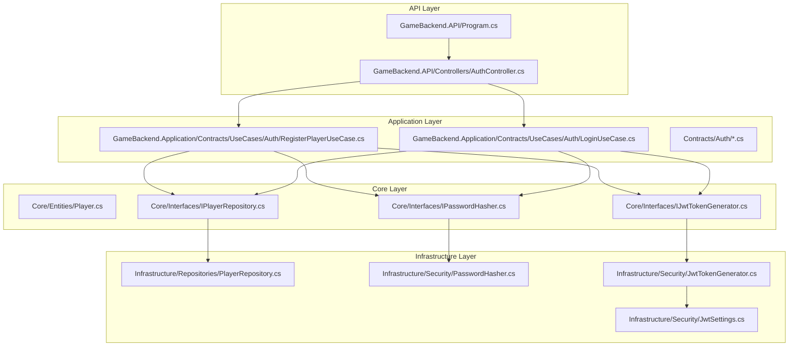
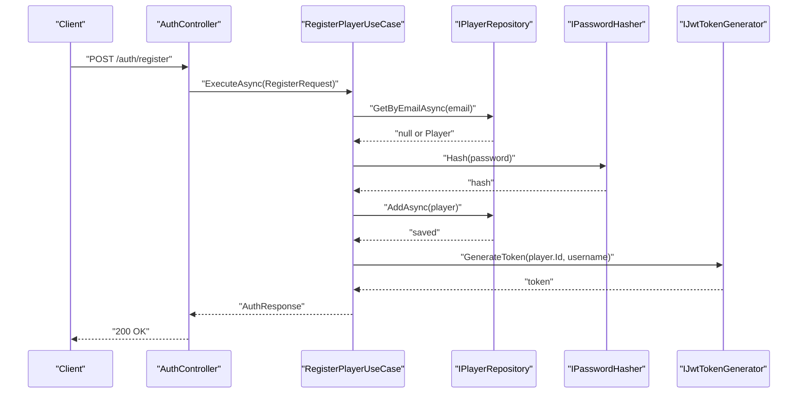
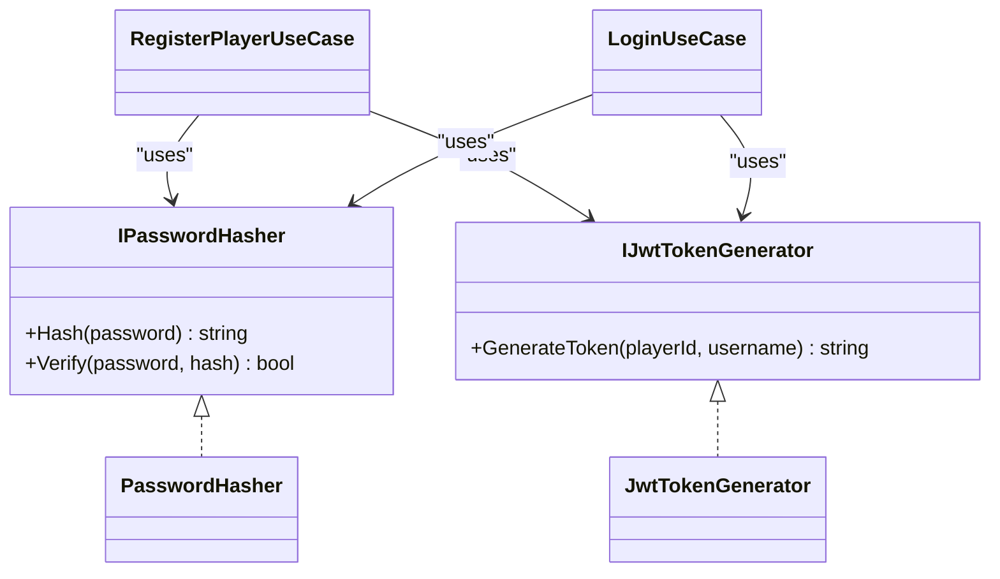
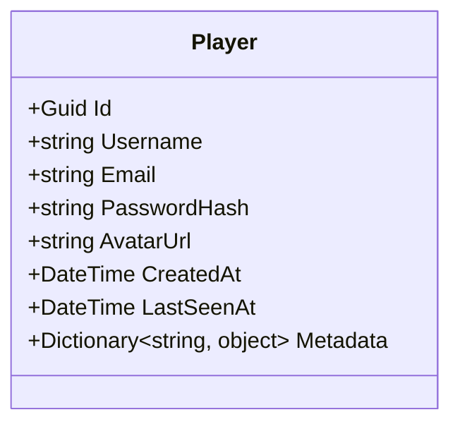
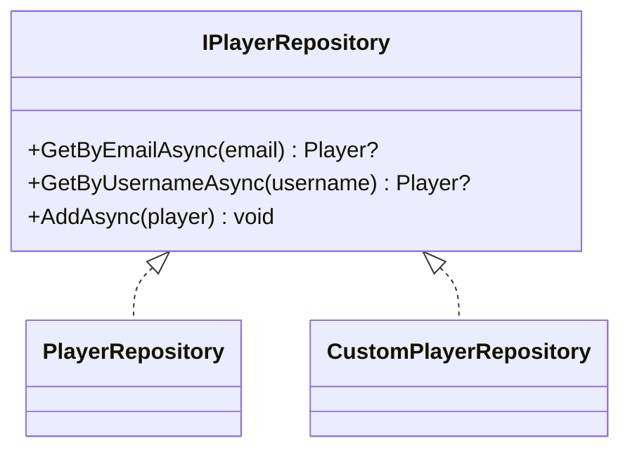
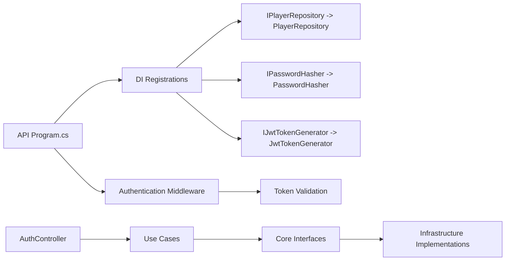

# Extension Patterns & Customization

<cite>
**Referenced Files in This Document**
- [Program.cs](file://GameBackend.API/Program.cs)
- [AuthController.cs](file://GameBackend.API/Controllers/AuthController.cs)
- [RegisterPlayerUseCase.cs](file://GameBackend.Application/Contracts/UseCases/Auth/RegisterPlayerUseCase.cs)
- [LoginUseCase.cs](file://GameBackend.Application/Contracts/UseCases/Auth/LoginUseCase.cs)
- [RegisterRequest.cs](file://GameBackend.Application/Contracts/Auth/RegisterRequest.cs)
- [LoginRequest.cs](file://GameBackend.Application/Contracts/Auth/LoginRequest.cs)
- [Player.cs](file://GameBackend.Core/Entities/Player.cs)
- [IPlayerRepository.cs](file://GameBackend.Core/Interfaces/IPlayerRepository.cs)
- [IPasswordHasher.cs](file://GameBackend.Core/Interfaces/IPasswordHasher.cs)
- [IJwtTokenGenerator.cs](file://GameBackend.Core/Interfaces/IJwtTokenGenerator.cs)
- [PlayerRepository.cs](file://GameBackend.Infrastructure/Repositories/PlayerRepository.cs)
- [PasswordHasher.cs](file://GameBackend.Infrastructure/Security/PasswordHasher.cs)
- [JwtTokenGenerator.cs](file://GameBackend.Infrastructure/Security/JwtTokenGenerator.cs)
- [JwtSettings.cs](file://GameBackend.Infrastructure/Security/JwtSettings.cs)
</cite>

## Table of Contents
1. [Introduction](#introduction)
2. [Project Structure](#project-structure)
3. [Core Components](#core-components)
4. [Architecture Overview](#architecture-overview)
5. [Detailed Component Analysis](#detailed-component-analysis)
6. [Dependency Analysis](#dependency-analysis)
7. [Performance Considerations](#performance-considerations)
8. [Troubleshooting Guide](#troubleshooting-guide)
9. [Conclusion](#conclusion)

## Introduction
This document explains how to extend the GameBackend project with new authentication providers, additional security features, and customized player entity behavior. It focuses on clean architecture boundaries, dependency injection registration, interface-based extension points, and configuration-driven customization. The guidance covers replacing services, adding new capabilities, and evolving the player model safely without breaking core contracts.

## Project Structure
The solution follows a layered architecture:
- API layer exposes HTTP endpoints and registers DI services.
- Application layer defines use cases and request/response contracts.
- Core layer defines domain entities and interfaces.
- Infrastructure layer implements repositories and security services.

**Diagram sources**
- [Program.cs:1-72](file://GameBackend.API/Program.cs#L1-L72)
- [AuthController.cs:1-49](file://GameBackend.API/Controllers/AuthController.cs#L1-L49)
- [RegisterPlayerUseCase.cs:1-58](file://GameBackend.Application/Contracts/UseCases/Auth/RegisterPlayerUseCase.cs#L1-L58)
- [LoginUseCase.cs:1-45](file://GameBackend.Application/Contracts/UseCases/Auth/LoginUseCase.cs#L1-L45)
- [Player.cs:1-13](file://GameBackend.Core/Entities/Player.cs#L1-L13)
- [IPlayerRepository.cs:1-10](file://GameBackend.Core/Interfaces/IPlayerRepository.cs#L1-L10)
- [IPasswordHasher.cs:1-7](file://GameBackend.Core/Interfaces/IPasswordHasher.cs#L1-L7)
- [IJwtTokenGenerator.cs:1-6](file://GameBackend.Core/Interfaces/IJwtTokenGenerator.cs#L1-L6)
- [PlayerRepository.cs:1-34](file://GameBackend.Infrastructure/Repositories/PlayerRepository.cs#L1-L34)
- [PasswordHasher.cs:1-16](file://GameBackend.Infrastructure/Security/PasswordHasher.cs#L1-L16)
- [JwtTokenGenerator.cs:1-44](file://GameBackend.Infrastructure/Security/JwtTokenGenerator.cs#L1-L44)
- [JwtSettings.cs:1-8](file://GameBackend.Infrastructure/Security/JwtSettings.cs#L1-L8)

**Section sources**
- [Program.cs:1-72](file://GameBackend.API/Program.cs#L1-L72)
- [AuthController.cs:1-49](file://GameBackend.API/Controllers/AuthController.cs#L1-L49)

## Core Components
This section highlights the primary extension points and how to replace or extend them.

- Authentication flow
  - Registration and login use cases orchestrate repository access, password hashing, and JWT generation.
  - Controllers expose HTTP endpoints for registration and login.

- Domain and interfaces
  - Player entity defines identity, credentials storage, and metadata.
  - Core interfaces decouple application logic from infrastructure concerns.

- Infrastructure implementations
  - Repository persists and retrieves players via Entity Framework.
  - Security services implement hashing and token generation.

Key extension points:
- Replaceable services: IPasswordHasher, IJwtTokenGenerator, IPlayerRepository.
- Configurable behavior: JwtSettings for token issuer, audience, and signing key.
- Extensible entity: Player supports additional fields via metadata or composition.

**Section sources**
- [RegisterPlayerUseCase.cs:1-58](file://GameBackend.Application/Contracts/UseCases/Auth/RegisterPlayerUseCase.cs#L1-L58)
- [LoginUseCase.cs:1-45](file://GameBackend.Application/Contracts/UseCases/Auth/LoginUseCase.cs#L1-L45)
- [AuthController.cs:1-49](file://GameBackend.API/Controllers/AuthController.cs#L1-L49)
- [Player.cs:1-13](file://GameBackend.Core/Entities/Player.cs#L1-L13)
- [IPlayerRepository.cs:1-10](file://GameBackend.Core/Interfaces/IPlayerRepository.cs#L1-L10)
- [IPasswordHasher.cs:1-7](file://GameBackend.Core/Interfaces/IPasswordHasher.cs#L1-L7)
- [IJwtTokenGenerator.cs:1-6](file://GameBackend.Core/Interfaces/IJwtTokenGenerator.cs#L1-L6)
- [PlayerRepository.cs:1-34](file://GameBackend.Infrastructure/Repositories/PlayerRepository.cs#L1-L34)
- [PasswordHasher.cs:1-16](file://GameBackend.Infrastructure/Security/PasswordHasher.cs#L1-L16)
- [JwtTokenGenerator.cs:1-44](file://GameBackend.Infrastructure/Security/JwtTokenGenerator.cs#L1-L44)
- [JwtSettings.cs:1-8](file://GameBackend.Infrastructure/Security/JwtSettings.cs#L1-L8)

## Architecture Overview
The system enforces dependency inversion: application use cases depend on abstractions, not concrete implementations. DI registration in the API layer binds abstractions to infrastructure implementations. Authentication middleware validates tokens issued by the configured generator.

**Diagram sources**
- [AuthController.cs:22-34](file://GameBackend.API/Controllers/AuthController.cs#L22-L34)
- [RegisterPlayerUseCase.cs:23-57](file://GameBackend.Application/Contracts/UseCases/Auth/RegisterPlayerUseCase.cs#L23-L57)
- [IPlayerRepository.cs:5-10](file://GameBackend.Core/Interfaces/IPlayerRepository.cs#L5-L10)
- [IPasswordHasher.cs:3-7](file://GameBackend.Core/Interfaces/IPasswordHasher.cs#L3-L7)
- [IJwtTokenGenerator.cs:3-6](file://GameBackend.Core/Interfaces/IJwtTokenGenerator.cs#L3-L6)

**Section sources**
- [Program.cs:13-24](file://GameBackend.API/Program.cs#L13-L24)
- [AuthController.cs:1-49](file://GameBackend.API/Controllers/AuthController.cs#L1-L49)
- [RegisterPlayerUseCase.cs:1-58](file://GameBackend.Application/Contracts/UseCases/Auth/RegisterPlayerUseCase.cs#L1-L58)

## Detailed Component Analysis

### Authentication Flow Extension Points
- Add new authentication providers
  - Implement IPasswordHasher to support alternative hashing schemes.
  - Implement IJwtTokenGenerator to switch token formats or add claims.
  - Register new implementations in Program.cs with AddScoped and replace defaults.

- Extend security features
  - Add rate limiting, IP binding, or device fingerprinting around use cases or middleware.
  - Introduce secondary verification (TOTP/SMS) by augmenting requests/responses and use case logic.

- Customize token issuance
  - Adjust JwtSettings to change issuer, audience, and key material.
  - Modify JwtTokenGenerator to add custom claims or token types.

**Diagram sources**
- [IPasswordHasher.cs:1-7](file://GameBackend.Core/Interfaces/IPasswordHasher.cs#L1-L7)
- [IJwtTokenGenerator.cs:1-6](file://GameBackend.Core/Interfaces/IJwtTokenGenerator.cs#L1-L6)
- [PasswordHasher.cs:1-16](file://GameBackend.Infrastructure/Security/PasswordHasher.cs#L1-L16)
- [JwtTokenGenerator.cs:1-44](file://GameBackend.Infrastructure/Security/JwtTokenGenerator.cs#L1-L44)
- [RegisterPlayerUseCase.cs:1-58](file://GameBackend.Application/Contracts/UseCases/Auth/RegisterPlayerUseCase.cs#L1-L58)
- [LoginUseCase.cs:1-45](file://GameBackend.Application/Contracts/UseCases/Auth/LoginUseCase.cs#L1-L45)

**Section sources**
- [Program.cs:21-22](file://GameBackend.API/Program.cs#L21-L22)
- [JwtTokenGenerator.cs:1-44](file://GameBackend.Infrastructure/Security/JwtTokenGenerator.cs#L1-L44)
- [PasswordHasher.cs:1-16](file://GameBackend.Infrastructure/Security/PasswordHasher.cs#L1-L16)

### Player Entity Model Extensions
- Add fields safely
  - Extend Player with new scalar properties for attributes like display name, timezone, or preferences.
  - Keep backward compatibility by initializing defaults and avoiding breaking changes to existing APIs.

- Use metadata dictionary
  - Store optional, evolving attributes in Player.Metadata to avoid frequent schema migrations.

- Composition vs inheritance
  - Prefer composition for optional features (e.g., profile details) to keep Player focused on core identity.

**Diagram sources**
- [Player.cs:1-13](file://GameBackend.Core/Entities/Player.cs#L1-L13)

**Section sources**
- [Player.cs:1-13](file://GameBackend.Core/Entities/Player.cs#L1-L13)

### Repository Replacement Pattern
- Replace persistence mechanism
  - Implement IPlayerRepository with an alternate store (e.g., NoSQL, cache, or remote service).
  - Register the new implementation in Program.cs to swap persistence without changing use cases.

**Diagram sources**
- [IPlayerRepository.cs:1-10](file://GameBackend.Core/Interfaces/IPlayerRepository.cs#L1-L10)
- [PlayerRepository.cs:1-34](file://GameBackend.Infrastructure/Repositories/PlayerRepository.cs#L1-L34)

**Section sources**
- [Program.cs](file://GameBackend.API/Program.cs#L19)
- [IPlayerRepository.cs:1-10](file://GameBackend.Core/Interfaces/IPlayerRepository.cs#L1-L10)
- [PlayerRepository.cs:1-34](file://GameBackend.Infrastructure/Repositories/PlayerRepository.cs#L1-L34)

### Configuration-Driven Extensions
- Tune JWT behavior
  - Adjust JwtSettings via configuration to change signing key, issuer, and audience.
  - Update JwtTokenGenerator to reflect new settings without code changes.

- Environment-specific behavior
  - Use appsettings profiles to enable/disable features or alter thresholds.
  - Externalize secrets and keys to secure configuration stores.

**Section sources**
- [Program.cs:13-14](file://GameBackend.API/Program.cs#L13-L14)
- [JwtSettings.cs:1-8](file://GameBackend.Infrastructure/Security/JwtSettings.cs#L1-L8)
- [JwtTokenGenerator.cs:13-18](file://GameBackend.Infrastructure/Security/JwtTokenGenerator.cs#L13-L18)

### Plugin Architecture Guidance
- Service discovery
  - Register multiple implementations behind the same interface and select at runtime via configuration or feature flags.
- Feature toggles
  - Gate new authentication providers behind flags to roll out incrementally.
- Cross-cutting concerns
  - Wrap use cases with decorators for logging, metrics, or auditing without altering core logic.

[No sources needed since this section provides general guidance]

## Dependency Analysis
The API layer configures DI and authentication. Application use cases depend on abstractions. Infrastructure implements those abstractions. Controllers depend on use cases.

**Diagram sources**
- [Program.cs:13-24](file://GameBackend.API/Program.cs#L13-L24)
- [Program.cs:32-50](file://GameBackend.API/Program.cs#L32-L50)
- [AuthController.cs:1-49](file://GameBackend.API/Controllers/AuthController.cs#L1-L49)
- [RegisterPlayerUseCase.cs:1-58](file://GameBackend.Application/Contracts/UseCases/Auth/RegisterPlayerUseCase.cs#L1-L58)
- [LoginUseCase.cs:1-45](file://GameBackend.Application/Contracts/UseCases/Auth/LoginUseCase.cs#L1-L45)
- [IPlayerRepository.cs:1-10](file://GameBackend.Core/Interfaces/IPlayerRepository.cs#L1-L10)
- [IPasswordHasher.cs:1-7](file://GameBackend.Core/Interfaces/IPasswordHasher.cs#L1-L7)
- [IJwtTokenGenerator.cs:1-6](file://GameBackend.Core/Interfaces/IJwtTokenGenerator.cs#L1-L6)
- [PlayerRepository.cs:1-34](file://GameBackend.Infrastructure/Repositories/PlayerRepository.cs#L1-L34)
- [PasswordHasher.cs:1-16](file://GameBackend.Infrastructure/Security/PasswordHasher.cs#L1-L16)
- [JwtTokenGenerator.cs:1-44](file://GameBackend.Infrastructure/Security/JwtTokenGenerator.cs#L1-L44)

**Section sources**
- [Program.cs:1-72](file://GameBackend.API/Program.cs#L1-L72)
- [AuthController.cs:1-49](file://GameBackend.API/Controllers/AuthController.cs#L1-L49)

## Performance Considerations
- Hashing cost
  - Choose a hashing algorithm appropriate for your workload; adjust parameters via IPasswordHasher implementation.
- Token lifetime
  - Shorten token expiration to reduce long-lived credential risk; ensure client refresh logic remains efficient.
- Caching
  - Cache frequently accessed player data (avoid caching secrets) to reduce database load.
- Asynchronous I/O
  - Keep repository and use case operations asynchronous to prevent thread blocking.

[No sources needed since this section provides general guidance]

## Troubleshooting Guide
- Authentication failures
  - Verify JWT configuration (issuer, audience, key) matches the generator settings.
  - Confirm token validation parameters align with the signing key and algorithm.

- Registration/login errors
  - Inspect use case flows for duplicate user detection, hashing, and token generation steps.
  - Ensure repository operations complete successfully before issuing tokens.

- Dependency resolution
  - Confirm all required services are registered in Program.cs and resolve at runtime.

**Section sources**
- [Program.cs:28-50](file://GameBackend.API/Program.cs#L28-L50)
- [RegisterPlayerUseCase.cs:23-57](file://GameBackend.Application/Contracts/UseCases/Auth/RegisterPlayerUseCase.cs#L23-L57)
- [LoginUseCase.cs:22-44](file://GameBackend.Application/Contracts/UseCases/Auth/LoginUseCase.cs#L22-L44)

## Conclusion
GameBackend’s layered design and DI-driven service bindings enable safe, incremental extensions. To add new authentication providers, implement core interfaces and register them in the API Program.cs. To introduce additional security features, wrap use cases or middleware without modifying core contracts. Extend the Player entity thoughtfully, favoring metadata or composition for optional attributes. Maintain architectural boundaries by keeping application logic dependent on abstractions and avoiding leakage from infrastructure into core.