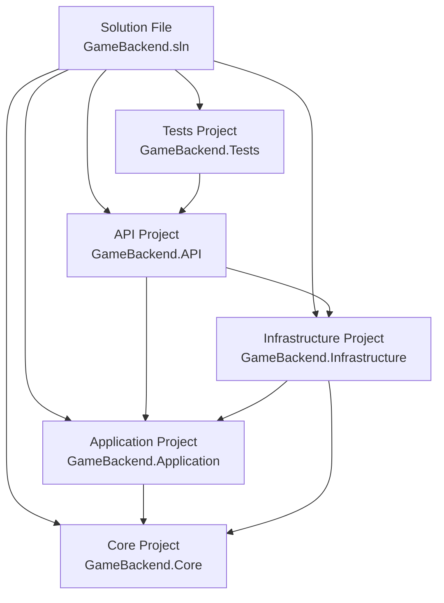
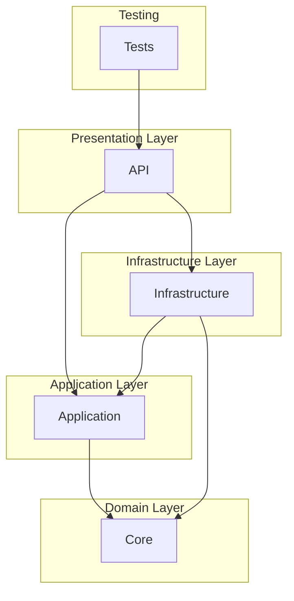
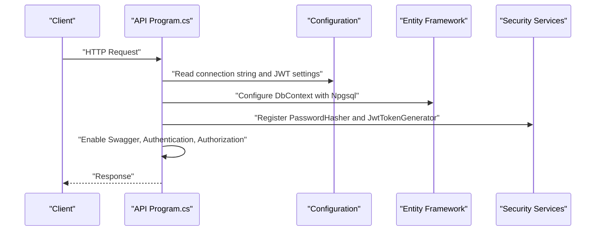
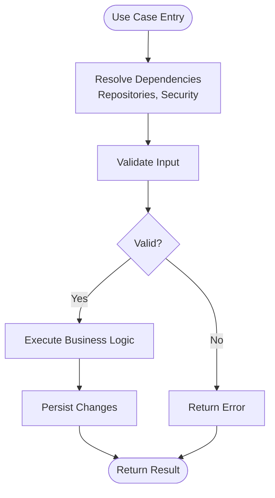
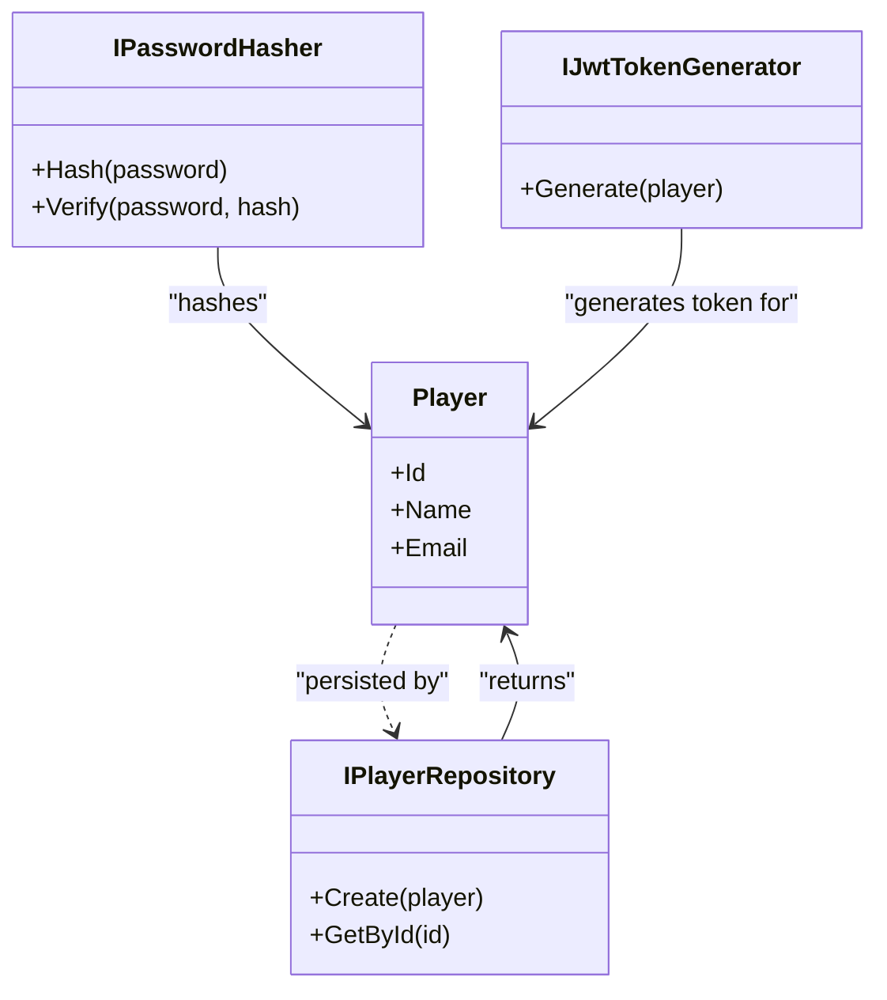
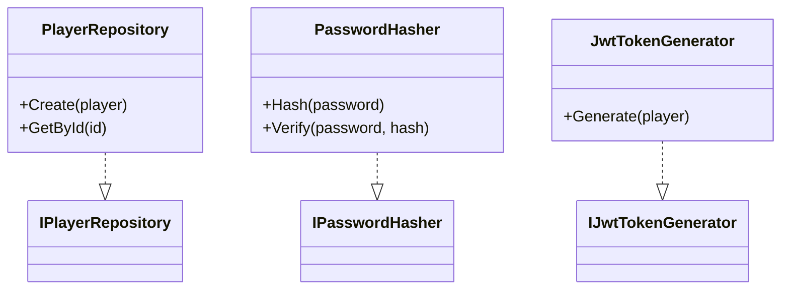
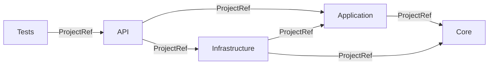

# Project Maintenance & Development Workflow

<cite>
**Referenced Files in This Document**
- [GameBackend.sln](file://GameBackend.sln)
- [global.json](file://global.json)
- [GameBackend.API.csproj](file://GameBackend.API/GameBackend.API.csproj)
- [GameBackend.Application.csproj](file://GameBackend.Application/GameBackend.Application.csproj)
- [GameBackend.Core.csproj](file://GameBackend.Core/GameBackend.Core.csproj)
- [GameBackend.Infrastructure.csproj](file://GameBackend.Infrastructure/GameBackend.Infrastructure.csproj)
- [GameBackend.Tests.csproj](file://GameBackend.Tests/GameBackend.Tests.csproj)
- [Program.cs (API)](file://GameBackend.API/Program.cs)
- [Program.cs (Application)](file://GameBackend.Application/Program.cs)
- [Program.cs (Core)](file://GameBackend.Core/Program.cs)
- [Program.cs (Infrastructure)](file://GameBackend.Infrastructure/Program.cs)
- [appsettings.json (API)](file://GameBackend.API/appsettings.json)
- [appsettings.Development.json (API)](file://GameBackend.API/appsettings.Development.json)
- [appsettings.json (Application)](file://GameBackend.Application/appsettings.json)
- [appsettings.Development.json (Application)](file://GameBackend.Application/appsettings.Development.json)
</cite>

## Table of Contents
1. [Introduction](#introduction)
2. [Project Structure](#project-structure)
3. [Core Components](#core-components)
4. [Architecture Overview](#architecture-overview)
5. [Detailed Component Analysis](#detailed-component-analysis)
6. [Dependency Analysis](#dependency-analysis)
7. [Build Processes](#build-processes)
8. [Deployment Configurations](#deployment-configurations)
9. [Development Environment Setup](#development-environment-setup)
10. [Debugging Strategies](#debugging-strategies)
11. [Local Development Workflows](#local-development-workflows)
12. [Version Control Practices](#version-control-practices)
13. [Branch Management](#branch-management)
14. [Release Procedures](#release-procedures)
15. [Scaling the Architecture](#scaling-the-architecture)
16. [Performance Optimization](#performance-optimization)
17. [Operational Maintenance Tasks](#operational-maintenance-tasks)
18. [Troubleshooting Guide](#troubleshooting-guide)
19. [Maintaining Code Quality](#maintaining-code-quality)
20. [Conclusion](#conclusion)

## Introduction
This document defines the project maintenance procedures and development workflow for the GameBackend project. It explains solution structure management, build processes, and deployment configurations. It also provides guidelines for managing multiple projects, handling dependencies, coordinating changes across layers, setting up the development environment, debugging strategies, local development workflows, version control practices, branch management, release procedures, scaling, performance optimization, operational maintenance, troubleshooting, and maintaining code quality over time.

## Project Structure
The GameBackend solution follows a layered architecture with separate concerns:
- API layer exposes HTTP endpoints and orchestrates requests.
- Application layer encapsulates use cases and application logic.
- Core layer defines domain entities and interfaces.
- Infrastructure layer handles persistence, security, and external integrations.
- Tests layer validates behavior across layers.

**Diagram sources**
- [GameBackend.sln:1-41](file://GameBackend.sln#L1-L41)
- [GameBackend.API.csproj:20-23](file://GameBackend.API/GameBackend.API.csproj#L20-L23)
- [GameBackend.Application.csproj:15-17](file://GameBackend.Application/GameBackend.Application.csproj#L15-L17)
- [GameBackend.Infrastructure.csproj:23-26](file://GameBackend.Infrastructure/GameBackend.Infrastructure.csproj#L23-L26)
- [GameBackend.Tests.csproj:14-16](file://GameBackend.Tests/GameBackend.Tests.csproj#L14-L16)

**Section sources**
- [GameBackend.sln:1-41](file://GameBackend.sln#L1-L41)
- [global.json:1-7](file://global.json#L1-L7)

## Core Components
- API layer configures authentication, Swagger, controllers, and wires repositories and use cases.
- Application layer defines contracts and use cases for authentication.
- Core layer defines domain entities and interfaces.
- Infrastructure layer implements repositories and security helpers, and integrates with PostgreSQL via Entity Framework.
- Tests layer references the API project for integration-style tests.

Key runtime configuration:
- JWT settings and connection strings are defined in the API project settings.
- Swagger is enabled in all projects that include web scaffolding.

**Section sources**
- [Program.cs (API):11-61](file://GameBackend.API/Program.cs#L11-L61)
- [Program.cs (Application):1-44](file://GameBackend.Application/Program.cs#L1-L44)
- [Program.cs (Core):1-44](file://GameBackend.Core/Program.cs#L1-L44)
- [Program.cs (Infrastructure):1-44](file://GameBackend.Infrastructure/Program.cs#L1-L44)
- [appsettings.json (API):1-17](file://GameBackend.API/appsettings.json#L1-L17)
- [appsettings.Development.json (API):1-9](file://GameBackend.API/appsettings.Development.json#L1-L9)
- [appsettings.json (Application):1-10](file://GameBackend.Application/appsettings.json#L1-L10)
- [appsettings.Development.json (Application):1-9](file://GameBackend.Application/appsettings.Development.json#L1-L9)

## Architecture Overview
The system uses a clean architecture pattern with explicit boundaries:
- API depends on Application and Infrastructure.
- Application depends on Core.
- Infrastructure depends on Application and Core.
- Tests depend on API.

**Diagram sources**
- [GameBackend.API.csproj:20-23](file://GameBackend.API/GameBackend.API.csproj#L20-L23)
- [GameBackend.Application.csproj:15-17](file://GameBackend.Application/GameBackend.Application.csproj#L15-L17)
- [GameBackend.Infrastructure.csproj:23-26](file://GameBackend.Infrastructure/GameBackend.Infrastructure.csproj#L23-L26)
- [GameBackend.Tests.csproj:14-16](file://GameBackend.Tests/GameBackend.Tests.csproj#L14-L16)

## Detailed Component Analysis

### API Layer
Responsibilities:
- Configures database context and registers repositories.
- Registers security services (password hashing, JWT generation).
- Registers use cases for authentication.
- Configures JWT authentication and authorization.
- Enables Swagger and maps controllers.

**Diagram sources**
- [Program.cs (API):11-61](file://GameBackend.API/Program.cs#L11-L61)
- [appsettings.json (API):1-17](file://GameBackend.API/appsettings.json#L1-L17)

**Section sources**
- [Program.cs (API):11-61](file://GameBackend.API/Program.cs#L11-L61)
- [appsettings.json (API):1-17](file://GameBackend.API/appsettings.json#L1-L17)
- [appsettings.Development.json (API):1-9](file://GameBackend.API/appsettings.Development.json#L1-L9)

### Application Layer
Responsibilities:
- Defines contracts for authentication requests/responses.
- Implements use cases for registration and login.
- Exposes OpenAPI/Swagger for documentation.

**Diagram sources**
- [GameBackend.Application.csproj:15-17](file://GameBackend.Application/GameBackend.Application.csproj#L15-L17)

**Section sources**
- [GameBackend.Application.csproj:1-20](file://GameBackend.Application/GameBackend.Application.csproj#L1-L20)

### Core Layer
Responsibilities:
- Defines domain entities (e.g., Player).
- Defines interfaces for repositories and security abstractions.

**Diagram sources**
- [GameBackend.Core.csproj:1-15](file://GameBackend.Core/GameBackend.Core.csproj#L1-L15)

**Section sources**
- [GameBackend.Core.csproj:1-15](file://GameBackend.Core/GameBackend.Core.csproj#L1-L15)

### Infrastructure Layer
Responsibilities:
- Implements repositories and security helpers.
- Integrates with PostgreSQL using Entity Framework and Npgsql.
- Provides JWT configuration and token generation.

**Diagram sources**
- [GameBackend.Infrastructure.csproj:23-26](file://GameBackend.Infrastructure/GameBackend.Infrastructure.csproj#L23-L26)

**Section sources**
- [GameBackend.Infrastructure.csproj:1-29](file://GameBackend.Infrastructure/GameBackend.Infrastructure.csproj#L1-L29)

### Tests Layer
Responsibilities:
- References the API project for integration-style testing.
- Leverages OpenAPI/Swagger for test documentation.

**Section sources**
- [GameBackend.Tests.csproj:1-19](file://GameBackend.Tests/GameBackend.Tests.csproj#L1-L19)

## Dependency Analysis
Project-to-project dependencies:
- API -> Application, Infrastructure
- Application -> Core
- Infrastructure -> Application, Core
- Tests -> API

External package dependencies:
- API: JWT bearer, OpenAPI/Swagger, EF Core design tools, BCrypt, Swashbuckle.
- Application: OpenAPI/Swagger, EF Core, Swashbuckle.
- Core: OpenAPI/Swagger, Swashbuckle.
- Infrastructure: JWT libraries, EF Core, Npgsql provider, Swashbuckle.
- Tests: OpenAPI/Swagger, Swashbuckle.

**Diagram sources**
- [GameBackend.API.csproj:20-23](file://GameBackend.API/GameBackend.API.csproj#L20-L23)
- [GameBackend.Application.csproj:15-17](file://GameBackend.Application/GameBackend.Application.csproj#L15-L17)
- [GameBackend.Infrastructure.csproj:23-26](file://GameBackend.Infrastructure/GameBackend.Infrastructure.csproj#L23-L26)
- [GameBackend.Tests.csproj:14-16](file://GameBackend.Tests/GameBackend.Tests.csproj#L14-L16)

**Section sources**
- [GameBackend.API.csproj:9-23](file://GameBackend.API/GameBackend.API.csproj#L9-L23)
- [GameBackend.Application.csproj:9-17](file://GameBackend.Application/GameBackend.Application.csproj#L9-L17)
- [GameBackend.Core.csproj:9-12](file://GameBackend.Core/GameBackend.Core.csproj#L9-L12)
- [GameBackend.Infrastructure.csproj:9-26](file://GameBackend.Infrastructure/GameBackend.Infrastructure.csproj#L9-L26)
- [GameBackend.Tests.csproj:9-16](file://GameBackend.Tests/GameBackend.Tests.csproj#L9-L16)

## Build Processes
- Target framework: net8.0 across all projects.
- SDK: Microsoft.NET.Sdk.Web.
- Build configuration: Debug and Release for Any CPU.
- Global SDK version pinned via global.json.

Recommended build commands:
- Restore: dotnet restore
- Build: dotnet build
- Build (Release): dotnet build --configuration Release

Build order:
- Core -> Application -> Infrastructure -> API -> Tests

**Section sources**
- [GameBackend.API.csproj:3-7](file://GameBackend.API/GameBackend.API.csproj#L3-L7)
- [GameBackend.Application.csproj:3-7](file://GameBackend.Application/GameBackend.Application.csproj#L3-L7)
- [GameBackend.Core.csproj:3-7](file://GameBackend.Core/GameBackend.Core.csproj#L3-L7)
- [GameBackend.Infrastructure.csproj:3-7](file://GameBackend.Infrastructure/GameBackend.Infrastructure.csproj#L3-L7)
- [GameBackend.Tests.csproj:3-7](file://GameBackend.Tests/GameBackend.Tests.csproj#L3-L7)
- [GameBackend.sln:14-39](file://GameBackend.sln#L14-L39)
- [global.json:1-7](file://global.json#L1-L7)

## Deployment Configurations
- Connection strings configured in API settings for PostgreSQL.
- JWT issuer, audience, and key configured in API settings.
- Swagger enabled for development and documentation.
- HTTPS redirection configured in lower layers’ Program.cs.

Deployment checklist:
- Set production connection string and JWT secret.
- Ensure PostgreSQL is reachable from deployment environment.
- Configure reverse proxy or load balancer if applicable.
- Enable HTTPS in production environments.

**Section sources**
- [appsettings.json (API):1-17](file://GameBackend.API/appsettings.json#L1-L17)
- [Program.cs (API):11-61](file://GameBackend.API/Program.cs#L11-L61)
- [Program.cs (Infrastructure):17-17](file://GameBackend.Infrastructure/Program.cs#L17-L17)

## Development Environment Setup
- Install .NET 8 SDK as per global.json.
- Restore packages: dotnet restore
- Run API project: dotnet run --project GameBackend.API
- Access Swagger UI at the API base address.
- Configure environment-specific settings via appsettings.Development.json.

**Section sources**
- [global.json:1-7](file://global.json#L1-L7)
- [GameBackend.API.csproj:1-26](file://GameBackend.API/GameBackend.API.csproj#L1-L26)
- [Program.cs (API):50-56](file://GameBackend.API/Program.cs#L50-L56)
- [appsettings.Development.json (API):1-9](file://GameBackend.API/appsettings.Development.json#L1-L9)
- [appsettings.Development.json (Application):1-9](file://GameBackend.Application/appsettings.Development.json#L1-L9)

## Debugging Strategies
- Use Rider or VS with project selection set to the API project for debugging.
- Verify JWT configuration and connection strings in appsettings.
- Confirm Swagger is enabled and accessible.
- Check logs under Logging configuration for warnings and errors.

**Section sources**
- [Program.cs (API):31-46](file://GameBackend.API/Program.cs#L31-L46)
- [appsettings.json (API):10-15](file://GameBackend.API/appsettings.json#L10-L15)

## Local Development Workflows
- Start PostgreSQL locally with credentials matching the connection string.
- Run the API project; Swagger UI should be available.
- Use HTTP client or Swagger to exercise authentication endpoints.
- Execute tests via dotnet test or IDE test runner.

**Section sources**
- [appsettings.json (API):7-9](file://GameBackend.API/appsettings.json#L7-L9)
- [GameBackend.Tests.csproj:1-19](file://GameBackend.Tests/GameBackend.Tests.csproj#L1-L19)

## Version Control Practices
- Keep global.json and csproj files synchronized with team consensus.
- Use feature branches for changes; avoid committing secrets to shared repositories.
- Prefer pull requests with review and passing tests.

[No sources needed since this section provides general guidance]

## Branch Management
- Develop features in feature branches.
- Merge to develop after review.
- Tag releases on main/master for production deployments.

[No sources needed since this section provides general guidance]

## Release Procedures
- Build Release configuration for all projects.
- Publish artifacts or container images as appropriate.
- Update production settings (connection strings, JWT secrets).
- Roll out gradually and monitor logs.

[No sources needed since this section provides general guidance]

## Scaling the Architecture
- Extract shared services into dedicated projects if needed.
- Introduce bounded contexts and CQRS for complex domains.
- Add caching (e.g., Redis) and message queues for async operations.
- Containerize and orchestrate with Kubernetes or Docker Compose.

[No sources needed since this section provides general guidance]

## Performance Optimization
- Profile startup and request latency.
- Optimize database queries and add indexes where appropriate.
- Use connection pooling and minimize allocations.
- Enable gzip/deflate compression and leverage CDN for static assets.

[No sources needed since this section provides general guidance]

## Operational Maintenance Tasks
- Monitor logs and metrics.
- Rotate JWT secrets periodically.
- Keep dependencies updated with security patches.
- Automate backups for PostgreSQL.

[No sources needed since this section provides general guidance]

## Troubleshooting Guide
Common issues and resolutions:
- JWT validation failures: verify issuer, audience, and signing key match configuration.
- Database connectivity errors: confirm connection string and PostgreSQL availability.
- Swagger not appearing: ensure development logging level allows Swagger middleware.
- Dependency injection errors: verify service registrations in API Program.cs.

**Section sources**
- [Program.cs (API):31-46](file://GameBackend.API/Program.cs#L31-L46)
- [appsettings.json (API):2-6](file://GameBackend.API/appsettings.json#L2-L6)
- [Program.cs (API):50-56](file://GameBackend.API/Program.cs#L50-L56)

## Maintaining Code Quality
- Enforce consistent project and namespace conventions across layers.
- Keep DTOs and contracts in Application layer; avoid leaking infrastructure details.
- Write unit and integration tests; maintain high coverage.
- Use linters and analyzers; adopt code reviews.

[No sources needed since this section provides general guidance]

## Conclusion
The GameBackend project follows a clean, layered architecture with clear separation of concerns. By adhering to the build, deployment, version control, and maintenance practices outlined here, teams can reliably develop, scale, and operate the backend while maintaining code quality and performance.