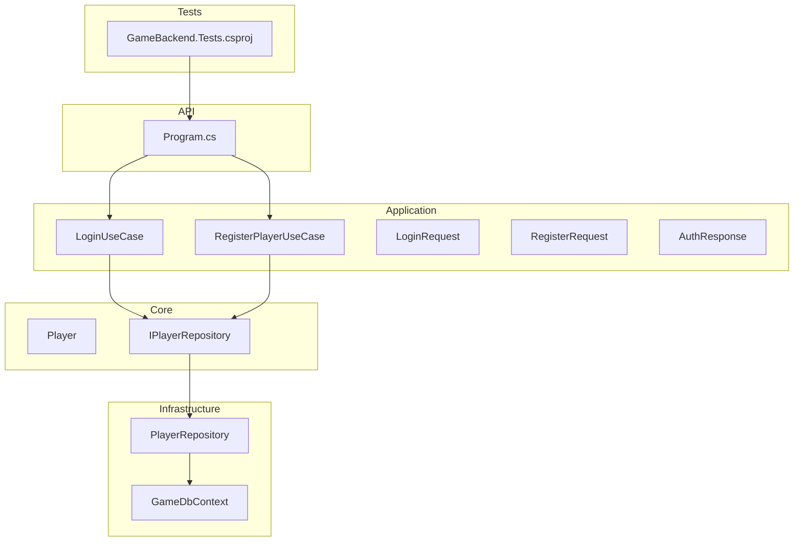
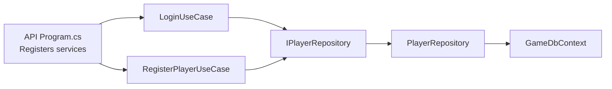
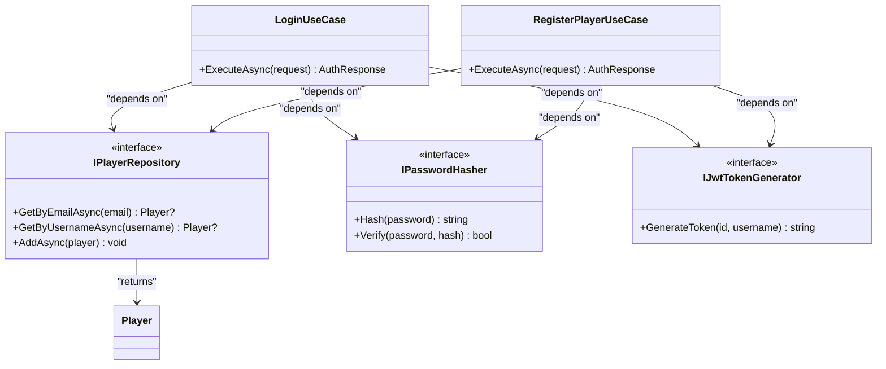
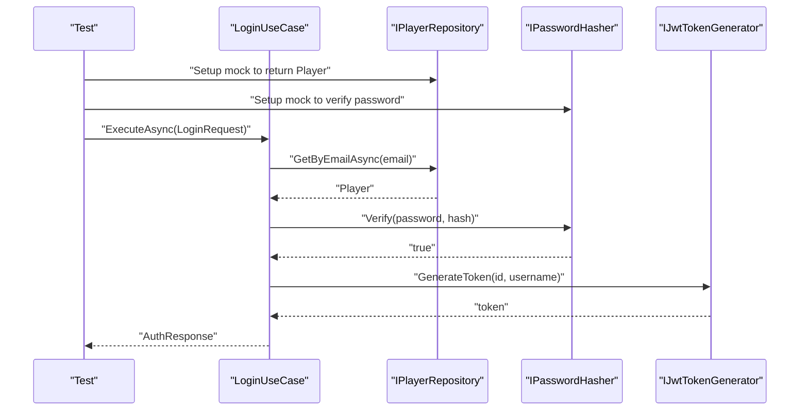
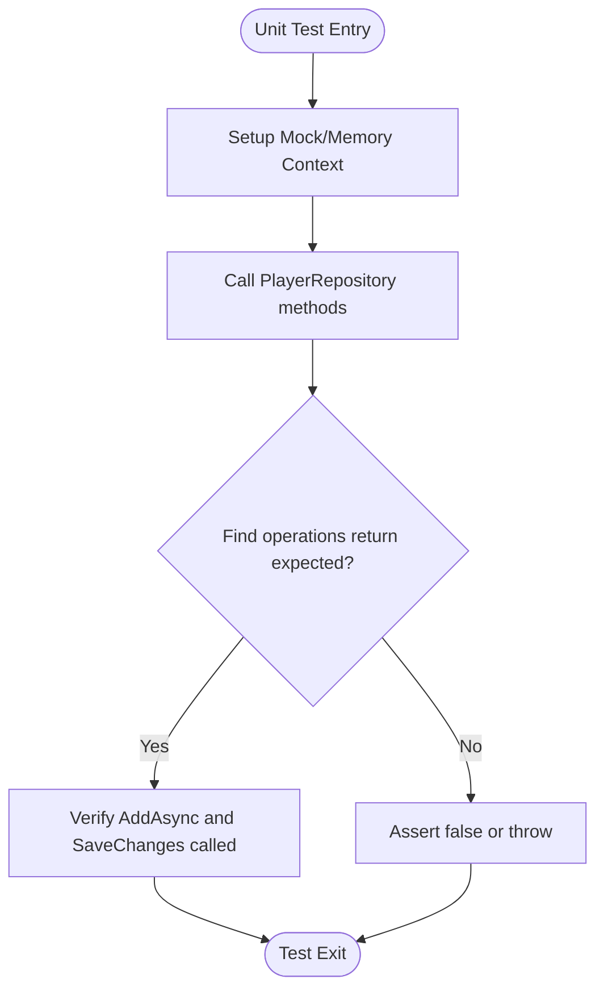
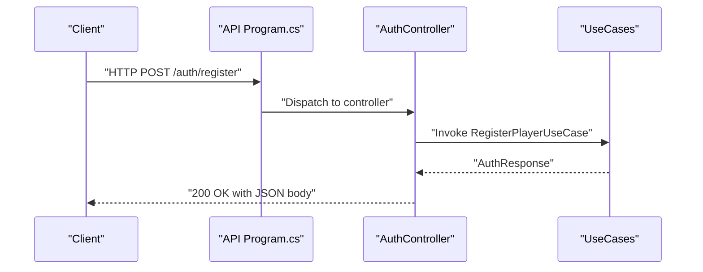
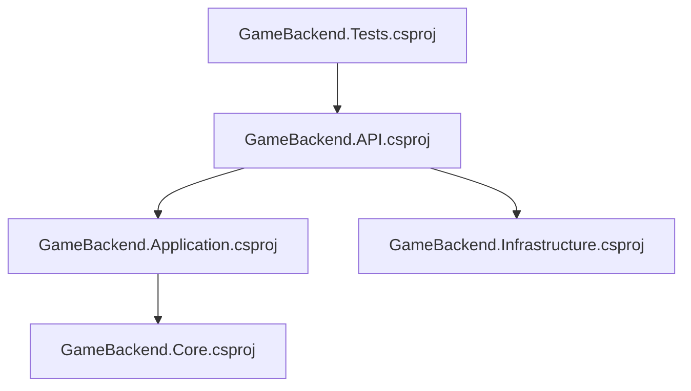

# Testing Strategy & Implementation

<cite>
**Referenced Files in This Document**
- [GameBackend.Tests.csproj](file://GameBackend.Tests/GameBackend.Tests.csproj)
- [GameBackend.API.csproj](file://GameBackend.API/GameBackend.API.csproj)
- [GameBackend.Application.csproj](file://GameBackend.Application/GameBackend.Application.csproj)
- [GameBackend.Core.csproj](file://GameBackend.Core/GameBackend.Core.csproj)
- [GameBackend.Infrastructure.csproj](file://GameBackend.Infrastructure/GameBackend.Infrastructure.csproj)
- [Program.cs](file://GameBackend.API/Program.cs)
- [Program.cs](file://GameBackend.Application/Program.cs)
- [Player.cs](file://GameBackend.Core/Entities/Player.cs)
- [IPlayerRepository.cs](file://GameBackend.Core/Interfaces/IPlayerRepository.cs)
- [PlayerRepository.cs](file://GameBackend.Infrastructure/Repositories/PlayerRepository.cs)
- [LoginRequest.cs](file://GameBackend.Application/Contracts/Auth/LoginRequest.cs)
- [RegisterRequest.cs](file://GameBackend.Application/Contracts/Auth/RegisterRequest.cs)
- [AuthResponse.cs](file://GameBackend.Application/Contracts/Auth/AuthResponse.cs)
- [LoginUseCase.cs](file://GameBackend.Application/Contracts/UseCases/Auth/LoginUseCase.cs)
- [RegisterPlayerUseCase.cs](file://GameBackend.Application/Contracts/UseCases/Auth/RegisterPlayerUseCase.cs)
</cite>

## Table of Contents
1. [Introduction](#introduction)
2. [Project Structure](#project-structure)
3. [Core Components](#core-components)
4. [Architecture Overview](#architecture-overview)
5. [Detailed Component Analysis](#detailed-component-analysis)
6. [Dependency Analysis](#dependency-analysis)
7. [Performance Considerations](#performance-considerations)
8. [Troubleshooting Guide](#troubleshooting-guide)
9. [Conclusion](#conclusion)
10. [Appendices](#appendices)

## Introduction
This document defines a comprehensive testing strategy for the GameBackend project. It covers unit testing approaches, mock implementations, and test organization patterns aligned with Clean Architecture. It documents testing frameworks, dependency mocking strategies, and test data management. It also provides guidelines for testing each architectural layer, from unit tests for business logic to integration tests for data access, and includes examples for authentication workflows, use case implementations, and repository patterns. Finally, it outlines test coverage expectations, continuous integration testing, automated pipelines, and best practices for clean architecture and dependency injection scenarios.

## Project Structure
The solution follows a layered Clean Architecture:
- Core: Entities and domain interfaces
- Application: Use cases, contracts, and application services
- Infrastructure: Data access, persistence, and infrastructure services
- API: HTTP entrypoint, controllers, DI registration, and middleware
- Tests: Test project referencing the API for integration-like tests

**Diagram sources**
- [Program.cs:1-72](file://GameBackend.API/Program.cs#L1-L72)
- [PlayerRepository.cs:1-34](file://GameBackend.Infrastructure/Repositories/PlayerRepository.cs#L1-L34)
- [IPlayerRepository.cs:1-10](file://GameBackend.Core/Interfaces/IPlayerRepository.cs#L1-L10)
- [Player.cs:1-13](file://GameBackend.Core/Entities/Player.cs#L1-L13)
- [LoginUseCase.cs:1-45](file://GameBackend.Application/Contracts/UseCases/Auth/LoginUseCase.cs#L1-L45)
- [RegisterPlayerUseCase.cs:1-58](file://GameBackend.Application/Contracts/UseCases/Auth/RegisterPlayerUseCase.cs#L1-L58)
- [GameBackend.Tests.csproj:1-19](file://GameBackend.Tests/GameBackend.Tests.csproj#L1-L19)

**Section sources**
- [GameBackend.API.csproj:1-22](file://GameBackend.API/GameBackend.API.csproj#L1-L22)
- [GameBackend.Application.csproj:1-20](file://GameBackend.Application/GameBackend.Application.csproj#L1-L20)
- [GameBackend.Infrastructure.csproj:1-29](file://GameBackend.Infrastructure/GameBackend.Infrastructure.csproj#L1-L29)
- [GameBackend.Core.csproj:1-15](file://GameBackend.Core/GameBackend.Core.csproj#L1-L15)
- [GameBackend.Tests.csproj:1-19](file://GameBackend.Tests/GameBackend.Tests.csproj#L1-L19)

## Core Components
This section identifies the primary building blocks to be tested and their roles in the system.

- Entities
  - Player: Domain entity with identity and metadata fields.
- Interfaces
  - IPlayerRepository: Abstraction for player persistence operations.
- Use Cases
  - LoginUseCase: Orchestrates login validation and token generation.
  - RegisterPlayerUseCase: Orchestrates registration, hashing, persistence, and token generation.
- Contracts
  - LoginRequest, RegisterRequest, AuthResponse: Request/response DTOs for authentication workflows.
- Infrastructure
  - PlayerRepository: EF Core-backed implementation of IPlayerRepository.
  - GameDbContext: Entity Framework context for persistence.

**Section sources**
- [Player.cs:1-13](file://GameBackend.Core/Entities/Player.cs#L1-L13)
- [IPlayerRepository.cs:1-10](file://GameBackend.Core/Interfaces/IPlayerRepository.cs#L1-L10)
- [PlayerRepository.cs:1-34](file://GameBackend.Infrastructure/Repositories/PlayerRepository.cs#L1-L34)
- [LoginRequest.cs:1-7](file://GameBackend.Application/Contracts/Auth/LoginRequest.cs#L1-L7)
- [RegisterRequest.cs:1-8](file://GameBackend.Application/Contracts/Auth/RegisterRequest.cs#L1-L8)
- [AuthResponse.cs:1-8](file://GameBackend.Application/Contracts/Auth/AuthResponse.cs#L1-L8)
- [LoginUseCase.cs:1-45](file://GameBackend.Application/Contracts/UseCases/Auth/LoginUseCase.cs#L1-L45)
- [RegisterPlayerUseCase.cs:1-58](file://GameBackend.Application/Contracts/UseCases/Auth/RegisterPlayerUseCase.cs#L1-L58)

## Architecture Overview
The API registers services and wires up DI. Application use cases depend on Core interfaces, while Infrastructure implements those interfaces. Tests can validate unit logic via mocks and integration-like behavior via the API project.

**Diagram sources**
- [Program.cs:1-72](file://GameBackend.API/Program.cs#L1-L72)
- [LoginUseCase.cs:1-45](file://GameBackend.Application/Contracts/UseCases/Auth/LoginUseCase.cs#L1-L45)
- [RegisterPlayerUseCase.cs:1-58](file://GameBackend.Application/Contracts/UseCases/Auth/RegisterPlayerUseCase.cs#L1-L58)
- [IPlayerRepository.cs:1-10](file://GameBackend.Core/Interfaces/IPlayerRepository.cs#L1-L10)
- [PlayerRepository.cs:1-34](file://GameBackend.Infrastructure/Repositories/PlayerRepository.cs#L1-L34)

## Detailed Component Analysis

### Unit Testing Strategy for Business Logic (Application Layer)
- Focus: Validate use case logic independently of persistence and external services.
- Approach:
  - Mock IPlayerRepository, IPasswordHasher, and IJwtTokenGenerator.
  - Parameterized tests for success and failure paths (invalid credentials, user exists, etc.).
  - Assert on AuthResponse shape and thrown exceptions.
- Example Scenarios:
  - Successful login: repository returns a player, hasher verifies password, JWT generator produces a token.
  - Registration duplicates: repository reports existing user -> exception.
  - Login with invalid credentials: repository returns null or hasher fails -> exception.
- Test Organization:
  - Group by use case class under a dedicated test namespace.
  - Separate folders per contract type (Auth) for clarity.

**Diagram sources**
- [LoginUseCase.cs:1-45](file://GameBackend.Application/Contracts/UseCases/Auth/LoginUseCase.cs#L1-L45)
- [RegisterPlayerUseCase.cs:1-58](file://GameBackend.Application/Contracts/UseCases/Auth/RegisterPlayerUseCase.cs#L1-L58)
- [IPlayerRepository.cs:1-10](file://GameBackend.Core/Interfaces/IPlayerRepository.cs#L1-L10)
- [Player.cs:1-13](file://GameBackend.Core/Entities/Player.cs#L1-L13)

**Section sources**
- [LoginUseCase.cs:1-45](file://GameBackend.Application/Contracts/UseCases/Auth/LoginUseCase.cs#L1-L45)
- [RegisterPlayerUseCase.cs:1-58](file://GameBackend.Application/Contracts/UseCases/Auth/RegisterPlayerUseCase.cs#L1-L58)
- [IPlayerRepository.cs:1-10](file://GameBackend.Core/Interfaces/IPlayerRepository.cs#L1-L10)
- [Player.cs:1-13](file://GameBackend.Core/Entities/Player.cs#L1-L13)

### Testing Authentication Workflows
- Login Workflow:
  - Arrange: Mock repository to return a player, hasher to verify successfully.
  - Act: Execute LoginUseCase.
  - Assert: AuthResponse contains expected fields and a non-empty token.
  - Edge: Repository returns null or hasher fails -> exception.
- Registration Workflow:
  - Arrange: Mock repository to report no existing user, hasher to produce a hash, JWT generator to produce a token.
  - Act: Execute RegisterPlayerUseCase.
  - Assert: AuthResponse contains new player identity and token; repository AddAsync invoked once.
  - Edge: Existing user detected -> exception.

**Diagram sources**
- [LoginUseCase.cs:1-45](file://GameBackend.Application/Contracts/UseCases/Auth/LoginUseCase.cs#L1-L45)
- [IPlayerRepository.cs:1-10](file://GameBackend.Core/Interfaces/IPlayerRepository.cs#L1-L10)
- [AuthResponse.cs:1-8](file://GameBackend.Application/Contracts/Auth/AuthResponse.cs#L1-L8)

**Section sources**
- [LoginUseCase.cs:1-45](file://GameBackend.Application/Contracts/UseCases/Auth/LoginUseCase.cs#L1-L45)
- [RegisterPlayerUseCase.cs:1-58](file://GameBackend.Application/Contracts/UseCases/Auth/RegisterPlayerUseCase.cs#L1-L58)
- [AuthResponse.cs:1-8](file://GameBackend.Application/Contracts/Auth/AuthResponse.cs#L1-L8)

### Testing Repository Patterns
- Unit Testing:
  - Arrange: In-memory DbContext or mock GameDbContext; inject into PlayerRepository.
  - Act: Invoke GetByEmailAsync, GetByUsernameAsync, AddAsync.
  - Assert: Correct queries executed, entity added, and saved changes persisted.
- Integration Testing:
  - Use a test database connection string and migrations to validate EF Core behavior end-to-end.
  - Seed minimal test data per scenario.

**Diagram sources**
- [PlayerRepository.cs:1-34](file://GameBackend.Infrastructure/Repositories/PlayerRepository.cs#L1-L34)
- [IPlayerRepository.cs:1-10](file://GameBackend.Core/Interfaces/IPlayerRepository.cs#L1-L10)

**Section sources**
- [PlayerRepository.cs:1-34](file://GameBackend.Infrastructure/Repositories/PlayerRepository.cs#L1-L34)
- [IPlayerRepository.cs:1-10](file://GameBackend.Core/Interfaces/IPlayerRepository.cs#L1-L10)

### Testing Controllers and API Endpoints
- Approach:
  - Use TestHost or minimal hosting to exercise controllers with configured DI.
  - Replace real repositories with in-memory or mocked implementations for isolation.
  - Validate HTTP responses, status codes, and serialized payload shapes.
- Example:
  - POST /auth/register and POST /auth/login endpoints mapped in the API project.
  - Use controller action tests to assert response model and exceptions.

**Diagram sources**
- [Program.cs:1-72](file://GameBackend.API/Program.cs#L1-L72)
- [RegisterPlayerUseCase.cs:1-58](file://GameBackend.Application/Contracts/UseCases/Auth/RegisterPlayerUseCase.cs#L1-L58)
- [AuthResponse.cs:1-8](file://GameBackend.Application/Contracts/Auth/AuthResponse.cs#L1-L8)

**Section sources**
- [Program.cs:1-72](file://GameBackend.API/Program.cs#L1-L72)

### Dependency Injection and Mocking Strategies
- DI Registration:
  - API registers DbContext, repositories, and use cases as scoped services.
- Mocking:
  - Use a lightweight DI container in tests to replace real implementations with mocks.
  - For HTTP tests, configure a TestServer or minimal host with overridden service registrations.
- Best Practices:
  - Prefer constructor injection for all dependencies.
  - Keep test fixtures minimal and deterministic.
  - Use auto-mocking libraries if desired, but ensure clarity of intent.

**Section sources**
- [Program.cs:1-72](file://GameBackend.API/Program.cs#L1-L72)

### Test Data Management
- In-Memory Databases:
  - Use SQLite in-memory for fast, isolated tests.
- Seeding:
  - Seed only required entities per test method to avoid cross-test contamination.
- Factories:
  - Consider simple factory classes to construct requests, responses, and entities for reuse.

**Section sources**
- [PlayerRepository.cs:1-34](file://GameBackend.Infrastructure/Repositories/PlayerRepository.cs#L1-L34)
- [Player.cs:1-13](file://GameBackend.Core/Entities/Player.cs#L1-L13)
- [LoginRequest.cs:1-7](file://GameBackend.Application/Contracts/Auth/LoginRequest.cs#L1-L7)
- [RegisterRequest.cs:1-8](file://GameBackend.Application/Contracts/Auth/RegisterRequest.cs#L1-L8)

## Dependency Analysis
The API project depends on Application and Infrastructure projects. Application depends on Core. Tests reference the API project to enable integration-like tests.

**Diagram sources**
- [GameBackend.API.csproj:1-22](file://GameBackend.API/GameBackend.API.csproj#L1-L22)
- [GameBackend.Application.csproj:1-20](file://GameBackend.Application/GameBackend.Application.csproj#L1-L20)
- [GameBackend.Infrastructure.csproj:1-29](file://GameBackend.Infrastructure/GameBackend.Infrastructure.csproj#L1-L29)
- [GameBackend.Tests.csproj:1-19](file://GameBackend.Tests/GameBackend.Tests.csproj#L1-L19)

**Section sources**
- [GameBackend.API.csproj:1-22](file://GameBackend.API/GameBackend.API.csproj#L1-L22)
- [GameBackend.Application.csproj:1-20](file://GameBackend.Application/GameBackend.Application.csproj#L1-L20)
- [GameBackend.Infrastructure.csproj:1-29](file://GameBackend.Infrastructure/GameBackend.Infrastructure.csproj#L1-L29)
- [GameBackend.Tests.csproj:1-19](file://GameBackend.Tests/GameBackend.Tests.csproj#L1-L19)

## Performance Considerations
- Favor in-memory databases for unit tests to reduce overhead.
- Minimize fixture setup and teardown costs.
- Parallelize independent tests; avoid shared mutable state.
- Use lightweight containers for DI in tests to reduce startup time.

## Troubleshooting Guide
- Common Issues:
  - Missing DI registrations in tests cause null reference exceptions.
  - Incorrectly configured JWT settings lead to authentication failures.
  - EF Core tests failing due to missing migrations or connection strings.
- Remediation:
  - Ensure test host configures all required services.
  - Validate JWT issuer, audience, and signing key in test configuration.
  - Apply migrations or use a test database for persistence tests.

**Section sources**
- [Program.cs:1-72](file://GameBackend.API/Program.cs#L1-L72)

## Conclusion
This testing strategy emphasizes layered testing: unit tests for use cases with mocks, repository tests for persistence logic, and integration-like tests via the API project. By aligning with Clean Architecture and DI, the suite remains maintainable, fast, and reliable. Adopt the outlined patterns to achieve robust coverage and sustainable quality.

## Appendices

### Test Coverage Expectations
- Unit tests: >80% for use cases and helpers.
- Repository tests: >70% for persistence logic.
- Integration tests: Cover critical API endpoints and error paths.
- Thresholds are advisory; prioritize critical paths and regressions.

### Continuous Integration and Automated Pipelines
- CI Pipeline Outline:
  - Restore packages and run unit tests.
  - Run integration tests against a test database.
  - Publish test results and coverage reports.
- Recommendations:
  - Use GitHub Actions, Azure DevOps, or similar.
  - Cache NuGet packages and SDKs.
  - Fail builds on test failures or coverage drops.

### Best Practices for Clean Architecture and DI
- Keep interfaces in Core; implement in Infrastructure.
- Inject abstractions into Application; avoid concrete dependencies.
- Use factories or builders for complex test objects.
- Keep tests deterministic; avoid time-sensitive assertions without mocks.