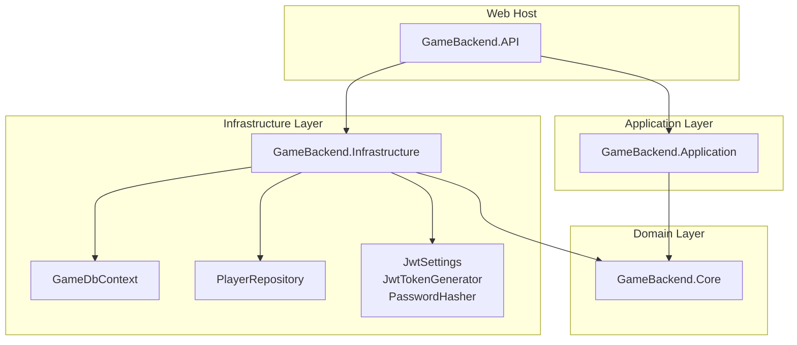
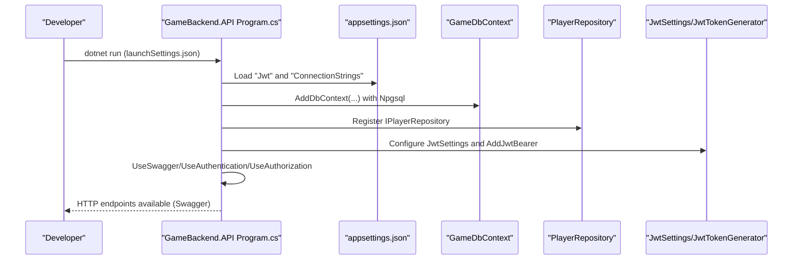
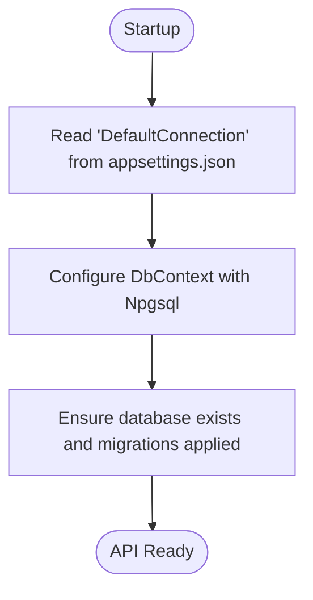
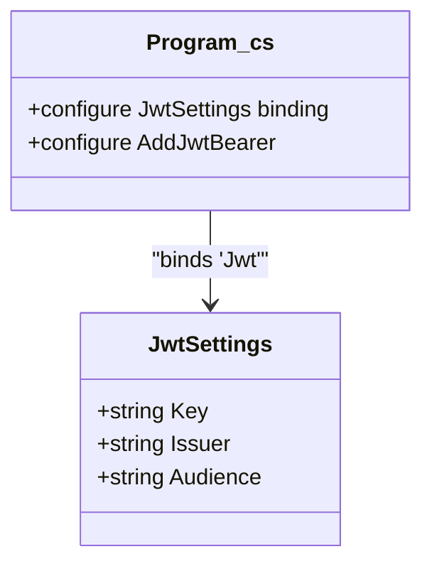
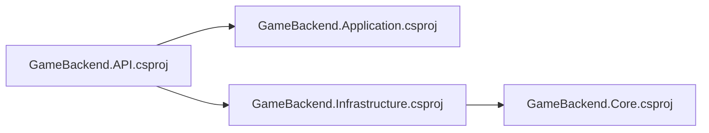

# Getting Started

<cite>
**Referenced Files in This Document**
- [global.json](file://global.json)
- [GameBackend.API.csproj](file://GameBackend.API/GameBackend.API.csproj)
- [Program.cs](file://GameBackend.API/Program.cs)
- [appsettings.json](file://GameBackend.API/appsettings.json)
- [appsettings.Development.json](file://GameBackend.API/appsettings.Development.json)
- [launchSettings.json](file://GameBackend.API/Properties/launchSettings.json)
- [GameDbContext.cs](file://GameBackend.Infrastructure/Persistence/GameDbContext.cs)
- [JwtSettings.cs](file://GameBackend.Infrastructure/Security/JwtSettings.cs)
- [PlayerRepository.cs](file://GameBackend.Infrastructure/Repositories/PlayerRepository.cs)
- [Player.cs](file://GameBackend.Core/Entities/Player.cs)
</cite>

## Table of Contents
1. [Introduction](#introduction)
2. [Project Structure](#project-structure)
3. [Core Components](#core-components)
4. [Architecture Overview](#architecture-overview)
5. [Detailed Component Analysis](#detailed-component-analysis)
6. [Dependency Analysis](#dependency-analysis)
7. [Performance Considerations](#performance-considerations)
8. [Troubleshooting Guide](#troubleshooting-guide)
9. [Conclusion](#conclusion)
10. [Appendices](#appendices)

## Introduction
This guide helps you install, configure, and run the GameBackend project locally. It covers prerequisites, environment setup, database configuration with PostgreSQL, JWT settings, and initial compilation and testing. By the end, you will have a working development server with Swagger UI, a configured database connection, and secure JWT authentication ready for use.

## Project Structure
The solution consists of layered projects:
- GameBackend.API: ASP.NET Core web host and HTTP entrypoint
- GameBackend.Application: Application use cases and contracts
- GameBackend.Core: Domain entities and interfaces
- GameBackend.Infrastructure: Persistence, repositories, and security implementations
- GameBackend.Tests: Test project (no extra setup required beyond building)

**Diagram sources**
- [Program.cs:1-72](file://GameBackend.API/Program.cs#L1-L72)
- [GameBackend.API.csproj:1-22](file://GameBackend.API/GameBackend.API.csproj#L1-L22)
- [GameDbContext.cs:1-28](file://GameBackend.Infrastructure/Persistence/GameDbContext.cs#L1-L28)
- [PlayerRepository.cs:1-34](file://GameBackend.Infrastructure/Repositories/PlayerRepository.cs#L1-L34)
- [JwtSettings.cs:1-8](file://GameBackend.Infrastructure/Security/JwtSettings.cs#L1-L8)
- [Player.cs:1-13](file://GameBackend.Core/Entities/Player.cs#L1-L13)

**Section sources**
- [GameBackend.API.csproj:1-22](file://GameBackend.API/GameBackend.API.csproj#L1-L22)
- [Program.cs:1-72](file://GameBackend.API/Program.cs#L1-L72)

## Core Components
- .NET 8.0 SDK: Required for building and running the project.
- PostgreSQL: Used via Entity Framework Core provider for persistence.
- JWT Authentication: Configured with issuer, audience, and symmetric key.
- Swagger/OpenAPI: Enabled in development for API exploration.

Key configuration locations:
- SDK version and roll-forward policy in [global.json:1-7](file://global.json#L1-L7)
- Target framework and package references in [GameBackend.API.csproj:1-22](file://GameBackend.API/GameBackend.API.csproj#L1-L22)
- JWT settings and connection string in [appsettings.json:9-16](file://GameBackend.API/appsettings.json#L9-L16)
- Development logging overrides in [appsettings.Development.json:1-9](file://GameBackend.API/appsettings.Development.json#L1-L9)
- Startup registration and middleware pipeline in [Program.cs:11-72](file://GameBackend.API/Program.cs#L11-L72)

**Section sources**
- [global.json:1-7](file://global.json#L1-L7)
- [GameBackend.API.csproj:1-22](file://GameBackend.API/GameBackend.API.csproj#L1-L22)
- [appsettings.json:1-17](file://GameBackend.API/appsettings.json#L1-L17)
- [appsettings.Development.json:1-9](file://GameBackend.API/appsettings.Development.json#L1-L9)
- [Program.cs:11-72](file://GameBackend.API/Program.cs#L11-L72)

## Architecture Overview
The runtime startup configures dependency injection, database context, authentication, and routing. The API exposes controllers that delegate to application use cases, which in turn use infrastructure repositories backed by the database.

**Diagram sources**
- [Program.cs:11-72](file://GameBackend.API/Program.cs#L11-L72)
- [appsettings.json:9-16](file://GameBackend.API/appsettings.json#L9-L16)
- [GameDbContext.cs:6-11](file://GameBackend.Infrastructure/Persistence/GameDbContext.cs#L6-L11)
- [PlayerRepository.cs:8-15](file://GameBackend.Infrastructure/Repositories/PlayerRepository.cs#L8-L15)
- [JwtSettings.cs:3-8](file://GameBackend.Infrastructure/Security/JwtSettings.cs#L3-L8)
- [launchSettings.json:11-31](file://GameBackend.API/Properties/launchSettings.json#L11-L31)

## Detailed Component Analysis

### Prerequisites and Installation
- Install .NET 8.0 SDK. The repository enforces this version and minor roll-forward behavior.
- Verify your installation matches the SDK requirement defined in [global.json:1-7](file://global.json#L1-L7).
- Build the solution to restore packages and compile all projects.

What to expect after build:
- Projects resolve NuGet dependencies including ASP.NET Core, JWT bearer, OpenAPI/Swagger, and Npgsql EF provider.
- The API project targets net8.0 as declared in [GameBackend.API.csproj](file://GameBackend.API/GameBackend.API.csproj#L4).

Verification steps:
- Run the API project using the configured launch profiles in [launchSettings.json:11-31](file://GameBackend.API/Properties/launchSettings.json#L11-L31).
- Confirm Swagger UI loads at the configured URLs.

**Section sources**
- [global.json:1-7](file://global.json#L1-L7)
- [GameBackend.API.csproj:1-22](file://GameBackend.API/GameBackend.API.csproj#L1-L22)
- [launchSettings.json:11-31](file://GameBackend.API/Properties/launchSettings.json#L11-L31)

### Environment Setup
- Environment variables: The launch settings set ASPNETCORE_ENVIRONMENT to Development for all profiles.
- Logging: Development overrides reduce noise from ASP.NET Core categories in [appsettings.Development.json:2-6](file://GameBackend.API/appsettings.Development.json#L2-L6).

Recommended approach:
- Keep Development profile active during local setup.
- Optionally override secrets via environment variables or user secrets in Development.

**Section sources**
- [launchSettings.json:18-30](file://GameBackend.API/Properties/launchSettings.json#L18-L30)
- [appsettings.Development.json:1-9](file://GameBackend.API/appsettings.Development.json#L1-L9)

### Database Configuration with PostgreSQL
- Provider: Npgsql EF provider is referenced in the API project.
- Connection string: Defined under "ConnectionStrings:DefaultConnection" in [appsettings.json:14-16](file://GameBackend.API/appsettings.json#L14-L16).
- Model: The Player entity is mapped with unique indexes for Email and Username in [GameDbContext.cs:19-26](file://GameBackend.Infrastructure/Persistence/GameDbContext.cs#L19-L26).
- Repository: Accesses Players DbSet via [PlayerRepository.cs:8-33](file://GameBackend.Infrastructure/Repositories/PlayerRepository.cs#L8-L33).

Setup checklist:
- Ensure PostgreSQL is installed and running.
- Create a database named gamebackend (or update the connection string accordingly).
- Confirm the connection string resolves to a reachable host/port with valid credentials.
- Seed minimal data if needed for testing.

**Diagram sources**
- [appsettings.json:14-16](file://GameBackend.API/appsettings.json#L14-L16)
- [Program.cs:16-17](file://GameBackend.API/Program.cs#L16-L17)
- [GameDbContext.cs:6-11](file://GameBackend.Infrastructure/Persistence/GameDbContext.cs#L6-L11)

**Section sources**
- [GameBackend.API.csproj:10-13](file://GameBackend.API/GameBackend.API.csproj#L10-L13)
- [appsettings.json:14-16](file://GameBackend.API/appsettings.json#L14-L16)
- [Program.cs:16-17](file://GameBackend.API/Program.cs#L16-L17)
- [GameDbContext.cs:19-26](file://GameBackend.Infrastructure/Persistence/GameDbContext.cs#L19-L26)
- [PlayerRepository.cs:17-33](file://GameBackend.Infrastructure/Repositories/PlayerRepository.cs#L17-L33)

### JWT Settings Configuration
- Settings model: JwtSettings holds Key, Issuer, and Audience in [JwtSettings.cs:3-8](file://GameBackend.Infrastructure/Security/JwtSettings.cs#L3-L8).
- Configuration binding: The API binds "Jwt" section to JwtSettings in [Program.cs:13-14](file://GameBackend.API/Program.cs#L13-L14).
- Validation parameters: Issuer, audience, and signing key are configured in [Program.cs:37-50](file://GameBackend.API/Program.cs#L37-L50).
- Current defaults: Key, Issuer, and Audience are present in [appsettings.json:9-13](file://GameBackend.API/appsettings.json#L9-L13).

Recommendations:
- Replace the default Key with a strong, random secret in production.
- Align Issuer and Audience with your identity provider and client audiences.
- Store sensitive keys using environment variables or secret stores in Development.

**Diagram sources**
- [JwtSettings.cs:3-8](file://GameBackend.Infrastructure/Security/JwtSettings.cs#L3-L8)
- [Program.cs:13-14](file://GameBackend.API/Program.cs#L13-L14)
- [Program.cs:37-50](file://GameBackend.API/Program.cs#L37-L50)

**Section sources**
- [JwtSettings.cs:1-8](file://GameBackend.Infrastructure/Security/JwtSettings.cs#L1-L8)
- [Program.cs:13-14](file://GameBackend.API/Program.cs#L13-L14)
- [Program.cs:28-50](file://GameBackend.API/Program.cs#L28-L50)
- [appsettings.json:9-13](file://GameBackend.API/appsettings.json#L9-L13)

### Initial Compilation and First-Time Setup
Steps:
1. Restore and build the solution to fetch dependencies.
2. Ensure PostgreSQL is running and reachable.
3. Confirm the connection string in [appsettings.json:14-16](file://GameBackend.API/appsettings.json#L14-L16) matches your environment.
4. Run the API project using the Development profile from [launchSettings.json:11-31](file://GameBackend.API/Properties/launchSettings.json#L11-L31).
5. Navigate to the Swagger UI endpoint exposed by the Development profile.

Verification:
- Swagger UI loads and displays controllers.
- No authentication errors appear at startup.
- Database context initializes without connection failures.

**Section sources**
- [launchSettings.json:11-31](file://GameBackend.API/Properties/launchSettings.json#L11-L31)
- [Program.cs:52-72](file://GameBackend.API/Program.cs#L52-L72)
- [appsettings.json:1-17](file://GameBackend.API/appsettings.json#L1-L17)

### First-Time Testing Procedures
- Use Swagger UI to test authentication endpoints after the API starts.
- Register a new player and log in to receive a JWT token.
- Call protected endpoints with the Authorization header using the Bearer token.
- Confirm that token validation succeeds with the configured issuer, audience, and key.

Note: The controller and use cases are wired in [Program.cs:19-24](file://GameBackend.API/Program.cs#L19-L24) and exposed via [Program.cs:26-70](file://GameBackend.API/Program.cs#L26-L70).

**Section sources**
- [Program.cs:19-24](file://GameBackend.API/Program.cs#L19-L24)
- [Program.cs:26-70](file://GameBackend.API/Program.cs#L26-L70)

## Dependency Analysis
High-level dependencies:
- GameBackend.API depends on Application and Infrastructure projects.
- Infrastructure depends on Core for entities and interfaces.
- API registers DbContext, repositories, hashing, and JWT services.

**Diagram sources**
- [GameBackend.API.csproj:16-19](file://GameBackend.API/GameBackend.API.csproj#L16-L19)

**Section sources**
- [GameBackend.API.csproj:1-22](file://GameBackend.API/GameBackend.API.csproj#L1-L22)

## Performance Considerations
- Keep Development logging reasonable; the defaults reduce ASP.NET Core noise in [appsettings.Development.json:2-6](file://GameBackend.API/appsettings.Development.json#L2-L6).
- Use HTTPS in development for realistic auth behavior as configured in [launchSettings.json:22-31](file://GameBackend.API/Properties/launchSettings.json#L22-L31).
- Avoid heavy synchronous work in API endpoints; leverage async patterns already used in [PlayerRepository.cs:17-33](file://GameBackend.Infrastructure/Repositories/PlayerRepository.cs#L17-L33).

[No sources needed since this section provides general guidance]

## Troubleshooting Guide
Common setup issues and resolutions:

- .NET SDK mismatch
  - Symptom: Build fails with incompatible SDK.
  - Fix: Install .NET 8.0 SDK as required by [global.json:1-7](file://global.json#L1-L7).

- PostgreSQL connection failure
  - Symptom: Startup throws a database connection error.
  - Fix: Verify the connection string in [appsettings.json:14-16](file://GameBackend.API/appsettings.json#L14-L16) and ensure PostgreSQL is running and reachable.

- JWT validation errors
  - Symptom: Unauthorized responses due to issuer/audience/key mismatches.
  - Fix: Confirm "Jwt" settings in [appsettings.json:9-13](file://GameBackend.API/appsettings.json#L9-L13) match the validation parameters in [Program.cs:37-50](file://GameBackend.API/Program.cs#L37-L50).

- Swagger not loading
  - Symptom: Swagger UI not available in Development.
  - Fix: Ensure Development profile is active and Swagger is enabled in [Program.cs:52-63](file://GameBackend.API/Program.cs#L52-L63) and [launchSettings.json:11-31](file://GameBackend.API/Properties/launchSettings.json#L11-L31).

- Missing Npgsql provider
  - Symptom: EF provider not found errors.
  - Fix: The API project references the provider in [GameBackend.API.csproj:10-13](file://GameBackend.API/GameBackend.API.csproj#L10-L13); rebuild to restore packages.

**Section sources**
- [global.json:1-7](file://global.json#L1-L7)
- [appsettings.json:9-16](file://GameBackend.API/appsettings.json#L9-L16)
- [Program.cs:37-50](file://GameBackend.API/Program.cs#L37-L50)
- [Program.cs:52-63](file://GameBackend.API/Program.cs#L52-L63)
- [launchSettings.json:11-31](file://GameBackend.API/Properties/launchSettings.json#L11-L31)
- [GameBackend.API.csproj:10-13](file://GameBackend.API/GameBackend.API.csproj#L10-L13)

## Conclusion
You now have the prerequisites, configuration references, and step-by-step instructions to install, configure, and run GameBackend locally. With PostgreSQL available, a valid connection string, and properly bound JWT settings, the API will start with Swagger UI and JWT authentication configured. Proceed to register and authenticate users, then test protected endpoints using the generated tokens.

[No sources needed since this section summarizes without analyzing specific files]

## Appendices

### Appendix A: Configuration Reference Summary
- SDK version and roll-forward: [global.json:1-7](file://global.json#L1-L7)
- Target framework and packages: [GameBackend.API.csproj:1-22](file://GameBackend.API/GameBackend.API.csproj#L1-L22)
- JWT settings: [appsettings.json:9-13](file://GameBackend.API/appsettings.json#L9-L13), [JwtSettings.cs:3-8](file://GameBackend.Infrastructure/Security/JwtSettings.cs#L3-L8)
- Connection string: [appsettings.json:14-16](file://GameBackend.API/appsettings.json#L14-L16)
- Development logging: [appsettings.Development.json:1-9](file://GameBackend.API/appsettings.Development.json#L1-L9)
- Startup pipeline: [Program.cs:11-72](file://GameBackend.API/Program.cs#L11-L72)
- Entity model and indexes: [GameDbContext.cs:19-26](file://GameBackend.Infrastructure/Persistence/GameDbContext.cs#L19-L26), [Player.cs:3-12](file://GameBackend.Core/Entities/Player.cs#L3-L12)
- Repository access: [PlayerRepository.cs:17-33](file://GameBackend.Infrastructure/Repositories/PlayerRepository.cs#L17-L33)

[No sources needed since this section aggregates references already cited above]