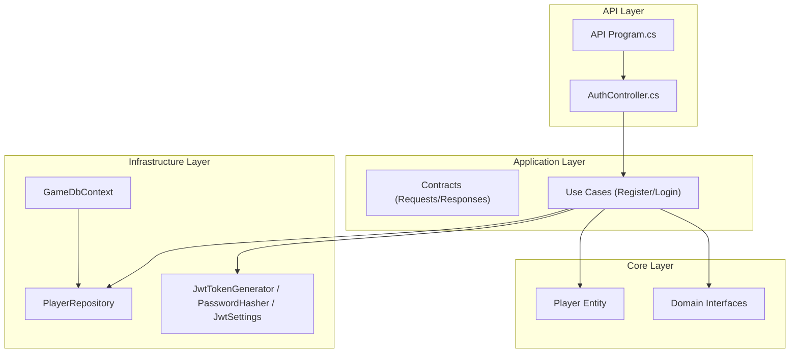
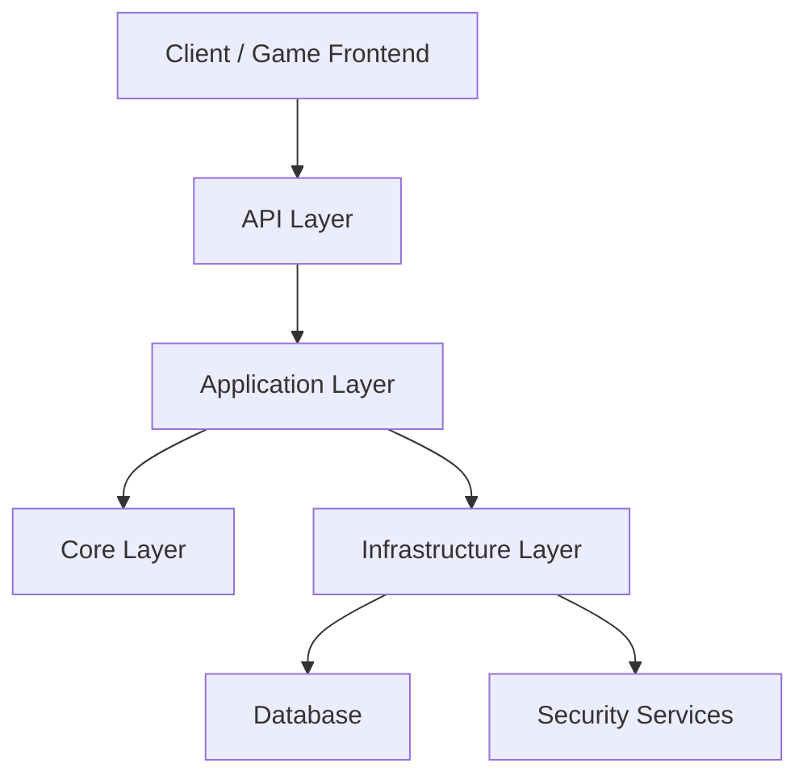
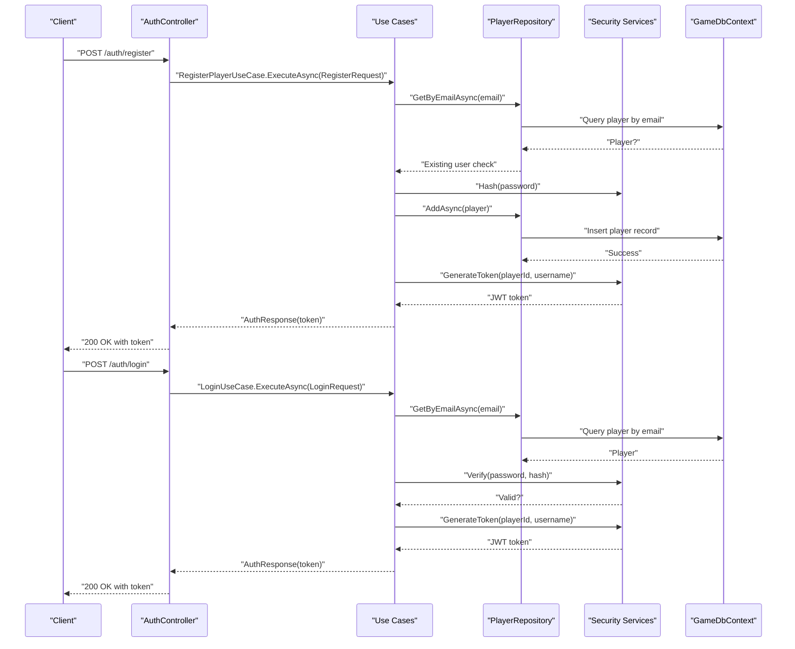
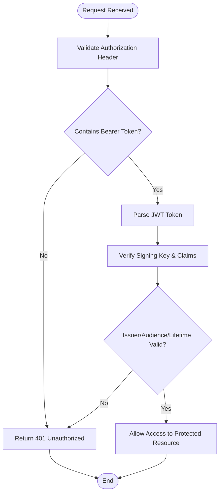
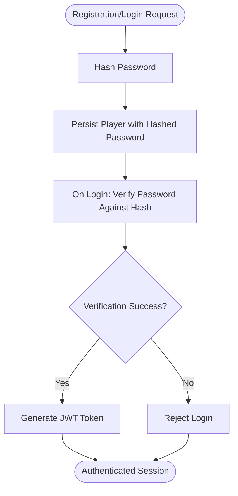
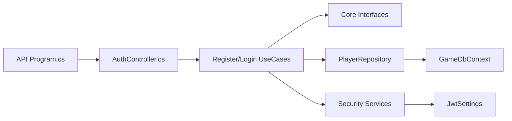

# Project Overview

<cite>
**Referenced Files in This Document**
- [Program.cs](file://GameBackend.API/Program.cs)
- [AuthController.cs](file://GameBackend.API/Controllers/AuthController.cs)
- [RegisterPlayerUseCase.cs](file://GameBackend.Application/Contracts/UseCases/Auth/RegisterPlayerUseCase.cs)
- [LoginUseCase.cs](file://GameBackend.Application/Contracts/UseCases/Auth/LoginUseCase.cs)
- [RegisterRequest.cs](file://GameBackend.Application/Contracts/Auth/RegisterRequest.cs)
- [LoginRequest.cs](file://GameBackend.Application/Contracts/Auth/LoginRequest.cs)
- [AuthResponse.cs](file://GameBackend.Application/Contracts/Auth/AuthResponse.cs)
- [Player.cs](file://GameBackend.Core/Entities/Player.cs)
- [IPlayerRepository.cs](file://GameBackend.Core/Interfaces/IPlayerRepository.cs)
- [IPasswordHasher.cs](file://GameBackend.Core/Interfaces/IPasswordHasher.cs)
- [GameDbContext.cs](file://GameBackend.Infrastructure/Persistence/GameDbContext.cs)
- [PlayerRepository.cs](file://GameBackend.Infrastructure/Repositories/PlayerRepository.cs)
- [JwtTokenGenerator.cs](file://GameBackend.Infrastructure/Security/JwtTokenGenerator.cs)
- [PasswordHasher.cs](file://GameBackend.Infrastructure/Security/PasswordHasher.cs)
- [JwtSettings.cs](file://GameBackend.Infrastructure/Security/JwtSettings.cs)
</cite>

## Table of Contents
1. [Introduction](#introduction)
2. [Project Structure](#project-structure)
3. [Core Components](#core-components)
4. [Architecture Overview](#architecture-overview)
5. [Detailed Component Analysis](#detailed-component-analysis)
6. [Dependency Analysis](#dependency-analysis)
7. [Performance Considerations](#performance-considerations)
8. [Troubleshooting Guide](#troubleshooting-guide)
9. [Conclusion](#conclusion)

## Introduction
GameBackend is a focused authentication backend service designed to power gaming platforms with robust, layered security and scalable user lifecycle management. Built on .NET 8.0, it implements a clean architecture that separates concerns across four distinct layers: API, Application, Core, and Infrastructure. The system emphasizes secure authentication via JWT tokens and strong password hashing, while maintaining clear boundaries between domain logic, application orchestration, infrastructure concerns, and presentation.

Target audience includes game developers, platform engineers, and DevOps teams who require a modular, testable, and extensible authentication foundation for multiplayer games, user accounts, and session management.

## Project Structure
The solution follows a four-layer clean architecture:
- API Layer: Exposes HTTP endpoints for authentication operations and configures middleware for authentication and authorization.
- Application Layer: Defines application contracts (requests, responses, use cases) and orchestrates business workflows without depending on external frameworks.
- Core Layer: Encapsulates domain entities and interfaces that define the core business rules and abstractions.
- Infrastructure Layer: Implements persistence, cryptography, and external integrations such as JWT token generation and database connectivity.

**Diagram sources**
- [Program.cs:1-72](file://GameBackend.API/Program.cs#L1-L72)
- [AuthController.cs:1-49](file://GameBackend.API/Controllers/AuthController.cs#L1-L49)
- [RegisterPlayerUseCase.cs:1-58](file://GameBackend.Application/Contracts/UseCases/Auth/RegisterPlayerUseCase.cs#L1-L58)
- [LoginUseCase.cs:1-45](file://GameBackend.Application/Contracts/UseCases/Auth/LoginUseCase.cs#L1-L45)
- [Player.cs:1-13](file://GameBackend.Core/Entities/Player.cs#L1-L13)
- [IPlayerRepository.cs:1-10](file://GameBackend.Core/Interfaces/IPlayerRepository.cs#L1-L10)
- [GameDbContext.cs](file://GameBackend.Infrastructure/Persistence/GameDbContext.cs)
- [PlayerRepository.cs](file://GameBackend.Infrastructure/Repositories/PlayerRepository.cs)
- [JwtTokenGenerator.cs](file://GameBackend.Infrastructure/Security/JwtTokenGenerator.cs)
- [PasswordHasher.cs](file://GameBackend.Infrastructure/Security/PasswordHasher.cs)
- [JwtSettings.cs](file://GameBackend.Infrastructure/Security/JwtSettings.cs)

**Section sources**
- [Program.cs:1-72](file://GameBackend.API/Program.cs#L1-L72)
- [AuthController.cs:1-49](file://GameBackend.API/Controllers/AuthController.cs#L1-L49)

## Core Components
- Authentication Endpoints: Exposed via the API controller, supporting registration and login operations with structured request/response contracts.
- Application Use Cases: Orchestrate authentication workflows, including user existence checks, password hashing, token generation, and persistence.
- Domain Model: The Player entity encapsulates identity, credentials storage, and metadata for players.
- Infrastructure Services: JWT token generation and secure password hashing, plus database context and repository for persistence.

Key capabilities:
- Registration: Validates uniqueness, hashes passwords, persists the new player, and issues a JWT token.
- Login: Locates a player by email, verifies credentials, and issues a JWT token.
- Secure Storage: Passwords are stored as hashes; tokens are generated using configured issuer, audience, and signing keys.

**Section sources**
- [AuthController.cs:1-49](file://GameBackend.API/Controllers/AuthController.cs#L1-L49)
- [RegisterPlayerUseCase.cs:1-58](file://GameBackend.Application/Contracts/UseCases/Auth/RegisterPlayerUseCase.cs#L1-L58)
- [LoginUseCase.cs:1-45](file://GameBackend.Application/Contracts/UseCases/Auth/LoginUseCase.cs#L1-L45)
- [Player.cs:1-13](file://GameBackend.Core/Entities/Player.cs#L1-L13)
- [IPlayerRepository.cs:1-10](file://GameBackend.Core/Interfaces/IPlayerRepository.cs#L1-L10)
- [IPasswordHasher.cs:1-7](file://GameBackend.Core/Interfaces/IPasswordHasher.cs#L1-L7)

## Architecture Overview
The four-layer architecture enforces separation of concerns:
- API Layer: Configures authentication middleware, maps controllers, and delegates to application use cases.
- Application Layer: Defines contracts and orchestrates workflows using domain interfaces and infrastructure services.
- Core Layer: Provides domain entities and interfaces that remain agnostic of frameworks and databases.
- Infrastructure Layer: Implements persistence, cryptography, and external integrations.

**Diagram sources**
- [Program.cs:1-72](file://GameBackend.API/Program.cs#L1-L72)
- [AuthController.cs:1-49](file://GameBackend.API/Controllers/AuthController.cs#L1-L49)
- [RegisterPlayerUseCase.cs:1-58](file://GameBackend.Application/Contracts/UseCases/Auth/RegisterPlayerUseCase.cs#L1-L58)
- [LoginUseCase.cs:1-45](file://GameBackend.Application/Contracts/UseCases/Auth/LoginUseCase.cs#L1-L45)
- [PlayerRepository.cs](file://GameBackend.Infrastructure/Repositories/PlayerRepository.cs)
- [JwtTokenGenerator.cs](file://GameBackend.Infrastructure/Security/JwtTokenGenerator.cs)
- [PasswordHasher.cs](file://GameBackend.Infrastructure/Security/PasswordHasher.cs)

## Detailed Component Analysis

### Multi-Layered Authentication Workflow
The authentication flow integrates the API, Application, Core, and Infrastructure layers to deliver secure login and registration.

**Diagram sources**
- [AuthController.cs:1-49](file://GameBackend.API/Controllers/AuthController.cs#L1-L49)
- [RegisterPlayerUseCase.cs:1-58](file://GameBackend.Application/Contracts/UseCases/Auth/RegisterPlayerUseCase.cs#L1-L58)
- [LoginUseCase.cs:1-45](file://GameBackend.Application/Contracts/UseCases/Auth/LoginUseCase.cs#L1-L45)
- [PlayerRepository.cs](file://GameBackend.Infrastructure/Repositories/PlayerRepository.cs)
- [JwtTokenGenerator.cs](file://GameBackend.Infrastructure/Security/JwtTokenGenerator.cs)
- [PasswordHasher.cs](file://GameBackend.Infrastructure/Security/PasswordHasher.cs)
- [GameDbContext.cs](file://GameBackend.Infrastructure/Persistence/GameDbContext.cs)

### JWT-Based Security and Token Validation
- Token Generation: The infrastructure layer generates signed JWT tokens using symmetric key signing configured via settings.
- Token Validation: The API layer configures JWT Bearer authentication with issuer, audience, and signing key validation.
- Lifecycle: Tokens are returned upon successful registration or login and validated for subsequent protected requests.

**Diagram sources**
- [Program.cs:32-50](file://GameBackend.API/Program.cs#L32-L50)
- [JwtTokenGenerator.cs](file://GameBackend.Infrastructure/Security/JwtTokenGenerator.cs)
- [JwtSettings.cs](file://GameBackend.Infrastructure/Security/JwtSettings.cs)

### Secure Password Handling
- Hashing: Passwords are hashed using a dedicated hasher interface implementation before being persisted.
- Verification: During login, the provided password is verified against the stored hash without exposing plaintext.
- Storage: The Player entity stores only the hashed password, ensuring compliance with secure credential practices.

**Diagram sources**
- [RegisterPlayerUseCase.cs:30-31](file://GameBackend.Application/Contracts/UseCases/Auth/RegisterPlayerUseCase.cs#L30-L31)
- [LoginUseCase.cs:29-32](file://GameBackend.Application/Contracts/UseCases/Auth/LoginUseCase.cs#L29-L32)
- [IPasswordHasher.cs:1-7](file://GameBackend.Core/Interfaces/IPasswordHasher.cs#L1-L7)
- [PasswordHasher.cs](file://GameBackend.Infrastructure/Security/PasswordHasher.cs)

**Section sources**
- [Program.cs:13-50](file://GameBackend.API/Program.cs#L13-L50)
- [AuthController.cs:1-49](file://GameBackend.API/Controllers/AuthController.cs#L1-L49)
- [RegisterPlayerUseCase.cs:1-58](file://GameBackend.Application/Contracts/UseCases/Auth/RegisterPlayerUseCase.cs#L1-L58)
- [LoginUseCase.cs:1-45](file://GameBackend.Application/Contracts/UseCases/Auth/LoginUseCase.cs#L1-L45)
- [IPasswordHasher.cs:1-7](file://GameBackend.Core/Interfaces/IPasswordHasher.cs#L1-L7)

## Dependency Analysis
The API layer depends on application use cases, which in turn depend on core interfaces and infrastructure implementations. The infrastructure layer connects to the database through the persistence context and repositories.

**Diagram sources**
- [Program.cs:1-72](file://GameBackend.API/Program.cs#L1-L72)
- [AuthController.cs:1-49](file://GameBackend.API/Controllers/AuthController.cs#L1-L49)
- [RegisterPlayerUseCase.cs:1-58](file://GameBackend.Application/Contracts/UseCases/Auth/RegisterPlayerUseCase.cs#L1-L58)
- [LoginUseCase.cs:1-45](file://GameBackend.Application/Contracts/UseCases/Auth/LoginUseCase.cs#L1-L45)
- [IPlayerRepository.cs:1-10](file://GameBackend.Core/Interfaces/IPlayerRepository.cs#L1-L10)
- [PlayerRepository.cs](file://GameBackend.Infrastructure/Repositories/PlayerRepository.cs)
- [GameDbContext.cs](file://GameBackend.Infrastructure/Persistence/GameDbContext.cs)
- [JwtSettings.cs](file://GameBackend.Infrastructure/Security/JwtSettings.cs)

**Section sources**
- [Program.cs:1-72](file://GameBackend.API/Program.cs#L1-L72)
- [RegisterPlayerUseCase.cs:1-58](file://GameBackend.Application/Contracts/UseCases/Auth/RegisterPlayerUseCase.cs#L1-L58)
- [LoginUseCase.cs:1-45](file://GameBackend.Application/Contracts/UseCases/Auth/LoginUseCase.cs#L1-L45)

## Performance Considerations
- Asynchronous Operations: Use cases and repositories leverage async/await to prevent blocking during database and cryptographic operations.
- Minimal Payloads: Authentication requests and responses are lightweight, reducing network overhead.
- Token Validation: JWT validation occurs server-side with minimal per-request computation.
- Scalability: The layered design enables horizontal scaling of the API layer while keeping domain logic and persistence pluggable.

## Troubleshooting Guide
Common issues and resolutions:
- Authentication Failures: Ensure JWT settings (issuer, audience, key) match between configuration and token issuance. Confirm middleware is registered before authorization.
- Database Connectivity: Verify connection string configuration and that migrations are applied.
- Password Hash Mismatches: Confirm the password hasher implementation is consistent and that the stored hash matches the verification process.
- Repository Errors: Check repository method implementations and ensure the Player entity properties align with database schema.

**Section sources**
- [Program.cs:13-50](file://GameBackend.API/Program.cs#L13-L50)
- [AuthController.cs:25-47](file://GameBackend.API/Controllers/AuthController.cs#L25-L47)

## Conclusion
GameBackend delivers a clean, secure, and scalable authentication backbone tailored for gaming platforms. Its four-layer architecture cleanly separates concerns, enabling maintainability, testability, and extensibility. With JWT-based authentication and robust password handling, it provides a solid foundation for user registration, login, and session management in .NET 8.0 environments.