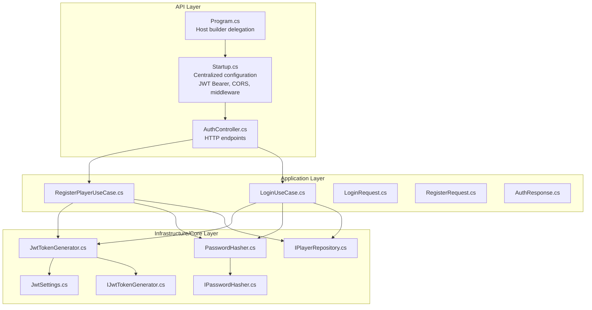
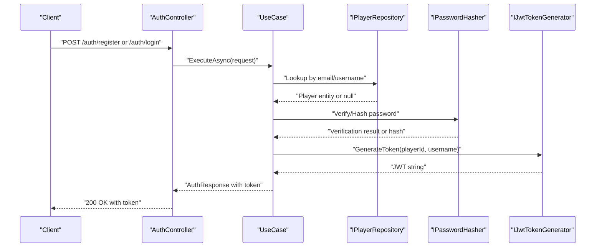
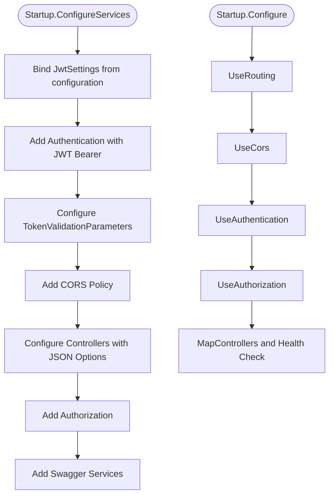
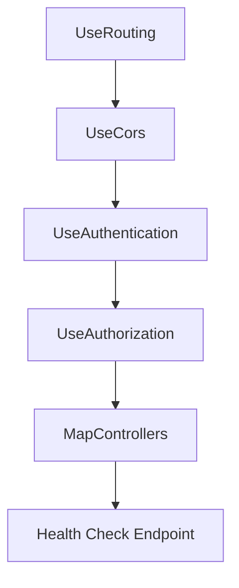
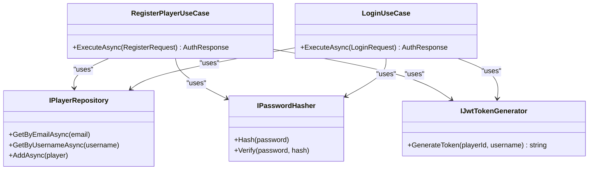
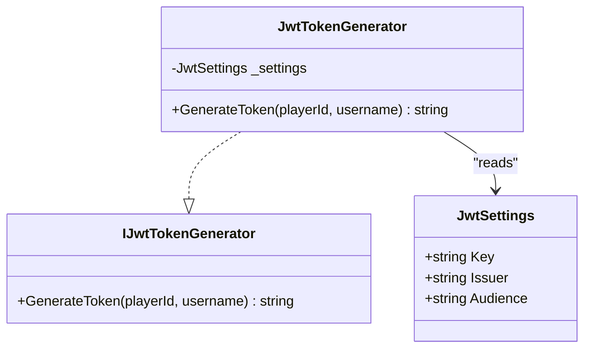
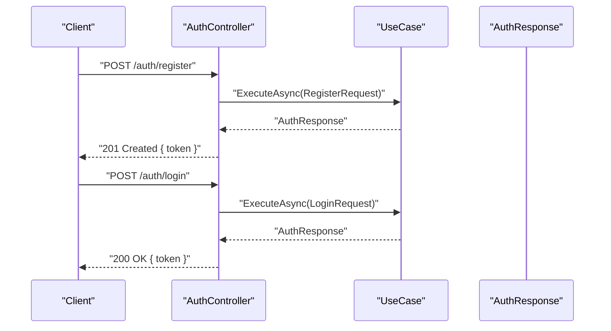
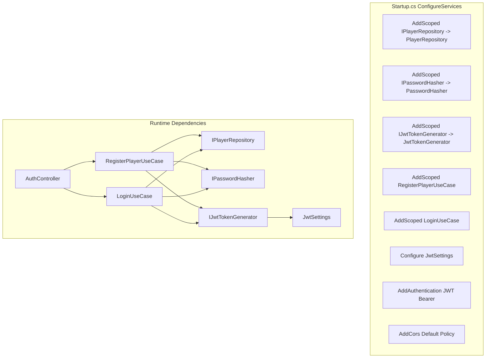

# Authentication Middleware & Configuration

<cite>
**Referenced Files in This Document**
- [Program.cs](file://GameBackend.API/Program.cs)
- [Startup.cs](file://GameBackend.API/Startup.cs)
- [AuthController.cs](file://GameBackend.API/Controllers/AuthController.cs)
- [JwtSettings.cs](file://GameBackend.Infrastructure/Security/JwtSettings.cs)
- [JwtTokenGenerator.cs](file://GameBackend.Infrastructure/Security/JwtTokenGenerator.cs)
- [IJwtTokenGenerator.cs](file://GameBackend.Core/Interfaces/IJwtTokenGenerator.cs)
- [LoginUseCase.cs](file://GameBackend.Application/Contracts/UseCases/Auth/LoginUseCase.cs)
- [RegisterPlayerUseCase.cs](file://GameBackend.Application/Contracts/UseCases/Auth/RegisterPlayerUseCase.cs)
- [LoginRequest.cs](file://GameBackend.Application/Contracts/Auth/LoginRequest.cs)
- [RegisterRequest.cs](file://GameBackend.Application/Contracts/Auth/RegisterRequest.cs)
- [AuthResponse.cs](file://GameBackend.Application/Contracts/Auth/AuthResponse.cs)
- [IPasswordHasher.cs](file://GameBackend.Core/Interfaces/IPasswordHasher.cs)
- [PasswordHasher.cs](file://GameBackend.Infrastructure/Security/PasswordHasher.cs)
- [IPlayerRepository.cs](file://GameBackend.Core/Interfaces/IPlayerRepository.cs)
</cite>

## Update Summary
**Changes Made**
- Updated authentication configuration location from Program.cs to Startup.cs
- Revised middleware pipeline to include CORS configuration before authentication
- Updated diagrams to reflect JWT Bearer authentication setup in Startup.cs Configure method
- Enhanced middleware order explanation to include CORS handling

## Table of Contents
1. [Introduction](#introduction)
2. [Project Structure](#project-structure)
3. [Core Components](#core-components)
4. [Architecture Overview](#architecture-overview)
5. [Detailed Component Analysis](#detailed-component-analysis)
6. [Dependency Analysis](#dependency-analysis)
7. [Performance Considerations](#performance-considerations)
8. [Troubleshooting Guide](#troubleshooting-guide)
9. [Conclusion](#conclusion)

## Introduction
This document explains the authentication middleware and configuration for the GameBackend project. It focuses on JWT-based authentication, middleware setup, token validation, token expiration handling, and the authentication pipeline. The authentication configuration has been centralized in the Startup.cs file, which provides a clean separation of concerns between application startup and service configuration. This document covers configuration options, error handling strategies, dependency injection integration, and practical guidance for optimizing and troubleshooting authentication flows.

## Project Structure
Authentication spans three layers with centralized configuration in the API layer:
- API layer: HTTP entry points and centralized middleware pipeline configuration in Startup.cs
- Application layer: Use cases orchestrating business logic for registration and login
- Infrastructure/Core layer: Security helpers (JWT generation, hashing) and interfaces

**Diagram sources**
- [Program.cs](file://GameBackend.API/Program.cs)
- [Startup.cs](file://GameBackend.API/Startup.cs)
- [AuthController.cs](file://GameBackend.API/Controllers/AuthController.cs)
- [RegisterPlayerUseCase.cs](file://GameBackend.Application/Contracts/UseCases/Auth/RegisterPlayerUseCase.cs)
- [LoginUseCase.cs](file://GameBackend.Application/Contracts/UseCases/Auth/LoginUseCase.cs)
- [JwtTokenGenerator.cs](file://GameBackend.Infrastructure/Security/JwtTokenGenerator.cs)
- [JwtSettings.cs](file://GameBackend.Infrastructure/Security/JwtSettings.cs)
- [PasswordHasher.cs](file://GameBackend.Infrastructure/Security/PasswordHasher.cs)
- [IPasswordHasher.cs](file://GameBackend.Core/Interfaces/IPasswordHasher.cs)
- [IJwtTokenGenerator.cs](file://GameBackend.Core/Interfaces/IJwtTokenGenerator.cs)
- [IPlayerRepository.cs](file://GameBackend.Core/Interfaces/IPlayerRepository.cs)

**Section sources**
- [Program.cs](file://GameBackend.API/Program.cs)
- [Startup.cs](file://GameBackend.API/Startup.cs)
- [AuthController.cs](file://GameBackend.API/Controllers/AuthController.cs)

## Core Components
- JWT configuration binding: The Startup.cs file binds the "Jwt" configuration section to a strongly typed settings object and registers it via dependency injection.
- Authentication provider: ASP.NET Core Authentication is configured with JWT Bearer in Startup.cs, enabling automatic token validation with comprehensive validation parameters.
- Token generator: Produces signed JWT tokens with issuer, audience, claims, and expiration using HMAC SHA256 signing.
- Password hashing: Uses bcrypt for secure hashing and verification through the PasswordHasher implementation.
- Use cases: Encapsulate registration and login flows, invoking repository and token generator services.
- HTTP endpoints: Expose registration and login endpoints returning tokens upon successful authentication.
- CORS configuration: Allows any game client to connect with appropriate HTTP methods and headers.

**Section sources**
- [Startup.cs](file://GameBackend.API/Startup.cs)
- [JwtSettings.cs](file://GameBackend.Infrastructure/Security/JwtSettings.cs)
- [JwtTokenGenerator.cs](file://GameBackend.Infrastructure/Security/JwtTokenGenerator.cs)
- [IJwtTokenGenerator.cs](file://GameBackend.Core/Interfaces/IJwtTokenGenerator.cs)
- [PasswordHasher.cs](file://GameBackend.Infrastructure/Security/PasswordHasher.cs)
- [IPasswordHasher.cs](file://GameBackend.Core/Interfaces/IPasswordHasher.cs)
- [RegisterPlayerUseCase.cs](file://GameBackend.Application/Contracts/UseCases/Auth/RegisterPlayerUseCase.cs)
- [LoginUseCase.cs](file://GameBackend.Application/Contracts/UseCases/Auth/LoginUseCase.cs)
- [AuthController.cs](file://GameBackend.API/Controllers/AuthController.cs)

## Architecture Overview
The authentication flow integrates middleware, controllers, and application services with centralized configuration in Startup.cs. The middleware validates incoming requests' Authorization headers, while controllers delegate business logic to use cases that interact with repositories and security helpers. The authentication configuration is now centralized for better maintainability and clearer separation of concerns.

**Diagram sources**
- [AuthController.cs](file://GameBackend.API/Controllers/AuthController.cs)
- [RegisterPlayerUseCase.cs](file://GameBackend.Application/Contracts/UseCases/Auth/RegisterPlayerUseCase.cs)
- [LoginUseCase.cs](file://GameBackend.Application/Contracts/UseCases/Auth/LoginUseCase.cs)
- [IPlayerRepository.cs](file://GameBackend.Core/Interfaces/IPlayerRepository.cs)
- [IPasswordHasher.cs](file://GameBackend.Core/Interfaces/IPasswordHasher.cs)
- [IJwtTokenGenerator.cs](file://GameBackend.Core/Interfaces/IJwtTokenGenerator.cs)

## Detailed Component Analysis

### JWT Configuration and Centralized Middleware Setup
**Updated** Authentication configuration has been moved from Program.cs to Startup.cs for better organization and maintainability. The Startup.cs file now handles all authentication-related configuration including JWT Bearer authentication setup, CORS policy configuration, and middleware pipeline ordering.

- Configuration binding: The Startup.cs file binds the "Jwt" configuration section to a settings object and registers it via dependency injection in the ConfigureServices method.
- Authentication provider: Adds JWT Bearer authentication with explicit validation parameters in the ConfigureServices method:
  - Issuer and audience validation
  - Signing key validation using HMAC SHA256
  - Lifetime validation
  - Token persistence configuration
- CORS configuration: Added default policy allowing any origin with GET, POST, PUT, DELETE methods and any headers
- Middleware pipeline: Configured in the Configure method with proper ordering including routing, CORS, authentication, authorization, and controller mapping

**Diagram sources**
- [Startup.cs](file://GameBackend.API/Startup.cs)
- [JwtSettings.cs](file://GameBackend.Infrastructure/Security/JwtSettings.cs)

**Section sources**
- [Startup.cs](file://GameBackend.API/Startup.cs)
- [JwtSettings.cs](file://GameBackend.Infrastructure/Security/JwtSettings.cs)

### Token Validation and Expiration Handling
- Validation parameters enforce issuer, audience, signing key, and lifetime checks using comprehensive TokenValidationParameters configuration.
- Expiration is controlled server-side via the token's exp claim with a 7-day expiration period; clients must refresh or re-authenticate after expiry.
- On invalid or expired tokens, the authentication middleware triggers challenge behavior, resulting in client errors with appropriate HTTP status codes.
- Token persistence is enabled to store tokens for later use in the authentication process.

**Diagram sources**
- [Startup.cs](file://GameBackend.API/Startup.cs)

**Section sources**
- [Startup.cs](file://GameBackend.API/Startup.cs)

### Authentication Pipeline and Middleware Order
**Updated** The middleware pipeline now includes CORS configuration before authentication for proper cross-origin resource sharing support. The order is crucial for optimal functionality:

- Routing: Establishes endpoint routing for all controllers and health checks
- CORS: Enables cross-origin requests from any client with appropriate HTTP methods and headers
- Authentication: Validates JWT tokens in Authorization headers
- Authorization: Enforces authorization policies after successful authentication
- Controllers: Handles authenticated routes and returns appropriate responses

**Diagram sources**
- [Startup.cs](file://GameBackend.API/Startup.cs)

**Section sources**
- [Startup.cs](file://GameBackend.API/Startup.cs)

### Registration and Login Use Cases
- Registration:
  - Checks for existing user by email to prevent duplicates
  - Hashes the password using bcrypt for secure storage
  - Persists the new player entity with creation timestamps
  - Generates a JWT token with 7-day expiration
  - Returns an authentication response containing player ID, username, and token
- Login:
  - Finds the player by email for authentication
  - Verifies the password using bcrypt verification
  - Generates a JWT token with 7-day expiration
  - Returns an authentication response containing player ID, username, and token

**Diagram sources**
- [RegisterPlayerUseCase.cs](file://GameBackend.Application/Contracts/UseCases/Auth/RegisterPlayerUseCase.cs)
- [LoginUseCase.cs](file://GameBackend.Application/Contracts/UseCases/Auth/LoginUseCase.cs)
- [IPlayerRepository.cs](file://GameBackend.Core/Interfaces/IPlayerRepository.cs)
- [IPasswordHasher.cs](file://GameBackend.Core/Interfaces/IPasswordHasher.cs)
- [IJwtTokenGenerator.cs](file://GameBackend.Core/Interfaces/IJwtTokenGenerator.cs)

**Section sources**
- [RegisterPlayerUseCase.cs](file://GameBackend.Application/Contracts/UseCases/Auth/RegisterPlayerUseCase.cs)
- [LoginUseCase.cs](file://GameBackend.Application/Contracts/UseCases/Auth/LoginUseCase.cs)

### Token Generation Details
- Signing key is derived from the configured JWT key using HMAC SHA256 algorithm
- Claims include subject (player identifier) and unique name (username) as standard JWT claims
- Token is issued with a fixed 7-day expiration period from current UTC time
- Issuer and audience validation parameters are enforced during authentication
- Token persistence is enabled to store tokens for subsequent authentication requests

**Diagram sources**
- [JwtTokenGenerator.cs](file://GameBackend.Infrastructure/Security/JwtTokenGenerator.cs)
- [JwtSettings.cs](file://GameBackend.Infrastructure/Security/JwtSettings.cs)
- [IJwtTokenGenerator.cs](file://GameBackend.Core/Interfaces/IJwtTokenGenerator.cs)

**Section sources**
- [JwtTokenGenerator.cs](file://GameBackend.Infrastructure/Security/JwtTokenGenerator.cs)
- [JwtSettings.cs](file://GameBackend.Infrastructure/Security/JwtSettings.cs)
- [IJwtTokenGenerator.cs](file://GameBackend.Core/Interfaces/IJwtTokenGenerator.cs)

### HTTP Endpoints and Error Handling
- Registration endpoint accepts registration requests and returns an authentication response with a token
- Login endpoint accepts login requests and returns an authentication response with a token
- Error handling follows RESTful conventions:
  - Registration catches exceptions and responds with appropriate HTTP status codes
  - Login catches exceptions and responds with 401 Unauthorized status
  - Both endpoints leverage the base controller error handling mechanism

**Diagram sources**
- [AuthController.cs](file://GameBackend.API/Controllers/AuthController.cs)
- [RegisterPlayerUseCase.cs](file://GameBackend.Application/Contracts/UseCases/Auth/RegisterPlayerUseCase.cs)
- [LoginUseCase.cs](file://GameBackend.Application/Contracts/UseCases/Auth/LoginUseCase.cs)
- [AuthResponse.cs](file://GameBackend.Application/Contracts/Auth/AuthResponse.cs)

**Section sources**
- [AuthController.cs](file://GameBackend.API/Controllers/AuthController.cs)
- [RegisterPlayerUseCase.cs](file://GameBackend.Application/Contracts/UseCases/Auth/RegisterPlayerUseCase.cs)
- [LoginUseCase.cs](file://GameBackend.Application/Contracts/UseCases/Auth/LoginUseCase.cs)
- [AuthResponse.cs](file://GameBackend.Application/Contracts/Auth/AuthResponse.cs)

## Dependency Analysis
**Updated** Dependencies are now managed centrally through the Startup.cs configuration with clear separation between service registration and middleware configuration.

- DI registrations bind interfaces to implementations across layers in the ConfigureServices method
- Controllers depend on use cases for business logic execution
- Use cases depend on repositories, password hasher, and JWT generator for core functionality
- JWT generator depends on settings; settings are injected via configuration binding
- CORS policy is configured globally for all endpoints

**Diagram sources**
- [Startup.cs](file://GameBackend.API/Startup.cs)
- [AuthController.cs](file://GameBackend.API/Controllers/AuthController.cs)
- [RegisterPlayerUseCase.cs](file://GameBackend.Application/Contracts/UseCases/Auth/RegisterPlayerUseCase.cs)
- [LoginUseCase.cs](file://GameBackend.Application/Contracts/UseCases/Auth/LoginUseCase.cs)
- [JwtTokenGenerator.cs](file://GameBackend.Infrastructure/Security/JwtTokenGenerator.cs)
- [JwtSettings.cs](file://GameBackend.Infrastructure/Security/JwtSettings.cs)
- [IPlayerRepository.cs](file://GameBackend.Core/Interfaces/IPlayerRepository.cs)
- [IPasswordHasher.cs](file://GameBackend.Core/Interfaces/IPasswordHasher.cs)
- [IJwtTokenGenerator.cs](file://GameBackend.Core/Interfaces/IJwtTokenGenerator.cs)

**Section sources**
- [Startup.cs](file://GameBackend.API/Startup.cs)
- [AuthController.cs](file://GameBackend.API/Controllers/AuthController.cs)
- [RegisterPlayerUseCase.cs](file://GameBackend.Application/Contracts/UseCases/Auth/RegisterPlayerUseCase.cs)
- [LoginUseCase.cs](file://GameBackend.Application/Contracts/UseCases/Auth/LoginUseCase.cs)

## Performance Considerations
- Prefer short-lived access tokens with refresh token strategies for long sessions
- Cache frequently accessed user roles/claims when applicable to reduce repeated work
- Use asynchronous repository calls consistently to avoid blocking threads
- Keep token validation parameters minimal but sufficient to reduce overhead
- Avoid unnecessary middleware invocations by ordering middleware efficiently
- Enable token persistence to reduce repeated validation overhead
- Configure CORS appropriately to minimize preflight request overhead

## Troubleshooting Guide
Common issues and resolutions:
- 401 Unauthorized on protected endpoints:
  - Ensure the Authorization header includes a valid Bearer token
  - Confirm issuer, audience, and signing key match server configuration
  - Verify token expiration has not passed
- 403 Forbidden:
  - Authorization failed after authentication; check policies and claims
- Invalid credentials during login/registration:
  - Verify email uniqueness for registration
  - Confirm password hashing and verification logic using bcrypt
- CORS-related issues:
  - Ensure client requests include proper origin headers
  - Verify CORS policy allows the requesting origin
- Token expiration:
  - Clients must refresh or re-authenticate when tokens expire
- Configuration mismatches:
  - Validate JWT settings binding and environment-specific configuration
  - Check that JWT key, issuer, and audience values match client expectations

**Section sources**
- [Startup.cs](file://GameBackend.API/Startup.cs)
- [AuthController.cs](file://GameBackend.API/Controllers/AuthController.cs)
- [LoginUseCase.cs](file://GameBackend.Application/Contracts/UseCases/Auth/LoginUseCase.cs)
- [RegisterPlayerUseCase.cs](file://GameBackend.Application/Contracts/UseCases/Auth/RegisterPlayerUseCase.cs)

## Conclusion
The GameBackend project implements a clean, layered JWT authentication system with centralized configuration in Startup.cs. The authentication configuration has been moved from Program.cs to Startup.cs for better organization and maintainability. The API layer now provides centralized middleware pipeline configuration including JWT Bearer authentication, CORS support, and proper middleware ordering. The application layer encapsulates registration and login flows, while infrastructure services provide secure token generation and password hashing. Following the documented middleware order, configuration, and error handling ensures reliable and secure authentication across the backend with improved separation of concerns.