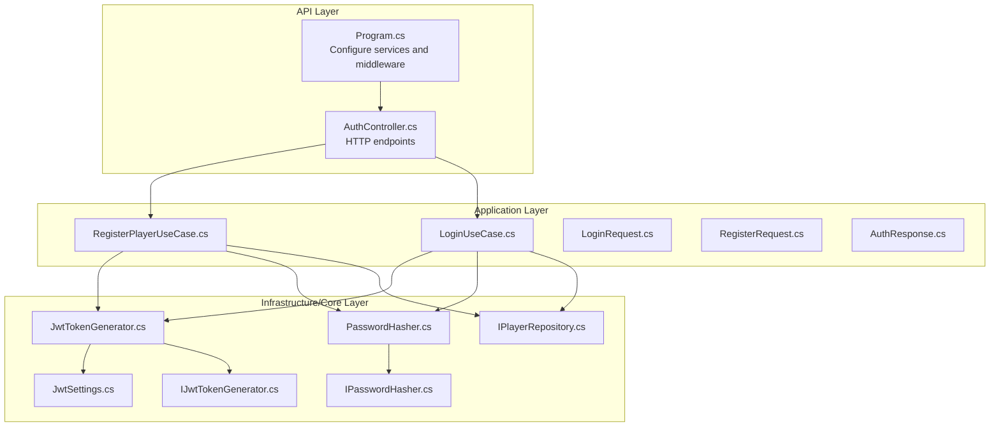
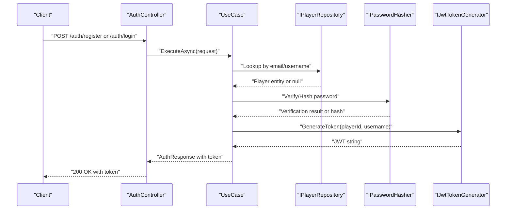
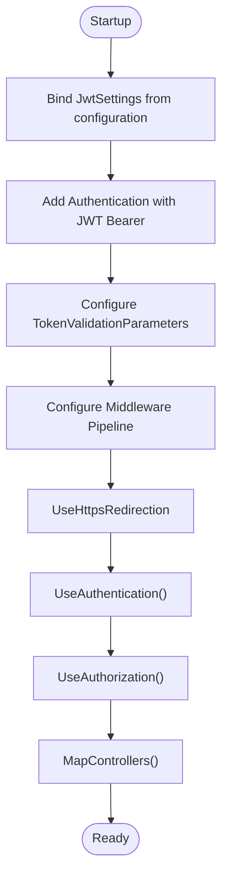
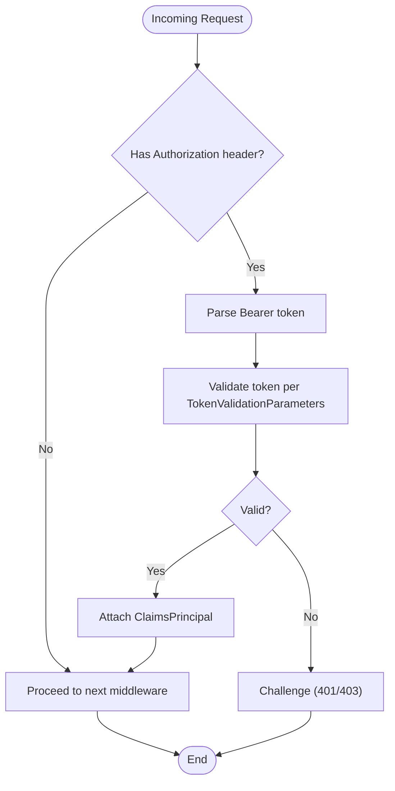
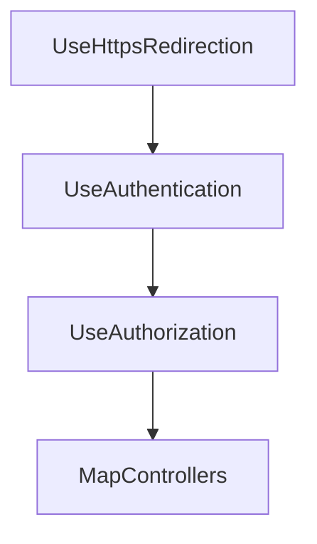
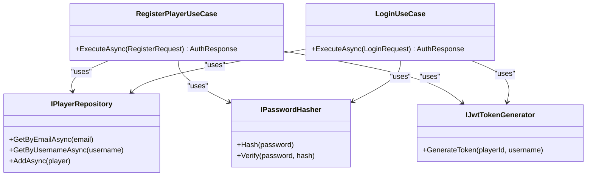
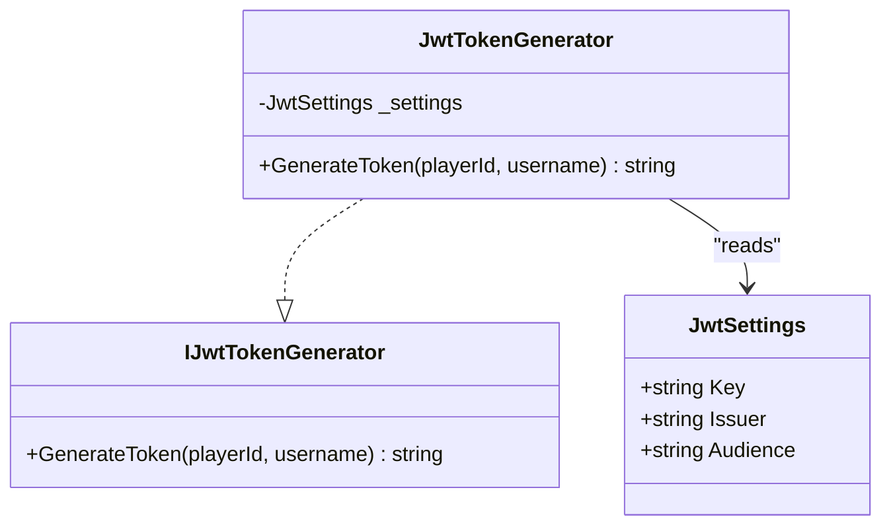
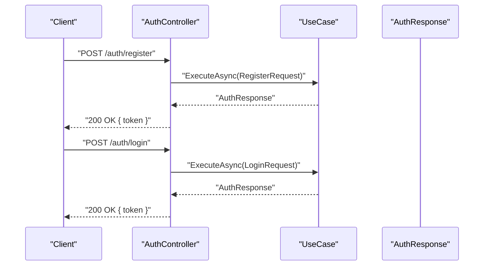
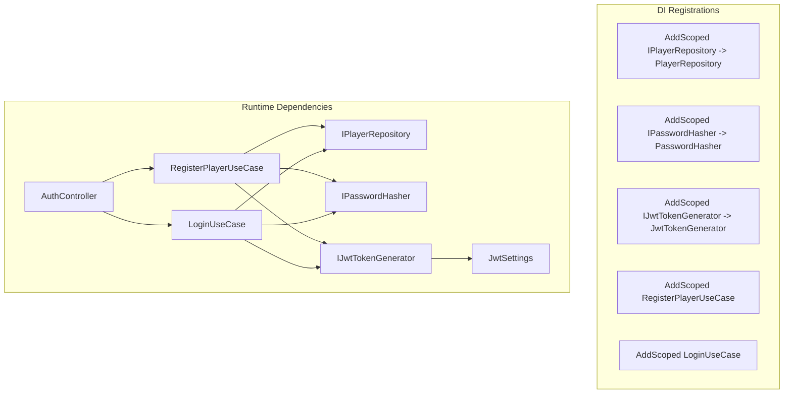

# Authentication Middleware & Configuration

<cite>
**Referenced Files in This Document**
- [Program.cs](file://GameBackend.API/Program.cs)
- [AuthController.cs](file://GameBackend.API/Controllers/AuthController.cs)
- [JwtSettings.cs](file://GameBackend.Infrastructure/Security/JwtSettings.cs)
- [JwtTokenGenerator.cs](file://GameBackend.Infrastructure/Security/JwtTokenGenerator.cs)
- [IJwtTokenGenerator.cs](file://GameBackend.Core/Interfaces/IJwtTokenGenerator.cs)
- [LoginUseCase.cs](file://GameBackend.Application/Contracts/UseCases/Auth/LoginUseCase.cs)
- [RegisterPlayerUseCase.cs](file://GameBackend.Application/Contracts/UseCases/Auth/RegisterPlayerUseCase.cs)
- [LoginRequest.cs](file://GameBackend.Application/Contracts/Auth/LoginRequest.cs)
- [RegisterRequest.cs](file://GameBackend.Application/Contracts/Auth/RegisterRequest.cs)
- [AuthResponse.cs](file://GameBackend.Application/Contracts/Auth/AuthResponse.cs)
- [IPasswordHasher.cs](file://GameBackend.Core/Interfaces/IPasswordHasher.cs)
- [PasswordHasher.cs](file://GameBackend.Infrastructure/Security/PasswordHasher.cs)
- [IPlayerRepository.cs](file://GameBackend.Core/Interfaces/IPlayerRepository.cs)
</cite>

## Table of Contents
1. [Introduction](#introduction)
2. [Project Structure](#project-structure)
3. [Core Components](#core-components)
4. [Architecture Overview](#architecture-overview)
5. [Detailed Component Analysis](#detailed-component-analysis)
6. [Dependency Analysis](#dependency-analysis)
7. [Performance Considerations](#performance-considerations)
8. [Troubleshooting Guide](#troubleshooting-guide)
9. [Conclusion](#conclusion)

## Introduction
This document explains the authentication middleware and configuration for the GameBackend project. It focuses on JWT-based authentication, middleware setup, token validation, token expiration handling, and the authentication pipeline. It also covers configuration options, error handling strategies, dependency injection integration, and practical guidance for optimizing and troubleshooting authentication flows.

## Project Structure
Authentication spans three layers:
- API layer: HTTP entry points and middleware pipeline.
- Application layer: Use cases orchestrating business logic for registration and login.
- Infrastructure/Core layer: Security helpers (JWT generation, hashing) and interfaces.

**Diagram sources**
- [Program.cs](file://GameBackend.API/Program.cs)
- [AuthController.cs](file://GameBackend.API/Controllers/AuthController.cs)
- [RegisterPlayerUseCase.cs](file://GameBackend.Application/Contracts/UseCases/Auth/RegisterPlayerUseCase.cs)
- [LoginUseCase.cs](file://GameBackend.Application/Contracts/UseCases/Auth/LoginUseCase.cs)
- [JwtTokenGenerator.cs](file://GameBackend.Infrastructure/Security/JwtTokenGenerator.cs)
- [JwtSettings.cs](file://GameBackend.Infrastructure/Security/JwtSettings.cs)
- [PasswordHasher.cs](file://GameBackend.Infrastructure/Security/PasswordHasher.cs)
- [IPasswordHasher.cs](file://GameBackend.Core/Interfaces/IPasswordHasher.cs)
- [IJwtTokenGenerator.cs](file://GameBackend.Core/Interfaces/IJwtTokenGenerator.cs)
- [IPlayerRepository.cs](file://GameBackend.Core/Interfaces/IPlayerRepository.cs)

**Section sources**
- [Program.cs](file://GameBackend.API/Program.cs)
- [AuthController.cs](file://GameBackend.API/Controllers/AuthController.cs)

## Core Components
- JWT configuration binding: The API reads JWT settings from configuration and binds them to a strongly typed settings object.
- Authentication provider: ASP.NET Core Authentication is configured with JWT Bearer, enabling automatic token validation.
- Token generator: Produces signed JWT tokens with issuer, audience, claims, and expiration.
- Password hashing: Uses bcrypt for secure hashing and verification.
- Use cases: Encapsulate registration and login flows, invoking repository and token generator.
- HTTP endpoints: Expose registration and login endpoints returning tokens upon successful authentication.

**Section sources**
- [Program.cs](file://GameBackend.API/Program.cs)
- [JwtSettings.cs](file://GameBackend.Infrastructure/Security/JwtSettings.cs)
- [JwtTokenGenerator.cs](file://GameBackend.Infrastructure/Security/JwtTokenGenerator.cs)
- [IJwtTokenGenerator.cs](file://GameBackend.Core/Interfaces/IJwtTokenGenerator.cs)
- [PasswordHasher.cs](file://GameBackend.Infrastructure/Security/PasswordHasher.cs)
- [IPasswordHasher.cs](file://GameBackend.Core/Interfaces/IPasswordHasher.cs)
- [RegisterPlayerUseCase.cs](file://GameBackend.Application/Contracts/UseCases/Auth/RegisterPlayerUseCase.cs)
- [LoginUseCase.cs](file://GameBackend.Application/Contracts/UseCases/Auth/LoginUseCase.cs)
- [AuthController.cs](file://GameBackend.API/Controllers/AuthController.cs)

## Architecture Overview
The authentication flow integrates middleware, controllers, and application services. The middleware validates incoming requests’ Authorization headers, while controllers delegate business logic to use cases that interact with repositories and security helpers.

**Diagram sources**
- [AuthController.cs](file://GameBackend.API/Controllers/AuthController.cs)
- [RegisterPlayerUseCase.cs](file://GameBackend.Application/Contracts/UseCases/Auth/RegisterPlayerUseCase.cs)
- [LoginUseCase.cs](file://GameBackend.Application/Contracts/UseCases/Auth/LoginUseCase.cs)
- [IPlayerRepository.cs](file://GameBackend.Core/Interfaces/IPlayerRepository.cs)
- [IPasswordHasher.cs](file://GameBackend.Core/Interfaces/IPasswordHasher.cs)
- [IJwtTokenGenerator.cs](file://GameBackend.Core/Interfaces/IJwtTokenGenerator.cs)

## Detailed Component Analysis

### JWT Configuration and Middleware Setup
- Configuration binding: The API binds the "Jwt" configuration section to a settings object and registers it via dependency injection.
- Authentication provider: Adds JWT Bearer authentication with explicit validation parameters:
  - Issuer and audience validation
  - Signing key validation
  - Lifetime validation
- Middleware pipeline:
  - HTTPS redirection
  - Authentication middleware
  - Authorization middleware
  - Controller routing

**Diagram sources**
- [Program.cs](file://GameBackend.API/Program.cs)
- [JwtSettings.cs](file://GameBackend.Infrastructure/Security/JwtSettings.cs)

**Section sources**
- [Program.cs](file://GameBackend.API/Program.cs)
- [JwtSettings.cs](file://GameBackend.Infrastructure/Security/JwtSettings.cs)

### Token Validation and Expiration Handling
- Validation parameters enforce issuer, audience, signing key, and lifetime checks.
- Expiration is controlled server-side via the token’s exp claim; clients must refresh or re-authenticate after expiry.
- On invalid or expired tokens, the authentication middleware triggers challenge behavior, resulting in client errors.

**Diagram sources**
- [Program.cs](file://GameBackend.API/Program.cs)

**Section sources**
- [Program.cs](file://GameBackend.API/Program.cs)

### Authentication Pipeline and Middleware Order
- Order matters: HTTPS redirection should precede authentication to avoid redirect loops.
- Authentication middleware must come before authorization so that identities are established.
- Authorization middleware enforces policies after authentication.
- Controllers are mapped last to handle authenticated routes.

**Diagram sources**
- [Program.cs](file://GameBackend.API/Program.cs)

**Section sources**
- [Program.cs](file://GameBackend.API/Program.cs)

### Registration and Login Use Cases
- Registration:
  - Checks for existing user by email.
  - Hashes the password.
  - Persists the new player.
  - Generates a JWT token.
  - Returns an authentication response containing the token.
- Login:
  - Finds the player by email.
  - Verifies the password.
  - Generates a JWT token.
  - Returns an authentication response containing the token.

**Diagram sources**
- [RegisterPlayerUseCase.cs](file://GameBackend.Application/Contracts/UseCases/Auth/RegisterPlayerUseCase.cs)
- [LoginUseCase.cs](file://GameBackend.Application/Contracts/UseCases/Auth/LoginUseCase.cs)
- [IPlayerRepository.cs](file://GameBackend.Core/Interfaces/IPlayerRepository.cs)
- [IPasswordHasher.cs](file://GameBackend.Core/Interfaces/IPasswordHasher.cs)
- [IJwtTokenGenerator.cs](file://GameBackend.Core/Interfaces/IJwtTokenGenerator.cs)

**Section sources**
- [RegisterPlayerUseCase.cs](file://GameBackend.Application/Contracts/UseCases/Auth/RegisterPlayerUseCase.cs)
- [LoginUseCase.cs](file://GameBackend.Application/Contracts/UseCases/Auth/LoginUseCase.cs)

### Token Generation Details
- Signing key is derived from the configured JWT key.
- Claims include subject (player identifier) and unique name (username).
- Token is issued with a fixed expiration (e.g., days from now).
- Issuer and audience are validated during authentication.

**Diagram sources**
- [JwtTokenGenerator.cs](file://GameBackend.Infrastructure/Security/JwtTokenGenerator.cs)
- [JwtSettings.cs](file://GameBackend.Infrastructure/Security/JwtSettings.cs)
- [IJwtTokenGenerator.cs](file://GameBackend.Core/Interfaces/IJwtTokenGenerator.cs)

**Section sources**
- [JwtTokenGenerator.cs](file://GameBackend.Infrastructure/Security/JwtTokenGenerator.cs)
- [JwtSettings.cs](file://GameBackend.Infrastructure/Security/JwtSettings.cs)
- [IJwtTokenGenerator.cs](file://GameBackend.Core/Interfaces/IJwtTokenGenerator.cs)

### HTTP Endpoints and Error Handling
- Registration endpoint accepts registration requests and returns an authentication response with a token.
- Login endpoint accepts login requests and returns an authentication response with a token.
- Errors are handled with appropriate HTTP status codes:
  - Registration catches exceptions and responds with bad request.
  - Login catches exceptions and responds with unauthorized.

**Diagram sources**
- [AuthController.cs](file://GameBackend.API/Controllers/AuthController.cs)
- [RegisterPlayerUseCase.cs](file://GameBackend.Application/Contracts/UseCases/Auth/RegisterPlayerUseCase.cs)
- [LoginUseCase.cs](file://GameBackend.Application/Contracts/UseCases/Auth/LoginUseCase.cs)
- [AuthResponse.cs](file://GameBackend.Application/Contracts/Auth/AuthResponse.cs)

**Section sources**
- [AuthController.cs](file://GameBackend.API/Controllers/AuthController.cs)
- [RegisterPlayerUseCase.cs](file://GameBackend.Application/Contracts/UseCases/Auth/RegisterPlayerUseCase.cs)
- [LoginUseCase.cs](file://GameBackend.Application/Contracts/UseCases/Auth/LoginUseCase.cs)
- [AuthResponse.cs](file://GameBackend.Application/Contracts/Auth/AuthResponse.cs)

## Dependency Analysis
- DI registrations bind interfaces to implementations across layers.
- Controllers depend on use cases.
- Use cases depend on repositories, password hasher, and JWT generator.
- JWT generator depends on settings; settings are injected via configuration.

**Diagram sources**
- [Program.cs](file://GameBackend.API/Program.cs)
- [AuthController.cs](file://GameBackend.API/Controllers/AuthController.cs)
- [RegisterPlayerUseCase.cs](file://GameBackend.Application/Contracts/UseCases/Auth/RegisterPlayerUseCase.cs)
- [LoginUseCase.cs](file://GameBackend.Application/Contracts/UseCases/Auth/LoginUseCase.cs)
- [JwtTokenGenerator.cs](file://GameBackend.Infrastructure/Security/JwtTokenGenerator.cs)
- [JwtSettings.cs](file://GameBackend.Infrastructure/Security/JwtSettings.cs)
- [IPlayerRepository.cs](file://GameBackend.Core/Interfaces/IPlayerRepository.cs)
- [IPasswordHasher.cs](file://GameBackend.Core/Interfaces/IPasswordHasher.cs)
- [IJwtTokenGenerator.cs](file://GameBackend.Core/Interfaces/IJwtTokenGenerator.cs)

**Section sources**
- [Program.cs](file://GameBackend.API/Program.cs)
- [AuthController.cs](file://GameBackend.API/Controllers/AuthController.cs)
- [RegisterPlayerUseCase.cs](file://GameBackend.Application/Contracts/UseCases/Auth/RegisterPlayerUseCase.cs)
- [LoginUseCase.cs](file://GameBackend.Application/Contracts/UseCases/Auth/LoginUseCase.cs)

## Performance Considerations
- Prefer short-lived access tokens with refresh token strategies for long sessions.
- Cache frequently accessed user roles/claims when applicable to reduce repeated work.
- Use asynchronous repository calls consistently to avoid blocking threads.
- Keep token validation parameters minimal but sufficient to reduce overhead.
- Avoid unnecessary middleware invocations by ordering middleware efficiently.

## Troubleshooting Guide
Common issues and resolutions:
- 401 Unauthorized on protected endpoints:
  - Ensure the Authorization header includes a valid Bearer token.
  - Confirm issuer, audience, and signing key match server configuration.
- 403 Forbidden:
  - Authorization failed after authentication; check policies and claims.
- Invalid credentials during login/registration:
  - Verify email uniqueness for registration.
  - Confirm password hashing and verification logic.
- Token expiration:
  - Clients must refresh or re-authenticate when tokens expire.
- Configuration mismatches:
  - Validate JWT settings binding and environment-specific configuration.

**Section sources**
- [Program.cs](file://GameBackend.API/Program.cs)
- [AuthController.cs](file://GameBackend.API/Controllers/AuthController.cs)
- [LoginUseCase.cs](file://GameBackend.Application/Contracts/UseCases/Auth/LoginUseCase.cs)
- [RegisterPlayerUseCase.cs](file://GameBackend.Application/Contracts/UseCases/Auth/RegisterPlayerUseCase.cs)

## Conclusion
The GameBackend project implements a clean, layered JWT authentication system. The API layer configures JWT Bearer authentication with robust validation parameters, while the application layer encapsulates registration and login flows. Infrastructure services provide secure token generation and password hashing. Following the documented middleware order, configuration, and error handling ensures reliable and secure authentication across the backend.