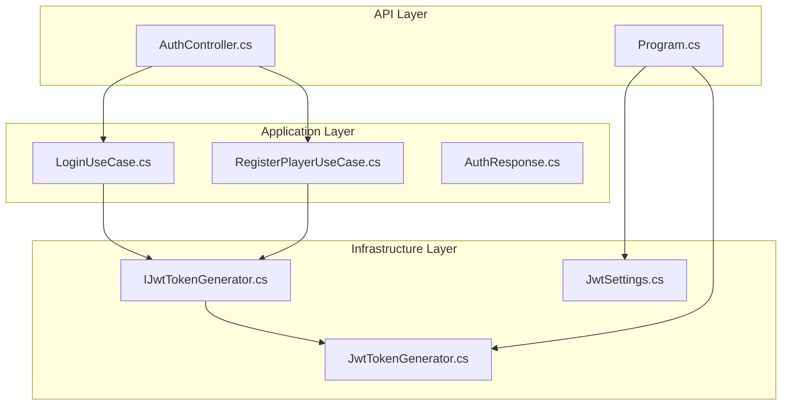
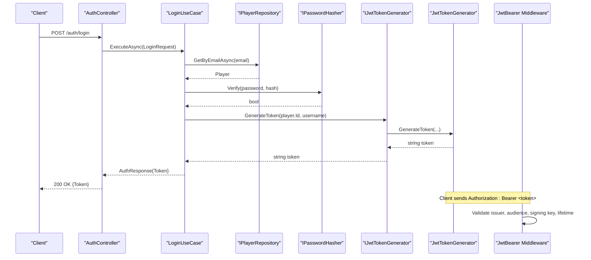
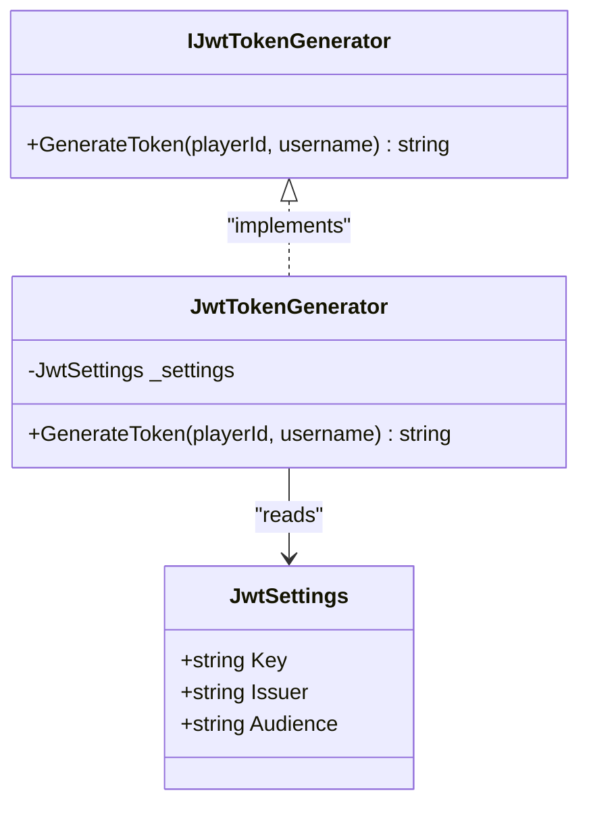
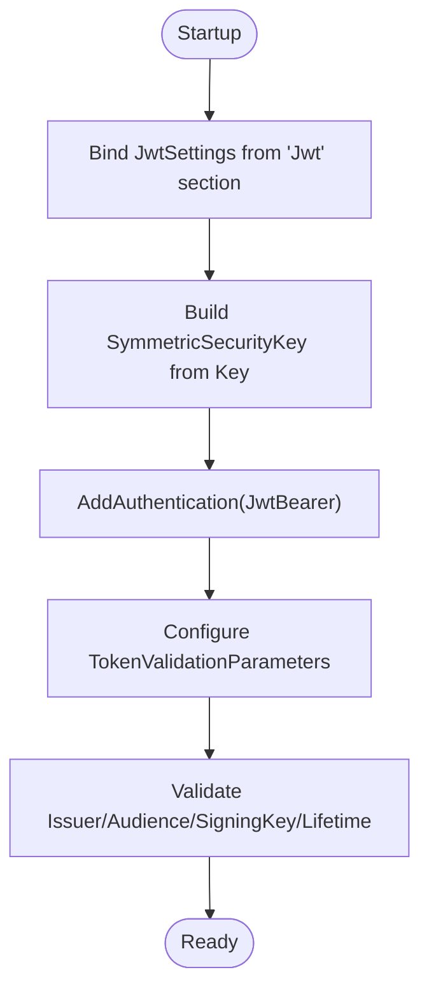
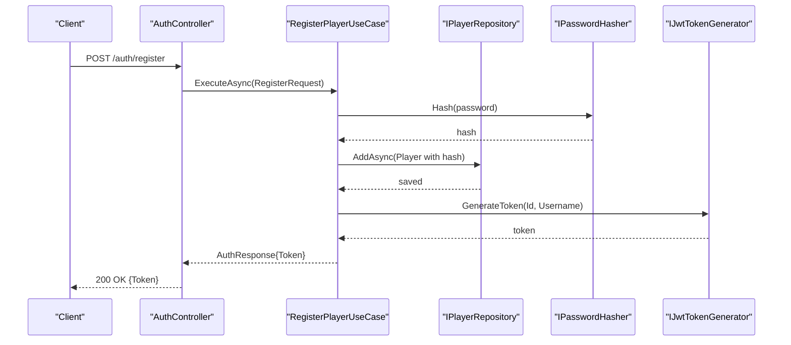
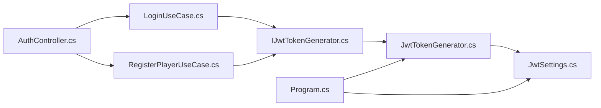

# JWT Token Management

<cite>
**Referenced Files in This Document**
- [JwtTokenGenerator.cs](file://GameBackend.Infrastructure/Security/JwtTokenGenerator.cs)
- [JwtSettings.cs](file://GameBackend.Infrastructure/Security/JwtSettings.cs)
- [IJwtTokenGenerator.cs](file://GameBackend.Core/Interfaces/IJwtTokenGenerator.cs)
- [Program.cs](file://GameBackend.API/Program.cs)
- [appsettings.json](file://GameBackend.API/appsettings.json)
- [AuthController.cs](file://GameBackend.API/Controllers/AuthController.cs)
- [LoginUseCase.cs](file://GameBackend.Application/Contracts/UseCases/Auth/LoginUseCase.cs)
- [RegisterPlayerUseCase.cs](file://GameBackend.Application/Contracts/UseCases/Auth/RegisterPlayerUseCase.cs)
- [AuthResponse.cs](file://GameBackend.Application/Contracts/Auth/AuthResponse.cs)
- [LoginRequest.cs](file://GameBackend.Application/Contracts/Auth/LoginRequest.cs)
- [RegisterRequest.cs](file://GameBackend.Application/Contracts/Auth/RegisterRequest.cs)
</cite>

## Table of Contents
1. [Introduction](#introduction)
2. [Project Structure](#project-structure)
3. [Core Components](#core-components)
4. [Architecture Overview](#architecture-overview)
5. [Detailed Component Analysis](#detailed-component-analysis)
6. [Dependency Analysis](#dependency-analysis)
7. [Performance Considerations](#performance-considerations)
8. [Troubleshooting Guide](#troubleshooting-guide)
9. [Conclusion](#conclusion)

## Introduction
This document explains JWT token management in the GameBackend project. It covers how tokens are generated, validated, and integrated into the ASP.NET Core authentication middleware. It also documents the configuration model, security key management, token expiration policies, signing algorithms, and recommended best practices such as key rotation and secure storage.

## Project Structure
The JWT implementation spans three layers:
- Infrastructure: token generation and settings model
- Application: use cases that orchestrate authentication flows and produce tokens
- API: configuration of ASP.NET Core authentication and controller endpoints

**Diagram sources**
- [AuthController.cs:1-49](file://GameBackend.API/Controllers/AuthController.cs#L1-L49)
- [Program.cs:1-72](file://GameBackend.API/Program.cs#L1-L72)
- [LoginUseCase.cs:1-45](file://GameBackend.Application/Contracts/UseCases/Auth/LoginUseCase.cs#L1-L45)
- [RegisterPlayerUseCase.cs:1-58](file://GameBackend.Application/Contracts/UseCases/Auth/RegisterPlayerUseCase.cs#L1-L58)
- [AuthResponse.cs:1-8](file://GameBackend.Application/Contracts/Auth/AuthResponse.cs#L1-L8)
- [JwtTokenGenerator.cs:1-44](file://GameBackend.Infrastructure/Security/JwtTokenGenerator.cs#L1-L44)
- [JwtSettings.cs:1-8](file://GameBackend.Infrastructure/Security/JwtSettings.cs#L1-L8)
- [IJwtTokenGenerator.cs:1-6](file://GameBackend.Core/Interfaces/IJwtTokenGenerator.cs#L1-L6)

**Section sources**
- [Program.cs:1-72](file://GameBackend.API/Program.cs#L1-L72)
- [JwtTokenGenerator.cs:1-44](file://GameBackend.Infrastructure/Security/JwtTokenGenerator.cs#L1-L44)
- [JwtSettings.cs:1-8](file://GameBackend.Infrastructure/Security/JwtSettings.cs#L1-L8)
- [IJwtTokenGenerator.cs:1-6](file://GameBackend.Core/Interfaces/IJwtTokenGenerator.cs#L1-L6)
- [AuthController.cs:1-49](file://GameBackend.API/Controllers/AuthController.cs#L1-L49)
- [LoginUseCase.cs:1-45](file://GameBackend.Application/Contracts/UseCases/Auth/LoginUseCase.cs#L1-L45)
- [RegisterPlayerUseCase.cs:1-58](file://GameBackend.Application/Contracts/UseCases/Auth/RegisterPlayerUseCase.cs#L1-L58)
- [AuthResponse.cs:1-8](file://GameBackend.Application/Contracts/Auth/AuthResponse.cs#L1-L8)
- [appsettings.json:1-17](file://GameBackend.API/appsettings.json#L1-L17)

## Core Components
- JwtSettings: Holds issuer, audience, and symmetric key used for signing.
- JwtTokenGenerator: Implements token creation with HMAC SHA-256, fixed claims, and 7-day expiration.
- IJwtTokenGenerator: Interface enabling DI and testability.
- Authentication configuration in Program.cs: Registers JwtBearer authentication with validation parameters aligned to JwtSettings.

Key configuration and behavior:
- Secret key is loaded from appsettings.json under the "Jwt" section and used to construct a symmetric key for signing.
- Tokens include subject and unique name claims mapped from player identity.
- Expiration is set to seven days from UTC now.
- Validation enforces issuer, audience, signing key, and lifetime checks.

**Section sources**
- [JwtSettings.cs:1-8](file://GameBackend.Infrastructure/Security/JwtSettings.cs#L1-L8)
- [JwtTokenGenerator.cs:20-43](file://GameBackend.Infrastructure/Security/JwtTokenGenerator.cs#L20-L43)
- [IJwtTokenGenerator.cs:1-6](file://GameBackend.Core/Interfaces/IJwtTokenGenerator.cs#L1-L6)
- [Program.cs:28-50](file://GameBackend.API/Program.cs#L28-L50)
- [appsettings.json:9-13](file://GameBackend.API/appsettings.json#L9-L13)

## Architecture Overview
The authentication flow integrates the application use cases with infrastructure token generation and ASP.NET Core authentication middleware.

**Diagram sources**
- [AuthController.cs:36-48](file://GameBackend.API/Controllers/AuthController.cs#L36-L48)
- [LoginUseCase.cs:22-44](file://GameBackend.Application/Contracts/UseCases/Auth/LoginUseCase.cs#L22-L44)
- [JwtTokenGenerator.cs:20-43](file://GameBackend.Infrastructure/Security/JwtTokenGenerator.cs#L20-L43)
- [Program.cs:32-50](file://GameBackend.API/Program.cs#L32-L50)

## Detailed Component Analysis

### JwtSettings
- Purpose: Strongly typed configuration for JWT issuer, audience, and symmetric key.
- Properties:
  - Key: Secret used for HMAC signing.
  - Issuer: Expected token issuer.
  - Audience: Expected token audience.

Configuration binding occurs in Program.cs using the "Jwt" section.

**Section sources**
- [JwtSettings.cs:1-8](file://GameBackend.Infrastructure/Security/JwtSettings.cs#L1-L8)
- [Program.cs:13-14](file://GameBackend.API/Program.cs#L13-L14)
- [appsettings.json:9-13](file://GameBackend.API/appsettings.json#L9-L13)

### JwtTokenGenerator
- Implementation pattern: Uses a symmetric key derived from the configured secret, HMAC SHA-256 signing, and a fixed set of registered claims.
- Claims:
  - Subject: Player identifier.
  - Unique name: Player username.
- Expiration: Seven days from UTC now.
- Signing algorithm: HMAC SHA-256.

**Diagram sources**
- [IJwtTokenGenerator.cs:1-6](file://GameBackend.Core/Interfaces/IJwtTokenGenerator.cs#L1-L6)
- [JwtTokenGenerator.cs:11-43](file://GameBackend.Infrastructure/Security/JwtTokenGenerator.cs#L11-L43)
- [JwtSettings.cs:3-8](file://GameBackend.Infrastructure/Security/JwtSettings.cs#L3-L8)

**Section sources**
- [JwtTokenGenerator.cs:11-43](file://GameBackend.Infrastructure/Security/JwtTokenGenerator.cs#L11-L43)

### ASP.NET Core Authentication Integration
- Registration: Adds authentication with JWT Bearer scheme and configures TokenValidationParameters.
- Validation parameters:
  - ValidateIssuer: true
  - ValidateAudience: true
  - ValidateIssuerSigningKey: true
  - ValidateLifetime: true
  - ValidIssuer and ValidAudience: taken from JwtSettings
  - IssuerSigningKey: symmetric key built from JwtSettings.Key

**Diagram sources**
- [Program.cs:13-14](file://GameBackend.API/Program.cs#L13-L14)
- [Program.cs:28-50](file://GameBackend.API/Program.cs#L28-L50)
- [JwtSettings.cs:3-8](file://GameBackend.Infrastructure/Security/JwtSettings.cs#L3-L8)

**Section sources**
- [Program.cs:28-50](file://GameBackend.API/Program.cs#L28-L50)

### Use Cases and Token Generation
- LoginUseCase:
  - Loads player by email.
  - Verifies password.
  - Generates token via IJwtTokenGenerator.
  - Returns AuthResponse containing PlayerId, Username, and Token.
- RegisterPlayerUseCase:
  - Hashes password.
  - Creates Player entity.
  - Persists player.
  - Generates token via IJwtTokenGenerator.
  - Returns AuthResponse.

**Diagram sources**
- [AuthController.cs:22-34](file://GameBackend.API/Controllers/AuthController.cs#L22-L34)
- [RegisterPlayerUseCase.cs:23-57](file://GameBackend.Application/Contracts/UseCases/Auth/RegisterPlayerUseCase.cs#L23-L57)
- [LoginUseCase.cs:22-44](file://GameBackend.Application/Contracts/UseCases/Auth/LoginUseCase.cs#L22-L44)
- [AuthResponse.cs:1-8](file://GameBackend.Application/Contracts/Auth/AuthResponse.cs#L1-L8)

**Section sources**
- [LoginUseCase.cs:22-44](file://GameBackend.Application/Contracts/UseCases/Auth/LoginUseCase.cs#L22-L44)
- [RegisterPlayerUseCase.cs:23-57](file://GameBackend.Application/Contracts/UseCases/Auth/RegisterPlayerUseCase.cs#L23-L57)
- [AuthResponse.cs:1-8](file://GameBackend.Application/Contracts/Auth/AuthResponse.cs#L1-L8)

## Dependency Analysis
- Application use cases depend on IJwtTokenGenerator for token production.
- JwtTokenGenerator depends on JwtSettings for issuer, audience, and key.
- Program.cs binds JwtSettings and configures JwtBearer validation parameters to match JwtSettings.
- Controllers expose endpoints that trigger use cases, which ultimately call token generation.

**Diagram sources**
- [LoginUseCase.cs:10-19](file://GameBackend.Application/Contracts/UseCases/Auth/LoginUseCase.cs#L10-L19)
- [RegisterPlayerUseCase.cs:11-20](file://GameBackend.Application/Contracts/UseCases/Auth/RegisterPlayerUseCase.cs#L11-L20)
- [IJwtTokenGenerator.cs:1-6](file://GameBackend.Core/Interfaces/IJwtTokenGenerator.cs#L1-L6)
- [JwtTokenGenerator.cs:13-18](file://GameBackend.Infrastructure/Security/JwtTokenGenerator.cs#L13-L18)
- [JwtSettings.cs:3-8](file://GameBackend.Infrastructure/Security/JwtSettings.cs#L3-L8)
- [Program.cs:13-14](file://GameBackend.API/Program.cs#L13-L14)
- [AuthController.cs:14-20](file://GameBackend.API/Controllers/AuthController.cs#L14-L20)

**Section sources**
- [LoginUseCase.cs:10-19](file://GameBackend.Application/Contracts/UseCases/Auth/LoginUseCase.cs#L10-L19)
- [RegisterPlayerUseCase.cs:11-20](file://GameBackend.Application/Contracts/UseCases/Auth/RegisterPlayerUseCase.cs#L11-L20)
- [JwtTokenGenerator.cs:13-18](file://GameBackend.Infrastructure/Security/JwtTokenGenerator.cs#L13-L18)
- [Program.cs:13-14](file://GameBackend.API/Program.cs#L13-L14)

## Performance Considerations
- Token generation cost is minimal due to symmetric signing and small claim sets.
- Consider rotating keys periodically to mitigate long-term exposure risk.
- Keep claims minimal to reduce token size and parsing overhead.
- Ensure database and hashing operations are efficient to avoid end-to-end latency bottlenecks.

## Troubleshooting Guide
Common issues and resolutions:
- Invalid issuer or audience:
  - Ensure ValidIssuer and ValidAudience in TokenValidationParameters match JwtSettings.
- Invalid signing key:
  - Confirm the Key value in appsettings.json matches the server-side secret.
- Token expired:
  - Adjust expiration policy in JwtTokenGenerator if appropriate for your scenario.
- Authentication failures:
  - Verify AddAuthentication and AddJwtBearer registration order and parameters.
  - Confirm Authorization header format: Bearer <token>.

Operational checks:
- Confirm JwtSettings binding from "Jwt" section.
- Validate symmetric key construction from the configured Key.
- Ensure UseAuthentication precedes UseAuthorization in the pipeline.

**Section sources**
- [Program.cs:28-50](file://GameBackend.API/Program.cs#L28-L50)
- [JwtTokenGenerator.cs:34-40](file://GameBackend.Infrastructure/Security/JwtTokenGenerator.cs#L34-L40)
- [appsettings.json:9-13](file://GameBackend.API/appsettings.json#L9-L13)

## Conclusion
The GameBackend project implements a clean, layered JWT solution:
- Configuration-driven settings for issuer, audience, and secret key.
- Secure symmetric signing with HMAC SHA-256 and a fixed set of claims.
- Robust ASP.NET Core authentication middleware validating issuer, audience, signing key, and lifetime.
- Practical integration via application use cases that generate tokens upon successful authentication or registration.

Recommended enhancements include configurable expiration, key rotation, and secure secret storage in production environments.