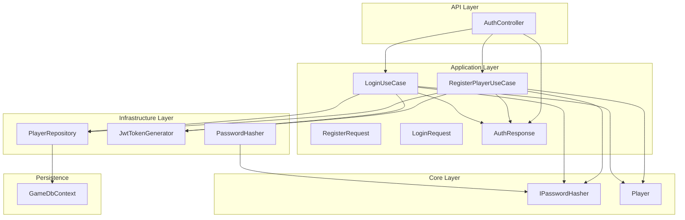
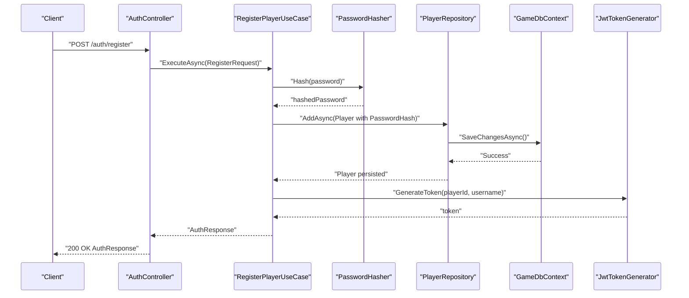
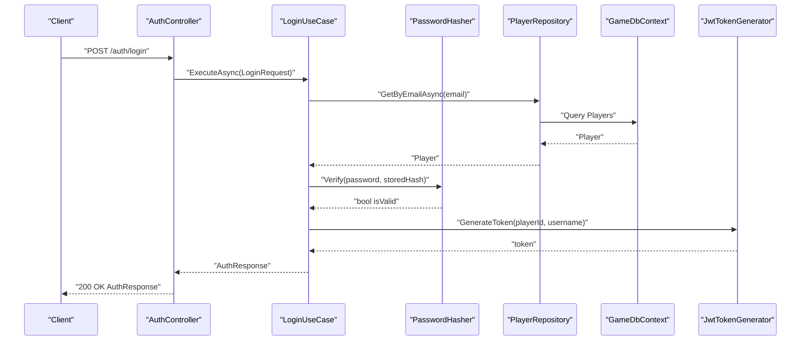
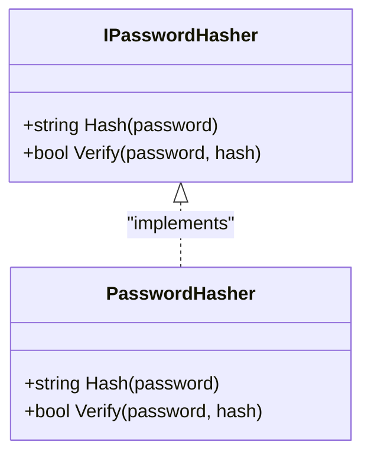
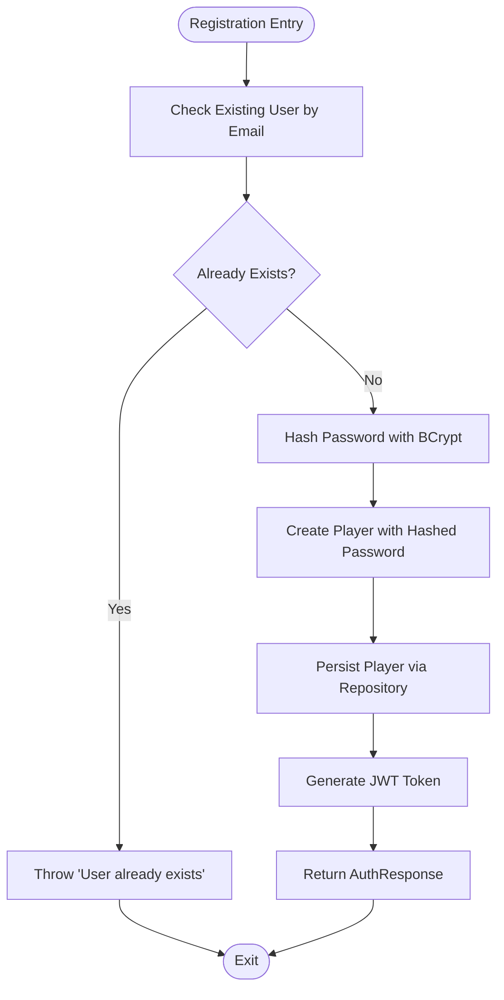
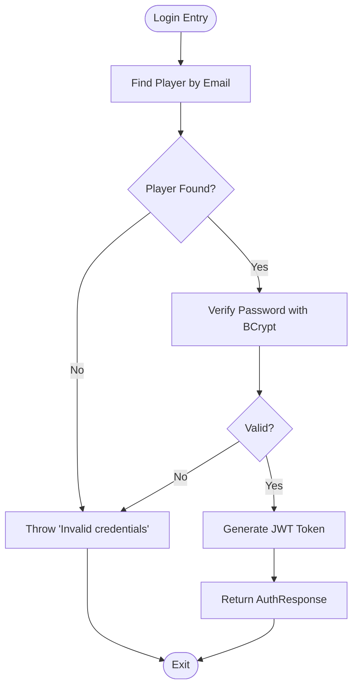
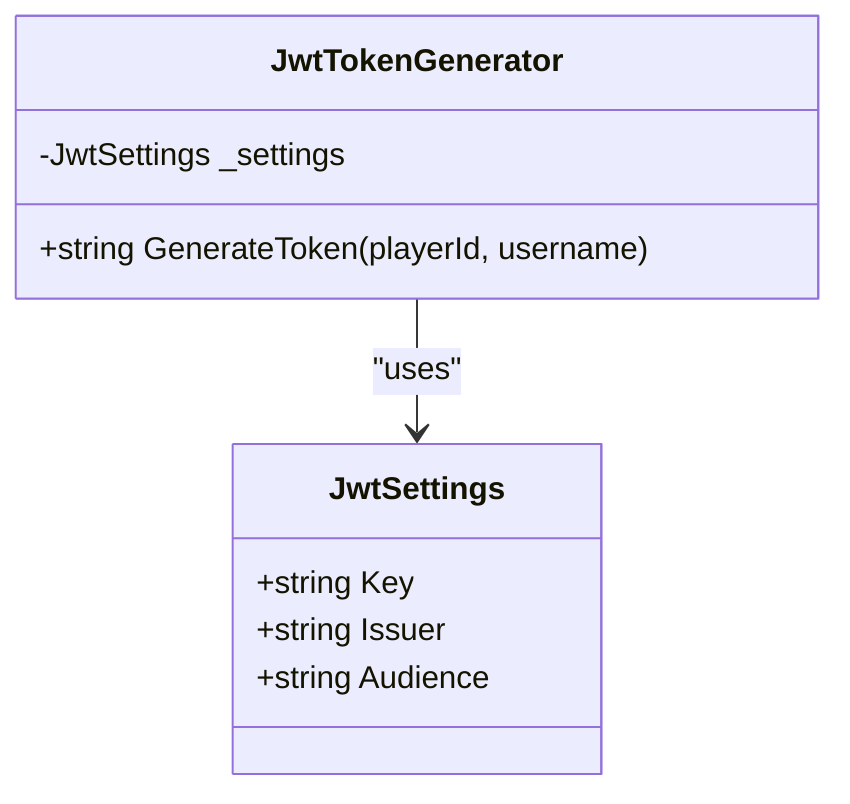
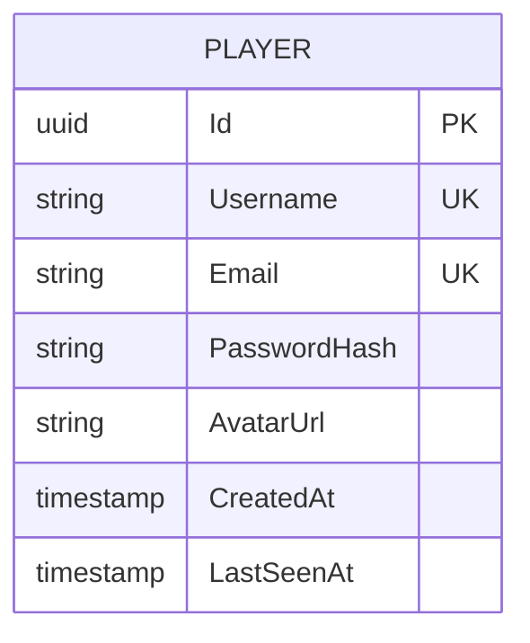
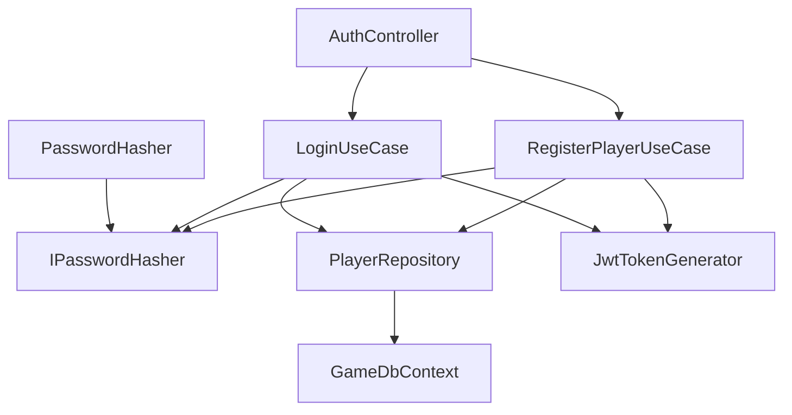

# Password Hashing & Security

<cite>
**Referenced Files in This Document**
- [PasswordHasher.cs](file://GameBackend.Infrastructure/Security/PasswordHasher.cs)
- [IPasswordHasher.cs](file://GameBackend.Core/Interfaces/IPasswordHasher.cs)
- [RegisterPlayerUseCase.cs](file://GameBackend.Application/Contracts/UseCases/Auth/RegisterPlayerUseCase.cs)
- [LoginUseCase.cs](file://GameBackend.Application/Contracts/UseCases/Auth/LoginUseCase.cs)
- [AuthController.cs](file://GameBackend.API/Controllers/AuthController.cs)
- [RegisterRequest.cs](file://GameBackend.Application/Contracts/Auth/RegisterRequest.cs)
- [LoginRequest.cs](file://GameBackend.Application/Contracts/Auth/LoginRequest.cs)
- [AuthResponse.cs](file://GameBackend.Application/Contracts/Auth/AuthResponse.cs)
- [Player.cs](file://GameBackend.Core/Entities/Player.cs)
- [PlayerRepository.cs](file://GameBackend.Infrastructure/Repositories/PlayerRepository.cs)
- [GameDbContext.cs](file://GameBackend.Infrastructure/Persistence/GameDbContext.cs)
- [JwtTokenGenerator.cs](file://GameBackend.Infrastructure/Security/JwtTokenGenerator.cs)
- [JwtSettings.cs](file://GameBackend.Infrastructure/Security/JwtSettings.cs)
- [appsettings.json](file://GameBackend.API/appsettings.json)
</cite>

## Table of Contents
1. [Introduction](#introduction)
2. [Project Structure](#project-structure)
3. [Core Components](#core-components)
4. [Architecture Overview](#architecture-overview)
5. [Detailed Component Analysis](#detailed-component-analysis)
6. [Dependency Analysis](#dependency-analysis)
7. [Performance Considerations](#performance-considerations)
8. [Troubleshooting Guide](#troubleshooting-guide)
9. [Conclusion](#conclusion)
10. [Appendices](#appendices)

## Introduction
This document provides comprehensive guidance on password hashing and security within the GameBackend project. It focuses on the BCrypt-based password hashing implementation, including salt generation, cost factors, and security considerations. It also explains password validation processes, hash comparison techniques, and storage security measures. Configuration options for password strength requirements, hash algorithm parameters, and security best practices are documented. Examples of password registration workflows, validation patterns, and integration with the authentication system are included. Finally, common password security vulnerabilities, mitigation strategies, and compliance requirements for secure credential storage are addressed.

## Project Structure
The password and authentication flow spans multiple layers:
- API layer exposes HTTP endpoints for registration and login.
- Application layer encapsulates use cases for registration and login.
- Infrastructure layer implements password hashing, JWT token generation, and persistence.
- Core layer defines interfaces and entities.

**Diagram sources**
- [AuthController.cs:1-49](file://GameBackend.API/Controllers/AuthController.cs#L1-L49)
- [RegisterPlayerUseCase.cs:1-58](file://GameBackend.Application/Contracts/UseCases/Auth/RegisterPlayerUseCase.cs#L1-L58)
- [LoginUseCase.cs:1-45](file://GameBackend.Application/Contracts/UseCases/Auth/LoginUseCase.cs#L1-L45)
- [PasswordHasher.cs:1-16](file://GameBackend.Infrastructure/Security/PasswordHasher.cs#L1-L16)
- [IPasswordHasher.cs:1-7](file://GameBackend.Core/Interfaces/IPasswordHasher.cs#L1-L7)
- [PlayerRepository.cs:1-34](file://GameBackend.Infrastructure/Repositories/PlayerRepository.cs#L1-L34)
- [GameDbContext.cs:1-28](file://GameBackend.Infrastructure/Persistence/GameDbContext.cs#L1-L28)
- [JwtTokenGenerator.cs:1-44](file://GameBackend.Infrastructure/Security/JwtTokenGenerator.cs#L1-L44)
- [Player.cs:1-13](file://GameBackend.Core/Entities/Player.cs#L1-L13)

**Section sources**
- [AuthController.cs:1-49](file://GameBackend.API/Controllers/AuthController.cs#L1-L49)
- [RegisterPlayerUseCase.cs:1-58](file://GameBackend.Application/Contracts/UseCases/Auth/RegisterPlayerUseCase.cs#L1-L58)
- [LoginUseCase.cs:1-45](file://GameBackend.Application/Contracts/UseCases/Auth/LoginUseCase.cs#L1-L45)
- [PasswordHasher.cs:1-16](file://GameBackend.Infrastructure/Security/PasswordHasher.cs#L1-L16)
- [IPasswordHasher.cs:1-7](file://GameBackend.Core/Interfaces/IPasswordHasher.cs#L1-L7)
- [PlayerRepository.cs:1-34](file://GameBackend.Infrastructure/Repositories/PlayerRepository.cs#L1-L34)
- [GameDbContext.cs:1-28](file://GameBackend.Infrastructure/Persistence/GameDbContext.cs#L1-L28)
- [JwtTokenGenerator.cs:1-44](file://GameBackend.Infrastructure/Security/JwtTokenGenerator.cs#L1-L44)
- [Player.cs:1-13](file://GameBackend.Core/Entities/Player.cs#L1-L13)

## Core Components
- PasswordHasher: Implements BCrypt-based hashing and verification.
- IPasswordHasher: Interface defining hashing and verification contracts.
- RegisterPlayerUseCase: Orchestrates registration, including password hashing and persistence.
- LoginUseCase: Orchestrates login, including password verification against stored hash.
- PlayerRepository: Persists and retrieves players, ensuring uniqueness constraints.
- GameDbContext: Defines database model and indexes for players.
- JwtTokenGenerator: Generates signed JWT tokens for authenticated sessions.
- AuthController: Exposes HTTP endpoints for registration and login.

**Section sources**
- [PasswordHasher.cs:1-16](file://GameBackend.Infrastructure/Security/PasswordHasher.cs#L1-L16)
- [IPasswordHasher.cs:1-7](file://GameBackend.Core/Interfaces/IPasswordHasher.cs#L1-L7)
- [RegisterPlayerUseCase.cs:1-58](file://GameBackend.Application/Contracts/UseCases/Auth/RegisterPlayerUseCase.cs#L1-L58)
- [LoginUseCase.cs:1-45](file://GameBackend.Application/Contracts/UseCases/Auth/LoginUseCase.cs#L1-L45)
- [PlayerRepository.cs:1-34](file://GameBackend.Infrastructure/Repositories/PlayerRepository.cs#L1-L34)
- [GameDbContext.cs:1-28](file://GameBackend.Infrastructure/Persistence/GameDbContext.cs#L1-L28)
- [JwtTokenGenerator.cs:1-44](file://GameBackend.Infrastructure/Security/JwtTokenGenerator.cs#L1-L44)
- [AuthController.cs:1-49](file://GameBackend.API/Controllers/AuthController.cs#L1-L49)

## Architecture Overview
The authentication architecture integrates HTTP endpoints, use cases, hashing, persistence, and token generation. Registration hashes passwords before storing; login verifies passwords against stored hashes. Both flows produce a JWT token upon successful authentication.

**Diagram sources**
- [AuthController.cs:22-34](file://GameBackend.API/Controllers/AuthController.cs#L22-L34)
- [RegisterPlayerUseCase.cs:23-57](file://GameBackend.Application/Contracts/UseCases/Auth/RegisterPlayerUseCase.cs#L23-L57)
- [PasswordHasher.cs:7-10](file://GameBackend.Infrastructure/Security/PasswordHasher.cs#L7-L10)
- [PlayerRepository.cs:29-33](file://GameBackend.Infrastructure/Repositories/PlayerRepository.cs#L29-L33)
- [GameDbContext.cs:13-28](file://GameBackend.Infrastructure/Persistence/GameDbContext.cs#L13-L28)
- [JwtTokenGenerator.cs:20-43](file://GameBackend.Infrastructure/Security/JwtTokenGenerator.cs#L20-L43)

**Diagram sources**
- [AuthController.cs:36-48](file://GameBackend.API/Controllers/AuthController.cs#L36-L48)
- [LoginUseCase.cs:22-44](file://GameBackend.Application/Contracts/UseCases/Auth/LoginUseCase.cs#L22-L44)
- [PasswordHasher.cs:12-15](file://GameBackend.Infrastructure/Security/PasswordHasher.cs#L12-L15)
- [PlayerRepository.cs:17-21](file://GameBackend.Infrastructure/Repositories/PlayerRepository.cs#L17-L21)
- [GameDbContext.cs:13-28](file://GameBackend.Infrastructure/Persistence/GameDbContext.cs#L13-L28)
- [JwtTokenGenerator.cs:20-43](file://GameBackend.Infrastructure/Security/JwtTokenGenerator.cs#L20-L43)

## Detailed Component Analysis

### PasswordHasher Implementation
- Purpose: Provides BCrypt-based password hashing and verification.
- Behavior:
  - Hash method accepts a plaintext password and returns a BCrypt hash.
  - Verify method compares a plaintext password against a stored BCrypt hash.
- Security characteristics:
  - BCrypt automatically handles salt generation and embedding within the hash.
  - Cost factor is managed by the underlying library defaults; explicit configuration is not present in the current implementation.

**Diagram sources**
- [IPasswordHasher.cs:3-7](file://GameBackend.Core/Interfaces/IPasswordHasher.cs#L3-L7)
- [PasswordHasher.cs:5-16](file://GameBackend.Infrastructure/Security/PasswordHasher.cs#L5-L16)

**Section sources**
- [PasswordHasher.cs:1-16](file://GameBackend.Infrastructure/Security/PasswordHasher.cs#L1-L16)
- [IPasswordHasher.cs:1-7](file://GameBackend.Core/Interfaces/IPasswordHasher.cs#L1-L7)

### Registration Workflow
- Steps:
  1. Check for existing user by email.
  2. Hash the provided password using PasswordHasher.
  3. Create a Player entity with the hashed password.
  4. Persist the Player via PlayerRepository.
  5. Generate a JWT token using JwtTokenGenerator.
  6. Return AuthResponse containing PlayerId, Username, and Token.
- Security considerations:
  - Uniqueness constraints prevent duplicate emails/usernames.
  - Passwords are never stored in plaintext; only BCrypt hashes are persisted.

**Diagram sources**
- [RegisterPlayerUseCase.cs:23-57](file://GameBackend.Application/Contracts/UseCases/Auth/RegisterPlayerUseCase.cs#L23-L57)
- [PasswordHasher.cs:7-10](file://GameBackend.Infrastructure/Security/PasswordHasher.cs#L7-L10)
- [PlayerRepository.cs:29-33](file://GameBackend.Infrastructure/Repositories/PlayerRepository.cs#L29-L33)
- [JwtTokenGenerator.cs:20-43](file://GameBackend.Infrastructure/Security/JwtTokenGenerator.cs#L20-L43)
- [Player.cs:3-13](file://GameBackend.Core/Entities/Player.cs#L3-L13)

**Section sources**
- [RegisterPlayerUseCase.cs:1-58](file://GameBackend.Application/Contracts/UseCases/Auth/RegisterPlayerUseCase.cs#L1-L58)
- [RegisterRequest.cs:1-8](file://GameBackend.Application/Contracts/Auth/RegisterRequest.cs#L1-L8)
- [Player.cs:1-13](file://GameBackend.Core/Entities/Player.cs#L1-L13)
- [PlayerRepository.cs:1-34](file://GameBackend.Infrastructure/Repositories/PlayerRepository.cs#L1-L34)
- [GameDbContext.cs:19-26](file://GameBackend.Infrastructure/Persistence/GameDbContext.cs#L19-L26)

### Login Workflow
- Steps:
  1. Retrieve Player by email.
  2. Verify the provided password against the stored BCrypt hash.
  3. Generate a JWT token upon successful verification.
  4. Return AuthResponse.
- Security considerations:
  - Verification uses BCrypt to compare the provided password with the stored hash.
  - Access is denied with invalid credentials.

**Diagram sources**
- [LoginUseCase.cs:22-44](file://GameBackend.Application/Contracts/UseCases/Auth/LoginUseCase.cs#L22-L44)
- [PasswordHasher.cs:12-15](file://GameBackend.Infrastructure/Security/PasswordHasher.cs#L12-L15)
- [PlayerRepository.cs:17-21](file://GameBackend.Infrastructure/Repositories/PlayerRepository.cs#L17-L21)
- [JwtTokenGenerator.cs:20-43](file://GameBackend.Infrastructure/Security/JwtTokenGenerator.cs#L20-L43)

**Section sources**
- [LoginUseCase.cs:1-45](file://GameBackend.Application/Contracts/UseCases/Auth/LoginUseCase.cs#L1-L45)
- [LoginRequest.cs:1-7](file://GameBackend.Application/Contracts/Auth/LoginRequest.cs#L1-L7)
- [PlayerRepository.cs:1-34](file://GameBackend.Infrastructure/Repositories/PlayerRepository.cs#L1-L34)

### JWT Token Generation
- Purpose: Produces signed JWT tokens for authenticated sessions.
- Configuration:
  - Secret key, issuer, and audience are loaded from configuration.
  - Token expiration is set to seven days from issuance.
- Security considerations:
  - Uses HMAC SHA-256 signing algorithm.
  - Claims include subject (player identifier) and unique name (username).

**Diagram sources**
- [JwtSettings.cs:3-8](file://GameBackend.Infrastructure/Security/JwtSettings.cs#L3-L8)
- [JwtTokenGenerator.cs:11-44](file://GameBackend.Infrastructure/Security/JwtTokenGenerator.cs#L11-L44)
- [appsettings.json:9-13](file://GameBackend.API/appsettings.json#L9-L13)

**Section sources**
- [JwtTokenGenerator.cs:1-44](file://GameBackend.Infrastructure/Security/JwtTokenGenerator.cs#L1-L44)
- [JwtSettings.cs:1-8](file://GameBackend.Infrastructure/Security/JwtSettings.cs#L1-L8)
- [appsettings.json:1-17](file://GameBackend.API/appsettings.json#L1-L17)

### Data Model and Storage Security
- Player entity stores the BCrypt hash in the PasswordHash field.
- GameDbContext enforces unique indexes on Email and Username to prevent duplicates.
- Metadata property is ignored by the persistence layer.

**Diagram sources**
- [Player.cs:3-13](file://GameBackend.Core/Entities/Player.cs#L3-L13)
- [GameDbContext.cs:19-26](file://GameBackend.Infrastructure/Persistence/GameDbContext.cs#L19-L26)

**Section sources**
- [Player.cs:1-13](file://GameBackend.Core/Entities/Player.cs#L1-L13)
- [GameDbContext.cs:1-28](file://GameBackend.Infrastructure/Persistence/GameDbContext.cs#L1-L28)

## Dependency Analysis
The following diagram shows key dependencies among components involved in password hashing and authentication.

**Diagram sources**
- [AuthController.cs:14-20](file://GameBackend.API/Controllers/AuthController.cs#L14-L20)
- [RegisterPlayerUseCase.cs:9-21](file://GameBackend.Application/Contracts/UseCases/Auth/RegisterPlayerUseCase.cs#L9-L21)
- [LoginUseCase.cs:8-20](file://GameBackend.Application/Contracts/UseCases/Auth/LoginUseCase.cs#L8-L20)
- [PasswordHasher.cs:5-16](file://GameBackend.Infrastructure/Security/PasswordHasher.cs#L5-L16)
- [PlayerRepository.cs:8-15](file://GameBackend.Infrastructure/Repositories/PlayerRepository.cs#L8-L15)
- [GameDbContext.cs:6-13](file://GameBackend.Infrastructure/Persistence/GameDbContext.cs#L6-L13)

**Section sources**
- [AuthController.cs:1-49](file://GameBackend.API/Controllers/AuthController.cs#L1-L49)
- [RegisterPlayerUseCase.cs:1-58](file://GameBackend.Application/Contracts/UseCases/Auth/RegisterPlayerUseCase.cs#L1-L58)
- [LoginUseCase.cs:1-45](file://GameBackend.Application/Contracts/UseCases/Auth/LoginUseCase.cs#L1-L45)
- [PasswordHasher.cs:1-16](file://GameBackend.Infrastructure/Security/PasswordHasher.cs#L1-L16)
- [PlayerRepository.cs:1-34](file://GameBackend.Infrastructure/Repositories/PlayerRepository.cs#L1-L34)
- [GameDbContext.cs:1-28](file://GameBackend.Infrastructure/Persistence/GameDbContext.cs#L1-L28)

## Performance Considerations
- BCrypt cost factor: The current implementation relies on library defaults. Higher cost factors increase security but also CPU usage and latency. Consider tuning cost factors based on hardware capabilities and acceptable login latency targets.
- Hash verification: BCrypt verification is computationally intensive by design. Ensure adequate server resources and consider monitoring login latency.
- Database indexing: Unique indexes on Email and Username optimize lookup performance during registration and login.

[No sources needed since this section provides general guidance]

## Troubleshooting Guide
- Registration fails with "User already exists":
  - Cause: Duplicate email detected.
  - Resolution: Use a unique email address.
- Login fails with "Invalid credentials":
  - Cause: Incorrect password or missing user.
  - Resolution: Verify credentials and ensure the user exists.
- Hashing or verification errors:
  - Cause: Unexpected input or corrupted hash.
  - Resolution: Validate input and ensure BCrypt compatibility.
- JWT token generation issues:
  - Cause: Missing or invalid JWT configuration.
  - Resolution: Confirm secret key, issuer, and audience settings.

**Section sources**
- [RegisterPlayerUseCase.cs:25-28](file://GameBackend.Application/Contracts/UseCases/Auth/RegisterPlayerUseCase.cs#L25-L28)
- [LoginUseCase.cs:24-27](file://GameBackend.Application/Contracts/UseCases/Auth/LoginUseCase.cs#L24-L27)
- [LoginUseCase.cs:29-32](file://GameBackend.Application/Contracts/UseCases/Auth/LoginUseCase.cs#L29-L32)
- [appsettings.json:9-13](file://GameBackend.API/appsettings.json#L9-L13)

## Conclusion
The GameBackend project implements secure password handling using BCrypt, ensuring salts are generated and embedded automatically. Registration and login flows consistently hash passwords during creation and verify them against stored hashes. Persistence enforces unique constraints on critical identifiers, and JWT tokens provide authenticated session management. To further strengthen security, consider configurable BCrypt cost factors, input validation, rate limiting, and secure configuration management.

[No sources needed since this section summarizes without analyzing specific files]

## Appendices

### Security Best Practices Checklist
- Enforce strong password policies at the application boundary (not shown in current code).
- Use configurable BCrypt cost factors aligned with performance targets.
- Store secrets securely (e.g., environment variables or secure key vaults).
- Apply rate limiting and account lockout mechanisms.
- Audit and log authentication events.
- Regularly review and update cryptographic libraries.

[No sources needed since this section provides general guidance]