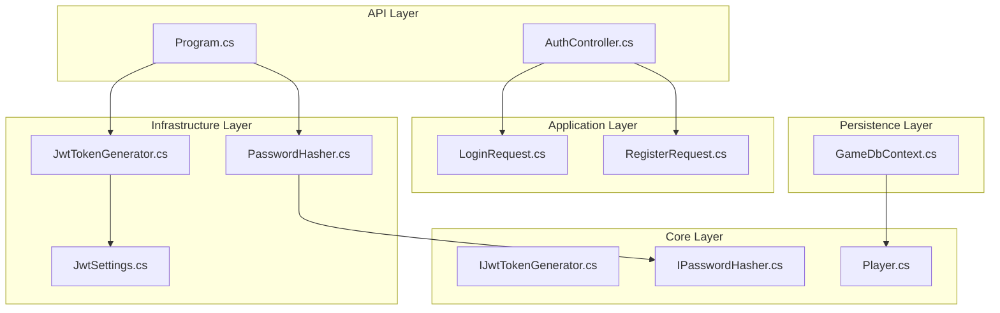
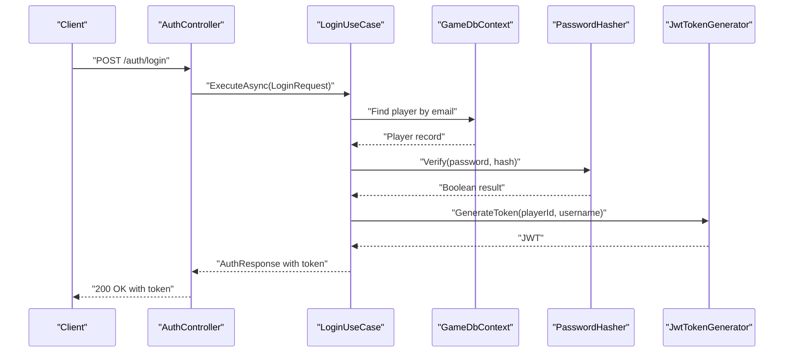
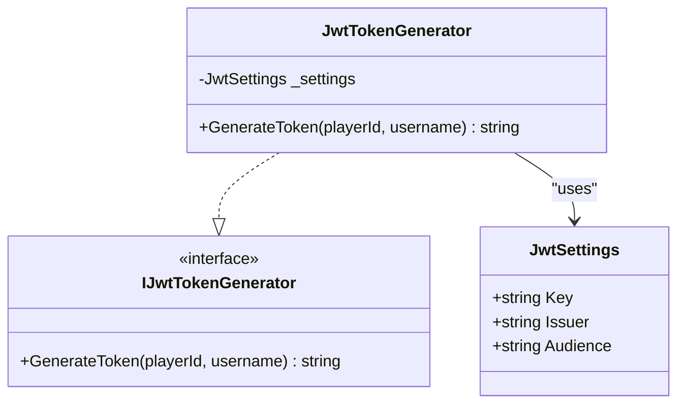
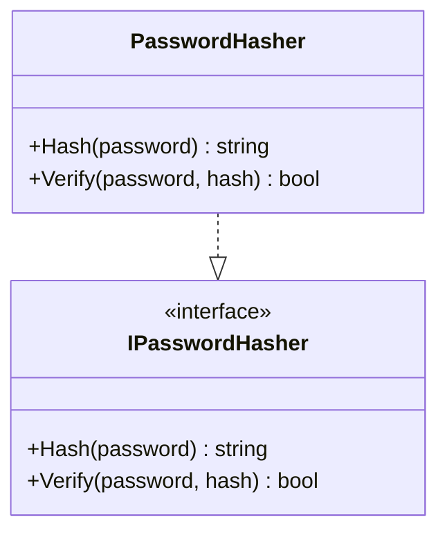
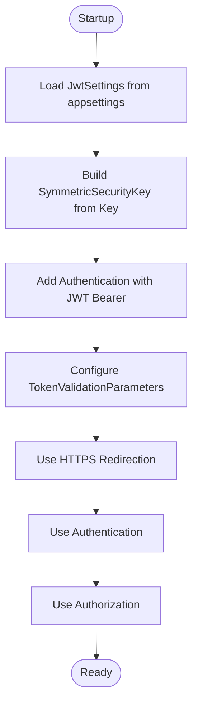
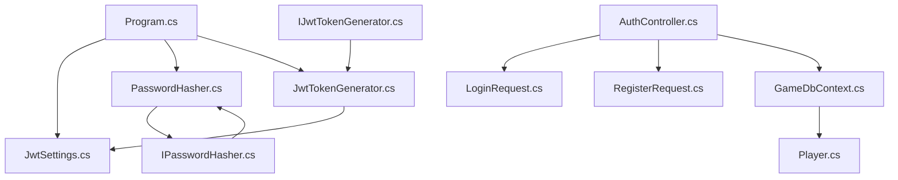

# Security Implementation

<cite>
**Referenced Files in This Document**
- [Program.cs](file://GameBackend.API/Program.cs)
- [appsettings.json](file://GameBackend.API/appsettings.json)
- [appsettings.Development.json](file://GameBackend.API/appsettings.Development.json)
- [JwtSettings.cs](file://GameBackend.Infrastructure/Security/JwtSettings.cs)
- [JwtTokenGenerator.cs](file://GameBackend.Infrastructure/Security/JwtTokenGenerator.cs)
- [PasswordHasher.cs](file://GameBackend.Infrastructure/Security/PasswordHasher.cs)
- [IJwtTokenGenerator.cs](file://GameBackend.Core/Interfaces/IJwtTokenGenerator.cs)
- [IPasswordHasher.cs](file://GameBackend.Core/Interfaces/IPasswordHasher.cs)
- [AuthController.cs](file://GameBackend.API/Controllers/AuthController.cs)
- [LoginRequest.cs](file://GameBackend.Application/Contracts/Auth/LoginRequest.cs)
- [RegisterRequest.cs](file://GameBackend.Application/Contracts/Auth/RegisterRequest.cs)
- [Player.cs](file://GameBackend.Core/Entities/Player.cs)
- [GameDbContext.cs](file://GameBackend.Infrastructure/Persistence/GameDbContext.cs)
</cite>

## Table of Contents
1. [Introduction](#introduction)
2. [Project Structure](#project-structure)
3. [Core Components](#core-components)
4. [Architecture Overview](#architecture-overview)
5. [Detailed Component Analysis](#detailed-component-analysis)
6. [Dependency Analysis](#dependency-analysis)
7. [Performance Considerations](#performance-considerations)
8. [Troubleshooting Guide](#troubleshooting-guide)
9. [Conclusion](#conclusion)
10. [Appendices](#appendices)

## Introduction
This document provides a comprehensive security implementation guide for the GameBackend project. It focuses on the JWT token generation and validation system, BCrypt password hashing, and security middleware configuration. It also covers cryptographic key management, token expiration policies, and security best practices. Configuration options for JWT settings, password hashing behavior, and authentication security measures are documented alongside mitigation strategies for common vulnerabilities and compliance considerations for authentication systems.

## Project Structure
Security-related components are distributed across the API, Application, Core, Infrastructure, and Persistence layers:
- API layer configures authentication, middleware, and exposes authentication endpoints.
- Application layer defines contracts and orchestrates use cases for registration and login.
- Core layer defines interfaces for token generation and password hashing.
- Infrastructure layer implements JWT token generation and BCrypt-based password hashing.
- Persistence layer manages database schema and enforces uniqueness constraints for usernames and emails.

**Diagram sources**
- [Program.cs:1-72](file://GameBackend.API/Program.cs#L1-L72)
- [AuthController.cs:1-49](file://GameBackend.API/Controllers/AuthController.cs#L1-L49)
- [LoginRequest.cs:1-7](file://GameBackend.Application/Contracts/Auth/LoginRequest.cs#L1-L7)
- [RegisterRequest.cs:1-8](file://GameBackend.Application/Contracts/Auth/RegisterRequest.cs#L1-L8)
- [IJwtTokenGenerator.cs:1-6](file://GameBackend.Core/Interfaces/IJwtTokenGenerator.cs#L1-L6)
- [IPasswordHasher.cs:1-7](file://GameBackend.Core/Interfaces/IPasswordHasher.cs#L1-L7)
- [Player.cs:1-13](file://GameBackend.Core/Entities/Player.cs#L1-L13)
- [JwtSettings.cs:1-8](file://GameBackend.Infrastructure/Security/JwtSettings.cs#L1-L8)
- [JwtTokenGenerator.cs:1-44](file://GameBackend.Infrastructure/Security/JwtTokenGenerator.cs#L1-L44)
- [PasswordHasher.cs:1-16](file://GameBackend.Infrastructure/Security/PasswordHasher.cs#L1-L16)
- [GameDbContext.cs:1-28](file://GameBackend.Infrastructure/Persistence/GameDbContext.cs#L1-L28)

**Section sources**
- [Program.cs:1-72](file://GameBackend.API/Program.cs#L1-L72)
- [appsettings.json:1-17](file://GameBackend.API/appsettings.json#L1-L17)
- [appsettings.Development.json:1-9](file://GameBackend.API/appsettings.Development.json#L1-L9)

## Core Components
- JWT Settings: Centralized configuration for issuer, audience, and symmetric key used for signing tokens.
- JWT Token Generator: Implements HMAC-SHA256 signing and produces tokens with subject and unique name claims, expiring after seven days.
- Password Hasher: Uses BCrypt to hash passwords and verify credentials against stored hashes.
- Authentication Middleware: Configured via ASP.NET Core Authentication with JWT Bearer scheme, enabling issuer, audience, signing key, and lifetime validation.
- Entity and Persistence: Enforces unique constraints on email and username to reduce risk of account takeover and enumeration attacks.

**Section sources**
- [JwtSettings.cs:1-8](file://GameBackend.Infrastructure/Security/JwtSettings.cs#L1-L8)
- [JwtTokenGenerator.cs:1-44](file://GameBackend.Infrastructure/Security/JwtTokenGenerator.cs#L1-L44)
- [PasswordHasher.cs:1-16](file://GameBackend.Infrastructure/Security/PasswordHasher.cs#L1-L16)
- [Program.cs:28-50](file://GameBackend.API/Program.cs#L28-L50)
- [Player.cs:1-13](file://GameBackend.Core/Entities/Player.cs#L1-L13)
- [GameDbContext.cs:19-26](file://GameBackend.Infrastructure/Persistence/GameDbContext.cs#L19-L26)

## Architecture Overview
The authentication flow integrates API controllers, application use cases, and infrastructure services. JWT configuration is loaded from appsettings and applied during service registration. Tokens are generated with a fixed expiration policy and validated centrally by the authentication middleware.

**Diagram sources**
- [AuthController.cs:36-48](file://GameBackend.API/Controllers/AuthController.cs#L36-L48)
- [LoginRequest.cs:1-7](file://GameBackend.Application/Contracts/Auth/LoginRequest.cs#L1-L7)
- [GameDbContext.cs:13](file://GameBackend.Infrastructure/Persistence/GameDbContext.cs#L13)
- [PasswordHasher.cs:12-15](file://GameBackend.Infrastructure/Security/PasswordHasher.cs#L12-L15)
- [JwtTokenGenerator.cs:20-43](file://GameBackend.Infrastructure/Security/JwtTokenGenerator.cs#L20-L43)

## Detailed Component Analysis

### JWT Token Generation and Validation
- Configuration: JWT settings are bound from appsettings under the "Jwt" section and injected into services.
- Signing: HMAC-SHA256 with a symmetric key derived from the configured secret.
- Claims: Subject (player identifier) and Unique Name (username) are included.
- Expiration: Tokens expire seven days after issuance.
- Validation: The middleware validates issuer, audience, signing key, and lifetime.

**Diagram sources**
- [JwtSettings.cs:3-8](file://GameBackend.Infrastructure/Security/JwtSettings.cs#L3-L8)
- [JwtTokenGenerator.cs:11-44](file://GameBackend.Infrastructure/Security/JwtTokenGenerator.cs#L11-L44)
- [IJwtTokenGenerator.cs:3-6](file://GameBackend.Core/Interfaces/IJwtTokenGenerator.cs#L3-L6)

**Section sources**
- [Program.cs:13-14](file://GameBackend.API/Program.cs#L13-L14)
- [Program.cs:28-50](file://GameBackend.API/Program.cs#L28-L50)
- [JwtSettings.cs:5-7](file://GameBackend.Infrastructure/Security/JwtSettings.cs#L5-L7)
- [JwtTokenGenerator.cs:20-43](file://GameBackend.Infrastructure/Security/JwtTokenGenerator.cs#L20-L43)

### BCrypt Password Hashing
- Hashing: Passwords are hashed using BCrypt, which applies a salt and cost factor automatically.
- Verification: During login, the provided password is verified against the stored hash.
- Security: BCrypt mitigates rainbow table and brute-force attacks through computational cost.

**Diagram sources**
- [PasswordHasher.cs:5-16](file://GameBackend.Infrastructure/Security/PasswordHasher.cs#L5-L16)
- [IPasswordHasher.cs:3-7](file://GameBackend.Core/Interfaces/IPasswordHasher.cs#L3-L7)

**Section sources**
- [PasswordHasher.cs:7-15](file://GameBackend.Infrastructure/Security/PasswordHasher.cs#L7-L15)
- [IPasswordHasher.cs:5-6](file://GameBackend.Core/Interfaces/IPasswordHasher.cs#L5-L6)

### Security Middleware Configuration
- Authentication Scheme: JWT Bearer is configured as both default authenticate and challenge schemes.
- Validation Parameters: Issuer, audience, signing key, and lifetime are validated.
- HTTPS Enforcement: HTTP-to-HTTPS redirection is enabled in the pipeline.
- Authorization: Authorization middleware is registered after authentication.

**Diagram sources**
- [Program.cs:28-50](file://GameBackend.API/Program.cs#L28-L50)
- [appsettings.json:9-13](file://GameBackend.API/appsettings.json#L9-L13)

**Section sources**
- [Program.cs:32-50](file://GameBackend.API/Program.cs#L32-L50)
- [appsettings.json:9-13](file://GameBackend.API/appsettings.json#L9-L13)

### Cryptographic Key Management
- Secret Storage: The JWT signing key is loaded from configuration. In production, externalize secrets using secure secret managers or environment-specific configuration.
- Key Strength: Ensure the key length exceeds 256 bits and is randomly generated.
- Rotation: Implement key rotation procedures with a smooth switchover strategy to avoid token invalidation storms.

**Section sources**
- [appsettings.json:10](file://GameBackend.API/appsettings.json#L10)
- [JwtSettings.cs:5](file://GameBackend.Infrastructure/Security/JwtSettings.cs#L5)

### Token Expiration Policies
- Fixed Expiration: Tokens currently expire seven days after issuance.
- Recommendations: Consider implementing sliding expiration, refresh tokens, and short-lived access tokens with long-lived refresh tokens stored securely.

**Section sources**
- [JwtTokenGenerator.cs:38](file://GameBackend.Infrastructure/Security/JwtTokenGenerator.cs#L38)

### Authentication Security Measures
- Unique Constraints: Database enforces unique indexes on email and username to prevent account takeover and enumeration.
- HTTPS Enforcement: HTTP-to-HTTPS redirection reduces exposure of credentials and tokens.
- Request Validation: API controllers wrap use case execution in try/catch blocks and return appropriate HTTP status codes.

**Section sources**
- [GameDbContext.cs:22-23](file://GameBackend.Infrastructure/Persistence/GameDbContext.cs#L22-L23)
- [Program.cs:65](file://GameBackend.API/Program.cs#L65)
- [AuthController.cs:25-33](file://GameBackend.API/Controllers/AuthController.cs#L25-L33)

## Dependency Analysis
The following diagram shows how authentication components depend on each other and on configuration:

**Diagram sources**
- [Program.cs:13-24](file://GameBackend.API/Program.cs#L13-L24)
- [JwtSettings.cs:3-8](file://GameBackend.Infrastructure/Security/JwtSettings.cs#L3-L8)
- [JwtTokenGenerator.cs:11-18](file://GameBackend.Infrastructure/Security/JwtTokenGenerator.cs#L11-L18)
- [PasswordHasher.cs:5-16](file://GameBackend.Infrastructure/Security/PasswordHasher.cs#L5-L16)
- [IJwtTokenGenerator.cs:3-6](file://GameBackend.Core/Interfaces/IJwtTokenGenerator.cs#L3-L6)
- [IPasswordHasher.cs:3-7](file://GameBackend.Core/Interfaces/IPasswordHasher.cs#L3-L7)
- [AuthController.cs:9-20](file://GameBackend.API/Controllers/AuthController.cs#L9-L20)
- [LoginRequest.cs:3-7](file://GameBackend.Application/Contracts/Auth/LoginRequest.cs#L3-L7)
- [RegisterRequest.cs:3-8](file://GameBackend.Application/Contracts/Auth/RegisterRequest.cs#L3-L8)
- [GameDbContext.cs:13](file://GameBackend.Infrastructure/Persistence/GameDbContext.cs#L13)
- [Player.cs:3-13](file://GameBackend.Core/Entities/Player.cs#L3-L13)

**Section sources**
- [Program.cs:13-24](file://GameBackend.API/Program.cs#L13-L24)
- [JwtTokenGenerator.cs:11-18](file://GameBackend.Infrastructure/Security/JwtTokenGenerator.cs#L11-L18)
- [PasswordHasher.cs:5-16](file://GameBackend.Infrastructure/Security/PasswordHasher.cs#L5-L16)

## Performance Considerations
- Token Validation Overhead: Validate issuer, audience, signing key, and lifetime adds minimal overhead but ensures robustness.
- BCrypt Cost Factor: Adjust the cost factor to balance security and performance; higher costs increase verification time.
- Caching: Consider caching recently validated tokens or user roles to reduce repeated database queries during authorization.

[No sources needed since this section provides general guidance]

## Troubleshooting Guide
- Invalid Token Errors: Ensure the client sends the Authorization header with the Bearer scheme and that the token matches the configured issuer, audience, and signing key.
- Token Expiration: If clients receive unauthorized errors, regenerate tokens as the current policy sets a fixed seven-day expiration.
- Configuration Issues: Verify that the "Jwt" section exists in appsettings and that the key length meets cryptographic requirements.
- HTTPS Redirect: Confirm HTTPS redirection is enabled to prevent credential leakage.

**Section sources**
- [Program.cs:32-50](file://GameBackend.API/Program.cs#L32-L50)
- [JwtTokenGenerator.cs:38](file://GameBackend.Infrastructure/Security/JwtTokenGenerator.cs#L38)
- [appsettings.json:9-13](file://GameBackend.API/appsettings.json#L9-L13)

## Conclusion
The GameBackend project implements a secure authentication foundation using JWT with HMAC-SHA256 and BCrypt-based password hashing. Centralized configuration, strict validation parameters, and HTTPS enforcement contribute to a robust system. To further strengthen security, consider rotating keys, implementing refresh tokens, and externalizing secrets. Align operational practices with organizational security policies and compliance requirements.

[No sources needed since this section summarizes without analyzing specific files]

## Appendices

### Configuration Options
- JWT Settings
  - Key: Symmetric secret used for signing tokens.
  - Issuer: Expected issuer value for token validation.
  - Audience: Expected audience value for token validation.
- Connection Strings
  - DefaultConnection: PostgreSQL connection string for persistence.

**Section sources**
- [appsettings.json:9-16](file://GameBackend.API/appsettings.json#L9-L16)

### Security Best Practices
- Secret Management: Store secrets in secure vaults or environment-specific configuration.
- Key Rotation: Plan periodic key rotation with dual-key validation during transitions.
- Token Expiration: Adopt short-lived access tokens with refresh tokens to minimize exposure windows.
- Input Validation: Validate and sanitize all authentication inputs to prevent injection and enumeration.
- Logging and Monitoring: Log authentication events without exposing sensitive data; monitor for anomalies.

[No sources needed since this section provides general guidance]